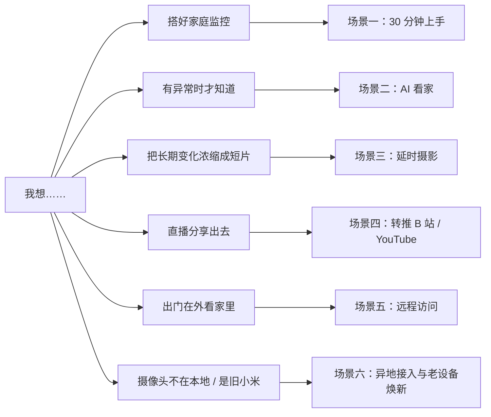
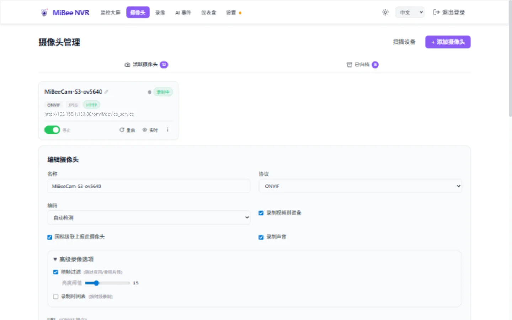
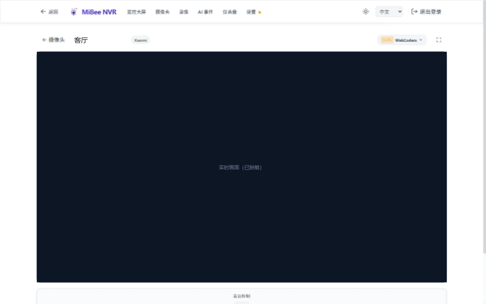
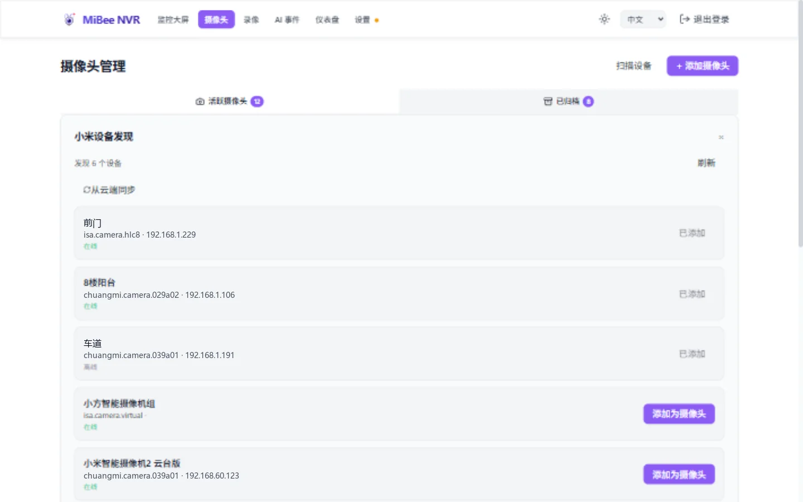

# 场景玩法指引

> 面向新手的 6 个实战场景——每个场景都是一条完整路径，照着做就能跑通。

不知道从哪开始？这张地图帮你对号入座：



---

## 场景一：30 分钟搭好家庭监控

**你将获得**：所有摄像头的实时画面 + 自动录像 + 手机可看。
**你需要**：一台常开设备（NAS / 旧电脑 / 树莓派 / 小主机）+ 支持 RTSP 或 ONVIF 的摄像头。

### 第 1 步：安装 NVR（5 分钟）

最省事的方式是一键脚本（Linux）：

```bash
curl -fsSL https://raw.githubusercontent.com/Mi-Bee-Studio/MiBeeNvr/main/install.sh | sudo bash
```

用 Docker 或在群晖 / 威联通 / 飞牛 fnOS 商店里安装也完全可以——参见[快速开始](quickstart.md)。装好后浏览器打开 `http://设备IP:9090`。

### 第 2 步：跟着初始化向导走（2 分钟）

首次打开会出现初始化向导：设置管理员密码 → 选择存储路径 → 完成。存储路径就是录像落盘的地方，选空间最大的那块盘。


### 第 3 步：发现并添加摄像头（5 分钟）

进入「摄像头」页点击「自动发现」——同一局域网内支持 ONVIF 的摄像头会自动出现，选中、填入摄像头的用户名密码即可接入。没有扫到的设备手动添加也只需填 RTSP 地址。


> 小贴士：海康 / 大华摄像头的 RTSP 地址通常是 `rtsp://用户名:密码@摄像头IP:554/Streaming/Channels/101`（主码流）或 `...201`（子码流，更省资源）。更多品牌参见[摄像头兼容指南](camera-guide.md)。

### 第 4 步：打开监控大屏（1 分钟）

顶部导航进入「监控」页，所有摄像头画面一屏尽览。点击任意画面可放大全屏、云台摄像头还能直接方向控制。


### 第 5 步：确认录像（2 分钟）

「录像」页能看到不断生成的 MP4 片段就说明录制正常。回放时直接拖动全天时间轴，跨录像、跨空隙一拖到底。


**小贴士**：

- 默认配置已经能跑——先跑起来，再按[配置参考](config.md)精调保留天数、分段时长
- 手机浏览器打开同一地址即可看家；把页面"添加到主屏幕"就成为一个 PWA 应用
- 在路由器上不要做端口映射（见场景五的安全做法）

---

## 场景二：AI 看家——看到"人"再报警

**痛点**： motion 检测只认"画面变了"——窗帘晃、光影变都报警，几天就麻木了。
**思路**： 让浏览器端的 AI 模型只认"人"，并且只盯你划定的关键区域。

### 第 1 步：开启 AI 检测

进入任意摄像头的实时预览页，点击画面右上角的 AI 图标开启检测。首次使用会自动下载 YOLO11 模型（浏览器本地推理，NVR 服务器零负载）。


### 第 2 步：划定 ROI 区域

在预览画面上画出你真正关心的区域——门口的走道、院子的入口。区域外的目标一律忽略。

### 第 3 步：调参到"既不漏报也不打扰"

- 置信度：0.5 起步，误报多就调高到 0.65–0.8
- 类别过滤：只留 `person`
- 跳帧率：省电设备设 8–10，桌面设 3–5

详细建议见 [AI 检测调参指南](ai-detection.md)——里面有边缘设备 / 桌面 / 布防 / 演示四种场景的推荐值。

### 第 4 步：让报警进入你的生活

- 事件实时出现在「AI 事件」页，带目标框截图
- 配合 MQTT 集成可以把事件推送到家庭自动化平台（Home Assistant / Node-RED）联动灯、音箱、通知


**小贴士**： 检测算力来自**看画面的那个浏览器**（WebGPU 加速，回退 WASM）——这意味着老旧 NVR 主机不用升级也能用 AI，多个人同时看就共享多份算力。

---

## 场景三：花园与工地——一天浓缩成 30 秒

**适用**： 植物生长、装修施工、蜂箱观察、云景记录。

### 第 1 步：选一种延时模式

| 模式 | 适合 | 说明 |
|------|------|------|
| 独立延时摄像头 | 有闲置摄像头 | 专门一路按固定间隔抓帧 |
| 从录像抽帧 | 摄像头已在录像 | 无需额外开销，直接从现有录像提取关键帧 |

### 第 2 步：设置合并窗口

「设置 → 延时摄影」中选择合并窗口：自然日（默认）/ 1h / 8h / 24h / 7d / 30d。NVR 会自动把帧合并为 MP4 短片，结果出现在「延时摄影」页。


### 第 3 步：回看与分享

合并结果按天 / 按窗口归档，浏览器直接播放，也可以下载原片。H.265 摄像头的延时同样支持（自动构建合规 hvcC，Windows Edge 也能播）。

**小贴士**： 工地监控建议 7d 窗口——一周的进度一条片子看完；植物记录用自然日，每天一部"今日份生长"。详见[延时摄影](timelapse.md)。

---

## 场景四：把家里的直播推到 B 站 / YouTube

**适用**： 水族箱直播、院子里的鸟 feeder、手工工作室分享。

### 第 1 步：拿到平台的推流地址

在直播平台开通直播，获得 RTMP 地址和推流码。以哔哩哔哩为例：开播设置里有 `rtmp://live-push.bilivideo.com/live-bv/` + 一串推流码。

### 第 2 步：在 NVR 里配置转推目标

「摄像头 → 编辑 → 转推」中添加目标：填入完整 RTMP 地址（地址 + 推流码），保存即开始转推。



### 第 3 步：确认直播

平台后台显示推流成功后开播即可。NVR 的转推是原生 Go 实现（CPU 占用远低于 FFmpeg 方案），斗鱼直播伴侣这类严格兼容的平台也已适配；个别异构平台可在目标上勾选 FFmpeg 兜底。

**小贴士**：

- 转推与录制互不影响——同一摄像头边录像边转推是设计内行为
- 详情见[直播转推](relay.md)

---

## 场景五：出门在外——安全地看家里

**原则： 不把 NVR 直接暴露公网。** 正确姿势是加密隧道，三种常见方案任选：

| 方案 | 适合 | 一句话说明 |
|------|------|-----------|
| Tailscale / ZeroTier | 新手最推荐 | 两端装客户端登录同一账号，自动组成虚拟局域网 |
| WireGuard / 自建 VPN | 有路由器管理权 | 路由器层面打通，全家庭设备受益 |
| HTTPS 反向代理 | 有域名 + 公网 IP | Caddy/Nginx 加一层 TLS + 认证转发 |

隧道打通后，手机访问 NVR 的内网地址（如 `http://100.x.x.x:9090`），直播自动走 WebRTC——亚秒级延迟，4G/5G 下也流畅。



**小贴士**：

- 回放走 HTTP 分片，弱网下比直播更稳——出门时查"刚才发生了什么"毫无压力
- 局域网发现（mDNS）在 Tailscale 虚拟网内同样部分可用；回家后自动回到本地直连
- 更多方案细节见[远程访问](remote-access.md)

---

## 场景六：异地摄像头与老设备焕新

### 情况 A：摄像头在另一个网络（老家 / 店铺）

让摄像头那一端主动把流**推**过来（不需要 NVR 能连到摄像头）：

- **SRT 推流**（弱网 / 跨公网更稳）：在 NVR「设置 → 流媒体」开启 SRT 监听，然后在摄像头一侧用 FFmpeg 推流：

```bash
ffmpeg -i "rtsp://摄像头地址" -c copy -f mpegts \
  "srt://NVR公网地址:9000?streamid=#!:r=店铺摄像头,m=publish"
```

- **RTMP 推流**：`rtmp://NVR公网地址:1935/live/店铺摄像头`
- **WebRTC WHIP**：浏览器 / 手机 / OBS 直接向 `http://NVR地址:9090/whip/摄像头ID` 发布

NVR 侧把推流当作一路普通摄像头——录制、直播、AI 一切照旧。详见 [SRT/RTMP 推流接入](srt-rtmp.md)。

> 注意： 开放公网入流端口时请启用流密钥认证，并配合防火墙限制来源。

### 情况 B：家里有旧小米摄像头

小米摄像头默认绑死云服务，看回放要买云存。接入 MiBee NVR 后：

1. 「摄像头 → 添加 → 小米」用小米账号登录授权
2. 扫描选择设备，自动入库



之后录像落在你自己的硬盘上，没有订阅费、没有隐私顾虑。支持 CS2 新协议机型与 7 款 TUTK 老型号（大白、小方、小白、Aqara G2 等），详见[小米摄像头接入](xiaomi.md)。

---

## 下一步

- 想全面了解功能边界：[功能总览](features.md)
- 正在和其他方案比较：[同类方案对比](comparison.md)
- 遇到问题：先看[故障排除](https://github.com/Mi-Bee-Studio/MiBeeNvr/blob/v0.12.0/docs/zh/troubleshooting.md)
