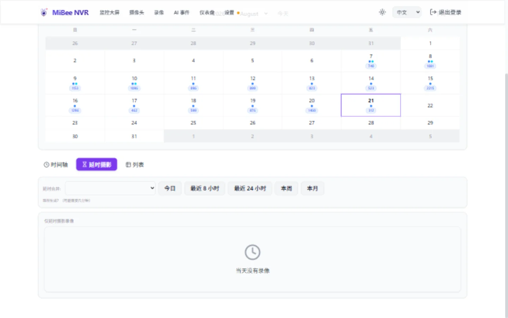

# 延时摄影录制

延时摄影功能从摄像头录制中创建延时摄影视频，将数小时或数天压缩为几分钟。MiBee NVR 支持灵活的合并窗口（1h 到 30 天）、H.264/H.265/JPEG 编解码感知合并、周期合并 DB 记录以及统一的录制界面。

## 概览

延时摄影系统自动将视频片段合并为压缩的延时摄影录制。关键功能：

- **灵活合并窗口**：支持 `1h`/`8h`/`12h`/`24h`/`natural-day`/`7d`/`30d`。默认 `natural-day`（每个自然日一条延时视频，按服务器本地时区的午夜对齐）
- **H.264/H.265/JPEG 编解码感知**：周期合并器自动检测帧类型并分派到对应的纯 Go 编解码合并器（H265GoMerger、H264GoMerger 或 GoMerger）
- **周期合并 DB 记录**：长窗口产物持久化在 `timelapse_merges` 表中——可通过 `/api/timelapse/merges*` 发现、播放和删除
- **统一界面**：集成的录制页面，支持表格、图库和日历视图模式
- **关键帧提取**：使用现有 RTSP 流进行零开销的延时摄影生成
- **磁盘回收**：周期合并后自动清理滚动合并的 `.mp4` 中间产物（可通过 `retain_intermediate_mp4` 配置）

## 配置

### 基础延时摄影设置

在配置中为摄像头启用延时摄影录制：

```yaml
cameras:
  - name: "前门摄像头"
    protocol: "rtsp"
    encoding: "h264"
    url: "rtsp://192.168.1.100:554/stream"
    enabled: true

    # 延时摄影配置
    timelapse:
      enabled: true
      merge_duration: "natural-day"    # 每个自然日一条延时视频（默认）
      frame_source: "auto"             # 双模式关键帧提取
      merge_output_fps: 30
```

### 双模式配置（RTSP 摄像头）

对于现有的 RTSP 摄像头，启用双模式延时摄影而无需更改摄像头协议：

```yaml
cameras:
  - name: "客厅摄像头"
    protocol: "rtsp"
    encoding: "h265"
    url: "rtsp://192.168.1.101:554/stream"
    enabled: true

    timelapse:
      enabled: true                          # 启用延时摄影
      merge_duration: "30m"                  # 每 30 分钟合并一次
      frame_source: "rtsp_keyframe"          # 从 RTSP 流提取
      output_fps: 30
```

### 独立延时摄影配置

创建带有独立 RTSP 源的专用延时摄影摄像头：

```yaml
cameras:
  - name: "纯延时摄影摄像头"
    protocol: "timelapse"
    encoding: "h264"
    url: "rtsp://backup-camera.example.com:554/stream"
    enabled: true

    timelapse:
      enabled: true
      merge_duration: "1h"                  # 最大合并间隔
      frame_source: "rtsp_keyframe"         # 从延时摄影流提取
      output_fps: 15                         # 降低帧率以适应长时间
```

## 合并窗口选项

`merge_duration` 字段控制周期合并窗口——将多少小时/天的关键帧合成一条延时视频。

**支持的命名窗口**（全部按服务器本地时区的午夜对齐）：

| 值 | 窗口 | 对齐示例 |
|-------|--------|-------------------|
| `1h` | 1 小时 | 00:00-01:00, 01:00-02:00, ... |
| `8h` | 8 小时 | 00:00-08:00, 08:00-16:00, 16:00-24:00 |
| `12h` | 12 小时 | 00:00-12:00, 12:00-24:00 |
| `24h` | 24 小时 | 00:00-24:00（午夜到午夜） |
| `natural-day` | 自然日（默认） | 00:00 到次日 00:00 本地时间 |
| `7d` | 7 天 | 周一 00:00 到下周一 00:00 |
| `30d` | 30 天 | 每月 1 号到下月 1 号 |

- 空字符串默认为 `"natural-day"`。
- 也接受任何其他 Go duration 字符串（如 `"30m"`、`"2h"`、`"90m"`），按挂钟时间对齐。
- 超过 30 天的值会在配置校验时被拒绝。

之前的 1h 上限已解除——多小时和多天窗口现在完全支持。旧配置中 `8h`/`12h`/`24h`/`natural-day`/`7d`/`30d` 等值（之前被静默截断为 1h）现在会生成实际请求的窗口。
- 旧版多小时字符串（`"8h"`、`"12h"`、`"24h"`、`"natural-day"`、`"7d"`、`"30d"`）现在完全支持（之前被静默截断为 1h，已修复）。
- 任何其他大于 `1h` 的 Go duration 字符串（例如 `"2h"`、`"90m"`）会在配置校验时被报错拒绝。

### 配置示例

```yaml
# 按小时合并（最大值）
timelapse:
  enabled: true
  merge_duration: "1h"
  output_fps: 30

# 半小时合并
timelapse:
  enabled: true
  merge_duration: "30m"
  output_fps: 10

# 15 分钟合并，得到更细粒度的片段
timelapse:
  enabled: true
  merge_duration: "15m"
  output_fps: 5
```

## 双模式延时摄影

双模式延时摄影允许任何 RTSP 摄像机生成延时摄影录制，无需额外的硬件要求。

### 工作原理

1. **主要 RTSP 流**：摄像头按常规录制视频片段
2. **关键帧提取**：KeyframeExtractor 订阅 RTSP StreamHub
3. **帧处理**：从流中提取 IDR 帧（H.264 类型 5，H.265 类型 19/20）
4. **延时摄影生成**：提取的帧被处理为压缩的延时摄影视频

### 支持的摄像头类型

- **RTSP H.264**：支持 H.264 编码的 IP 摄像头
- **RTSP H.265**：支持 H.265 编码的现代摄像头，提供更好的效率
- **ONVIF**：自动发现摄像头，同时支持 H.264 和 H.265 流

### H.265 支持

系统自动检测 H.265 流并相应配置 KeyframeExtractor：

```yaml
# ONVIF H.265 摄像头
cameras:
  - name: "安全摄像头 1"
    protocol: "onvif"
    encoding: "h265"                    # 主要编码
    stream_encoding: "H265"            # ONVIF 特定字段
    url: "onvif://192.168.1.102"
    enabled: true

    timelapse:
      enabled: true
      merge_duration: "1h"
      frame_source: "rtsp_keyframe"
```

## 统一录制界面



MiBee NVR 将延时摄影和常规录制合并到统一 Library 页面，具有增强的导航和过滤功能。

### 视图模式

通过 URL 参数访问不同视图：

- **表格视图**：`#/recordings?view=table` - 包含详细信息的列表
- **图库视图**：`#/recordings?view=gallery` - 缩略图画格布局
- **列表视图**：`#/recordings?view=list` - 紧凑列表布局

### 格式过滤器

使用 `format` 参数按格式过滤录制：

- **所有格式**：`format=all` - 显示所有录制类型
- **仅视频**：`format=video` - 显示常规视频录制
- **仅延时摄影**：`format=timelapse` - 仅显示延时摄影录制
- **仅 MJPEG**：`format=mjpeg` - 显示 MJPEG 录制

主导航格式过滤器按钮始终可见在界面中，允许在录制格式之间快速切换。

### 图库视图

```bash
# URL: /#recordings?view=gallery&format=all
```

响应式网格布局中显示录制，包含：

- 缩略图预览
- 日期/时间标签
- 格式徽章（视频/延时摄影/mjpeg）
- 延迟加载以提升性能
- 点击查看/下载录制

### 列表视图

```bash
# URL: /#recordings?view=list&format=all
```

提供紧凑的列表视图，包含：

- 录制元数据
- 持续时间和文件大小信息
- 格式指示器
- 快速下载按钮
- 搜索和过滤功能

### 日历视图

```bash
# URL: /#recordings?view=calendar&format=all
```

提供基于日历的导航，包含：

- 月/周/日视图
- 录制密度可视化
- 格式特定过滤
- 点击日期过滤录制
- 时间线导航控件

### 时间线栏

在视图模式选项卡上方，时间线栏始终可见，提供：

- 水平时间线显示录制密度
- 时间范围选择器（周/月/3个月）
- 格式过滤器集成
- 可点击的时间期间导航
- 录制可用性的视觉指示

## 迁移指南

### 从旧版 `daily_merge` 字段迁移

#### 1. 更新配置

**迁移前：**

```yaml
timelapse:
  enabled: true
  daily_merge: true
  output_fps: 30
```

**迁移后：**

```yaml
timelapse:
  enabled: true
  merge_duration: "natural-day"   # 替代 daily_merge（默认）
  frame_source: "rtsp_keyframe"
  output_fps: 30
```

#### 2. 合并间隔选项

如果需要不同的合并间隔：

```yaml
# 半小时合并
timelapse:
  enabled: true
  merge_duration: "30m"
  frame_source: "rtsp_keyframe"
  output_fps: 30
```

#### 3. 现有 RTSP 摄像头的双模式迁移

为现有 RTSP 摄像头启用延时摄影而无需更改其配置：

```yaml
# 迁移前：仅常规录制
cameras:
  - name: "现有摄像头"
    protocol: "rtsp"
    encoding: "h264"
    url: "rtsp://192.168.1.100:554/stream"
    enabled: true

# 迁移后：为现有摄像头添加延时摄影
cameras:
  - name: "现有摄像头"
    protocol: "rtsp"
    encoding: "h264"
    url: "rtsp://192.168.1.100:554/stream"
    enabled: true

    timelapse:                     # 添加此部分
      enabled: true
      merge_duration: "1h"
      frame_source: "rtsp_keyframe"  # 双模式
      output_fps: 30
```

### 向后兼容性

- **现有摄像头无需更改即可继续工作**
- **遗留的 `daily_merge` 字段**仍然可用但已弃用
- **多小时 `merge_duration` 值**（`8h`/`12h`/`24h`/`natural-day`/`7d`/`30d`）现在完全支持（之前被静默截断为 1h）
- **现有的延时摄影录制**在统一界面中仍然可以访问
- **API 端点**与现有集成保持兼容

### 迁移检查清单

1. [ ] 审查现有摄像头配置
2. [ ] 为需要的 RTSP 摄像头添加 `timelapse.enabled: true`
3. [ ] 设置适当的 `merge_duration`（默认："natural-day"）
4. [ ] 使用样本摄像头测试双模式功能
5. [ ] 验证统一录制界面工作正常
6. [ ] 检查现有录制仍然可以访问

## 故障排除

### 常见问题

#### 1. 关键帧提取不工作

**症状**：延时摄影录制为空或缺少帧

**解决方案**：验证摄像头编码和流配置：

```bash
# 检查摄像头是否支持关键帧提取
curl -u admin:password "http://localhost:9090/api/cameras/camera-id/status"
```

确保在摄像头配置中正确指定 H.264/H.265 编码。

#### 2. 合并间隔问题

**症状**：合并未按预期间隔运行

**解决方案**：检查合并日志并验证间隔格式：

```bash
# 检查合并管理器状态
curl -u admin:password "http://localhost:9090/api/timelapse/status"

# 验证配置中的间隔格式
grep "merge_duration" /path/to/config.yaml
```

有效值：`1h`、`8h`、`12h`、`24h`、`natural-day`、`7d`、`30d`（命名窗口），或任何不超过 30 天的 Go duration 字符串（如 `30m`、`2h`）。空字符串默认为 `natural-day`。超过 30 天的值会被拒绝。

#### 3. 双模式摄像头设置

**症状**：双模式摄像头未生成延时摄影录制

**解决方案**：验证双模式配置：

```yaml
# 正确的双模式设置
cameras:
  - name: "双模式摄像头"
    protocol: "rtsp"                    # 必须是 rtsp/onvif
    encoding: "h264"                    或 "h265"
    url: "rtsp://192.168.1.100:554/stream"
    enabled: true

    timelapse:
      enabled: true                      # 必须启用
      merge_duration: "1h"               # 设置间隔
      frame_source: "rtsp_keyframe"      # 关键帧源
      output_fps: 30
```

#### 4. ONVIF 流编码

**症状**：ONVIF 摄像头 H.265 延时摄影不工作

**解决方案**：检查 `encoding` 和 `stream_encoding` 字段：

```yaml
cameras:
  - name: "ONVIF H.265"
    protocol: "onvif"
    encoding: "h265"
    stream_encoding: "H265"  # ONVIF 特定字段
    url: "onvif://192.168.1.102"
    enabled: true

    timelapse:
      enabled: true
      merge_duration: "1h"
      frame_source: "rtsp_keyframe"
```

### 调试命令

```bash
# 检查延时摄影管理器状态
curl -u admin:password "http://localhost:9090/api/timelapse/status"

# 列出所有录制文件（延时摄影 + 常规）
curl -u admin:password "http://localhost:9090/api/recordings"

# 检查摄像头延时摄影配置
curl -u admin:password "http://localhost:9090/api/cameras/camera-id"

# 查看合并日志（如果可用）
journalctl -u mibee-nvr -f | grep merge
```

## 性能考虑

### 内存使用

- **关键帧提取**使用最少的内存（无视频解码）
- **合并操作**使用 1MB 缓冲的临时文件
- **RPi 3B 兼容**：最大 512MB 内存预算

### 存储需求

- **延时摄影文件**通常比原始素材小 90-95%
- **合并间隔**影响文件大小：
  - 30m 合并：更小、更频繁的片段
  - 1h 合并（最大值）：更大的按小时片段

### 网络影响

- **双模式**不使用额外的网络带宽
- **关键帧提取**与现有 RTSP 流配合工作
- **Web 界面**使用延迟加载高效加载

## API 参考

### 延时摄影端点

#### 获取延时摄影状态

```bash
GET /api/timelapse/status
```

响应包含全局延时摄影设置和合并状态。

#### 触发手动合并

```bash
POST /api/timelapse/merge
```

可选的 `duration` 查询参数用于指定时间窗口。

#### 列出录制文件

```bash
GET /api/recordings?format=timelapse
```

列出延时摄影录制文件。在 Web 界面中使用 `view=gallery|list&format=timelapse`，或在统一 Library 页面中访问 `#/recordings?format=timelapse`。

### 配置 API

更新摄像头延时摄影配置：

```bash
PUT /api/cameras/camera-id
{
  "timelapse": {
    "enabled": true,
    "merge_duration": "1h",
    "frame_source": "rtsp_keyframe",
    "output_fps": 30
  }
}
```

## 最佳实践

### 配置技巧

1. **根据用例选择合适的合并间隔**：
   - 安全监控：`1h` 用于频繁的可审查片段
   - 更细粒度的片段：`30m` 或 `15m`
   - 降低输出 FPS 以保持长间隔片段小巧

2. **优化输出 FPS**：
   - 30 FPS：实时事件
   - 15 FPS：频繁总结
   - 5 FPS：紧凑概览

3. **对于"观看一整天"的用例**，依赖录制详情视图中的客户端连续播放（它会自动前进到下一段），而不是合成单个多小时文件。

### 双模式设置

1. **先在一个摄像头上测试**，然后再在所有摄像头上启用
2. **监控存储**使用量，特别是增加了录制体积时
3. **验证摄像头编码**是否正确指定（H.264/H.265）
4. **检查流编码**，特别是 ONVIF 摄像头

### 性能监控

1. **定期维护**：根据保留策略清理旧的延时摄影录制
2. **存储监控**：监控可用磁盘空间，特别是长时间合并时
3. **系统资源**：在资源受限设备上监控合并操作期间的内存使用

## 相关文档

- [配置参考](https://github.com/Mi-Bee-Studio/MiBeeNvr/blob/v0.12.0/docs/zh/configuration.md)
- [摄像头指南](camera-guide.md)
- [API 参考](https://github.com/Mi-Bee-Studio/MiBeeNvr/blob/v0.12.0/docs/zh/api-reference.md)
- [故障排除](https://github.com/Mi-Bee-Studio/MiBeeNvr/blob/v0.12.0/docs/zh/troubleshooting.md)
