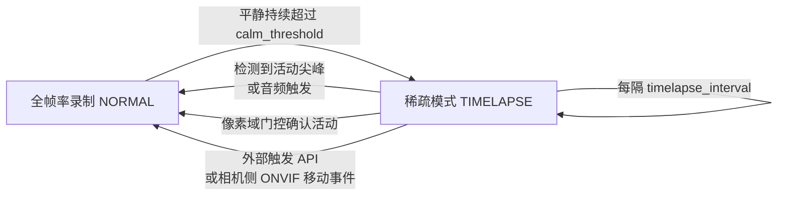
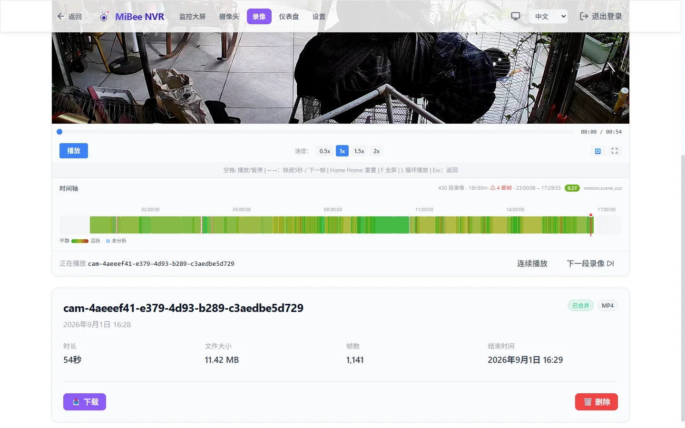

# 自适应录制（动静感知）

> 适用于 MiBeeNvr v0.13.0

大部分监控场景里，画面 95% 以上的时间什么都没发生——但连续录制仍以全帧率、全码率写盘。**自适应录制**让 NVR 在画面安静时自动降为「延时摄影级」的稀疏关键帧写入，一旦检测到活动立即恢复全帧率录制，切换瞬间零丢帧。实测静态场景磁盘占用下降 **约 75%–98%**，而事件发生的第一帧就落在录像里。


## 工作原理



NVR 不解码画面，直接在**压缩域**分析：持续统计 P 帧大小相对滚动基线的偏离（MAD 稳健统计），画面「安静」= P 帧尺寸贴合基线。进入稀疏模式后：

- 只写每 `timelapse_interval` 一个关键帧（音频同时停录，除非开启[环境声氛围层](#环境声氛围层)）
- 一个 GOP 环形预缓冲（默认 32MB）持续保留最近的完整图像组
- **任何活动尖峰（P 帧突然变大）立即冲刷预缓冲**，把「尖峰前一整个 GOP」补写进盘——所以从稀疏到全帧率的切换不丢任何参考帧，回放无花屏、无断层

适用的活动信号有五路，任一路都能把相机拉回全帧率：

| 信号 | 说明 |
|------|------|
| 视频尖峰 | P 帧尺寸偏离基线超过 `spike_factor` 倍（默认路径，全部 H.264/H.265 相机可用） |
| [音频触发](#音频触发) | 1 秒窗口响度超过阈值的「异常声音」——玻璃破碎、呼喊、警报（需 G.711 音频） |
| [像素域门控](#像素域门控-pixgate) | 子码流 ~1fps 采样解码后经典 CV 判定的「真实前景移动」——码率恒定的智能编码器相机也能判动静 |
| 相机侧移动侦测 | `motion_source: camera:onvif` 时订阅相机的 ONVIF MotionAlarm 事件（`reason=onvif_motion`）——见 [ONVIF 指南](onvif-discovery.md) |
| 外部语义触发 | `POST /api/cameras/{id}/adaptive/trigger`——由家庭自动化、AI 后端等外部系统调用（如「检测到人形」） |

## 如何选择

v0.13 起这条链路有三种组合，按相机编码器行为选：

| 场景 | 推荐组合 | 理由 |
|------|----------|------|
| 普通编码相机（码率随动静明显起伏） | `recording_mode: adaptive` 单层即可 | 压缩域判定可靠，配置最简 |
| 智能编码器相机（画面常驻静止但码率恒定——静态 ~0.5fps / 5MP VBR 一类） | [`recording_tier: tiered`](#分层录制-tiered-recording) + 主码流 `adaptive`（±[pixgate](#像素域门控-pixgate)） | 码率域判不出动静：子码流 24/7 兜底不漏拍，像素域替代码率域判定，主码流只录事件 |
| 雨天/水面/树叶等持续视频噪声，或要求「没人就绝不升帧率」 | `adaptive` + `video_exit: false`（常驻延时）+ pixgate / 音频触发 / 外部语义触发 | 视频尖峰不再退出稀疏模式，只有确凿信号（前景移动、异常声音、语义事件）才恢复全速率 |

## 开启方式

### Web UI（推荐）

摄像头管理 → 编辑相机 → **录像模式**：选择「**自适应（动静感知）**」。展开后可微调参数（留空使用默认值）；修改模式后需重启录像器（保存时界面会提示）。

### 配置文件

```yaml
cameras:
  - id: "studio"
    name: "工作室内"
    protocol: "onvif"
    # ... 常规接入配置 ...
    recording_mode: "adaptive"   # 默认 "continuous" = 全帧率录制
    adaptive:                    # 全部可选，以下为默认值
      calm_threshold: "60s"      # 平静判定时长（10s–30m）
      timelapse_interval: "30s"  # 稀疏模式关键帧间隔（5s–10m）
      spike_factor: 5.0          # 活动灵敏度（1.5–20，见下文调参）
      gop_buffer_bytes: 33554432 # GOP 预缓冲上限（1–64MB）
```

## 参数调优

| 参数 | 默认值 | 调什么 |
|------|--------|--------|
| `calm_threshold` | 60s | 画面要「安静」多久才降级。楼道等偶有人经过的场景可拉长到 2–5 分钟，进一步压低磁盘写入 |
| `timelapse_interval` | 30s | 稀疏期的关键帧间隔。间隔越长越省盘，但安静期的画面「帧率」越低 |
| `spike_factor` | 5.0 | **活动灵敏度**，越小越灵敏。天台云景、水面反光、树叶摇曳等持续噪声场景需 10–15 才能进入稀疏模式；调得过小会导致相机几乎从不降级（磁盘占用降不下来），过大则会漏掉轻微活动 |
| `gop_buffer_bytes` | 32MB | 预缓冲必须容纳相机一个完整 GOP。2K 相机若 GOP 接近 30s，16MB 会被冲爆导致切换瞬间丢帧——保持默认 32MB 即可 |
| `noise_floor_bytes` | 0（关） | **绝对每帧字节噪声地板**（0–8MB）。低于该字节数的 P 帧**永远不算**退出尖峰——专治夜间模式/码控崩塌时编码器把码率压到几百字节、相对倍数指标被抖动点燃的相机。设 0 关闭 |
| `auto_noise_floor` | true | 从**延时驻留帧自校准**地板：稀疏模式里的帧按构造就是静止的，其 p99 尺寸 ×1.25（上限 p50×8）即为该相机自己的噪声天花板。只在码率饥饿流（驻留中位 P 帧 < 2KB）上生效，健康码率流行为不变 |
| `video_exit` | true | 设 `false` = **常驻延时**：视频尖峰一律不再退出稀疏模式，只有[音频触发](#音频触发)、[pixgate](#像素域门控-pixgate)、相机侧 ONVIF 事件或[外部语义触发](#外部触发-api)才恢复全速率。雨、水波、树叶再怎么闪都留 in 延时——适合「没人就绝不录高帧率」的场景 |

> 噪声地板的两条路径取**较大者**生效：显式 `noise_floor_bytes` 与自校准地板（`auto_noise_floor`）可并用——显式值给硬下限，自校准在饥饿流上再抬高。夜间误退出（日志里 `reason=video` 但回放画面没动）多半就是码率饥饿，优先靠默认开启的自校准兜住，仍不够再显式设 `noise_floor_bytes`。

```yaml
    adaptive:
      noise_floor_bytes: 0     # 绝对地板（字节），0 = 关闭
      auto_noise_floor: true   # 从延时驻留帧自校准（默认开）
      video_exit: true         # false = 常驻延时（视频尖峰不退出）
```

> 实测参考：静态工作室相机（2K H.265）从 ~2700MB/h 降到 ~688MB/h（含活动时段）；完全无人时段的稀疏段 5.6MB/248s，对比全帧率 ~190MB（约 34 倍）。

### 离线回放评估（eval-replay）

判定逻辑是「P 帧尺寸序列 + 配置」的纯函数，所以一份已完成的录像足以回答「**换这组参数，门控会怎么做**」——不用接相机、不用解码。`eval-replay` 子命令把历史录像重放给打分器或门控，产出前后对照表，调参不碰生产：

```bash
# 打分器回放：每段录像的活动分 + 置信度
mibee-nvr eval-replay --corpus corpus.json

# 门控回放：默认参数 vs 候选参数并排对比（稀疏占比 TL% / 切换次数 / 生效地板）
mibee-nvr eval-replay --corpus corpus.json --gate --videoexit=false
mibee-nvr eval-replay --corpus corpus.json --gate --spike 8 --noisefloor-bytes 600
```

corpus 是一个 JSON 数组，`label` 惯例为 `rain` / `lowbitrate` / `static` / `active`（按标签聚合出均值行）：

```json
[
  {"path": "/mnt/data/nvr/cam-studio/202609/23/15/sub_studio_20260923_150001_1.mp4", "camera": "studio", "label": "rain"}
]
```

候选参数旗标：`--spike`（spike_factor）、`--noisefloor-bytes`（noise_floor_bytes）、`--autonoise true|false`、`--videoexit true|false`；`--fps 0` 时按「帧数/时长」自动推导帧距。

## 分层录制 (tiered recording)

智能编码器相机（静态画面 ~0.5fps / 5MP VBR 一类）的码率**恒定、无动静差异**——压缩域判定在这种流上失效：`recording_mode: adaptive` 要么永远不降级，要么降级后也无法靠码率识别活动。**分层录制**（`recording_tier: "tiered"`，相机级）是这类相机的兜底方案：

- **子码流 24/7 连续录制为 layer=1 基线**——永不漏拍，低码率（480p 级）写盘代价很小
- **主码流保持其 `recording_mode` 的写盘密度**——近空场景配 `adaptive` + `video_exit: false`（±[像素域门控](#像素域门控-pixgate)），主码流只录事件、全高画质，子码流覆盖所有空隙

```yaml
cameras:
  - id: "yard"
    recording_tier: "tiered"     # 子码流 24/7 连续录制（layer=1 基线）
    recording_mode: "adaptive"   # 主码流写盘密度照常生效
    adaptive:
      video_exit: false          # 推荐搭配：常驻延时，主流只靠确凿信号升帧率
    pixgate:                     # 可选：像素域判动静（见下节）
      enabled: true
```

要点：

- **前提**：rtsp / onvif / gb28181 相机且配好子码流（`sub_stream_url` 或 ONVIF `sub_profile_token`，见[子码流](sub-stream.md)）；仅 H.264 / H.265。配置校验不符直接拒绝保存
- **段形态**：子层段与主流录像同一目录树，`sub_` 文件名前缀，60s 一段；天生终态（`merge_status='sublayer'`）**永不参与合并**，遵循普通保留期清理
- **全链 layer 过滤**：子层行默认从录像列表、回放时间轴、合并与 Vision 推送中隐藏。录像列表 API 用查询参数 `layer` 切换：`?layer=1` 只看子层段，`?layer=0` 显式只看主流
- **语义门控**：`vision.tiered_cameras` 名单内的相机，其子层段（layer=1）推送给外部 Vision 消费者做语义判读——低分辨率段解码成本只有主流的几分之一；主流段让位、不再推送（`vision.skip_cameras` 优先于名单）。语义结论由外部系统经[外部触发 API](#外部触发-api)回灌拉起主流
- **与 adaptive 的关系**：两者不互斥也不替代——`recording_mode` 决定「主码流写多密」，`recording_tier` 决定「是否多一条永不间断的低码率兜底」。普通相机单层 adaptive 即可；码率域判不出动静的相机才需要 tiered

## 像素域门控 (pixgate)

压缩域的盲区：雨、水面反光、摇曳树叶与「真人走过」**都是真实的像素移动**——P 帧尺寸分不清两者。**像素域门控**（相机级 `pixgate:` 配置块）补上业界标准的那一层：把子码流以 ~1fps 采样解码后跑**经典 CV**，用「有没有成块、持久的前景」判定动静——码率恒定的智能编码器相机也能判，持续视频噪声场景也能滤。

**原理链路**：子码流（优先复用共享子码流源采样，不额外拉流；必要时回退独立 RTSP/TCP 拉取）→ ffmpeg 解码缩放到 160×120 灰度网格 → 纯 Go CV 引擎逐样本判定。解码成本有界：480p 级子码流 ~1fps 采样，每相机约 10–20ms/帧软件解码（<2% 单核）。

CV 引擎按序处理：

1. **背景模型**（EMA 慢学习）——前景像素学习率仅背景的 1/5，站立的人几分钟内不会被吸收进背景
2. **自适应像素差分阈值**——跟踪传感器噪声中位数动态抬阈，夜间增益颗粒不再读作前景
3. **照度阶跃抑制**——大灯扫过、IR-cut 翻转、曝光跳变按全帧事件处理：单次阶跃直接抑制，连续确认（灯光真的留在「开」）才重建背景模型——车灯扫过墙面绝不触发
4. **连通域最小面积**——取最大前景块占网格面积百分比与 `min_area_pct` 比较；雨点呈小而散的短命块，人呈大而持久的单块
5. **ROI 掩膜**——归一化多边形排除天空、水面、街道等常驻闪烁区域
6. **ghost 吸收**——开灯、停车、镜头水滴等**静止**前景持续 `ghost_secs` 后并入背景、停止触发（移动的物体质心漂移，永不被吸收）
7. **持久性迟滞**——连续 `persist` 个活动样本才确认，连续 3 个安静样本才释放——单帧噪声触发不了

确认活动后走**与音频触发相同的退出路径**：退出稀疏 + GOP 冲刷 + 保持 `hold` 时长（每个活动样本都会重新计时）。判定结果同时以 `pixgate.activity` 事件发布到事件总线（含 `area_pct` / 质心 / `flood` / `ghost` 字段），UI 与自动化可直接订阅；Prometheus 侧有 `nvr_pixgate_samples_total` / `nvr_pixgate_triggers_total` 等采样器遥测。云台转动期间门控自动失明（防误触发，转动结束后重建背景模型）。

```yaml
cameras:
  - id: "yard"
    pixgate:
      enabled: true
      sample_fps: 1        # 采样率（0.2–2，默认 1）
      min_area_pct: 1.5    # 最大前景块面积阈值，网格占比 %（0.1–50，默认 1.5——480p 子码流上中距离的人约 2–8%）
      persist: 2           # 连续活动样本数确认（1–10，默认 2）
      hold: "30s"          # 每次确认保持全速率的时长（1s–10m，默认 30s）
      ghost_secs: 300      # 静止前景多久被吸收（0–3600，默认 300；0 = 取默认）
      masks:               # 排除多边形，归一化 [0,1] 坐标（≥3 点）
        - name: "sky"
          points: [[0, 0], [1, 0], [1, 0.2], [0, 0.25]]
```

注意事项：

- **需要 ffmpeg**——可选依赖（转码共用）；缺失时门控自动关闭并告警一次，其余功能不受影响
- **需要 RTSP 可达的子码流**（rtsp / onvif / gb28181 相机；srt / rtmp 推流相机不适用），配置校验直接拒绝不可能的组合
- 与 `video_exit: false` 是设计搭档：常驻延时下 pixgate 成为视频活动的唯一出口——雨再大也留 in 延时，真人走过立刻全速率
- 采样是**低速抽帧解码**，不是直播转发：相机侧无额外码率压力（共享源模式下连新连接都不开）

## 音频触发

画面不动但**有声音**的场景（对讲机、玻璃破碎、异响）视频尖峰可能不敏感。开启音频触发后，NVR 用纯 Go 查表解码 G.711 音频，按 1 秒窗口计算响度（dBFS）：

- **进入稀疏模式额外要求**：音频也安静满 `calm_threshold`
- **稀疏中任何响亮窗口**：立即冲刷 GOP 退出稀疏（`reason=audio`），并回填 `pre_capture_s` 秒的预触发音频——异常声音连画面前因一起录下

```yaml
cameras:
  - id: "studio"
    recording_mode: "adaptive"
    audio_trigger:
      enabled: true
      min_dbfs: -45        # 响度阈值（-90–0 dBFS）
      pre_capture_s: 3     # 预录音频秒数（0–30）
```

注意事项：

- 仅支持 **G.711（µ-law / A-law）**音频的相机——AAC / Opus 没有纯 Go 解码器，触发不生效（日志会提示）
- **环境底噪决定阈值**：机房、马路边的相机底噪可能常态 -38dBFS，直接超过默认 -45——需按相机实测调高阈值（如 -35）
- 直播试听与音频触发互相独立；`audio_enabled` 需开启（音频通路要有数据）

### 外部触发 API

任意外部系统（AI 后端、家庭自动化、脚本）都可以把一路相机拉回全帧率：

```bash
curl -u admin:password -X POST \
  http://192.168.1.50:9090/api/cameras/studio/adaptive/trigger \
  -H "Content-Type: application/json" \
  -d '{"source": "mqtt", "hold": "30s", "dbfs": -30}'
```

| 字段 | 说明 |
|------|------|
| `source` | 触发来源标识（自由字符串，进日志与健康统计） |
| `hold` | 保持全帧率多久（如 `"30s"`；缺省用默认保持时长） |
| `dbfs` | 可选，记录触发时的响度参考（进日志） |

MQTT 集成（[MQTT 集成](mqtt.md)）的触发式录制同样走这条路径。

## 环境声氛围层

默认情况下稀疏期音频是**不录**的（省盘优先）。开启 `ambient_audio` 后，稀疏期以 G.711 连续记录环境声（约 28.8MB/小时），滚动合并时把这段「安静的声音」合成为低音量的**氛围层**铺在延时画面下——回放延时片段不再是死寂，而事件段保留真实音频。

```yaml
    adaptive:
      ambient_audio: true      # 稀疏期连续录环境声，合并时合成氛围层
      timelapse_frame_ms: 100  # 合并产物的延时帧距：100 / 300 / 500ms
      ambient_archive: false   # true = 原始环境声另存 <segment>.g711 附属文件供后期
```

## 回放语义

- **无人段以压缩时间轴呈现**：合并产物里 >2s 的驻留样本被压到 `timelapse_frame_ms` 帧距（默认 0.1s），有人/无人段在同一文件内自动变速——因此延时产物的**文件时长远小于墙钟时长**（如 122s 的稀疏段压缩后仅 0.4s），这是预期行为而非损坏
- **数据库行时长保持墙钟轴**，回放页的日时间轴 seek 经由时间轴映射（`timeline_map`）落在产物内的正确位置
- 有人段与全帧率录像完全一致，逐帧可查

## 活动分与检索

每次录制都会被压缩域分析器打上**活动分**（motion score）与活动标签，录像库直接可用：

- **活动筛选**：录像列表按「有活动 / 安静 / 场景切换」过滤，或设「最低活动分」只看高活动片段
- **热力时间轴**：录像详情页一键把时间轴按活动分上色（绿=安静 → 红=活跃），快速目测一天里什么时候有动静
- **按活动清理磁盘**：设置 → 录像与处理，磁盘到达水位时**优先删除活动分最低的安静片段**，同样的磁盘空间留下更多「有事件」的录像

v0.13 起打分器还有两项增强：

- **绝对码率置信度**（`motion_confidence` 列）：纯相对指标在「码率饥饿」流上会失真——夜间编码器把码率压到几百字节/帧时，码控抖动本身就能点燃活动分。置信度按段内中位 P 帧字节**绝对锚定**（约 400B 以下置信度归 0，约 1200B 以上全信，中间线性爬升）；榜单、清理等按「活动分 × 置信度」解读即可滤掉这类假高分
- **像素优先路由**：开启[像素域门控](#像素域门控-pixgate)的相机，若其前景时间序列对某段的覆盖足够（有效样本数与覆盖率达标），活动分直接改由像素域合成——`0.8 × 前景占空比 + 0.2 × 面积幅度`，对夜增益噪声与编码器刷新帧免疫；`scene_cut` 标签仍来自压缩域（真实的码率不连续信号）



## 限制与判读

| 事项 | 说明 |
|------|------|
| 编码要求 | 仅 H.264 / H.265 相机（MJPEG 无压缩域差分信号） |
| 音频触发编码 | 仅 G.711；AAC/Opus 相机不生效 |
| 模式切换生效 | 修改录像模式需重启录像器（UI 会提示；启停开关或重启相机均可） |
| 磁盘占用没降？ | 多半是 `spike_factor` 过小导致相机几乎不降级——查看仪表盘存储趋势，适当调高灵敏度阈值 |
| 延时段「时长不对」 | 见[回放语义](#回放语义)——压缩时间轴是设计行为 |
| 相机重启/断流 | 稀疏状态自动重置，恢复后重新判定平静窗口 |
| 分层录制不显示子层段 | 预期行为——默认列表/时间轴隐藏 layer=1；录像列表 API `?layer=1` 查看 |
| pixgate 没生效 | 先确认 ffmpeg 已安装（缺失时启动告警一次、门控关闭），再确认子码流可达；采样遥测见 `nvr_pixgate_*` 指标 |

## 下一步

- [录制与回放](recording-playback.md) — 常规录制与回放
- [子码流](sub-stream.md) — 子码流接入（分层录制与像素域门控的前提）
- [音频](audio.md) — 音频录制、试听与对讲
- [存储优化与扩容](storage-management.md) — 按相机存储路径、候选卷与录像迁移
- [MQTT 集成](mqtt.md) — 外部事件触发录制
