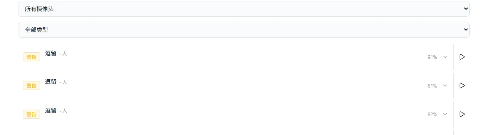

# MiBee Vision 智能分析

MiBee Vision 是与 MiBee NVR 配套的服务端智能分析组件：对 NVR
已录制的视频做 AI 分析（人、车等常见目标），把检测结果以事件形式
写回 NVR，在网页端直接浏览与检索。

> **内测中**：MiBee Vision 目前处于内测阶段，暂不公开提供下载，
> 也暂不以开源形式发布。内测用户随部署包获得配套的安装与配置说明。

## 它能做什么

- **事后智能分析**——对 NVR 录好的视频片段进行目标检测，不占用
  NVR 本机的分析算力，录像性能不受影响。
- **结构化事件**——检测结果生成带置信度的事件（如「逗留 · 人」），
  写回 NVR 的 **AI 事件页**：按日分组、可按摄像头与事件类型筛选、
  一键跳转到对应录像位置。
- **独立监控页**——Vision 自带推送监控页，实时显示队列、处理量与
  处理耗时，运行状态一目了然。


分析在独立的设备或服务器上完成——低功耗主机即可起步，使用带显卡
的机器可以获得更高的处理吞吐。Vision 与 NVR 在同一台机器或分机
部署均可。

## 接入教程

接入只需三步：NVR 生成密钥 → NVR 开启推送 → Vision 填入密钥。
需要 **v0.12.0 及以上**版本的 MiBee NVR。

### 1. 在 NVR 生成 API Key

进入 **设置 → AI 检测 → MiBeeVision 集成**，点击生成 API Key。
密钥形如 `mbv_…`，**只在生成时显示一次**，请妥善保存；同一页面
可以随时吊销（吊销后 Vision 立即失去访问权限）。

### 2. 在 NVR 开启推送

编辑 NVR 配置文件，加入（或修改）`vision` 配置节：

```yaml
vision:
  enabled: true
  url: "http://192.0.2.50:9091"   # Vision 所在主机的地址
  # skip_cameras:                  # 可选：不参与分析的摄像头
  #   - "cam-xxxx"
```

保存后重启 NVR 服务生效。

### 3. 在 Vision 填入 NVR 地址与密钥

在 Vision 的配置中填入 NVR 的访问地址，以及第 1 步生成的
API Key（内测部署包附有对应说明）。连接建立后，NVR 会把新完成的
录像片段推送给 Vision 分析。

### 4. 验证

- NVR 网页端打开 **仪表盘 → AI 事件**：出现检测结果即接入成功；
  未连接时该页会提示「MiBeeVision 未连接」。
- Vision 监控页状态显示 `healthy`，处理计数持续增长。



## 与浏览器端 AI 检测的关系

NVR 网页端另有一套运行在浏览器里的实时检测框叠加（参数调整见
[AI 检测调参指南](ai-detection.md)）。它与 Vision 相互独立：
浏览器检测只影响你观看时的画面叠加，Vision 则负责服务端的录像
事后分析并把事件写回 NVR——两者可以同时使用。

## MiBee App

配套的手机端 **MiBee App**（内测中）可在局域网内直连 NVR，观看
直播与回放录像，这里不再展开。
