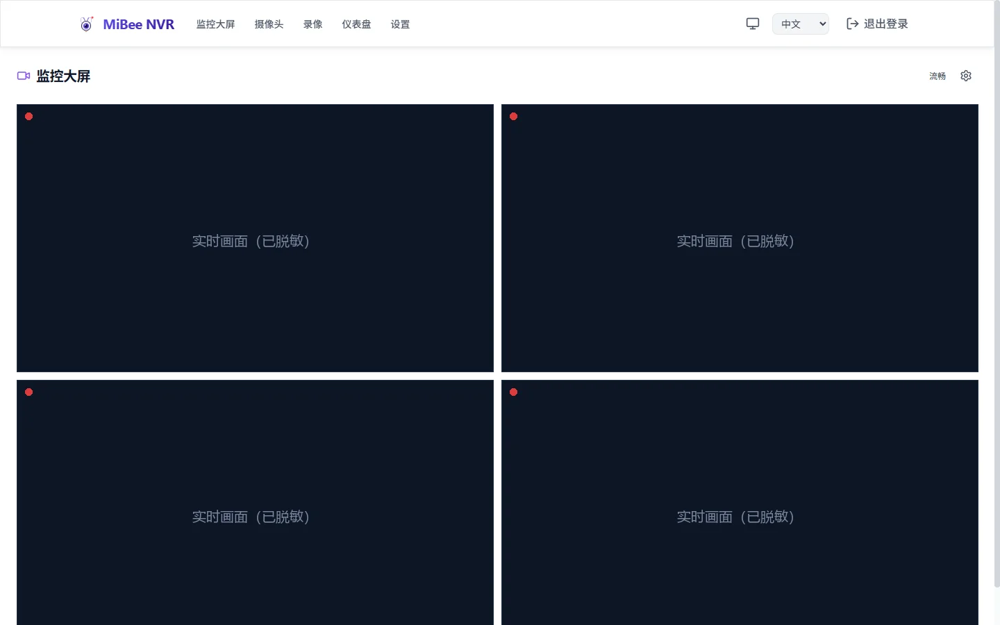

# Web 界面功能导览

> 适用于 MiBeeNvr v0.13.0

MiBee NVR 的 Web 界面分为五个顶级页面 + 直播页。本页是各页面功能速查与使用技巧；具体配置步骤见对应的专题文档。

## 监控大屏（首页）

登录后的默认页面，多宫格实时画面：

- **宫格布局**：右上「配置」按钮打开**选机面板**，选择显示哪些摄像头（最多 4 路）
- **页头画质切换**：「**流畅 / 高清**」一键切换全宫格画质——「流畅」走相机[子码流](sub-stream.md)（默认），多路同看时带宽与解码压力骤降；无子码流的相机自动回退主码流
- **每路画面**：显示名称、「实时」状态、播放协议（WebCodecs / MJPEG 等）与**健康分**
- **画面操作**：取消静音（有音频的摄像头）、全屏
- **AI 叠加**：开启[浏览器端 AI 检测](ai-detection.md)后，检测框直接画在画面上
- **点击画面**进入该摄像头的直播页

选机面板专为多相机场景设计：**搜索框**按名称 / 分组过滤；「**仅在线**」开关默认隐藏离线相机（已选中的离线相机仍显示，便于取消选择）；面板按[分组](#摄像头)分节展示、节头带计数，「**整组选入**」一键把该分组相机按顺序补进剩余空位；底部已选芯片条带 1-4 顺序号，点 × 移除。

> H.265 摄像头在浏览器里通过 WASM 解码播放，无需 HTTPS 或插件；协议选择见[播放协议选择](streaming.md)。

## 摄像头

摄像头全生命周期管理：

| 操作 | 说明 |
|------|------|
| 扫描设备 | ONVIF / 小米自动发现，见 [ONVIF 自动发现](onvif-discovery.md) |
| + 添加摄像头 | 手动添加任意协议摄像头 |
| 启停开关 | 临时停用 / 恢复一路摄像头（保留配置与录像） |
| 重启 | 断开重连该摄像头 |
| 实时 | 进入直播页 |
| 激活 | 部分国标 / ONVIF 设备需先激活 |
| 已归档 | 归档不删除的旧摄像头（换机、留档） |
| 新建分组 | 创建分组整理摄像头——卡片拖拽换组，组头改名 / 删除 / 排序 |

卡片上直接显示运行状态（录制中 / 仅直播 / 已停止 / 重连中 / 无法连接）与协议、编码标签。

### 分组管理

相机多了以后用分组整理：

- 工具栏「**新建分组**」创建空分组
- 组头点击**折叠 / 展开**（状态跨刷新记忆），铅笔图标**内联改名**（组内相机自动跟随），垃圾桶**删除分组**（成员回到「未分组」）
- **拖拽摄像头卡片**换组（空分组显示虚线投放区），**拖动组头**调整分组顺序，「未分组」固定排在最后
- 编辑表单基本信息区的「**分组**」字段可输入新名称或从已有分组下拉选择，留空即未分组

编辑表单按功能折叠分区，除基础接入信息外还包括：

- **[录像模式](adaptive-recording.md)**：连续录制 / 自适应（动静感知）——后者附带音频触发、环境声氛围层等参数
- **[子码流](sub-stream.md)**：ONVIF 子流自动发现或手填子码流 RTSP 地址
- **存储**：为该相机单独指定存储根，并可把历史录像排入[后台迁移](storage-management.md)
- **国标级联**：是否向上级平台上报此摄像头、是否上报子码流

## 录像

录像检索与回放中心，三种视图：

- **时间轴**（默认）：每摄像头一条当日轨道，AI 事件以标记叠加，延时采样与已合并的延时录像条带直接画在轨道上（延时条点击即播），点击 / 拖拽定位播放
- **列表**：片段明细（格式、时长、大小、合并状态），多选批量删除
- **延时摄影**：延时摄影专属视图

顶部工具栏支持类型筛选（视频 / 延时 / MJPEG）、摄像头过滤、**AI 检测过滤**（含人 / 含车）、**活动过滤**（有活动 / 安静 / 场景切换 + 最低活动分）与关键词搜索。详见[录制与回放](recording-playback.md)。

## 仪表盘

运行状态一览，四个子页（标签页）：

- **存储趋势**（默认）：每日写入量的堆叠趋势图（[自绘 SVG](observability.md)）——**图例即相机选择器**（点击隔离 / 切换 / 再点恢复），每根柱子按当日写入量独立排序，悬停色块弹出当日明细，一键翻转排序方向；下方「摄像头状态」卡每行直接显示**录像段数与存储占用**（表头可点击排序），另有每摄像头「存储占用」卡（占用、段数、占比条）
- **健康历史**：摄像头健康事件时间线
- **转码历史**：转码任务记录
- **AI 事件**：服务端 AI 后端（MiBeeVision 集成）推送的检测事件流——按摄像头与事件类型（进入区域 / 越线 / 逗留 / 检测到物体）筛选，每条事件可**跳转到对应录像时刻**回看；仅在外部 AI 后端已配置时显示

> 摄像头状态卡的每行可展开**链路诊断树**（采集源 → 分发中枢 → 录像落盘 / 直播观看 / 健康检测 / 转发 / 子码流），状态一目了然——绿色 = 活跃、灰色 = 空闲、橙色 = 异常、红色 = 严重丢帧。详见[可观测性](observability.md)。

## 设置

九个分页：**通用**（时区 / 端口 / 前端偏好）、**存储**（存储路径、[候选卷与录像迁移](storage-management.md)）、**摄像头接入**、**直播**、**GB28181**、**AI 检测**（浏览器端检测 + MiBeeVision 集成 + 单摄像头配置）、**录像与处理**（含[按活动清理磁盘](adaptive-recording.md#活动分与检索)）、**高级**、**关于**。

- 导航上的「有新版本可用」徽标提示可升级（见[升级指南](upgrade-faq.md)）
- 大部分设置保存即生效；存储路径等少数项需重启

## 直播页（单摄像头）

从监控大屏或摄像头卡片进入 `#/live/{id}`：

- 大画面直播 + 协议切换
- **画质切换器**：该相机有[子码流](sub-stream.md)时可在主 / 子码流间切换
- **PTZ 云台控制**：支持云台的摄像头（如小米云台版）可转向 / 预置位操作
- **双向对讲**：按住说话，声音回传摄像头（见[音频](audio.md)）
- **快照**：保存当前画面
- **摄像头设置**：页面底部折叠面板内嵌该摄像头的编辑表单，不跳转即可调整接入参数；保存后静默刷新探测，不打断当前播放

## 界面偏好

- **主题**：浅色 / 深色 / 跟随系统（右上角切换）
- **语言**：中文 / English（右上角切换，即时生效）
- **PWA**：可作为独立应用安装到桌面 / 手机主屏，离线可打开界面

## 下一步

- [快速开始](quickstart.md) — 添加第一台摄像头
- [CLI 用户手册](cli.md) — 命令行管理
- [直播转推](relay.md) — 把画面推到直播平台
