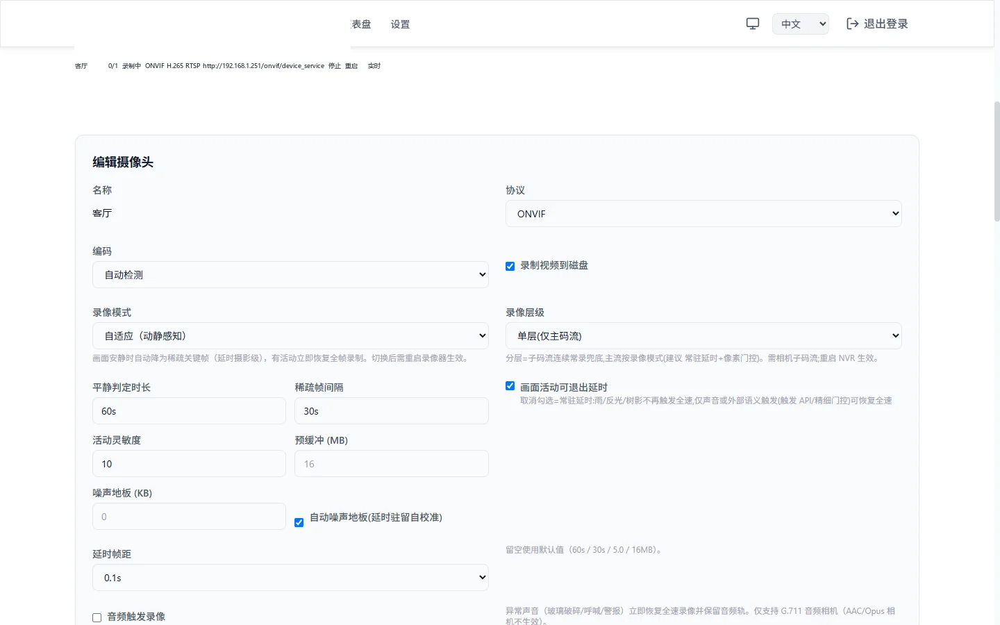
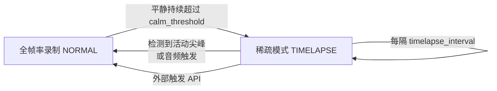

# 自适应录制（动静感知）

> 适用于 MiBeeNvr v0.12.0

大部分监控场景里，画面 95% 以上的时间什么都没发生——但连续录制仍以全帧率、全码率写盘。**自适应录制**让 NVR 在画面安静时自动降为「延时摄影级」的稀疏关键帧写入，一旦检测到活动立即恢复全帧率录制，切换瞬间零丢帧。实测静态场景磁盘占用下降 **约 75%–98%**，而事件发生的第一帧就落在录像里。



## 工作原理



NVR 不解码画面，直接在**压缩域**分析：持续统计 P 帧大小相对滚动基线的偏离（MAD 稳健统计），画面「安静」= P 帧尺寸贴合基线。进入稀疏模式后：

- 只写每 `timelapse_interval` 一个关键帧（音频同时停录，除非开启[环境声氛围层](#环境声氛围层)）
- 一个 GOP 环形预缓冲（默认 32MB）持续保留最近的完整图像组
- **任何活动尖峰（P 帧突然变大）立即冲刷预缓冲**，把「尖峰前一整个 GOP」补写进盘——所以从稀疏到全帧率的切换不丢任何参考帧，回放无花屏、无断层

适用的活动信号有三路，任一路都能把相机拉回全帧率：

| 信号 | 说明 |
|------|------|
| 视频尖峰 | P 帧尺寸偏离基线超过 `spike_factor` 倍（默认路径，全部 H.264/H.265 相机可用） |
| [音频触发](#音频触发) | 1 秒窗口响度超过阈值的「异常声音」——玻璃破碎、呼喊、警报（需 G.711 音频） |
| 外部语义触发 | `POST /api/cameras/{id}/adaptive/trigger`——由家庭自动化、AI 后端等外部系统调用（如「检测到人形」） |

## 开启方式

### Web UI（推荐）

摄像头管理 → 编辑相机 → **录像模式**：选择「**自适应（动静感知）**」。展开后可微调参数（留空使用默认值）；修改模式后需重启录像器（保存时界面会提示）。

### 配置文件

```yaml
cameras:
  - id: "studio"
    name: "工作室内"
    protocol: "onvif"
    # ... 常规接入配置 ...
    recording_mode: "adaptive"   # 默认 "continuous" = 全帧率录制
    adaptive:                    # 全部可选，以下为默认值
      calm_threshold: "60s"      # 平静判定时长（10s–30m）
      timelapse_interval: "30s"  # 稀疏模式关键帧间隔（5s–10m）
      spike_factor: 5.0          # 活动灵敏度（1.5–20，见下文调参）
      gop_buffer_bytes: 33554432 # GOP 预缓冲上限（1–64MB）
```

## 参数调优

| 参数 | 默认值 | 调什么 |
|------|--------|--------|
| `calm_threshold` | 60s | 画面要「安静」多久才降级。楼道等偶有人经过的场景可拉长到 2–5 分钟，进一步压低磁盘写入 |
| `timelapse_interval` | 30s | 稀疏期的关键帧间隔。间隔越长越省盘，但安静期的画面「帧率」越低 |
| `spike_factor` | 5.0 | **活动灵敏度**，越小越灵敏。天台云景、水面反光、树叶摇曳等持续噪声场景需 10–15 才能进入稀疏模式；调得过小会导致相机几乎从不降级（磁盘占用降不下来），过大则会漏掉轻微活动 |
| `gop_buffer_bytes` | 32MB | 预缓冲必须容纳相机一个完整 GOP。2K 相机若 GOP 接近 30s，16MB 会被冲爆导致切换瞬间丢帧——保持默认 32MB 即可 |

> 实测参考：静态工作室相机（2K H.265）从 ~2700MB/h 降到 ~688MB/h（含活动时段）；完全无人时段的稀疏段 5.6MB/248s，对比全帧率 ~190MB（约 34 倍）。

## 音频触发

画面不动但**有声音**的场景（对讲机、玻璃破碎、异响）视频尖峰可能不敏感。开启音频触发后，NVR 用纯 Go 查表解码 G.711 音频，按 1 秒窗口计算响度（dBFS）：

- **进入稀疏模式额外要求**：音频也安静满 `calm_threshold`
- **稀疏中任何响亮窗口**：立即冲刷 GOP 退出稀疏（`reason=audio`），并回填 `pre_capture_s` 秒的预触发音频——异常声音连画面前因一起录下

```yaml
cameras:
  - id: "studio"
    recording_mode: "adaptive"
    audio_trigger:
      enabled: true
      min_dbfs: -45        # 响度阈值（-90–0 dBFS）
      pre_capture_s: 3     # 预录音频秒数（0–30）
```

注意事项：

- 仅支持 **G.711（µ-law / A-law）**音频的相机——AAC / Opus 没有纯 Go 解码器，触发不生效（日志会提示）
- **环境底噪决定阈值**：机房、马路边的相机底噪可能常态 -38dBFS，直接超过默认 -45——需按相机实测调高阈值（如 -35）
- 直播试听与音频触发互相独立；`audio_enabled` 需开启（音频通路要有数据）

### 外部触发 API

任意外部系统（AI 后端、家庭自动化、脚本）都可以把一路相机拉回全帧率：

```bash
curl -u admin:password -X POST \
  http://192.168.1.50:9090/api/cameras/studio/adaptive/trigger \
  -H "Content-Type: application/json" \
  -d '{"source": "mqtt", "hold": "30s", "dbfs": -30}'
```

| 字段 | 说明 |
|------|------|
| `source` | 触发来源标识（自由字符串，进日志与健康统计） |
| `hold` | 保持全帧率多久（如 `"30s"`；缺省用默认保持时长） |
| `dbfs` | 可选，记录触发时的响度参考（进日志） |

MQTT 集成（[MQTT 集成](mqtt.md)）的触发式录制同样走这条路径。

## 环境声氛围层

默认情况下稀疏期音频是**不录**的（省盘优先）。开启 `ambient_audio` 后，稀疏期以 G.711 连续记录环境声（约 28.8MB/小时），滚动合并时把这段「安静的声音」合成为低音量的**氛围层**铺在延时画面下——回放延时片段不再是死寂，而事件段保留真实音频。

```yaml
    adaptive:
      ambient_audio: true      # 稀疏期连续录环境声，合并时合成氛围层
      timelapse_frame_ms: 100  # 合并产物的延时帧距：100 / 300 / 500ms
      ambient_archive: false   # true = 原始环境声另存 <segment>.g711 附属文件供后期
```

## 回放语义

- **无人段以压缩时间轴呈现**：合并产物里 >2s 的驻留样本被压到 `timelapse_frame_ms` 帧距（默认 0.1s），有人/无人段在同一文件内自动变速——因此延时产物的**文件时长远小于墙钟时长**（如 122s 的稀疏段压缩后仅 0.4s），这是预期行为而非损坏
- **数据库行时长保持墙钟轴**，回放页的日时间轴 seek 经由时间轴映射（`timeline_map`）落在产物内的正确位置
- 有人段与全帧率录像完全一致，逐帧可查

## 活动分与检索

每次录制都会被压缩域分析器打上**活动分**（motion score）与活动标签，录像库直接可用：

- **活动筛选**：录像列表按「有活动 / 安静 / 场景切换」过滤，或设「最低活动分」只看高活动片段
- **热力时间轴**：录像详情页一键把时间轴按活动分上色（绿=安静 → 红=活跃），快速目测一天里什么时候有动静
- **按活动清理磁盘**：设置 → 录像与处理，磁盘到达水位时**优先删除活动分最低的安静片段**，同样的磁盘空间留下更多「有事件」的录像


## 限制与判读

| 事项 | 说明 |
|------|------|
| 编码要求 | 仅 H.264 / H.265 相机（MJPEG 无压缩域差分信号） |
| 音频触发编码 | 仅 G.711；AAC/Opus 相机不生效 |
| 模式切换生效 | 修改录像模式需重启录像器（UI 会提示；启停开关或重启相机均可） |
| 磁盘占用没降？ | 多半是 `spike_factor` 过小导致相机几乎不降级——查看仪表盘存储趋势，适当调高灵敏度阈值 |
| 延时段「时长不对」 | 见[回放语义](#回放语义)——压缩时间轴是设计行为 |
| 相机重启/断流 | 稀疏状态自动重置，恢复后重新判定平静窗口 |

## 下一步

- [录制与回放](recording-playback.md) — 常规录制与回放
- [音频](audio.md) — 音频录制、试听与对讲
- [存储优化与扩容](storage-management.md) — 按相机存储路径、候选卷与录像迁移
- [MQTT 集成](mqtt.md) — 外部事件触发录制
