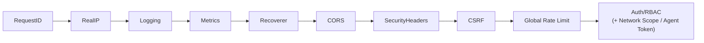
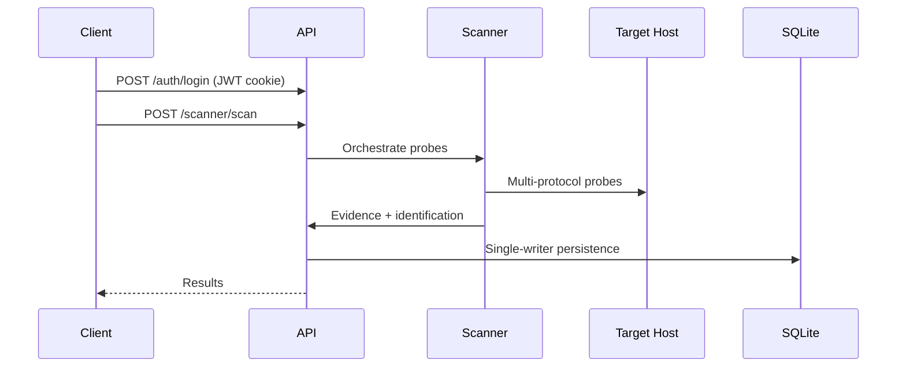

# API Reference

Complete REST API documentation for the MiBee Steward device management and monitoring system (including device systems, network scanning, multi-subnet agents, notifications and audit).

## Table of Contents

- [Overview](#overview)
- [Authentication & Accounts](#authentication--accounts)
- [Health](#health)
- [Users & Network Grants](#users--network-grants)
- [Devices](#devices)
- [Device Systems](#device-systems)
- [Device Neighbors & Certificates](#device-neighbors--certificates)
- [Device Config History](#device-config-history)
- [Networks](#networks)
- [Scanner](#scanner)
- [Credentials](#credentials)
- [Agents & Command Channel](#agents--command-channel)
- [Changes & Discovery](#changes--discovery)
- [Topology](#topology)
- [Documents](#documents)
- [Device-Document Links](#device-document-links)
- [Heartbeat](#heartbeat)
- [Synthetic Probing](#synthetic-probing)
- [Dashboard](#dashboard)
- [Notifications](#notifications)
- [Audit Logs](#audit-logs)
- [Metrics & Service Discovery](#metrics--service-discovery)
- [Pagination](#pagination)
- [Rate Limiting](#rate-limiting)
- [Error Codes](#error-codes)

## Overview

- **Base URL**: `/api/v1` (except `/metrics` and `/sd`)
- **Content-Type**: `application/json` (file uploads use `multipart/form-data`)
- **Auth**: JWT cookie-first + Bearer header fallback (see [Authentication & Accounts](#authentication--accounts))
- **Error envelope**: All errors use `{"error": "message"}` format
- **Capability gating**: Endpoints are gated by capability matrix rather than a uniform role check (see [Authentication & Accounts](#authentication--accounts))

### Middleware Chain

Every request passes through the following middleware in source registration order:



- `RealIP` only trusts `X-Forwarded-For` when the TCP peer is in `server.trusted_proxies` (default empty = trust no proxy); when directly exposed the TCP peer is used. Reverse proxy deployments must declare the proxy source range in configuration.
- Global rate limit defaults to 600 requests per minute per IP; login endpoints 10/min; scan triggers 10/min (see [Rate Limiting](#rate-limiting)).

## Authentication & Accounts

Authentication uses JWT tokens with cookie-first and Bearer header fallback. All business endpoints require authentication except public endpoints.

### JWT Flow

1. **Login**: Submit credentials to obtain a JWT token (set as HTTP-only cookie)
2. **Usage**: Subsequent requests automatically send the token via cookie
3. **Fallback**: If the cookie is unavailable, use the `Authorization: Bearer <token>` header
4. **Expiry**: Configurable (default 24 hours)
5. **Logout**: Blacklist the current token by jti until its expiry (server-side revocation) and clear the cookie

### Roles & Capabilities

Access control is based on a **capability matrix**: each route group is gated by capability, roles map to capability sets, and admin inherits all capabilities.

| Capability Class | Capabilities | Roles |
|------------------|-------------|-------|
| Read | `CapDeviceRead` / `CapNetworkRead` / `CapDiscoveryRead` / `CapChangesRead` / `CapTopologyRead` / `CapConfigRead` / `CapHeartbeatRead` / `CapDashboardRead` / `CapDocumentRead` / `CapNotificationRead` / `CapAuditRead` | Any logged-in user (viewer and above) |
| Operations | `CapDeviceWrite` / `CapScanTrigger` / `CapScanManage` / `CapHeartbeatManage` / `CapDocumentWrite` | Operator and above (operator+) |
| Admin | `CapUserManage` / `CapNetworkManage` / `CapCredManage` / `CapAgentManage` / `CapNotificationManage` / `CapDashboardManage` | Admin only |

> Roles: **admin** (full capabilities), **operator** (scan and write), **viewer** (read-only observer), **user** (legacy basic user).

### Auth Levels


- **Public**: No authentication required (health check, login, logout, 2FA verification, `/metrics`, `/sd`)
- **Authenticated**: Valid JWT token (any role)
- **Capability-gated**: Valid JWT token holding the required capability — read capabilities for any logged-in user, operational capabilities for operator and above, manage capabilities for admin only

### TOTP Two-Factor Authentication (2FA)

Accounts support TOTP-based two-factor authentication. Endpoints are at `/api/v1/auth/2fa` (the entire `/auth` group is subject to login rate limiting):

| Endpoint | Auth | Description |
|----------|------|-------------|
| `POST /api/v1/auth/2fa/verify` | Public · Login Rate Limit | Verify TOTP code (login two-factor verification step) |
| `POST /api/v1/auth/2fa/setup` | Authenticated | Get TOTP setup (generate secret / otpauth URI binding info) |
| `POST /api/v1/auth/2fa/enable` | Authenticated | Enable 2FA (after binding and confirming verification code) |
| `POST /api/v1/auth/2fa/disable` | Authenticated | Disable 2FA |
| `GET /api/v1/auth/2fa/status` | Authenticated | Query current account 2FA status |

### Endpoints

#### POST /api/v1/auth/login

Authenticate user and return JWT token.

**Public** · **10 requests per minute rate limit**

**Request**:
```json
{
  "username": "string",  // accepts username or email
  "password": "string"
}
```

**Response**:
```json
{
  "token": "string",
  "user": {
    "id": 1,
    "username": "admin",
    "email": "admin@example.com",
    "role": "admin",
    "must_change_password": false,
    "created_at": "2023-01-01T00:00:00Z",
    "updated_at": "2023-01-01T00:00:00Z"
  },
  "two_factor_required": false
}
```

Every user object carries a `must_change_password` flag. Accounts with 2FA enabled have a **challenge variant**: after the password checks out, the response carries `two_factor_required: true` and **no** cookie/token is issued — complete the login by passing `POST /auth/2fa/verify`.

#### POST /api/v1/auth/register

Register a new user (admin only).

**Admin Required** · **10 requests per minute rate limit**

**Request**:
```json
{
  "username": "string",
  "email": "string",
  "password": "string",
  "role": "string"  // optional, defaults to "user"
}
```

**Response**:
```json
{
  "id": 1,
  "username": "user",
  "email": "user@example.com",
  "role": "user",
  "must_change_password": false,
  "created_at": "2023-01-01T00:00:00Z",
  "updated_at": "2023-01-01T00:00:00Z"
}
```

#### POST /api/v1/auth/logout

User logout: blacklists the presented token by jti until its expiry (server-side revocation, stronger than clearing the cookie alone) and clears the client cookie.

**Public** (no auth gate; shares the login rate limit with the whole `/auth` group) · **10 requests per minute rate limit**

**Response**: `200 OK` with `{"message": "logged out"}`

### Account Self-Service Endpoints

Self-service profile and password management for the current user (all require auth):

| Endpoint | Method | Auth | Description |
|----------|--------|------|-------------|
| `/api/v1/auth/profile` | GET | Authenticated | Get current user profile |
| `/api/v1/auth/profile` | PUT | Authenticated | Update profile (`email`, required) |
| `/api/v1/auth/password` | PUT | Authenticated | Change password (`old_password` + `new_password`) |
| `/api/v1/auth/force-password` | PUT | Authenticated | Forced password change (first change after `must_change_password` is set, `new_password` only) |

## Health

### GET /api/v1/health

System health check, including database status.

**Public**

**Response**:
```json
{
  "status": "ok",
  "db": "ok",
  "version": "v0.1.0"
}
```

`status` is `ok` or `degraded` (when database ping fails). `db` is `ok` or `error`. `version` is the build version injected via ldflags (`dev` for untagged builds).

## Users & Network Grants

User management and network scope grant endpoints. All endpoints require **Admin** (`CapUserManage`).

| Endpoint | Method | Auth | Description |
|----------|--------|------|-------------|
| `/api/v1/users` | GET | Admin | List all users (paginated) |
| `/api/v1/users/batch-delete` | POST | Admin | Batch delete users |
| `/api/v1/users/{id}/reset-password` | POST | Admin | Reset specified user's password |
| `/api/v1/users/{id}/network-grants` | GET | Admin | List networks granted to a user (visible scope in closed mode) |
| `/api/v1/network-grants` | GET | Admin | List all network grants |
| `/api/v1/network-grants` | POST | Admin | Create a network grant (grant a user access to a specified network, request includes `user_id` and `network_id`) |
| `/api/v1/network-grants/{id}` | DELETE | Admin | Delete a network grant |

Network scope grants take effect in **closed scope mode** (`rbac.scope_default` is closed): users can only see devices, scan tasks, and results within granted networks; out-of-scope device access returns `403`, while unauthorized scan task/run/result details return `404`. See [Configuration Reference → Network Scope](configuration.md) for management.

### GET /api/v1/users

List all users.

**Admin Required**

**Query Parameters**:
- `search`: Fuzzy search over username/email
- `limit`: Number of results (default: 20, max: 100)
- `offset`: Pagination offset

**Response**:
```json
{
  "users": [
    {
      "id": 1,
      "username": "admin",
      "email": "admin@example.com",
      "role": "admin",
      "must_change_password": false,
      "created_at": "2023-01-01T00:00:00Z",
      "updated_at": "2023-01-01T00:00:00Z"
    }
  ],
  "total": 1
}
```

### POST /api/v1/users/{id}/reset-password

Reset user password (admin only). The target user must change their password on next login; login lockout state is also cleared.

**Admin Required**

**Request**:
```json
{
  "new_password": "new-secure-password"
}
```

**Response**:
```json
{
  "message": "password reset successfully"
}
```

## Devices

Device registration and management with multi-protocol auto-discovery and identification.

| Endpoint | Method | Auth | Description |
|----------|--------|------|-------------|
| `/api/v1/devices` | GET | Authenticated · `CapDeviceRead` | List devices (filter + pagination) |
| `/api/v1/devices` | POST | Authenticated · `CapDeviceWrite` | Create a device |
| `/api/v1/devices/stats` | GET | Authenticated · `CapDeviceRead` | Device statistics (counts by status and type) |
| `/api/v1/devices/export` | GET | Authenticated · `CapDeviceRead` | Export device inventory |
| `/api/v1/devices/{id}` | GET | Authenticated · `CapDeviceRead` | Get device details |
| `/api/v1/devices/{id}` | PUT | Authenticated · `CapDeviceWrite` | Update a device |
| `/api/v1/devices/{id}` | DELETE | Authenticated · `CapDeviceWrite` | Delete a device |
| `/api/v1/devices/batch-delete` | POST | Authenticated · `CapDeviceWrite` | Batch delete devices |
| `/api/v1/devices/batch-update-status` | POST | Authenticated · `CapDeviceWrite` | Batch update device status |

Device read/write paths carry **Network Scope** (`NetworkScope`) filtering; device-level operations add a `ValidateDeviceScope` check — out-of-scope access in closed mode returns `403` (`{"error":"forbidden: device out of network scope"}`).

### GET /api/v1/devices

List devices with filtering and pagination.

**Authenticated** · `CapDeviceRead`

**Query Parameters**:
- `status`: Filter by status (`online`, `offline`, `unknown`)
- `type`: Filter by type (12 types: `pc`, `server`, `switch`, `router`, `firewall`, `nas`, `camera`, `phone`, `printer`, `embedded`, `iot`, `other`)
- `search`: Fuzzy search over name/IP/MAC etc.
- `sort` / `order`: Sort field and direction (`asc` / `desc`)
- `created_from` / `created_to`: Filter by creation time (`YYYY-MM-DD` or full timestamp)
- `network_id`: Filter to a single network (absent = all networks)
- `limit`: Number of results (default: 20, max: 100)
- `offset`: Pagination offset

**Response**:
```json
{
  "devices": [
    {
      "id": 1,
      "name": "Server-01",
      "type": "pc",
      "brand": "Dell",
      "model": "PowerEdge R740",
      "location": "Data Center A",
      "purpose": "Web Server",
      "description": "Primary web hosting server",
      "status": "online",
      "ip_address": "192.168.1.100",
      "mac_address": "00:1a:2b:3c:4d:5e",
      "serial_number": "DELL123456",
      "purchase_date": "2022-01-15",
      "warranty_expiry": "2025-01-15",
      "tags": "web,primary",
      "scan_attributes": {
        "vendor": "Dell Inc.",
        "oui_prefix": "001A2B",
        "oui_vendor": "Dell Inc.",
        "mac": "00:1a:2b:3c:4d:5e",
        "mac_is_locally_administered": false,
        "mac_is_multicast": false,
        "hostname": "server-01",
        "os": "Linux",
        "inferred_type": "server",
        "inferred_type_source": "protocol",
        "scan_source": "scanner_v2"
      },
      "created_at": "2023-01-01T00:00:00Z",
      "updated_at": "2023-01-01T00:00:00Z"
    }
  ],
  "total": 1
}
```

**`scan_attributes` (scan-discovery aggregation written by the engine)** — a JSON object on each device carrying scan-discovered information. MAC/OUI-related fields:

| Field | Description |
|-------|-------------|
| `vendor` | Device **self-reported** brand (via SNMP sysObjectID / HTTP Server header / TLS cert CN); falls back to OUI vendor when none of the above match. |
| `oui_prefix` | IEEE-assigned block matched by longest prefix on the MAC — 6 hex (MA-L /24), 7 hex (MA-M /28), or 9 hex (MA-S /36). Empty when no OUI table is loaded or the MAC is unknown/locally administered. |
| `oui_vendor` | IEEE-registered organization name for `oui_prefix` — the **NIC chip vendor**, separate from `vendor` (they differ in OEM/rebrand/virtualization scenarios). |
| `mac` | Normalized lowercase MAC (`aa:bb:cc:..`). |
| `mac_is_locally_administered` | Neutral factual flag: U/L bit (first byte `& 0x02`) set — MAC is locally administered, not from an IEEE block. This bit **cannot** distinguish privacy randomization (unstable) from local fixed assignment (stable), so it is observation-only and **does not change device identity**. |
| `mac_is_multicast` | I/G bit (first byte `& 0x01`) set — a real device should never transmit from a multicast MAC; data hygiene flag. |

### GET /api/v1/devices/stats

Get device statistics (counts by status and type). Supports an optional `network_id` query parameter (scope counts to a single network).

**Authenticated** · `CapDeviceRead`

**Response**:
```json
{
  "by_status": {
    "online": 5,
    "offline": 2,
    "unknown": 1
  },
  "by_type": {
    "pc": 4,
    "embedded": 2,
    "iot": 1,
    "other": 1
  }
}
```

### GET /api/v1/devices/{id}

Get device details by ID.

**Authenticated** · `CapDeviceRead`

**Response**: Same as GET /api/v1/devices, but a single device object.

### POST /api/v1/devices

Create a new device.

**Authenticated** · `CapDeviceWrite`

**Request**:
```json
{
  "name": "string",
  "type": "string",     // pc, server, switch, router, firewall, nas, camera, phone, printer, embedded, iot, other
  "brand": "string",
  "model": "string",
  "location": "string",
  "purpose": "string",
  "description": "string",
  "ip_address": "string",
  "mac_address": "string",
  "serial_number": "string",
  "purchase_date": "string",
  "warranty_expiry": "string",
  "tags": "string"
}
```

**Response**: `201 Created` with DeviceResponse.

### PUT /api/v1/devices/{id}

Update a device (partial update using pointer fields).

**Authenticated** · `CapDeviceWrite`

**Request**:
```json
{
  "name": "string",
  "type": "string",
  "brand": "string",
  "model": "string",
  "location": "string",
  "purpose": "string",
  "description": "string",
  "ip_address": "string",
  "mac_address": "string",
  "serial_number": "string",
  "purchase_date": "string",
  "warranty_expiry": "string",
  "tags": "string"
}
```

**Response**: `200 OK` with updated DeviceResponse.

### DELETE /api/v1/devices/{id}

Delete a device.

**Authenticated** · `CapDeviceWrite`

**Response**: `200 OK` with `{"message": "device deleted"}`

## Device Systems

Device systems management for managing each system installed on a device, its entry URL and monitoring capabilities.

| Endpoint | Method | Auth | Description |
|----------|--------|------|-------------|
| `/api/v1/devices/{id}/systems` | GET | Authenticated · `CapDeviceRead` | List all systems on a device |
| `/api/v1/devices/{id}/systems` | POST | Authenticated · `CapDeviceWrite` | Create a new system for a device |
| `/api/v1/devices/{id}/systems/{systemId}` | GET | Authenticated · `CapDeviceRead` | Get system details |
| `/api/v1/devices/{id}/systems/{systemId}` | PUT | Authenticated · `CapDeviceWrite` | Update a system |
| `/api/v1/devices/{id}/systems/{systemId}` | DELETE | Authenticated · `CapDeviceWrite` | Delete a system |

### GET /api/v1/devices/{id}/systems

List all systems on a device.

**Authenticated** · `CapDeviceRead`

**Response**:
```json
{
  "systems": [
    {
      "id": 1,
      "device_id": 1,
      "name": "Web Server",
      "entry_url": "https://app.example.com",
      "description": "Main web application",
      "category": "web_app",
      "metrics_url": "https://app.example.com/metrics",
      "metrics_enabled": true,
      "tags": "primary,web",
      "created_at": "2023-01-01T00:00:00Z",
      "updated_at": "2023-01-01T00:00:00Z"
    }
  ],
  "total": 1
}
```

### POST /api/v1/devices/{id}/systems

Create a new system for a device.

**Authenticated** · `CapDeviceWrite`

**Request**:
```json
{
  "name": "string",
  "entry_url": "string",
  "description": "string",
  "category": "string",  // web_app, database, middleware, custom
  "metrics_url": "string",
  "metrics_enabled": true,
  "tags": "string"
}
```

**Response**: `201 Created` with SystemResponse.

### GET /api/v1/devices/{id}/systems/{systemId}

Get system details by ID.

**Authenticated** · `CapDeviceRead`

**Response**: Same as GET /api/v1/devices/{id}/systems, but a single system object.

### PUT /api/v1/devices/{id}/systems/{systemId}

Update a system (partial update using pointer fields).

**Authenticated** · `CapDeviceWrite`

**Request**:
```json
{
  "name": "string",
  "entry_url": "string",
  "description": "string",
  "category": "string",
  "metrics_url": "string",
  "metrics_enabled": true,
  "tags": "string"
}
```

**Response**: `200 OK` with updated SystemResponse.

### DELETE /api/v1/devices/{id}/systems/{systemId}

Delete a system.

**Authenticated** · `CapDeviceWrite`

**Response**: `200 OK` with `{"message": "device system deleted"}`

## Device Neighbors & Certificates

Read-only data on the device detail page: L2 neighbors and TLS certificates.

| Endpoint | Method | Auth | Description |
|----------|--------|------|-------------|
| `/api/v1/devices/{id}/neighbors` | GET | Authenticated · `CapDeviceRead` | List device L2 neighbors (Bridge-MIB / LLDP / CDP / ARP) |
| `/api/v1/devices/{id}/certificates` | GET | Authenticated · `CapDeviceRead` | List TLS certificate chains for device ports |

### GET /api/v1/devices/{id}/neighbors

List discovered L2 neighbors (from Bridge-MIB / LLDP / CDP / ARP) for the device detail neighbor panel.

**Authenticated** · `CapDeviceRead`

**Response**: Neighbor list (`{ neighbors: [...] }`, with peer IP/MAC and discovery source).

### GET /api/v1/devices/{id}/certificates

List TLS certificate chains collected from each TLS port on the device, grouped by port. Collected by the v2 scanner from TLS-wrapped services (HTTPS, LDAPS, SMTPS, IMAPS, POP3S, FTPS, IRCS, TelnetS); one row per certificate in each port chain (`cert_index` 0 = leaf/server cert, 1..N = issuing authorities). The chain for a port is replaced in its entirety on each scan. Retained per `retention.host_tls_certs_days` (default 30 days).

**Authenticated** · `CapDeviceRead` (read-only)

**Response**:
```json
{
  "certificates": [
    {
      "port": 990,
      "tls_version": "TLS 1.2",
      "cipher_suite": "TLS_ECDHE_RSA_WITH_AES_256_GCM_SHA384",
      "trusted": false,
      "error": "",
      "updated_at": "2026-07-17T23:38:33Z",
      "leaf": {
        "cert_index": 0,
        "subject_cn": "device.example.com",
        "subject_org": "Example Org",
        "subject": "CN=device.example.com,O=Example Org",
        "issuer_cn": "Example CA",
        "issuer_org": "Example CA Ltd",
        "issuer": "CN=Example CA,O=Example CA Ltd,C=US",
        "san_dns": "device.example.com, alt.example.com",
        "san_ip": "192.168.63.112",
        "san_email": "",
        "serial": "665071982890971409216315924781532514095376553279",
        "not_before": "2023-10-29T02:38:14Z",
        "not_after": "2033-10-26T02:38:14Z",
        "sig_algorithm": "SHA256-RSA",
        "key_algorithm": "RSA",
        "key_bits": 2048,
        "is_ca": false,
        "self_signed": false,
        "fingerprint_sha256": "B8A72EE7DF38217D2C037C8927E687921FD8D31B9A0AF2E4E22779B60671F278",
        "pem": "-----BEGIN CERTIFICATE-----\nMIIC4zCCAcsCFHR+...\n-----END CERTIFICATE-----\n"
      },
      "chain": [
        { "cert_index": 0, "subject_cn": "device.example.com", "...": "..." },
        { "cert_index": 1, "subject_cn": "Example CA", "is_ca": true, "...": "..." }
      ]
    }
  ],
  "total": 1
}
```

**Field descriptions**:
- `tls_version` / `cipher_suite` / `trusted` are handshake metadata, identical on every entry within the same port chain (describing the same handshake).
- `leaf` is `chain[0]`, exposed separately for at-a-glance rendering; omitted when `error` is non-empty.
- `error` is non-empty when the TLS handshake fails (e.g. `not TLS`, `handshake failure`). These rows are still returned so the UI can show "this port was attempted" rather than silently omitting it. In this case `leaf` and `chain` are empty.
- `trusted` is a best-effort determination (one validation handshake against the system root cert pool), used for UI badge only — **it does not affect collection** (self-signed certs are always collected).
- When a device has no recorded TLS ports, an empty `certificates` array is returned with HTTP 200 — render an empty state, not 404.

## Device Config History

Device running configuration history (Oxidized/RANCID style), written by the background config-backup service (`scanner.config_backup.enabled`); endpoints are read-only. The list omits `config_text`; details and diffs load on demand.

| Endpoint | Method | Auth | Description |
|----------|--------|------|-------------|
| `/api/v1/devices/{id}/configs` | GET | Authenticated · `CapConfigRead` | List device config history (excludes `config_text`) |
| `/api/v1/devices/{id}/configs/diff` | GET | Authenticated · `CapConfigRead` | Diff two config versions (required query params `a`, `b` = config IDs), return the diff |
| `/api/v1/devices/{id}/configs/{configId}` | GET | Authenticated · `CapConfigRead` | Get a single config version (includes `config_text`) |

## Networks

Network registry: identifies networks in multi-subnet/multi-instance deployments (source of `network_id` tagging and filtering). Read (`CapNetworkRead`) available to any logged-in user; write (`CapNetworkManage`) admin only.

| Endpoint | Method | Auth | Description |
|----------|--------|------|-------------|
| `/api/v1/networks` | GET | Authenticated · `CapNetworkRead` | List networks |
| `/api/v1/networks` | POST | Admin · `CapNetworkManage` | Create a network (request body includes `name`, `cidr`, `site`) |
| `/api/v1/networks/{id}` | PUT | Admin · `CapNetworkManage` | Update a network |
| `/api/v1/networks/{id}` | DELETE | Admin · `CapNetworkManage` | Delete a network |

This instance's own network is auto-upserted into the registry at startup from configuration `network.name` / `network.cidr` / `network.site`.

## Scanner

The network scanner uses the v2 plugin engine (probe → classify → handler → persist), detailed in [Architecture → Network Scanner](architecture.md) and [Fingerprint Rule Specification](fingerprint-spec.md). Scanner-related endpoints are gated by capability tier: read (`CapDiscoveryRead`) available to any logged-in user; trigger and task management (`CapScanTrigger` / `CapScanManage`) operator and above; `add-devices` requires `CapDeviceWrite`. In closed mode, non-admins can only see tasks/runs/results within granted networks; unauthorized details return `404`.

### Auth & Scan Sequence



### POST /api/v1/scanner/scan

Run a synchronous scan against targets (single IP, CIDR, range, comma list).

**Authenticated** · `CapScanTrigger` · Scan rate limit (default 10/min per IP)

**Request Body**:
```json
{ "targets": "192.168.1.0/24", "community": "public", "timeout": 2 }
```
- `targets` (required): IP / CIDR / `a.b.c.d-e` range / comma list
- `community` (default "public"): SNMP community
- `timeout` (default 2): Per-host ICMP timeout (seconds)
- `credential_id` (optional): Bind an SNMP credential (default 0 = none)

**Response**: `ScanResponse { hosts: [ScanHost], total, alive, duration_ms }`, each `ScanHost` containing `ip`, `alive`, `rtt_ms`, `snmp_*` variables, and `inferred_type` / `inferred_brand` (e.g. `camera`, `server`, `pc`).

**Persistence**: Alive hosts are persisted through the device bridge (`ApplyReport`) into the `devices` table — device upsert, heartbeat-config seeding for new devices, change events — the same single-writer path as async tasks. Sync scans do **not** write raw `scan_results` / `scan_task_runs` rows (that is the async-task path).

**Limits**: Returns **413** for targets >1024 IPs (use the async task API below). Returns **504** if the server `write_timeout` triggers mid-scan (config drift fallback).

### POST /api/v1/scanner/add-devices

Manually add devices from scan results. Each entry goes through the device bridge upsert (creates a new `devices` row + seeds heartbeat config for new devices).

**Authenticated** · `CapDeviceWrite`

**Request Body**:
```json
{ "devices": [ { "ip": "192.168.1.1", "name": "Gateway", "type": "other", "brand": "...", "ports": [...], "services": [...] } ] }
```

**Response**: `{ added: int, errors: [string] }`. Returns **422** when **every** item fails to persist (`added=0`, `errors` carries per-item reasons) — the request was valid but the operation could not be applied.

### Scanner Task API (async, for large ranges)

| Endpoint | Method | Auth | Description |
|----------|--------|------|-------------|
| `/api/v1/scanner/tasks` | POST | `CapScanManage` | Create a cron-driven scan task (includes `targets`, cron expression, timeout, concurrent hosts and optional SNMP credential ID) |
| `/api/v1/scanner/tasks` | GET | `CapDiscoveryRead` | List tasks (paginated) |
| `/api/v1/scanner/tasks/{id}` | GET | `CapDiscoveryRead` | Task details |
| `/api/v1/scanner/tasks/{id}` | PUT | `CapScanManage` | Update a task |
| `/api/v1/scanner/tasks/{id}` | DELETE | `CapScanManage` | Delete a task |
| `/api/v1/scanner/tasks/{id}/trigger` | POST | `CapScanTrigger` · Scan Rate Limit | Trigger a task asynchronously (returns `202` with synthetic "triggered" status; the real run row is created when the scan starts) |
| `/api/v1/scanner/tasks/{id}/cancel` | POST | `CapScanTrigger` | Cancel a running scan (returns `409` if not running) |
| `/api/v1/scanner/tasks/{id}/runs` | GET | `CapDiscoveryRead` | Run history |
| `/api/v1/scanner/tasks/{id}/results` | GET | `CapDiscoveryRead` | Per-host results for the task |

Task creation (`POST /scanner/tasks`) validates: `name` and `targets` are required; targets are capped at **4096 IPs**; `cron_expr` is required and must be a valid cron expression; `timeout` must be **1–600** seconds; `concurrent_hosts` must be **1–200**; `pipeline_config` must pass validation (port lists etc.). Validation failures return `400`.

### Scan Results API

| Endpoint | Method | Auth | Description |
|----------|--------|------|-------------|
| `/api/v1/scanner/results` | GET | `CapDiscoveryRead` | Browse results (`task_id`, `ip`, `alive` (`1`/`0`), `sort`, `order`, `limit`, `offset`) |
| `/api/v1/scanner/results/{id}` | GET | `CapDiscoveryRead` | Single result |
| `/api/v1/scanner/results/export` | GET | `CapDiscoveryRead` | CSV export (`task_id`) |
| `/api/v1/scanner/results` | DELETE | `CapScanManage` | Batch delete by date (`before_date`, RFC3339) |
| `/api/v1/scanner/runs` | GET | `CapDiscoveryRead` | Browse runs (`task_id`) |
| `/api/v1/scanner/runs/{id}` | GET | `CapDiscoveryRead` | Single run |

## Credentials

SNMP and SSH credential management for scanning. Both credential types are stored as AES-GCM encrypted ciphertext (`security.master_key`); list and detail responses are **masked projections** that do not include the key material. All endpoints are **Admin only** (`CapCredManage`).

### SNMP Credentials

| Endpoint | Method | Auth | Description |
|----------|--------|------|-------------|
| `/api/v1/snmp-credentials` | POST | Admin · `CapCredManage` | Create credential (v1/v2c community or v3 USM auth/priv) |
| `/api/v1/snmp-credentials` | GET | Admin · `CapCredManage` | List credentials (masked projection) |
| `/api/v1/snmp-credentials/{id}` | GET | Admin · `CapCredManage` | Get a single credential (masked projection) |
| `/api/v1/snmp-credentials/{id}` | PUT | Admin · `CapCredManage` | Update a credential |
| `/api/v1/snmp-credentials/{id}` | DELETE | Admin · `CapCredManage` | Delete a credential |

### SSH Credentials

| Endpoint | Method | Auth | Description |
|----------|--------|------|-------------|
| `/api/v1/ssh-credentials` | POST | Admin · `CapCredManage` | Create credential |
| `/api/v1/ssh-credentials` | GET | Admin · `CapCredManage` | List credentials (masked projection) |
| `/api/v1/ssh-credentials/{id}` | GET | Admin · `CapCredManage` | Get a single credential (masked projection) |
| `/api/v1/ssh-credentials/{id}` | PUT | Admin · `CapCredManage` | Update a credential |
| `/api/v1/ssh-credentials/{id}` | DELETE | Admin · `CapCredManage` | Delete credential |

SSH credentials are used by device config backup probes (see [Device Config History](#device-config-history)).

## Agents & Command Channel

Discovery agent management and command dispatch channel in distributed deployments. Token management and command management endpoints require **Admin** (`CapAgentManage`); agent data upload and command pull use **Agent Token** (`RequireAgentToken`) authentication — tokens are bound to `agent_id` + `network_id`, every reported device is tagged with that network, and multi-subnet data does not collide.

| Endpoint | Method | Auth | Description |
|----------|--------|------|-------------|
| `/api/v1/agents/tokens` | POST | Admin · `CapAgentManage` | Create agent token (request binds `agent_id` and `network_id`) |
| `/api/v1/agents/tokens` | GET | Admin · `CapAgentManage` | List agent tokens |
| `/api/v1/agents/tokens/{id}/revoke` | POST | Admin · `CapAgentManage` | Revoke an agent token |
| `/api/v1/agents/tokens/{id}` | DELETE | Admin · `CapAgentManage` | Delete an agent token |
| `/api/v1/agents/report` | POST | Agent Token | Agent uploads scan results (machine-to-machine; every device is tagged with the reporting network) |
| `/api/v1/agents/commands` | GET | Agent Token | Agent pulls pending commands (pull model) |
| `/api/v1/agents/commands/{id}/ack` | POST | Agent Token | Acknowledge receipt of a command |
| `/api/v1/agents/commands/{id}/complete` | POST | Agent Token | Report command execution result |
| `/api/v1/agents/{agentId}/commands` | POST | Admin · `CapAgentManage` | Create a command for a specific agent |
| `/api/v1/agents/commands/all` | GET | Admin · `CapAgentManage` | View all agent commands |

> Agent token authentication and user JWT are two independent authentication systems: `/agents/report` and `/agents/commands` (pull/ack/complete) are under the `/api/v1/agents` group and use `RequireAgentToken`; command management and token management use admin JWT.

## Changes & Discovery

Change event stream and passive discovery status.

| Endpoint | Method | Auth | Description |
|----------|--------|------|-------------|
| `/api/v1/changes` | GET | Authenticated · `CapChangesRead` | Change event list (`device_added` / `device_changed` / `device_lost`; filterable by `network_id` / `change_type` / `entity_type`) |
| `/api/v1/changes/watch` | GET | Authenticated · `CapChangesRead` | Real-time change push (SSE) |
| `/api/v1/discovery/status` | GET | Authenticated · `CapDiscoveryRead` | Passive discovery runtime status (event count, dedup hits, identification triggers, recorded device count, active source list; `enabled=false` when service is disabled) |

Change events are written to the `change_log` table by the change detection engine; `/changes/watch` pushes in real time via an in-process watcher. The notification rule engine subscribes to the same event source (see [Notifications](#notifications)).

## Topology

| Endpoint | Method | Auth | Description |
|----------|--------|------|-------------|
| `/api/v1/topology` | GET | Authenticated · `CapTopologyRead` | Full network topology: all devices (nodes) + all neighbor edges |

## Documents

Document management with URL fetching and file upload capabilities.

| Endpoint | Method | Auth | Description |
|----------|--------|------|-------------|
| `/api/v1/documents` | GET | Authenticated · `CapDocumentRead` | List documents |
| `/api/v1/documents/{id}` | GET | Authenticated · `CapDocumentRead` | Get document details |
| `/api/v1/documents/{id}/download` | GET | Authenticated · `CapDocumentRead` | Download document file |
| `/api/v1/documents` | POST | Authenticated · `CapDocumentWrite` (operator+) | Create a URL document |
| `/api/v1/documents/upload` | POST | Authenticated · `CapDocumentWrite` (operator+) | Upload a file document (multipart) |
| `/api/v1/documents/{id}` | PUT | Authenticated · `CapDocumentWrite` (operator+) | Update a document |
| `/api/v1/documents/{id}` | DELETE | Authenticated · `CapDocumentWrite` (operator+) | Delete a document |

### GET /api/v1/documents

List documents.

**Authenticated** · `CapDocumentRead`

**Query Parameters**:
- `search`: Fuzzy search over title/description
- `limit`: Number of results (default: 20, max: 100)
- `offset`: Pagination offset

**Response**:
```json
{
  "documents": [
    {
      "id": 1,
      "title": "Server Manual",
      "type": "file",
      "url": "",
      "file_path": "./data/uploads/server-manual.pdf",
      "file_size": 2048000,
      "mime_type": "application/pdf",
      "description": "Server administration manual",
      "created_at": "2023-01-01T00:00:00Z",
      "updated_at": "2023-01-01T00:00:00Z"
    }
  ],
  "total": 1
}
```

### GET /api/v1/documents/{id}

Get document details.

**Authenticated** · `CapDocumentRead`

**Response**: Same as GET /api/v1/documents, but a single document object.

### GET /api/v1/documents/{id}/download

Download document file.

**Authenticated** · `CapDocumentRead`

**Response**: File download with appropriate content-type header.

### POST /api/v1/documents

Create a URL document.

**Authenticated** · `CapDocumentWrite` (operator and above)

**Request**:
```json
{
  "title": "string",
  "type": "url",
  "url": "https://example.com/document",
  "description": "string"
}
```

**Response**: `201 Created` with DocumentResponse.

### POST /api/v1/documents/upload

Upload a file document (multipart form).

**Authenticated** · `CapDocumentWrite` (operator and above)

**Form Parameters**:
- `file`: File to upload (default max 10 MiB, configurable via `storage.max_file_size`; a reverse proxy's `client_max_body_size` is a separate layer)
- `title`: Document title
- `description`: Document description

**Response**: `201 Created` with DocumentResponse.

### PUT /api/v1/documents/{id}

Update a document.

**Authenticated** · `CapDocumentWrite` (operator and above)

**Request**:
```json
{
  "title": "string",
  "url": "string",
  "description": "string"
}
```

**Response**: `200 OK` with updated DocumentResponse.

### DELETE /api/v1/documents/{id}

Delete a document.

**Authenticated** · `CapDocumentWrite` (operator and above)

**Response**: `200 OK` with `{"message": "document deleted"}`

## Device-Document Links

Association management between devices and documents.

| Endpoint | Method | Auth | Description |
|----------|--------|------|-------------|
| `/api/v1/devices/{id}/documents` | GET | Authenticated · `CapDocumentRead` | Get documents associated with a device |
| `/api/v1/devices/{id}/documents` | POST | Authenticated · `CapDocumentWrite` (operator+) | Associate a document with a device |
| `/api/v1/devices/{id}/documents/{docId}` | DELETE | Authenticated · `CapDocumentWrite` (operator+) | Remove association between device and document |
| `/api/v1/documents/{id}/devices` | GET | Authenticated · `CapDocumentRead` | Get devices associated with a document |

### GET /api/v1/devices/{id}/documents

Get documents associated with a device.

**Authenticated** · `CapDocumentRead`

**Response**:
```json
{
  "documents": [
    {
      "id": 1,
      "title": "Server Manual",
      "type": "file",
      "url": "",
      "file_path": "./data/uploads/server-manual.pdf",
      "file_size": 2048000,
      "mime_type": "application/pdf",
      "description": "Server administration manual",
      "created_at": "2023-01-01T00:00:00Z",
      "updated_at": "2023-01-01T00:00:00Z"
    }
  ],
  "total": 1
}
```

### POST /api/v1/devices/{id}/documents

Associate a document with a device.

**Authenticated** · `CapDocumentWrite` (operator and above)

**Request**:
```json
{
  "document_id": 1
}
```

**Response**: `201 Created`

### DELETE /api/v1/devices/{id}/documents/{docId}

Remove association between device and document.

**Authenticated** · `CapDocumentWrite` (operator and above)

**Response**: `200 OK` with `{"message": "document unlinked from device"}`

### GET /api/v1/documents/{id}/devices

Get devices associated with a document.

**Authenticated** · `CapDocumentRead`

**Response**:
```json
{
  "devices": [
    {
      "id": 1,
      "name": "Server-01",
      "type": "pc",
      "brand": "Dell",
      "model": "PowerEdge R740",
      "location": "Data Center A",
      "purpose": "Web Server",
      "description": "Primary web hosting server",
      "status": "online",
      "ip_address": "192.168.1.100",
      "mac_address": "00:1A:2B:3C:4D:5E",
      "serial_number": "DELL123456",
      "purchase_date": "2022-01-15",
      "warranty_expiry": "2025-01-15",
      "tags": "web,primary",
      "created_at": "2023-01-01T00:00:00Z",
      "updated_at": "2023-01-01T00:00:00Z"
    }
  ],
  "total": 1
}
```

## Heartbeat

Device heartbeat configuration and monitoring. Read (`CapHeartbeatRead`) available to any logged-in user; write (`CapHeartbeatManage`) operator and above (operator+, not admin-only).

| Endpoint | Method | Auth | Description |
|----------|--------|------|-------------|
| `/api/v1/devices/{id}/heartbeat-configs` | GET | Authenticated · `CapHeartbeatRead` | Get device heartbeat configuration |
| `/api/v1/devices/{id}/heartbeat-configs` | POST | Operator+ · `CapHeartbeatManage` | Create device heartbeat configuration |
| `/api/v1/heartbeat-configs/{id}` | PUT | Operator+ · `CapHeartbeatManage` | Update heartbeat configuration |
| `/api/v1/heartbeat-configs/{id}` | DELETE | Operator+ · `CapHeartbeatManage` | Delete heartbeat configuration |
| `/api/v1/devices/{id}/heartbeat-results` | GET | Authenticated · `CapHeartbeatRead` | Device heartbeat results (paging default 50/max 500, `start_date`/`end_date` filters) |
| `/api/v1/devices/{id}/heartbeat-results/export` | GET | Authenticated · `CapHeartbeatRead` | Export heartbeat results (CSV) |
| `/api/v1/devices/{id}/heartbeat-history` | GET | Authenticated · `CapHeartbeatRead` | Device heartbeat history (**required** `from`/`to`, RFC3339, `to` > `from`, range ≤ 90 days) |
| `/api/v1/devices/{id}/heartbeat-stats` | GET | Authenticated · `CapHeartbeatRead` | Device heartbeat statistics (**required** `from`/`to`, RFC3339, `to` > `from`, range ≤ 90 days) |

### GET /api/v1/devices/{id}/heartbeat-configs

Get device heartbeat configuration.

**Authenticated** · `CapHeartbeatRead`

**Response**:
```json
{
  "configs": [
    {
      "id": 1,
      "device_id": 1,
      "method": "icmp",
      "target": "192.168.1.100",
      "interval_seconds": 30,
      "timeout_seconds": 5,
      "snmp_community": "public",
      "snmp_oid": "1.3.6.1.2.1.1.3.0",
      "enabled": 1,
      "created_at": "2023-01-01T00:00:00Z",
      "updated_at": "2023-01-01T00:00:00Z"
    }
  ],
  "total": 1
}
```

### POST /api/v1/devices/{id}/heartbeat-configs

Create device heartbeat configuration.

**Operator+** · `CapHeartbeatManage`

**Request**:
```json
{
  "method": "icmp",
  "target": "192.168.1.100",
  "interval_seconds": 30,
  "timeout_seconds": 5,
  "snmp_community": "public",
  "snmp_oid": "1.3.6.1.2.1.1.3.0",
  "enabled": 1
}
```
- `method` (required): `icmp` | `http` | `tcp` | `snmp`
- `target` (required): probe target
- `interval_seconds` (optional, default 30): probe interval (seconds)
- `timeout_seconds` (optional, default 5): timeout (seconds)
- `snmp_community` (optional, default "public"): SNMP community
- `snmp_oid` (optional, default sysUpTime OID): SNMP probe OID
- `enabled` (optional, default 1): whether enabled

**Response**: `201 Created` with HeartbeatConfigResponse.

### PUT /api/v1/heartbeat-configs/{id}

Update heartbeat configuration (partial update using pointer fields, same field names as the create request).

**Operator+** · `CapHeartbeatManage`

**Request**:
```json
{
  "method": "icmp",
  "target": "192.168.1.100",
  "interval_seconds": 30,
  "timeout_seconds": 5,
  "snmp_community": "public",
  "snmp_oid": "1.3.6.1.2.1.1.3.0",
  "enabled": 1
}
```

**Response**: `200 OK` with updated HeartbeatConfigResponse.

### DELETE /api/v1/heartbeat-configs/{id}

Delete heartbeat configuration.

**Operator+** · `CapHeartbeatManage`

**Response**: `200 OK` with `{"message": "heartbeat config deleted"}`

### GET /api/v1/devices/{id}/heartbeat-results

Get device heartbeat results.

**Authenticated** · `CapHeartbeatRead`

**Query Parameters**:
- `limit`: Number of results (default: 50, max: 500)
- `offset`: Pagination offset
- `start_date` / `end_date`: Filter by check time (RFC3339)

**Response**:
```json
{
  "results": [
    {
      "id": 1,
      "device_id": 1,
      "config_id": 1,
      "status": "success",
      "latency_ms": 12,
      "error_message": "",
      "checked_at": "2023-01-01T00:00:00Z"
    }
  ],
  "total": 1
}
```

`status` is one of `success` / `fail` / `timeout`; `checked_at` is an RFC3339 string.

## Synthetic Probing (拨测)

Periodic probing of EXPLICIT user-configured endpoints (blackbox_exporter-style), typically external/internet resources. Four modules: `http` / `tls` / `tcp` / `icmp`. The `tls` module — and https-flavored `http` targets — collect the full certificate chain (reusing the scanner's internal cert inventory for external hosts; results carry a trust verdict and TLS version). Reads (`CapProbeRead`) are available to any logged-in user; writes (`CapProbeManage`) require operator and above.

| Endpoint | Method | Auth | Description |
|----------|--------|------|-------------|
| `/api/v1/probe-targets/` | GET | Auth · `CapProbeRead` | List targets (`limit`/`offset`/`search`) |
| `/api/v1/probe-targets/` | POST | Operator+ · `CapProbeManage` | Create a probe target |
| `/api/v1/probe-targets/{id}` | GET | Auth · `CapProbeRead` | Get one target |
| `/api/v1/probe-targets/{id}` | PUT | Operator+ · `CapProbeManage` | Update (partial; nil fields unchanged) |
| `/api/v1/probe-targets/{id}` | DELETE | Operator+ · `CapProbeManage` | Delete target (with its result history and stored certificate chain) |
| `/api/v1/probe-targets/{id}/trigger` | POST | Operator+ · `CapProbeManage` | Probe now (synchronous — returns the recorded result) |
| `/api/v1/probe-targets/{id}/results` | GET | Auth · `CapProbeRead` | Result history (`limit`/`offset`, newest first) |
| `/api/v1/probe-targets/{id}/certificates` | GET | Auth · `CapProbeRead` | Current certificate chain (same shape as the device endpoint) |

### POST /api/v1/probe-targets/

Create a probe target.

**Operator+** · `CapProbeManage`

**Request**:
```json
{
  "name": "github-tls",
  "module": "tls",
  "target": "github.com:443",
  "interval_seconds": 60,
  "timeout_seconds": 10,
  "notes": "",
  "enabled": true
}
```
- `name` (required, globally unique): target name (also the Prometheus metric label)
- `module` (required): `http` | `tls` | `tcp` | `icmp`
- `target` (required, module-validated): `http` needs a full http(s) URL; `tls`/`tcp` need host:port (port 1–65535); `icmp` needs a bare host or IP
- `interval_seconds` (optional, default 60): probe interval, 10–86400 seconds
- `timeout_seconds` (optional, default 10): per-probe timeout, 1–60 seconds, must be smaller than the interval
- `notes` (optional, ≤500 chars), `enabled` (optional, default true)

**Response**: `201 Created` with ProbeTargetResponse (including the denormalized `last_run_at`/`last_status`/`last_latency_ms`/`last_error`; empty = never probed).

### POST /api/v1/probe-targets/{id}/trigger

Run one probe immediately (mutually exclusive with the scheduler via an in-flight guard; bounded by the target's `timeout_seconds`).

**Operator+** · `CapProbeManage`

**Response**: the just-recorded result (ProbeResultResponse):
```json
{
  "target_id": 1,
  "status": "success",
  "latency_ms": 75.09,
  "status_code": 0,
  "error_message": "",
  "tls_version": "TLS 1.2",
  "cert_not_after": "2027-01-24T02:32:55Z",
  "cert_trusted": true,
  "checked_at": "2026-08-19T06:30:22Z"
}
```
`status` is `success` / `fail` / `timeout` (a probe error carrying timeout markers is classified as timeout); `status_code` is non-zero only for the http module; the certificate fields are present only when a cert was collected (`cert_trusted` of `null` means none this run).

### GET /api/v1/probe-targets/{id}/certificates

The target's current certificate chain (leaf + intermediates/root, with SAN/serial/fingerprint/PEM/handshake metadata). A transient collection failure keeps the last known-good chain; no certificates at all returns an empty array (200). The `certificates[]` response is structurally identical to `GET /api/v1/devices/{id}/certificates` (one single-port entry per target).

Related metrics: `mibee_probe_up{name,module}`, `mibee_probe_duration_seconds`, `mibee_probe_cert_expiry_timestamp_seconds`, `mibee_probe_checks_total{status,module}` (see [Metrics & Service Discovery](#metrics--service-discovery)).

## Dashboard

Prometheus data source dashboard configuration and query passthrough. Read (`CapDashboardRead`, network scope filtering) available to any logged-in user; configuration management (`CapDashboardManage`) admin only.

| Endpoint | Method | Auth | Description |
|----------|--------|------|-------------|
| `/api/v1/dashboard/configs` | GET | Authenticated · `CapDashboardRead` | List dashboard panel configurations |
| `/api/v1/dashboard/configs` | POST | Admin · `CapDashboardManage` | Create a panel configuration |
| `/api/v1/dashboard/configs/{id}` | PUT | Admin · `CapDashboardManage` | Update a panel configuration |
| `/api/v1/dashboard/configs/{id}` | DELETE | Admin · `CapDashboardManage` | Delete a panel configuration |
| `/api/v1/dashboard/overview` | GET | Authenticated · `CapDashboardRead` | Overview statistics (device/system/network counts) |
| `/api/v1/dashboard/query` | GET | Authenticated · `CapDashboardRead` | Prometheus instant query passthrough |
| `/api/v1/dashboard/query_range` | GET | Authenticated · `CapDashboardRead` | Prometheus range query passthrough |

### GET /api/v1/dashboard/configs

List dashboard panel configurations.

**Authenticated** · `CapDashboardRead`

**Response**:
```json
{
  "configs": [
    {
      "id": 1,
      "name": "CPU Usage",
      "type": "line",
      "data_source": "prometheus",
      "query": "100 - (avg by (instance) (rate(node_cpu_seconds_total{mode=\"idle\"}[5m])) * 100)",
      "refresh_interval": 30,
      "position": "{\"col\":1,\"row\":1}",
      "created_at": "2023-01-01T00:00:00Z",
      "updated_at": "2023-01-01T00:00:00Z"
    }
  ],
  "total": 1
}
```

`position` is a JSON **string** (panel layout coordinates), not an object.

### POST /api/v1/dashboard/configs

Create a dashboard panel configuration.

**Admin Required** · `CapDashboardManage`

**Request**:
```json
{
  "name": "CPU Usage",
  "type": "line",
  "data_source": "prometheus",
  "query": "100 - (avg by (instance) (rate(node_cpu_seconds_total{mode=\"idle\"}[5m])) * 100)",
  "refresh_interval": 30,
  "position": "{\"col\":1,\"row\":1}"
}
```
- `name` (required): panel name
- `type` (required): `gauge` | `line` | `bar` | `pie`
- `data_source` (optional, default "prometheus"): data source type
- `query` (optional): query expression
- `refresh_interval` (optional, default 30): refresh interval (seconds)
- `position` (optional, default "{}"): layout coordinates (JSON string)

**Response**: `201 Created` with DashboardConfigResponse.

### GET /api/v1/dashboard/query

Passthrough **instant query** to the configured Prometheus data source. Equivalent to Prometheus HTTP API `GET /api/v1/query`, but only `query` and `time` are forwarded (other parameters are not).

**Authenticated** · `CapDashboardRead`

**Query Parameters**:
- `query` (required): PromQL expression
- `time` (optional): Evaluation timestamp (RFC3339 or Unix seconds; defaults to server current time)

**Response**: Prometheus `query` response envelope (`status` / `data`).

### GET /api/v1/dashboard/query_range

Passthrough **range query** to the configured Prometheus data source. Equivalent to Prometheus HTTP API `GET /api/v1/query_range`, but only `query`, `start`, `end`, and `step` are forwarded (other parameters are not).

**Authenticated** · `CapDashboardRead`

**Query Parameters**:
- `query` (required): PromQL expression
- `start` / `end` (required): Range start/end timestamps (RFC3339 or Unix seconds)
- `step` (required): Step size (duration format, e.g. `15s`)

**Response**: Prometheus `query_range` response envelope (`status` / `data`, with `resultType: matrix`).

## Notifications

Alert notification channel and rule management. Rules are gated by capability matrix (`CapNotificationManage`) — admin by default; channels use the same capability, `PATCH` for enable/disable. Log endpoints are readable by any logged-in user.

### Notification Channels

| Endpoint | Method | Auth | Description |
|----------|--------|------|-------------|
| `/api/v1/notification/channels` | POST | Admin · `CapNotificationManage` | Create a channel |
| `/api/v1/notification/channels` | GET | Admin · `CapNotificationManage` | List channels |
| `/api/v1/notification/channels/{id}` | GET | Admin · `CapNotificationManage` | Channel details |
| `/api/v1/notification/channels/{id}` | PUT | Admin · `CapNotificationManage` | Update a channel |
| `/api/v1/notification/channels/{id}` | PATCH | Admin · `CapNotificationManage` | Enable/disable a channel |
| `/api/v1/notification/channels/{id}` | DELETE | Admin · `CapNotificationManage` | Delete a channel |
| `/api/v1/notification/channels/{id}/test` | POST | Admin · `CapNotificationManage` | Send a test notification |

### Notification Rules

| Endpoint | Method | Auth | Description |
|----------|--------|------|-------------|
| `/api/v1/notification/rules` | POST | Admin · `CapNotificationManage` | Create a rule |
| `/api/v1/notification/rules` | GET | Admin · `CapNotificationManage` | List rules |
| `/api/v1/notification/rules/{id}` | GET | Admin · `CapNotificationManage` | Rule details |
| `/api/v1/notification/rules/{id}` | PUT | Admin · `CapNotificationManage` | Update a rule |
| `/api/v1/notification/rules/{id}` | PATCH | Admin · `CapNotificationManage` | Enable/disable a rule |
| `/api/v1/notification/rules/{id}` | DELETE | Admin · `CapNotificationManage` | Delete a rule |

### Notification Logs

| Endpoint | Method | Auth | Description |
|----------|--------|------|-------------|
| `/api/v1/notification/logs` | GET | Authenticated | Notification send logs (paginated) |
| `/api/v1/notification/logs/read` | POST | Authenticated | Mark notification logs as read |

## Audit Logs

Audit logs track user actions (login/logout, device CRUD, configuration changes, etc.). Read-only endpoints readable by any logged-in user (`CapAuditRead`).

| Endpoint | Method | Auth | Description |
|----------|--------|------|-------------|
| `/api/v1/audit-logs` | GET | Authenticated · `CapAuditRead` | Query audit logs (filter by time/user/action, paginated) |
| `/api/v1/audit-logs/facets` | GET | Authenticated · `CapAuditRead` | Audit log dimension aggregation (time histogram, action/user/entity counts, for filter UI) |
| `/api/v1/audit-logs/export` | GET | Authenticated · `CapAuditRead` | Export audit logs (CSV) |

## Metrics & Service Discovery

The following endpoints are not under the `/api/v1` prefix and **require no authentication**:

| Endpoint | Description |
|----------|-------------|
| `GET /metrics` | Prometheus metrics scrape endpoint (HTTP request counters/histograms, written by the Metrics middleware) |
| `GET /sd` | Prometheus HTTP SD file contents (registered device IPs and labels, for Prometheus service discovery) |

## Pagination

List endpoints use `limit` and `offset` query parameters:

- `limit`: Number of results (default: 20, max: 100 — applies to devices/users/documents/scanner-results)
- `offset`: Pagination offset (default: 0)

Exceptions: the changes list (`/changes`) uses default 50 / max 200; heartbeat results (`/heartbeat-results`) use default 50 / max 500.

Responses use the `{ "<items>": [...], "total": <int> }` envelope, where `total` is the filtered count.

## Rate Limiting

| Limit | Default | Applies To |
|-------|---------|------------|
| Global Rate Limit | 600 req/min/IP | All endpoints (`rate_limit.global_per_minute`) |
| Login Rate Limit | 10 req/min/IP | `/api/v1/auth/*` (including 2FA verification, `rate_limit.login_per_minute`) |
| Scan Rate Limit | 10 req/min/IP | `POST /scanner/scan` and `POST /scanner/tasks/{id}/trigger` (`rate_limit.scan_per_minute`) |

- Scan rate limit is enforced after capability gating — unauthorized requests (403) do **not** consume quota.
- Exceeding the limit returns `429 Too Many Requests`.
- Values are configurable; see [Configuration Reference](configuration.md).

## Error Codes

| Status Code | Meaning |
|-------------|---------|
| `400` | Invalid request body or query parameters |
| `401` | Unauthenticated or token invalid/expired |
| `403` | Authenticated but insufficient capabilities; in closed scope mode, out-of-scope device access also returns 403 (`forbidden: device out of network scope`) |
| `404` | Resource not found (in closed scope mode, unauthorized scan tasks/runs/results also return 404 to prevent existence leaking) |
| `409` | State conflict (e.g. cancelling a scan task that is not running) |
| `413` | Target scope too large (e.g. synchronous scan with >1024 IPs) |
| `422` | Valid request but the operation could not be applied (e.g. `add-devices` where every item fails to persist) |
| `429` | Rate limit exceeded; also returned for account lockout after 5 consecutive failed logins (30-minute lock, `429 "account is temporarily locked"`) |
| `500` | Internal server error |
| `502` / `504` | Upstream unreachable (e.g. Prometheus query passthrough failure / scan timeout fallback) |
