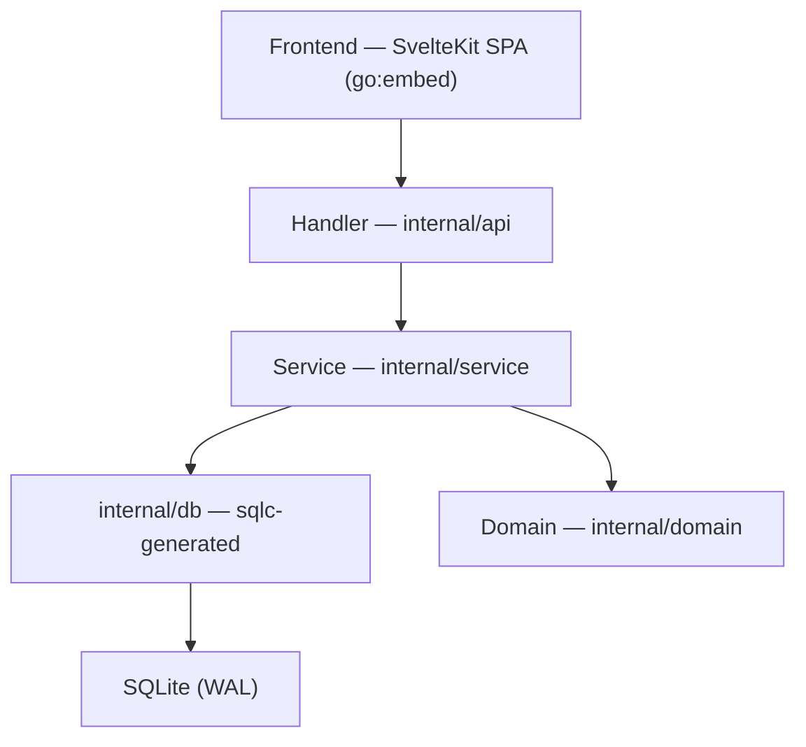
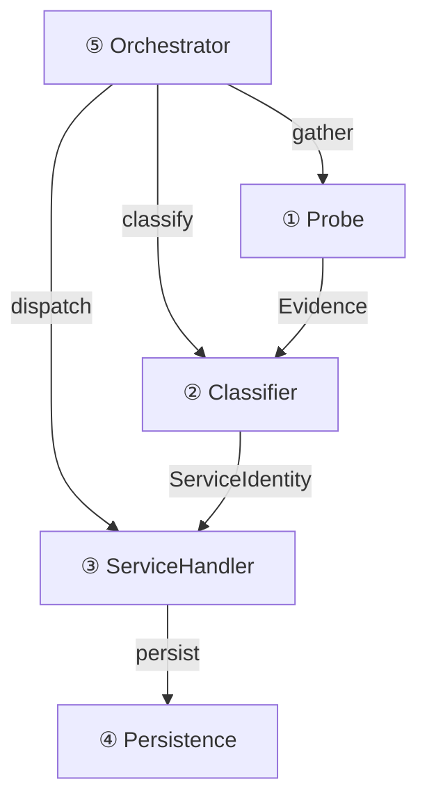
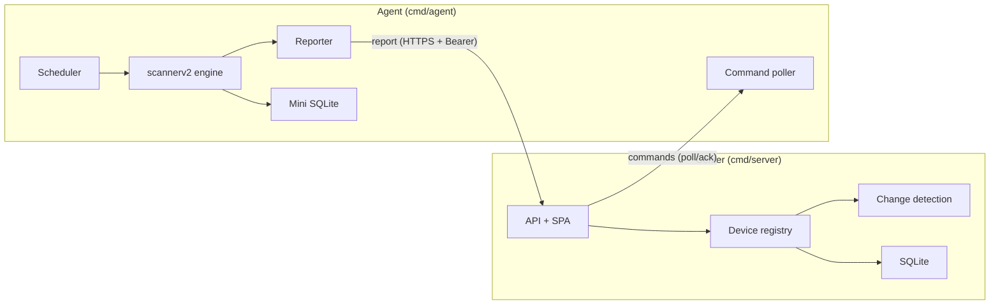

# Architecture Overview

## System Overview

MiBee Steward is a device management and monitoring system deployed as a **single binary**. The Go backend (Chi web framework + SQLite) embeds a SvelteKit 5 SPA via `go:embed`. This zero-dependency shape means one `mibee-steward` binary on a Linux box is the entire stack — no runtime, no container, no sidecar.

In a typical deployment a reverse proxy (Nginx) fronts the binary and forwards requests to the Chi router; requests then pass through the middleware chain, handlers, and service layer before landing in SQLite.

## Layered Architecture

The backend is layered; data repos (DeviceRepository / DeviceSystemRepository / AuditRepository) live beside their consumers inside the service layer — there is no separate repository package:

**Domain Layer (internal/domain)**: business models, DTOs, constants, context keys for request tracing, typed error definitions.

**Service Layer (internal/service)**: business logic, error handling, the scannerv2 engine, and the repos of the heartbeat/notification/audit subsystems. Constructor-based dependency injection; typed errors. **Charter**: mutating handlers must go through a service; read-only passthrough handlers may call sqlc directly.

**Handler Layer (internal/api)**: HTTP request/response processing, input validation, audit logging, error-to-status-code translation. `routes.go` registers ~40 handlers plus the middleware chain.

### Request Lifecycle

1. HTTP Request → Chi Router → middleware chain
2. Middleware: `RequestID → RealIP → Logging → Metrics → Recoverer → CORS → SecurityHeaders → CSRF → RateLimit → Auth/RBAC` (plus a scope middleware for network-scoped endpoints; `agent_auth` bearer auth for agent endpoints)
3. Handler: validation → audit log → service call
4. Service → sqlc → SQLite
5. Response back up the chain

### Frontend

SvelteKit 5 SPA embedded via `web/embed.go` (`//go:embed all:dist`). Tailwind 4 styling, ECharts for charts, `@inlang/paraglide-js` for i18n (English + Chinese). File-based routing in `web/src/routes/`; shared components in `web/src/lib/components/`.

### Database

SQLite via the pure-Go `modernc.org/sqlite` driver (CGO-free), WAL mode, main pool `MaxOpenConns=16` (`busy_timeout=5000`). Heartbeat results go to a **separate** SQLite file `data/heartbeat.db` (single connection, batched writes) so high-frequency probe records never contend with the main DB. sqlc generates type-safe Go from `db/queries/*.sql`. Default path: `./data/mibee.db`. **Migrations run automatically at startup**: the embedded `schema.sql` (`CREATE TABLE IF NOT EXISTS`) plus idempotent `ALTER TABLE`/table rebuilds, with an automatic `VACUUM INTO` backup taken on existing DBs before migration. Never edit `internal/db/*.go` directly — modify SQL and regenerate.

## Scanner Engine v2

The scanner is a **plugin-based, 5-layer architecture** that decouples detection from persistence. Adding a new protocol means registering one classifier + one handler — no orchestrator or persistence changes required.

- **① Probe** — active (TCP/SNMP/RTSP/ONVIF/HTTP-metrics) + passive (eBPF TC observer behind the `WITH_EBPF` build tag) → emits Evidence (port_open / banner / snmp / …).
- **② Classifier** — per-protocol pure functions over Evidence → fuses into ServiceIdentity (ssh/http/rtsp/onvif/prometheus/node_exporter/snmp/camera) with confidence.
- **③ ServiceHandler** — per-service customization: `GenerateHeartbeat()` / `Collect()` / `EnrichDevice()`. 29 service handlers registered, 8 of them TLS-wrapped cert collectors.
- **④ Persistence** — Repository interface → SQLite; records evidence / services / device updates / heartbeats.
- **⑤ Orchestrator** — declarative gather → classify → dispatch, with cycle-guarded cascade triggers (max depth 5).

Typical cascade: http → probe `/metrics` → prometheus → node_exporter → parse CPU/mem/kernel → enrich device fields.

### Probe Source Taxonomy

| Category | Source | What it needs | What it yields |
|---|---|---|---|
| Active | ICMP ping | network reachability | echo/reply, RTT |
| Active | TCP port scan | target IP + port | port_open, banner text |
| Active | SNMP Get (8 scalar OIDs) | UDP/161, community/credentials | sysDescr, sysObjectID and other system fields (v1/v2c + v3 USM) |
| Active | RTSP OPTIONS | RTSP port (554/8554) | rtsp_banner, Server header |
| Active | ONVIF SOAP probe | TCP unicast (observed ports / 80/8080) | onvif_response, device metadata |
| Active | HTTP probe | HTTP/HTTPS port | Server header, /metrics availability |
| Active | ARP cache | local `/proc/net/arp` | IP→MAC mapping (same subnet) |
| Active | CDP-MIB | SNMP on Cisco switches | neighbor MAC/IP/port |
| Active | LLDP-MIB | SNMP on LLDP-capable switches | neighbor MAC/port/vlan |
| Active | Q-BRIDGE-MIB | SNMP on managed switches | MAC→port + 802.1Q VLAN tags |
| Active | STP-MIB | SNMP on switches | dot1dTpFdbTable (MAC→port) |
| Passive (host-local) | arp_cache | local host | kernel ARP table |
| Passive (host-local) | multicast | local host | multicast group membership |
| Passive (host-local) | router_arp | local host | router ARP cache |
| Passive (eBPF) | eBPF TC observer | kernel ≥5.8, `WITH_EBPF` build tag | ONVIF multicast + TCP magic bytes (confidence 0.6) |
| Router-resident Tier-1 | dhcp_leases | on-gateway only (default off) | DHCP lease file / DHCPACK logs |
| Router-resident Tier-1 | conntrack | on-gateway only (default off) | `/proc/net/nf_conntrack` active flows |
| Router-resident Tier-1 | hostapd | on-gateway only (default off) | Wi-Fi client associations |
| Router-resident Tier-1 | dns_log | on-gateway only (default off) | DNS query/response log |

Passive sources (eBPF + host-local) are off by default; router-resident Tier-1 sources only run when the binary is deployed directly on the gateway, opt-in and off by default. See [Discovery & Identification](discovery.md) for details.

### Detected Services (out of the box)

SSH, HTTP/HTTPS, RTSP, ONVIF, SNMP, Prometheus, node\_exporter, mail (SMTP/POP3/IMAP), remote-access (VNC/RDP/Telnet), directory & file-share (LDAP/SMB), DNS, **databases** (MySQL/PostgreSQL/Redis/MongoDB/MSSQL/Memcached), TLS-wrapped family (LDAPS, SMTPS, IMAPS, POP3S, FTPS, IRCS, TelnetS), and a host-level **camera** meta-identity (fused from RTSP + ONVIF evidence, with brand inference from Server headers / SNMP sysDescr / enterprise OID / TLS cert CN).

### TLS Certificate Inventory

Any port classified as TLS-speaking (default ports 443/8443/9443/4443 + well-known TLS-wrapped ports 465/636/989/990/992/993/994/995 + classifier-flagged ports) has its full certificate chain collected via `probe.CollectCertChain` and persisted to `host_tls_certs` — Subject/Issuer/SAN/validity/signature/key/fingerprint + PEM, one row per cert (leaf + issuers). Surfaced via `GET /api/v1/devices/{id}/certificates`.

### Persistence Tables (v2)

| Table | Contents |
|---|---|
| `service_evidence` | Raw probe observations (sampling-controlled) |
| `host_services` | Classified service identities per host |
| `host_tls_certs` | TLS cert chains per `(ip, port)`, one row per cert; `not_after` indexed |
| `device_neighbors` | Raw neighbor facts from the LLDP/CDP/Bridge/Q-BRIDGE probes |
| `topology_edges` | Materialized device↔device topology edges |
| `subnets` / `vlans` | Per-network CIDR/gateway, 802.1Q VLANs |

Device upserts go to the existing `devices` table; heartbeat configs to `heartbeat_configs`; SNMPv3/SSH credentials (AES-256-GCM encrypted) to `snmp_credentials` / `ssh_credentials`; device config-backup versions to `device_configs`.

## Device Identity & Persistence

### MAC-Primary Identity

Devices are identified by **MAC address first** (a roaming device stays one asset across networks), falling back to `(ip_address, network_id)` when no MAC is known:

- Same private IP on two different LANs → **two distinct devices** (partitioned by `network_id`).
- Same MAC, different IP (subnet move) → **one asset**.
- `(ip_address, network_id)` composite unique index backs this partitioning.

**MAC bit flags** (observability only): `mac_is_locally_administered` (U/L bit) and `mac_is_multicast` (I/G bit) are recorded in `scan_attributes` as neutral facts. Neither changes device identity.

**OUI vendor inference**: the OUI loader (`internal/service/scannerv2/vendor/`) resolves MAC to IEEE-registered vendor via **longest-prefix-match** across three registries: MA-S (/36) → MA-M (/28) → MA-L (/24). Result stored as `scan_attributes.oui_prefix` + `oui_vendor` (NIC silicon vendor), kept **separate** from `vendor` (device self-declared brand via SNMP/HTTP/TLS). Out-of-box: embedded curated CC-BY-SA table; full IEEE set optional via `scripts/fetch-oui.sh` (`scanner.oui_path`).

### Single-Writer Funnel (v0.2.0)

All device writes funnel through `runner.applyDeviceBridge` — a single-writer concurrency model that prevents race conditions between concurrent probe handlers (the bridge runs sequentially after the parallel scan). It landed together with MAC-primary identity in v0.2.0.

### Device Replacement Detection

When a scan discovers a device whose MAC matches an existing record but key attributes differ significantly (e.g., different IP range, different services), the system detects a **replacement** event: the IP holder wins, the old MAC row is marked offline, and the diff is recorded in `change_log`.

### Network Reconciliation Drift Job

`internal/service/scannerv2/reconcile` provides the network-reconciliation job (`scanner.reconcile_interval`, default 1h): it periodically reconciles devices against their network's CIDR membership but only **detects and surfaces** drift (the `mibee_network_mismatches` gauge) — it never auto-modifies device records.

### Change Detection Engine

The center diffs each scan against known device state and emits events to `change_log`:

| Event | Trigger |
|---|---|
| `device_added` | New device appears in scan |
| `device_changed` | Tracked field differs (type, brand, MAC, ports, services, scan\_attributes). Field-by-field comparison with normalized `scan_attributes` (volatile keys stripped, key order canonicalized). `after_data` = full post-change snapshot. |
| `device_lost` | Absent from `lostThreshold` (2) consecutive scans. Grace period prevents single-scan jitter. |
| `device_recovered` | A previously-lost device reappears. Shares the liveness cooldown bucket with `device_lost` (anti-flap). |
| `device_config_changed` | The config-backup sweep fetched a running-config whose hash differs from the last version (see below). |

Events: `GET /api/v1/changes`, SSE `GET /api/v1/changes/watch`, Prometheus counter `mibee_changes_total{type}`.

Liveness noise control: online/offline verdicts are sampled into the `device_liveness` time series (in the heartbeat store) instead of firing `device_changed` per flip — the registry stays a living ledger without burying real changes.

### Device Config Backup

`internal/service/scannerv2/configbackup` runs an opt-in sweep (`scanner.config_backup`, default 6h): it selects router/switch/firewall devices with a bound SSH credential, fetches the running-config over SSH (vendor command matrix; host-key TOFU), computes a unified diff against the last version (`internal/configdiff`), and records a new `device_configs` version only on change — emitting `device_config_changed` into the change-detection pipeline above. SSH credentials live in `ssh_credentials`, encrypted with the same AES-256-GCM master-key cipher as SNMPv3 passphrases.

### Synthetic Probing (probe targets)

`internal/service/probetarget` probes explicitly configured EXTERNAL endpoints (public HTTPS sites, hosted TLS ports) on per-target intervals (10s tick re-reads targets — CRUD applies without restart; next-due resumes from `last_run_at`; 8-probe concurrency bound). Modules http/tcp/icmp reuse the heartbeat probers; tls (and https) call `CollectCertChain`, so the internal cert-chain inventory extends to internet hosts. Tables: `probe_targets` / `probe_results` / `probe_tls_certs`; metrics `mibee_probe_*`.

## Heartbeat & State

`HeartbeatService` runs in a background goroutine with a 30-second ticker:

| Config Key | Default | Description |
|---|---|---|
| `heartbeat.default_interval` | 30 | Device check interval (seconds) |
| `heartbeat.timeout` | 5 | Probe timeout (seconds) |
| `heartbeat.tick_interval_seconds` | 30 | Probe loop tick (seconds) |
| `heartbeat.offline_threshold` | 5 | Consecutive failures before offline |
| `heartbeat.offline_backoff_ticks` | 10 | Probe offline devices once every N ticks (~5 min on 30s ticker) instead of every tick. Stops steady timeout-row writes for known-dead hosts. A reviving scan clears failure count immediately. 0 disables backoff. |

**Service lifecycle**: `NewRouter() → HeartbeatService.Start() → goroutine → signal wait → graceful shutdown`.

## Distributed Model

MiBee Steward supports a center + agent deployment: the **center** (`cmd/server`) aggregates device data from multiple **agents** (`cmd/agent`), each on a different LAN segment. Deep dive → [Distributed Deployment](distributed.md).

| Role | Binary | Responsibilities |
|---|---|---|
| **Center** | `cmd/server` | Aggregation hub: API, SPA, device registry, change detection, heartbeat, ingestion, agent management |
| **Agent** | `cmd/agent` | Lightweight scanner: runs the scannerv2 discovery engine locally (router-form reports passive discoveries), reports upstream, polls for commands |

**Pull model** — agent initiates all connections (NAT-friendly):

1. **Report** (`POST /api/v1/agents/report`): batch HostReports, MAC-primary merge.
2. **Command poll** (`GET /api/v1/agents/commands`, the token is the identity): every 60s; ack/complete are separate calls.
3. **Disconnect recovery**: failed batches held in memory (bounded at 100), flushed oldest-first.

**Anti-entropy**: agent reports carry `X-Network-State-Hash` (SHA-256 of the alive-set identity/classification fields); the center uses it for drift detection. **Lease TTL**: agent tokens are bound to `network_id` + `agent_id`; lease-TTL lost detection (default 5m), revocation is soft-delete (`revoked_at`).

## Observability

**Metrics**: `/metrics` — standard Prometheus endpoint. Counter, Gauge, Histogram for system metrics.

**Service Discovery**: `/sd` — HTTP SD endpoint for Prometheus scrape config and device-systems auto-discovery (`metrics_enabled=true`).

**Dashboard Proxy**: `/api/v1/dashboard/query` — read-only proxy to Prometheus.

**Retention Sweepers** (`internal/service/scannerv2/cleanup/`): periodic pruning of high-volume detail tables. Batch deletes (default 5000 rows) to avoid holding the SQLite write lock. Runs on startup + every `sweep_interval_hours` (default 6).

| Table | Default Retention |
|---|---|
| `heartbeat_results` | 7 days |
| `scan_results` | 30 days |
| `service_evidence` | 14 days |
| `host_services` | 30 days |
| `host_tls_certs` | 30 days |
| `change_log` | 30 days |
| `device_neighbors` | 90 days |
| `device_liveness` | 7 days |
| `notification_log` | 30 days |
| `scan_task_runs` | 30 days |
| `audit_logs` | 90 days |

A **silent-device sweep** also runs: scanner-discovered devices that stop appearing for 24h without a MAC (`retention.silent_device_hours_no_mac`) or 7 days with a MAC (`retention.silent_device_days_mac`) are physically deleted with a `device_removed` record — discovery is the entry to the registry, and rows that can never be rediscovered get reclaimed.

## Background Tasks

Resident goroutines started by `NewRouter()` (stopped in dependency order on graceful shutdown):

| Task | Cadence | Duty |
|---|---|---|
| Heartbeat probing loop | 30s tick | Poll due devices, write verdicts |
| Token blacklist cleanup | periodic | Evict expired JWT blacklist entries |
| v2 scan scheduler | cron | Fire `scan_tasks` + stale-run sweeper |
| Lease sweeper | 60s | Agent-network lease expiry → `device_lost` |
| Retention sweeper | 6h | Batched pruning of the table above |
| Config-backup sweep | 6h (config) | SSH running-config pulls → `device_configs` versions |
| Probe-target engine | 10s tick | Due synthetic probes → `probe_results` |
| Notification rule engine | event-driven | Change events → matched rules → dispatch queue |
| Notification dispatcher | 3 workers | Rule engine → channel (email/webhook/…) dispatch |
| Device metrics refresher | periodic | Device gauges for `/metrics` |
| Change Watcher | event-driven | `change_log` → SSE push |

## Security Model

- **JWT auth**: cookie + Bearer dual mode. `auth.jwt_secret` must be changed in production (≥32 chars, enforced at startup). `auth.token_expiry` default 24h.
- **TOTP 2FA** (optional): `/api/v1/auth/2fa/{verify,setup,enable,disable,status}`.
- **RBAC**: capability-based model (admin / operator / viewer tiers, `user` being a legacy alias for viewer), enforced in the middleware chain.
- **Network scope authorization (network grants)**: per-user network scope isolation via `internal/authz` (scopeql + scoperesolver), restricting users to authorized networks.
- **Secret storage**: SNMPv3 USM passphrases and SSH credentials are AES-256-GCM encrypted in SQLite under `security.master_key` (32 bytes, held in memory only; optional until the first credential exists).
- **CSRF**: cross-site request forgery protection middleware.
- **Agent tokens**: SHA-256-hashed opaque bearer tokens in `agent_tokens`. Plaintext returned once at creation; only hash persisted. Bound to `network_id` + `agent_id`.
- **Audit log**: request-level audit trail via middleware.
- **Security headers**: set by `SecurityHeaders` middleware.
