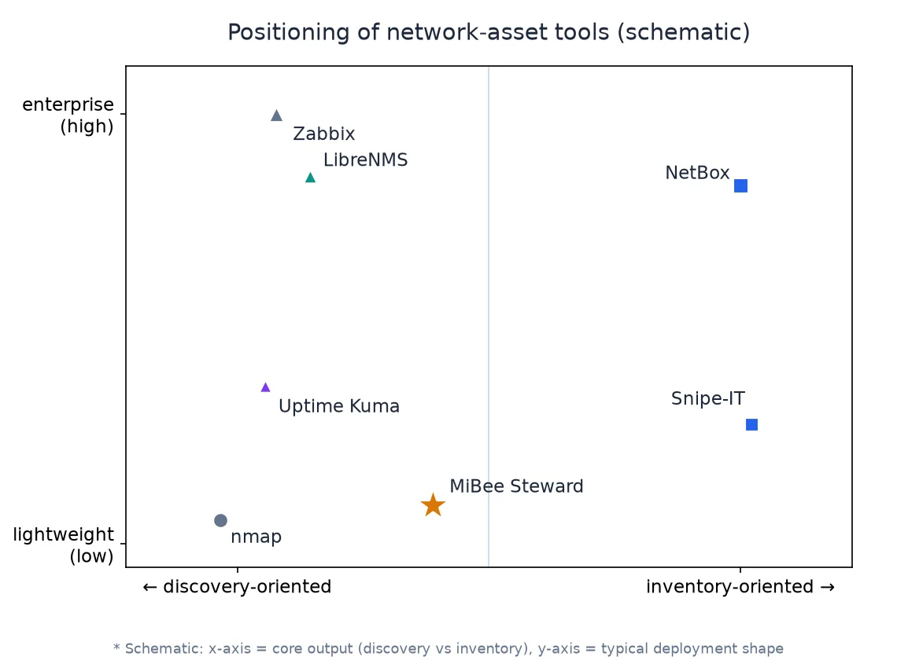
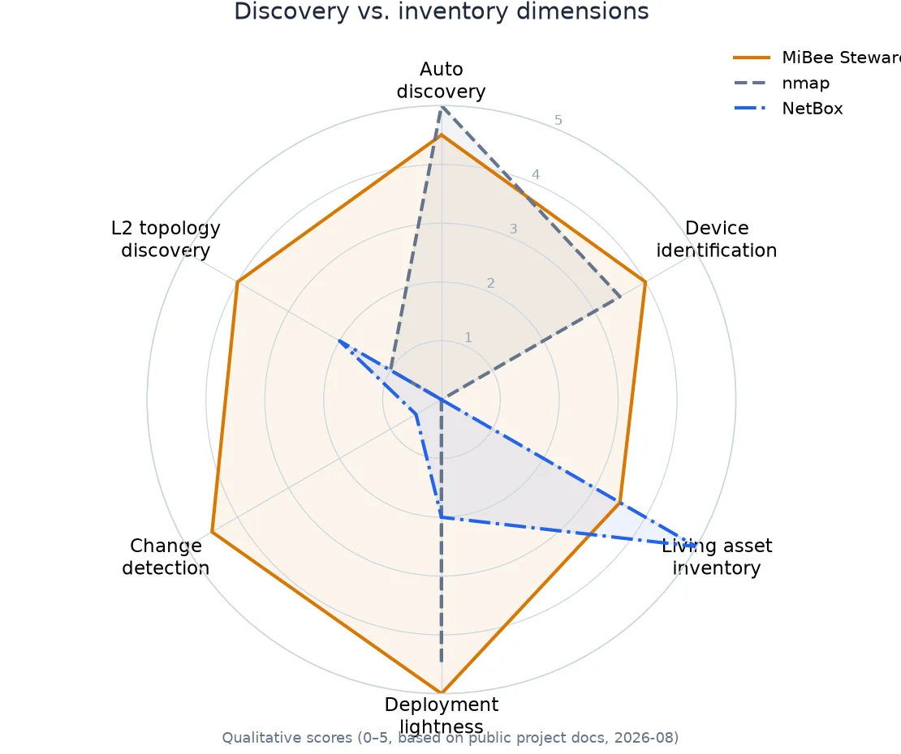
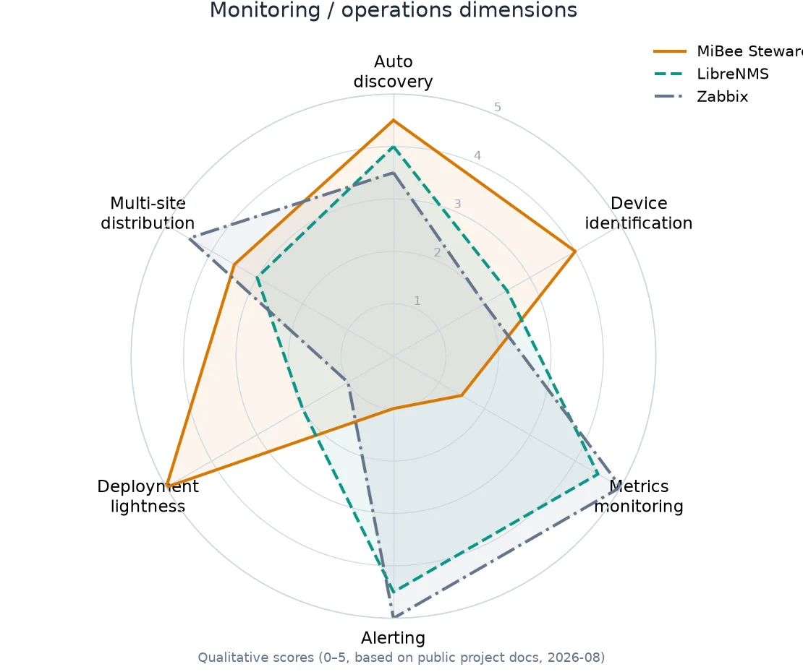

# Comparison with Similar Tools

> **How to read this page**: the comparison below is based on each project's public docs and release notes (as of 2026-08); scores are **qualitative judgments** (0–5), not benchmark results. All these projects evolve actively and this page will be updated with them. The best way to choose a tool is to be clear about your core problem first.

MiBee Steward's positioning in one line: **device/network-layer auto-discovery + identification + registry** (CMDB-lite), delivered as a single zero-dependency binary. It does not try to replace any of the tool classes below, quite the opposite, it coexists with them via its `/metrics` and `/sd` endpoints.

## Scope first: what it is not

| It is not | Use instead |
|---|---|
| An alerting system (thresholds/silences/routing trees) | Prometheus + Alertmanager |
| A free-form dashboard platform | Grafana |
| A status page | Uptime Kuma / gatus |
| Host deep monitoring (CPU/memory/disk) | Netdata / node_exporter |
| An L7 service registry | Consul / etcd |

These boundaries are design decisions, not gaps to be filled: do one thing, the asset portrait, thoroughly, and leave the rest to mature ecosystems.

## The tool landscape

Network-asset tools can be placed on two axes: whether the **core output is discovery or inventory**, and whether the **deployment shape is lightweight or enterprise-grade**. MiBee Steward occupies the "auto-discovery + auto-identification + lightweight delivery" cell:

## Tool-by-tool comparison

### vs. scanners: nmap

nmap is the de-facto standard for network scanning, its probing depth and flexibility are beyond question. The difference is **what happens after the scan**: nmap gives you a one-shot CLI result; MiBee Steward gives you a living asset registry.

- nmap's service/version detection (`-sV`) and OS fingerprinting are powerful; MiBee's rule library covers the same evidence sources, but its goal is unattended continuous identification and registry, not a single deep audit.
- MiBee adds change detection, heartbeat liveness, a Web UI, an API, and Prometheus endpoints; nmap offers its script ecosystem (NSE) and ultimate scan control.
- Deep security audits still call for nmap; day-to-day asset inventory calls for MiBee. They don't replace each other.

### vs. CMDB/IPAM: NetBox, Snipe-IT

NetBox is the reference DCIM/IPAM system; Snipe-IT excels at asset lifecycle and procurement/warranty management. Their shared premise is **manual entry**, you fill in the IPs, MACs, models, and ownership yourself. MiBee Steward inverts it: **scan it out, identify it, register it**.

- If you need rigorous IPAM, data-center cabling documentation, procurement and warranty workflows, compliance exports, NetBox/Snipe-IT are the mature choices.
- If you need a living ledger that nobody has to maintain, MiBee's discovery + identification + change detection is the direct answer.
- They also compose: MiBee discovers and keeps fresh; results export (CSV/JSON/API) into NetBox for governance.

### vs. network monitoring: LibreNMS, Zabbix

LibreNMS and Zabbix are the mainstream SNMP-monitoring stacks: metric collection, threshold alerting, dashboards, distributed polling. They also auto-discover, but that discovery serves **populating monitoring targets**; identification is a by-product.

- Deployment shapes differ sharply: LibreNMS needs MySQL + PHP + Redis; Zabbix needs Server + Agent + DB + Web; MiBee is a ~20MB single binary with embedded SQLite that starts in seconds. Lightness is MiBee's choice, the price is that it does **not** do metric collection or alerting.
- If you need port traffic graphs, threshold alerts, SLA reports, pick LibreNMS/Zabbix (or the Prometheus ecosystem).
- If you need "what's on the network, what is it, when did it come and go", pick MiBee, and feed asset state into your monitoring stack via `/metrics`.

### vs. lightweight uptime: Uptime Kuma

Uptime Kuma watches services you **already know about** and renders a lovely status page, adjacent to, not overlapping, MiBee. MiBee's probing module (v0.5.0) covers the basics of external availability and certificate expiry; if you need status pages, multi-location probing, or rich notification routing, Uptime Kuma fits better. A common combo: MiBee discovers and registers inside assets, Uptime Kuma guards key services.

## Capability matrix

> ✅ full support · ⚠️ partial / needs composition · ❌ not supported (or deliberately out of scope)

| Capability | MiBee Steward | nmap | NetBox | LibreNMS | Zabbix | Uptime Kuma |
|---|:---:|:---:|:---:|:---:|:---:|:---:|
| Multi-protocol auto-discovery | ✅ | ✅ | ❌ | ✅ | ✅ | ❌ |
| Device identification (brand/model) | ✅ automatic | ⚠️ version detection | ❌ manual | ⚠️ sysObjectID mapping | ⚠️ templates | ❌ |
| Living asset inventory | ✅ automatic | ❌ | ✅ manual | ✅ | ✅ | ❌ |
| Change detection (add/change/loss) | ✅ | ❌ | ❌ | ⚠️ | ⚠️ | ❌ |
| L2 topology (LLDP/CDP/Bridge-MIB) | ✅ | ❌ | ⚠️ manual cabling | ✅ | ⚠️ | ❌ |
| TLS certificate inventory | ✅ | ⚠️ scripts | ❌ | ⚠️ | ⚠️ | ✅ limited |
| Heartbeat/liveness tracking | ✅ | ❌ | ❌ | ✅ | ✅ | ✅ |
| Metric collection & alerting | ❌ (scope) | ❌ | ❌ | ✅ | ✅ | ⚠️ |
| Host deep monitoring | ❌ (scope) | ❌ | ❌ | ✅ | ✅ | ❌ |
| Config backup (versioned diff) | ✅ | ❌ | ❌ | ⚠️ via Oxidized | ⚠️ | ❌ |
| Distributed multi-subnet | ✅ agents | ❌ | ❌ | ✅ pollers | ✅ proxies | ❌ |
| Prometheus endpoints | ✅ | ❌ | ⚠️ exporters | ✅ | ✅ | ⚠️ exporters |
| Single binary, zero deps | ✅ | ✅ | ❌ | ❌ | ❌ | ⚠️ Node |
| Web UI | ✅ | ❌ | ✅ | ✅ | ✅ | ✅ |

## Where it currently falls short (honest list)

So you don't pick the wrong tool, here are MiBee's present weaknesses, plainly:

1. **No alerting engine**, device events forward to webhook/email, but there are no thresholds, silences, or escalation routes. Use Alertmanager for that.
2. **No host deep monitoring**, CPU/memory/disk metrics are not collected (node_exporter is discovered and registered, not replaced).
3. **The fingerprint library is still maturing**, cameras and network gear are well covered; long-tail vendors and models improve through community YAML contributions.
4. **No LDAP/SAML SSO**, local accounts + JWT + TOTP 2FA today.
5. **Single-instance center**, one SQLite store, no native HA; cross-subnet scale-out is via agents, not multiple centers.
6. **No multi-tenancy or service desk**, team RBAC and network-level grants exist; MSP tenancy and ticket workflows do not.

If any of these is a hard requirement today, the corresponding mature tool is the pragmatic choice.

## One-line selection guide

- One-off **deep scanning / security audit** → nmap
- Rigorous **IPAM/DCIM governance** → NetBox
- **Metric monitoring + alerting stacks** → Zabbix / LibreNMS / the Prometheus stack
- **Service availability + status page** → Uptime Kuma
- **Auto-discovery + auto-identification + a lightweight living asset ledger** → MiBee Steward

Most real environments are combinations: MiBee Steward answers "what's on the network and what is it", and the rest goes to the best tool in each domain.
