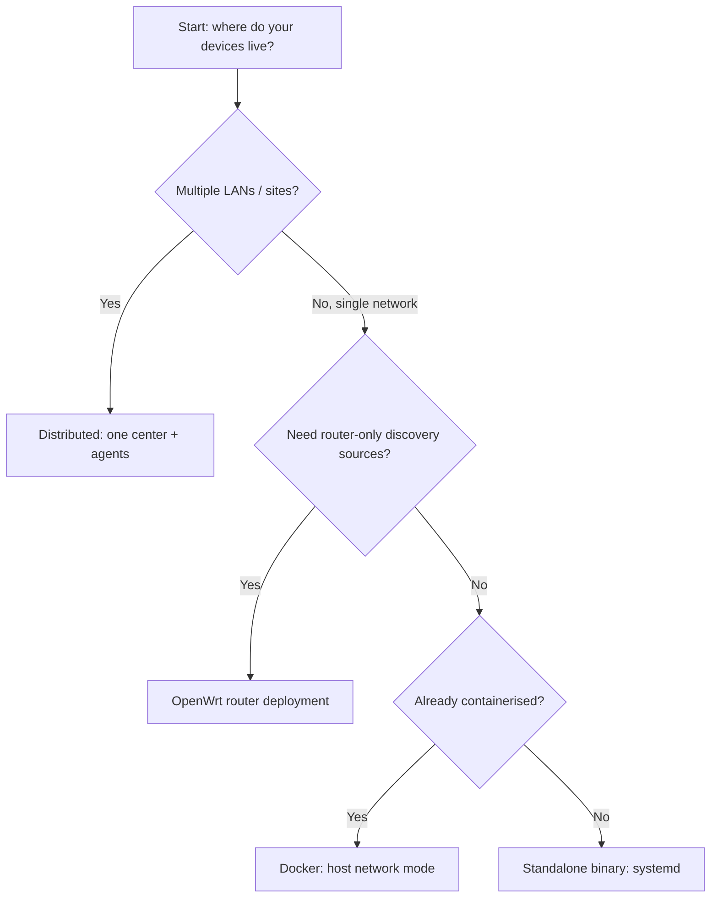
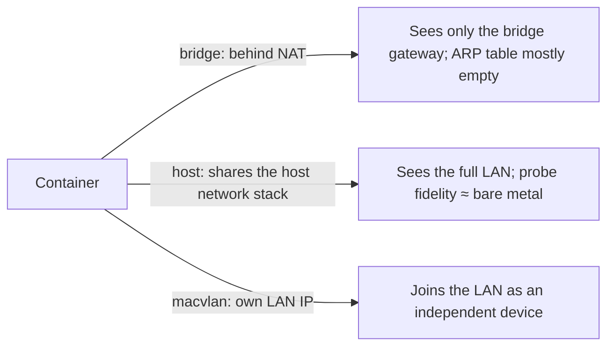

# Standalone Deployment

This guide covers production deployment methods for MiBee Steward on a single host, including binary, Docker, Nginx reverse proxy, backup strategy, and security hardening.

## Deployment Form Selection

MiBee Steward offers several deployment forms — pick the one that fits your scenario:

| Form | Best for | Notes |
|---|---|---|
| **Standalone binary** | Linux servers, VMs | Direct execution, systemd management, simplest setup |
| **Docker** | Containerised environments, rapid deployment | GHCR prebuilt image or local build; multi-arch |
| **OpenWrt router** | Running directly on a router | Unlocks Tier-1 router-only discovery signals (DHCP/conntrack/hostapd/dns_log); see [OpenWrt Deployment](openwrt.md) |
| **Distributed** | Multi-LAN / multi-site | One center + multiple agents, cross-subnet management; see [Distributed Deployment](distributed.md) |

If you have a single LAN with a manageable number of devices, standalone deployment is sufficient.



## Binary Deployment

### Download

Grab the prebuilt binary for your platform (amd64/arm64) from [GitHub Releases](https://github.com/Mi-Bee-Studio/MiBeeSteward/releases), or build from source. Standalone deployments use the **center** binary (source entry `cmd/server`, ~24MB, embeds the SvelteKit web UI); the agent (`cmd/agent`, ~18MB, no embedded UI) is for the [OpenWrt](openwrt.md) and [Distributed](distributed.md) scenarios:

```bash
git clone https://github.com/Mi-Bee-Studio/MiBeeSteward.git
cd mibee-steward
make build
# or cross-compile
make build-linux-amd64
```

### Minimal Setup

```bash
# Create user and directories
sudo useradd -r -s /usr/sbin/nologin -d /opt/mibee-steward mibee
sudo mkdir -p /opt/mibee-steward/{data,data/uploads,data/backups,configs}

# Copy files
sudo cp mibee-steward /opt/mibee-steward/
sudo cp -r configs/* /opt/mibee-steward/configs/
sudo chown -R mibee:mibee /opt/mibee-steward
sudo chmod +x /opt/mibee-steward/mibee-steward
```

### Production Configuration

```bash
sudo cp /opt/mibee-steward/configs/config.production.yaml /opt/mibee-steward/configs/config.yaml
sudo nano /opt/mibee-steward/configs/config.yaml
```

Critical settings:

```yaml
auth:
  jwt_secret: "<random-32-char>"  # openssl rand -base64 32
  initial_admin_password: "<strong-password>"
  cookie_secure: true
  cookie_same_site: "strict"
```

### Systemd Service

```bash
sudo cp deploy/mibee-steward.service /etc/systemd/system/
sudo systemctl daemon-reload
sudo systemctl enable mibee-steward
sudo systemctl start mibee-steward
```

The service includes security hardening: `NoNewPrivileges=true`, `ProtectSystem=strict`, `ReadWritePaths=/opt/mibee-steward/data`.

## Docker Deployment

### Prebuilt Image (GHCR)

From v0.4.0 onwards, each release publishes a multi-arch container image (amd64 / arm64) to GitHub Container Registry. Image tags cover `latest`, `:version` (e.g. `0.4.0`), `:major.minor` (e.g. `0.4`), and `:commit-sha`:

```bash
# Pull latest
docker pull ghcr.io/mi-bee-studio/mibeesteward:latest

# Or pin a specific version
docker pull ghcr.io/mi-bee-studio/mibeesteward:0.4.0
```

The prebuilt image is the **unprivileged variant** (LLDP/eBPF compiled as stubs). For passive probes, build from source with `make docker-build-priv`.

### docker-compose

The following is a **simplified example** (the host-network equivalent). The repo's own `docker-compose.yml` actually ships three profiles (`bridge` / `host` / `macvlan`) with shared build anchors — prefer using it directly:

```yaml
services:
  mibee-steward:
    build: .
    network_mode: host          # host mode for production (see below)
    volumes:
      - mibee-data:/data
      - ./configs/config.yaml:/app/configs/config.yaml:ro
    restart: unless-stopped

volumes:
  mibee-data:
```

### Network Mode Selection (Important)

MiBee Steward's scanner operates at the network-namespace level, so **the container's network mode directly determines probe effectiveness**. `docker-compose.yml` ships three profiles:

| Profile | Start command | Probe effectiveness | Use case | Limitations |
|---|---|---|---|---|
| `bridge` (default) | `docker compose --profile bridge up` | Only TCP/SNMP/HTTP/TLS/RTSP/ONVIF reliable; **ICMP and ARP/MAC discovery severely degraded** | UI demo, dev | Can't see the real LAN; device MACs mostly lost |
| `host` (**recommended**) | `docker compose --profile host up` | ≈ bare-metal, full probe fidelity (ICMP, `/proc/net/arp`, multicast) | **Production** | Takes host port 8080; needs `cap_add: NET_RAW,NET_ADMIN` |
| `macvlan` | `docker compose --profile macvlan up` | Container gets its own LAN IP; ARP/MAC work | Container must appear as its own LAN device | Host↔container unrouted by default (needs manual macvlan shim) |



Field experience backs this up: bridge mode recovers essentially no device MACs while host networking recovers nearly all of them — always use host networking for production scanning.

> ⚠️ **Why bridge mode can't be used for real inventory**
> The default Docker bridge places the container behind NAT. Consequences:
> 1. **ARP/MAC broken**: `/proc/net/arp` inside the container only sees the bridge gateway entry; LAN device MACs are essentially unrecoverable (`ARPProbe`, `ARPCacheSource`, `LookupMACPostScan` all read this file).
> 2. **ICMP broken**: ping replies crossing NAT are often dropped, so the heartbeat's 30s active probe falsely marks LAN devices offline.
> 3. **Passive multicast broken**: the bridge doesn't forward 224/239 multicast, so mDNS/SSDP listeners self-disable.
>
> Partial workaround: list your gateway router IPs in `scanner.router_arp.routers` so the scanner can SNMP-walk the router's ARP table for MACs — but this only recovers MACs, not ICMP or multicast.

### Full Host-Mode Example

```bash
# 1. Prepare config
cp configs/config.docker.yaml configs/config.yaml
#    Edit jwt_secret / initial_admin_password / network.cidr

# 2. Build and start (host profile)
docker compose --profile host up -d --build

# 3. Verify
curl -s http://localhost:8080/api/v1/health
```

To enable raw-frame LLDP listeners or the eBPF passive observer (compiled out by default), pass build tags:

```bash
BUILD_TAGS=WITH_LLDP,WITH_EBPF docker compose --profile host build
# eBPF additionally needs cap_add: BPF, kernel >=5.8 + BTF
```

**Building behind a restricted network**:

```bash
NPM_REGISTRY=https://registry.npmmirror.com \
GOPROXY=https://goproxy.cn,direct \
docker compose --profile host build
```

The Makefile wraps common flows: `make docker-up` (host profile, recommended), `make docker-up-bridge` (demo), `make docker-up-macvlan`, `make docker-build-priv` (privileged variant).

### Running the Prebuilt Image Directly

```bash
docker run -d --name mibee \
  --network host \
  --cap-add NET_RAW --cap-add NET_ADMIN \
  -v mibee-data:/data \
  -v "$PWD/configs/config.yaml:/app/configs/config.yaml:ro" \
  ghcr.io/mi-bee-studio/mibeesteward:latest
```

## Nginx Reverse Proxy + TLS

Place MiBee Steward behind an Nginx reverse proxy with TLS encryption and security headers:

```nginx
server {
    listen 80;
    server_name your-domain.com;
    return 301 https://$host$request_uri;
}

server {
    listen 443 ssl http2;
    server_name your-domain.com;

    ssl_certificate /etc/nginx/ssl/cert.pem;
    ssl_certificate_key /etc/nginx/ssl/key.pem;
    ssl_protocols TLSv1.2 TLSv1.3;
    ssl_ciphers ECDHE-ECDSA-AES128-GCM-SHA256:ECDHE-RSA-AES128-GCM-SHA256:ECDHE-ECDSA-AES256-GCM-SHA384:ECDHE-RSA-AES256-GCM-SHA384;
    ssl_prefer_server_ciphers off;

    add_header X-Frame-Options DENY always;
    add_header X-Content-Type-Options nosniff always;
    add_header Strict-Transport-Security "max-age=63072000; includeSubDomains; preload" always;

    location / {
        proxy_pass http://127.0.0.1:8080;
        proxy_set_header Host $host;
        proxy_set_header X-Real-IP $remote_addr;
        proxy_set_header X-Forwarded-For $proxy_add_x_forwarded_for;
        proxy_set_header X-Forwarded-Proto $scheme;
        proxy_http_version 1.1;
        proxy_set_header Upgrade $http_upgrade;
        proxy_set_header Connection "upgrade";
        proxy_buffering off;
        client_max_body_size 100m;
    }

    location /metrics {
        proxy_pass http://127.0.0.1:8080;
        allow 127.0.0.1;
        deny all;
    }
}
```

Enable and test:

```bash
sudo ln -s /etc/nginx/sites-available/mibee-steward /etc/nginx/sites-enabled/
sudo nginx -t
sudo systemctl restart nginx
```

**SSL Certificate (Let's Encrypt)**:

```bash
sudo apt install certbot python3-certbot-nginx
sudo certbot --nginx -d your-domain.com
# Auto-renewal: 0 12 * * * /usr/bin/certbot renew --quiet
```

## Data & Backup

### Data Location

The SQLite database lives at `./data/mibee.db` (binary deployment) or `/data/mibee.db` inside the container (Docker deployment).

### Backup Strategy

Use `scripts/backup.sh` for safe SQLite backups (no database locking):

```bash
# Usage: ./scripts/backup.sh [DB_PATH] [BACKUP_DIR] [RETENTION_DAYS]
# Defaults: ./data/mibee.db → ./data/backups, retain 7 days
./scripts/backup.sh

# Scheduled backup (crontab)
# 0 2 * * * /opt/mibee-steward/scripts/backup.sh /opt/mibee-steward/data/mibee.db /opt/mibee-steward/data/backups 30
```

The backup script automatically verifies integrity and cleans up expired backups.

### Automatic Maintenance

Every retention sweep (default every 6h, `retention.sweep_interval_hours`) also
runs a storage-health pass: the WAL is checkpointed and truncated
(`PRAGMA wal_checkpoint(TRUNCATE)` — folds write-ahead log pages back into the
main file so `-wal` returns to zero), SQLite statistics are refreshed
(`PRAGMA optimize`), and the on-disk sizes plus high-volume table row counts
are exported to Prometheus:

| Metric | Labels | Meaning |
|---|---|---|
| `mibee_db_size_bytes` | `db` (main/heartbeat), `kind` (db/wal) | On-disk file sizes |
| `mibee_db_table_rows` | `db`, `table` | Row counts of the high-volume tables |

These are the growth baseline for capacity planning and for the
db-growth alert in the self-monitoring example (see `deploy/prometheus`).

Ready-to-import Grafana dashboards for all exported metrics live in
`deploy/grafana/` — see the [Integrations guide](https://github.com/Mi-Bee-Studio/MiBeeSteward/blob/main/docs/en/integrations.md).

### Capacity Planning (field-measured baseline)

Measured on a 85-device LAN with default retention windows (30d scan results,
7d heartbeat results, 14d service evidence):

- Steady state: ~150 MB total for the main database + ~4 MB heartbeat store
- Growth is dominated by `scan_results` (one row per task × IP per scan —
  a /24 scanned every 30 min ≈ 12k rows/day) and `heartbeat_results`
  (one row per probe per tick — ~30 devices × 3 probes × 2880 ticks/day
  ≈ 260k rows/day, pruned at 7d)
- Rule of thumb: budget **~2 MB per scanned device per month** at the default
  retention windows, then watch `mibee_db_size_bytes` — if growth deviates
  from linear, check `mibee_db_table_rows` for which table is accumulating
  (a stuck sweeper shows as monotonic growth on one table).


### Restore

Backups are **binary database files** produced by `sqlite3 ".backup"` — not SQL scripts. Restore by copying the file back:

```bash
sudo systemctl stop mibee-steward
sudo cp /path/to/backup/mibee-YYYYMMDD_HHMMSS.db /opt/mibee-steward/data/mibee.db
# remove stale WAL/SHM sidecar files so old state can't interfere
sudo rm -f /opt/mibee-steward/data/mibee.db-wal /opt/mibee-steward/data/mibee.db-shm
sudo systemctl start mibee-steward
```

## Upgrading

### Binary Upgrade

```bash
sudo systemctl stop mibee-steward
# Replace the binary (data files are unaffected)
sudo cp mibee-steward /opt/mibee-steward/
sudo systemctl start mibee-steward
```

### Docker Upgrade

```bash
docker compose pull  # pull new image
docker compose up -d
```

Data compatibility: the database schema auto-migrates on startup (with an automatic `VACUUM INTO` backup first) — no manual steps required. ARMv7 devices have no prebuilt release artifact — cross-compile locally with `make build-linux-arm`.

### Resetting the admin password

Forgot the `admin` password? No DB surgery needed:

```bash
sudo /opt/mibee-steward/mibee-steward reset-admin-password -config /opt/mibee-steward/configs/config.yaml
# interactive prompt, or: -password 'new-pass' / env MIBEE_RESET_PASSWORD
```

## Security Checklist

- [ ] **Non-root**: create a dedicated user (e.g. `mibee`), never run the service as root
- [ ] **JWT secret**: generate with `openssl rand -base64 32`, never use the default
- [ ] **Admin password**: strong password (12+ chars), enable `cookie_secure` and `cookie_same_site`
- [ ] **Firewall**: open only necessary ports (80/443); internal scan port 8080 not exposed externally
- [ ] **Reverse proxy TLS**: production must use HTTPS via Nginx or similar reverse proxy
- [ ] **Metrics endpoint**: allow only localhost access to `/metrics`, never expose Prometheus metrics externally
- [ ] **Regular backups**: configure cron for daily automated SQLite backups
- [ ] **Log monitoring**: use `journalctl -u mibee-steward -f` or JSON-formatted logs

## Health Checks & Monitoring

```bash
# Service health
curl -s http://localhost:8080/api/v1/health
# Response: {"status":"ok","db":"ok","version":"0.x.x"}

# Prometheus metrics (localhost only)
curl -s http://localhost:8080/metrics
```

Key metrics: `mibee_devices_total` (device count), `mibee_heartbeat_checks_total` (heartbeat checks), `mibee_heartbeat_latency_seconds` (heartbeat latency).

The repo ships Prometheus alert rules (`deploy/prometheus/alert_rules.yml`, 5 rules):

| Rule | Trigger |
|---|---|
| `MiBeeStewardDown` | instance unreachable |
| `HighErrorRate` | 5xx share >5% over 5m (from `mibee_api_requests_total`) |
| `HeartbeatFailures` | heartbeat fail/timeout share >30% over 5m (status-label filter) |
| `DatabaseLocked` | sustained 5xx burst caused by DB lock |
| `HighMemoryUsage` | resident memory >500MB |

A matching `deploy/prometheus/alertmanager.yml` and scrape config (with `/sd` service discovery) live in the same directory.

The embedded SPA provides a real-time device status dashboard, heartbeat monitoring charts, and device uptime statistics.
