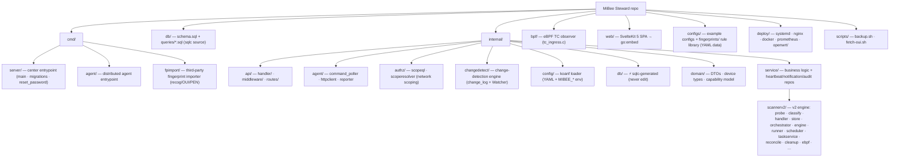
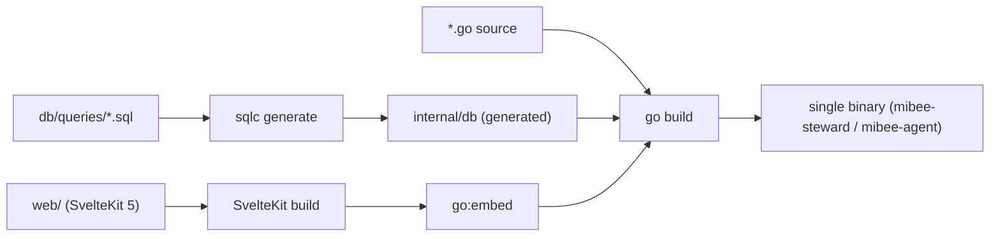

# Development & Contributing

This guide covers the development environment, project structure, common tasks, coding conventions, and contribution process for MiBee Steward.

## Development Environment

### Prerequisites

- **Go** 1.26+ (CGO disabled, uses `modernc.org/sqlite`)
- **Node.js** 20+ and npm
- **sqlc** — for query code generation
- **golangci-lint** v2 — linter (config in `.golangci.yml`)

### Starting the Development Server

```bash
# Install dependencies
cd web && npm install && cd ..

# Start frontend + backend
make dev
```

This runs:
- Frontend: `npm run dev` on port 5173 (Vite HMR)
- Backend: `go run` on port 8080 (**no hot reload** — restart `make dev` after backend changes)

### Building for Production

```bash
make build                  # Build frontend then backend
make build-all              # Cross-compile (linux amd64 + arm64)
make build-linux-arm64      # arm64 only
```

## Project Structure



### Build Pipeline

The parts above are assembled into a single binary at build time:



### Key Architecture Layers

- **Domain Layer** (`internal/domain/`): DTOs, constants, request/response models, capability (RBAC) definitions
- **Service Layer** (`internal/service/`): business logic, probe subsystem, the scannerv2 engine; data repos (device/device_system/audit) live beside their consumers
- **Handler Layer** (`internal/api/handler/`): HTTP request handling, response formatting. **Charter**: mutating handlers MUST go through a service; read-only passthrough handlers MAY use `*db.Queries` directly

## Common Tasks

### Database Queries (sqlc Workflow)

1. Write SQL in `db/queries/*.sql`
2. Regenerate: `~/go/bin/sqlc generate`
3. Generated code appears in `internal/db/` — **never edit these files directly**

```sql
-- db/queries/your_table.sql
-- name: GetYourData :one
SELECT * FROM your_table WHERE id = $1;
```

### Schema Changes

1. Edit `db/schema.sql`
2. Run `~/go/bin/sqlc generate`
3. Schema is applied automatically at startup from the embedded `schema.sql`

### Frontend Development

```bash
cd web && npm run dev       # Start frontend dev server
cd web && npm run build     # Build for production
cd web && npm test          # Run vitest
```

### Testing

```bash
go test ./...               # Run all Go tests (make test is equivalent)
go test -race ./...         # Race detector (what CI runs)
cd web && npm test          # Frontend tests (vitest run, single-shot)
```

### Linting & the Format Gate

```bash
golangci-lint run           # Go linter (CI pins v2.12.2 — stricter than go vet)
```

> ⚠️ **Run the format check before pushing** (the #1 "passes locally, fails CI" trap — local `go vet`/`go build` pass but CI's golangci-lint fails):
>
> ```bash
> gofmt -l internal/ cmd/      # must print NOTHING
> goimports -l internal/ cmd/  # must print NOTHING (not preinstalled: go install golang.org/x/tools/cmd/goimports@latest)
> ```

### eBPF Build (Optional)

```bash
make build-with-ebpf       # Requires clang/llvm/bpftool + kernel BTF (run go generate first — see the eBPF page)
```

See [eBPF Passive Observer](ebpf.md) for details.

## Extending the Scanner

### Adding a protocol = one Classifier + one Handler

scannerv2 is a five-layer plugin engine; the extension points are exactly two:

1. **Classifier**: write one under `internal/service/scannerv2/classify/` and register it in `classify.DefaultClassifiers()`;
2. **Handler**: write one under `internal/service/scannerv2/handler/` and add it to `handler.DefaultHandlers()`.

The orchestrator and persistence layers need **zero changes**. The startup log `scannerv2 engine ready registry{probes=N classifiers=N handlers=N}` verifies that every layer loaded.

**Many protocols need no new type at all** — they are data-driven:

- **Server-class services** (database/mail/remote-access/directory/file-share: mysql, postgresql, redis, mongodb, mssql, memcached, …): add the service name to `serverServiceNames` in `handler/services.go`;
- **TLS-wrapped services** (https/ldaps/smtps/imaps/pop3s/ftps/ircs/telnets, …): add it to `tlsCollectNames` in `handler/tls_collect.go` and full certificate-chain collection comes for free.

Only protocols with real per-protocol collection logic (HTTP/SNMP/Camera/RTSP/ONVIF/Prometheus/NodeExporter/SSH) define a named type.

### Fingerprint & device-type rules are data, not code

- Device signature rules live in `configs/fingerprints/*.yaml` (format: see [Fingerprint Library — Adapter Specification](fingerprint-spec.md)); after editing you MUST sync to the embed dir: **`make sync-fingerprints`** (before `make build`).
- The device-type keyword table lives in `configs/fingerprints/device-types/device_types.yaml`, synced via **`make sync-device-types`**; a drift test (`TestDeviceTypesYAML_InSyncWithSourceOfTruth`) fails CI when the two copies diverge — always edit the `configs/` source and sync, never the embedded `runner/` copy directly.
- All `build-*` targets already depend on those sync steps; the curated OUI table syncs via `make sync-oui-curated`.

## Coding Conventions

### Critical Anti-Patterns

- **NEVER edit `internal/db/*.go`** — they are sqlc-generated
- **NEVER use `CGO_ENABLED=1`** — use `modernc.org/sqlite`
- **NEVER bypass the service layer from mutating handlers** — read-only handlers may use `*db.Queries` directly
- **NEVER register routes outside `routes/routes.go`** — keep routing centralized
- **NEVER bypass auth middleware** for protected endpoints
- **NEVER use `$state` runes in `.ts` files** — only in `.svelte` files
- **NEVER hardcode API URLs** — the frontend goes through `import.meta.env.VITE_API_BASE ?? '/api/v1'` (`web/src/lib/api/client.ts`)
- **NEVER commit secrets** — use `.env` (gitignored)

### Request DTO Patterns

**CreateXRequest** (required fields):
```go
type CreateUserRequest struct {
    Username string `json:"username" validate:"required,min:3,max:255"`
    Email    string `json:"email" validate:"required,email"`
    Password string `json:"password" validate:"required,min:8"`
}
```

**UpdateXRequest** (pointer fields for partial updates):
```go
type UpdateUserRequest struct {
    Username *string `json:"username"`
    Email    *string `json:"email"`
    Password *string `json:"password"`
}
```

### Error Handling

Services return typed errors; handlers translate to HTTP status codes:

```go
// Service
func (s *YourService) YourMethod(ctx context.Context, id int64) error {
    if notFound {
        return domain.ErrYourResourceNotFound
    }
    return nil
}

// Handler
func (h *YourHandler) YourMethod(w http.ResponseWriter, r *http.Request) {
    if errors.Is(err, domain.ErrYourResourceNotFound) {
        response.Error(w, http.StatusNotFound, "Resource not found")
        return
    }
}
```

### Response Format

Always use JSON with snake_case fields and ISO 8601 timestamps:

```json
{
    "id": 123,
    "name": "Resource Name",
    "created_at": "2026-01-15T10:30:00Z",
    "updated_at": "2026-01-15T10:30:00Z"
}
```

### Testing Conventions

- Use `testify/require` assertions and in-memory SQLite
- Place `_test.go` files beside the source they test
- Frontend tests go in `web/src/__tests__/`
- Use `t.Helper()` for test helpers
- Use `httptest.Server` for integration tests
- Test both success and error cases

## Contribution Process

### Workflow — Test-Driven Development

We follow **TDD**: Red → Green → Refactor.

1. **Red**: Write a failing test first
   - Backend: `_test.go` beside the source, using `testify/require`
   - Frontend: `*.test.ts` in `web/src/__tests__/`
2. **Green**: Write the minimum code to make the test pass
3. **Refactor**: Clean up while keeping tests green

### Branch & Pull Request Process

1. Fork the repo and create a feature branch from `main`
2. Use [Conventional Commits](https://www.conventionalcommits.org/): `feat:`, `fix:`, `docs:`, `chore:`, `ci:`, `refactor:`
3. Open a PR against `main` and fill in the PR template checklist
4. Ensure all CI checks pass
5. Request review from a maintainer

### CI Gates

All of the following must pass before a PR can merge:

- Frontend build (`npm ci && npm run build`)
- `go vet ./...`
- `golangci-lint run` (pinned v2.12.2)
- `go test -race -coverprofile=cover.out -covermode=atomic ./...`
- Frontend tests (`npm ci && npm test`)
- `sqlc compile` (validates queries against the schema)
- Docker image build + `/health` smoke test (the `docker-build` job)
- DCO sign-off check

Coverage is **reported** (artifact uploaded), not hard-gated.

## Dual License & Legal Requirements

MiBee Steward is distributed under a **dual license**: [GNU AGPLv3](https://github.com/Mi-Bee-Studio/MiBeeSteward/blob/main/LICENSE) + [commercial license](https://github.com/Mi-Bee-Studio/MiBeeSteward/blob/main/LICENSE-COMMERCIAL.md). For this to remain possible, every contribution must satisfy:

### Contributor License Agreement (CLA)

A signed CLA is required **once per contributor** (ICLA for individuals, CCLA for companies). The CLA grants Mi-Bee Studio the right to release your contribution under both AGPLv3 and the commercial license. You retain your copyright.

A pull request **cannot be merged** until the CLA is on file. See [CLA.md](https://github.com/Mi-Bee-Studio/MiBeeSteward/blob/main/CLA.md) for signing instructions.

### DCO Sign-off

Every commit must carry a `Signed-off-by` line certifying its origin. Pass `-s` to `git commit`:

```bash
git commit -s -m "feat: add new discovery source"
```

A CI check (`.github/workflows/dco.yml`) blocks any PR with an unsigned commit. See [DCO.md](https://github.com/Mi-Bee-Studio/MiBeeSteward/blob/main/.github/DCO.md) for details.

### Fingerprint Corpus License

Fingerprint YAML files are licensed under [CC-BY-SA 4.0](https://creativecommons.org/licenses/by-sa/4.0/). Derivative fingerprint corpora must be released under the same license. IEEE OUI and IANA PEN data are factual registries — cited, not copied into the corpus. See [Fingerprint Library — Adapter Specification](fingerprint-spec.md) §8 for the full provenance and license boundary.

## Documentation Updates

User-facing documentation lives in the repository under `docs/{zh,en}/` (Chinese and English, structurally aligned). When making changes that affect user-visible behavior, update the relevant documentation files alongside your code changes.

## Getting Help

- Start with the root `README.md` and this `docs/` directory for the big picture
- Check existing code for patterns and conventions
- Open an issue on [GitHub](https://github.com/Mi-Bee-Studio/MiBeeSteward/issues)
