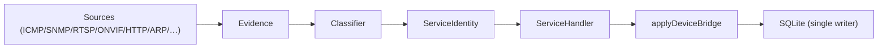
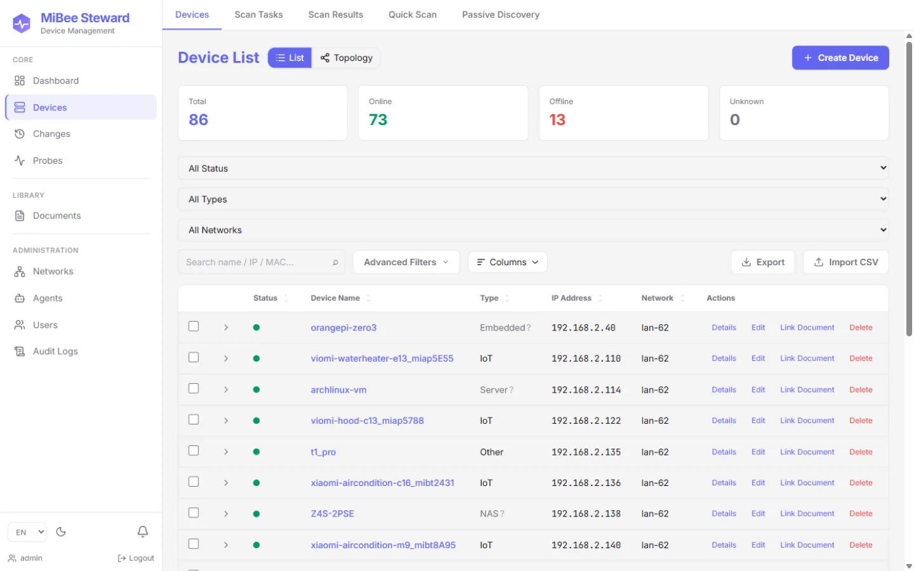
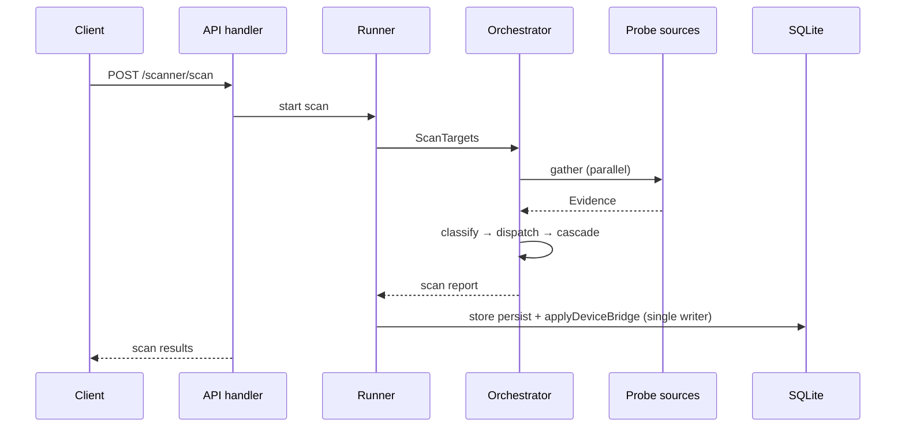

# Device Discovery & Identification

## Discovery Overview

MiBee Steward discovers devices through a layered pipeline: **probe sources** produce raw evidence, **classifiers** fuse evidence into service identities, and a **single-writer persistence funnel** merges results into the device registry. The flow:



Discovery sources fall into four categories:

| Category | Runs where | Default |
|---|---|---|
| **Active probes** | any deployment | enabled |
| **Passive (eBPF)** | any deployment (kernel ≥5.8, `WITH_EBPF` build tag) | disabled |
| **Passive (host-local)** | any deployment | disabled (master switch `scanner.discovery.enabled`, default `false`) |
| **Router-resident Tier-1** | only on the gateway | disabled, opt-in |

## Active Probe Sources

Active probes initiate connections to target hosts. They work from any network position with L3 reachability.

| Source | Protocol / Port | Evidence emitted | Notes |
|---|---|---|---|
| ICMP ping | ICMP | `echo` (RTT, reachable) | Basic liveness check |
| TCP connect | 38 default ports (configurable via `scanner.pipeline_defaults.default_ports`) | `port_open`, `banner` | Covers remote access / database / mail / directory / media / monitoring-exporter services |
| SNMP Get | UDP/161 | `snmp` (8 scalar OIDs: sysDescr, sysObjectID, sysServices, ifNumber, sysUpTime, sysContact, sysName, sysLocation) | v1+v2c version ladder; SNMPv3 USM via the credential store. Only the L2 topology probes walk tables |
| RTSP OPTIONS | TCP/554,8554 | `rtsp_banner` (Server header, Public methods) | Camera/NVR detection |
| ONVIF SOAP | TCP unicast POST `/onvif/device_service` (observed ports, fallback 80/8080) | `onvif_response` (GetSystemDateAndTime + XML namespace validation) | IP camera identification; WS-Discovery **multicast** sniffing belongs to the eBPF observer (see [eBPF](ebpf.md)) |
| HTTP probe | TCP/80,443,8080,… | `http` (Server header, `/metrics` availability) | Triggers the prometheus/node_exporter cascade |
| TLS cert chain | TCP/443,8443,9443,4443,465,636,989-995, … | `tls` (full certificate chain) | Certificate inventory for TLS-wrapped services (https/ldaps/smtps/imaps/pop3s…) |
| mDNS / SSDP | UDP/5353, UDP/1900 | `mdns`, `ssdp` (service instance names, vendor fields) | Active UDP discovery; mDNS can do unicast (`scanner.mdns.unicast_queries`) |
| rDNS | DNS reverse lookup | `rdns` (hostname) | Resolvers configurable via `scanner.rdns.dns_servers` |
| SMB/NetBIOS | TCP/139,445 | `smb` (hostname, domain, SMB signatures) | Windows/NAS identification |
| ARP cache | local `/proc/net/arp` | IP→MAC mapping | Hosts the local machine has talked to (same subnet only) |

**L2 topology probes** (SNMP table walks against capable switches; neighbors land in `device_neighbors` → topology edges):

| Probe | Table walked | Produces |
|---|---|---|
| LLDP-MIB | `lldpRemTable` | neighbor MAC/port/system description |
| CDP-MIB | `cdpCacheTable` (Cisco) | neighbor MAC/IP/port |
| Bridge-MIB | `dot1dTpFdbTable` | MAC→port forwarding entries |
| Q-BRIDGE-MIB | `dot1qTpFdbPort` | MAC→port + 802.1Q VLAN tags |
| STP-MIB | `dot1dStp` | root/designated bridge + port STP roles |
| IF-MIB | `ifName` | ifIndex→human-readable port names |

## Passive & Router-Resident Sources

These sources read data from the local system rather than probing remote hosts. **All passive discovery is gated by the master switch `scanner.discovery.enabled` (default `false`)**; with the master switch on, each sub-source follows its own `enabled` key.

**Passive (eBPF)**: the eBPF TC observer (`WITH_EBPF` build tag, kernel ≥5.8) watches ONVIF/WS-Discovery multicast and TCP magic bytes, emitting evidence at confidence 0.6. See [eBPF Passive Observer](ebpf.md).

**Passive (host-local)**: `arp_cache` (diffs the kernel `/proc/net/arp` cache — zero traffic), `multicast` (passively listens on mDNS 224.0.0.251:5353 and SSDP 239.255.255.250:1900 for self-announcing devices), `router_arp` (walks the SNMP ARP tables of the routers listed in `scanner.router_arp.routers` — cross-VLAN MAC coverage; no-op without routers). Two more optional sources need dedicated build tags in the default build: `arp_scan` (active ARP broadcast sweep, `WITH_ARPSCAN` tag) and the raw-frame LLDP listener (`WITH_LLDP` tag + `scanner.discovery.lldp_interfaces`).

**Router-resident Tier-1**: only produce data when MiBee Steward runs directly on the gateway (e.g., an OpenWrt device). **Off by default; opt-in.**

| Source | Config key | What it reads | Why gateway-only |
|---|---|---|---|
| `dhcp_leases` | `scanner.discovery.dhcp_leases.enabled` | dnsmasq lease file (OpenWrt `/tmp/dhcp.leases`, Debian `/var/lib/misc/dnsmasq.leases`) | Needs the local DHCP server's lease table |
| `conntrack` | `scanner.discovery.conntrack.enabled` | `/proc/net/nf_conntrack` (LAN-side endpoints of active NAT flows) | Needs the gateway's network namespace |
| `hostapd` | `scanner.discovery.hostapd.enabled` | hostapd control socket (`iw station dump` fallback) — STA associations / signal dBm / SSID | Needs the Wi-Fi AP on the same device |
| `dns_log` | `scanner.discovery.dns_log.enabled` | dnsmasq query log (`--log-queries`) | Needs the local DNS resolver's log |

**Enabling passive discovery** (YAML example — master switch first, then sub-sources as needed):

```yaml
scanner:
  discovery:
    enabled: true            # master switch (default false)
    interval: 60             # passive-source poll cadence (seconds)
    trigger_identify: true   # trigger a single-IP full identification scan on
                             # each new host (recommended)
    arp_cache:
      enabled: true          # the three sub-sources shipped enabled in the
    multicast:               # example config; none run while the master
      enabled: true          # switch is off
    router_arp:
      enabled: true          # also needs scanner.router_arp.routers set
    dhcp_leases:             # Tier-1 router sources, default false
      enabled: true
    conntrack:
      enabled: false
    hostapd:
      enabled: false
      interfaces: []         # e.g. ["wlan0"]; empty = autodetect
    dns_log:
      enabled: false
      path: ""               # empty probes conventional paths
```

Or via environment variables (note the `_ENABLED` suffix):

```bash
export MIBEE_SCANNER_DISCOVERY_ENABLED=true
export MIBEE_SCANNER_DISCOVERY_DHCP_LEASES_ENABLED=true
export MIBEE_SCANNER_DISCOVERY_CONNTRACK_ENABLED=true
```

**Why Tier-1 is opt-in**: these sources read sensitive system state and only produce useful data when the binary runs on the actual gateway. Running them remotely yields nothing useful and may cause permission errors; when the underlying files/sockets are absent they degrade cleanly to no-ops (debug log + skip) — no errors, no crashes.

## Fingerprint Identification

After probes produce evidence, the **RuleClassifier** matches evidence against a data-driven YAML rule library to identify device type, brand, and model. Identification results surface directly in the device list and detail page — the badge next to the type distinguishes the identification source (protocol evidence vs hostname heuristic):




### Rule Files

| File | Covers |
|---|---|
| `banner.yaml` | TCP banner greetings (SSH/HTTP/RTSP/FTP/SMTP/POP3/IMAP) |
| `http-tls.yaml` | Kind-presence services (RTSP/ONVIF/Web/TLS/Prometheus) |
| `ports.yaml` | Port-shape-only fallbacks (LDAP/SMB/DNS-TCP/...) |
| `snmp-data.yaml` | SNMP OID-prefix tables + sysDescr keyword tables |
| `lldp-cdp.yaml` | LLDP/CDP system-description traits |
| `recog-imported.yaml` | Rules bulk-imported from recog (Apache-2.0) via `cmd/fpimport` |

The rule library is embedded in the binary by default (rule assets ship inside the `mibee-fingerprints-go` module). Custom rules: set `scanner.fingerprint_path` to a directory of YAML files.

### Match & Emit Flow

Each rule has a `match` node (testing evidence fields) and an `emit` node (producing a `ServiceIdentity`). Match operations include `kind_presence`, `port`/`port_eq`, `prefix`/`prefix_ci`, `contains`/`contains_any`, `equals`, `regex`, and composite `compound`/`or` operators. Confidence is fused: `fused = 1 - (1 - evidence.conf) * (1 - rule.conf)`.

See [Fingerprint Specification](fingerprint-spec.md) for the full rule format, match operations, and confidence model.

> **Logic that can't be a single declarative rule** (the SNMP bitmask+numeric device-type heuristic, the camera classifier's cross-evidence fusion) stays as Go code, coexisting with the rule library — see the fingerprint spec §"Logic plugins".

### Device-Type Inference (hostname/brand/port keyword table)

Beyond service-level fingerprints, the device **type** (camera/switch/nas/…) is additionally inferred from a data-driven keyword table: `configs/fingerprints/device-types/device_types.yaml` (hostname prefixes, brands, port combos → type), consumed by the generic matcher in `runner`.

Every rule carries a `source` field — `protocol` (from SNMP/RTSP/ONVIF protocol evidence, trustworthy) or `heuristic` (from hostname guessing, spoofable) — recorded in `scan_attributes.inferred_type_source`. The UI shows a `?` badge on heuristic-sourced types. Adding a device signature = one YAML line, not a new Go branch.

### OUI Vendor Resolution

The OUI loader resolves MAC addresses to IEEE-registered vendors via **longest-prefix-match** across three registries:

| Registry | Prefix length | Example |
|---|---|---|
| MA-S (formerly IAB) | /36 (9 hex) | Murata, specific sub-blocks |
| MA-M | /28 (7 hex) | Medium-sized assignments |
| MA-L (OUI) | /24 (6 hex) | Large IEEE blocks |

**Longest-prefix is mandatory** because MA-S/MA-M sub-blocks are carved out of /24 OUIs owned by IEEE or another vendor. For example, a MAC starting `8C1F64B14..` belongs to Murata's MA-S block, not the parent /24 owner "IEEE Registration Authority".

**Two vendor fields**:

| Field | Source | Meaning |
|---|---|---|
| `oui_vendor` | OUI loader (IEEE registry) | NIC silicon vendor |
| `vendor` | Device self-declaration (SNMP/HTTP/TLS) | Device brand |

Both stored in `scan_attributes`. The distinction matters: a Hikvision camera might use a Realtek NIC (oui_vendor = Realtek, vendor = Hikvision).

**OUI data sources**:

- **Embedded** (default): curated CC-BY-SA table of common vendors. Sufficient for most deployments.
- **Full IEEE set** (optional): download via `scripts/fetch-oui.sh`, set `scanner.oui_path` to the file. IEEE registries are "All rights reserved" factual data — cited, not folded into the CC-BY-SA fingerprint corpus.

## Identity Merging & Device Replacement

### MAC-Primary Identity

The device identity model uses **MAC address as the primary key**:

- Same MAC, different IP (device moved subnets) → **one asset**
- Same IP, different MAC (DHCP reuse) → **two distinct assets**
- No MAC known → fallback to `(ip_address, network_id)` composite key

This means a device that roams between Wi-Fi networks (same MAC, different IP each time) stays tracked as a single asset.

### Device Replacement Detection

When a scan finds a MAC matching an existing device but with significantly different attributes (different IP range, different services, different brand), the system emits a **replacement** event: the IP holder wins, the old MAC row is marked offline, and the divergence is written to `change_log`. This helps detect when a device is physically swapped (e.g., old camera replaced with a new one using the same cable).

### Single-Writer Concurrency

All device writes go through `runner.applyDeviceBridge` — a single-writer funnel that prevents race conditions when multiple probe handlers run concurrently (the bridge runs sequentially after the parallel scan). MAC-primary identity and this bridge landed in v0.2.0.

### Network Reconciliation Job

`internal/service/scannerv2/reconcile` provides the network reconciliation job (`scanner.reconcile_interval`, default 1h): it periodically reconciles devices against their network's CIDR membership, **detecting and surfacing only** (the `mibee_network_mismatches` gauge + records) — it never modifies device rows.

## Tuning Tips

### Sync vs Async Scan

`POST /scanner/scan` (synchronous) rejects targets with **>1024 IPs** (HTTP 413). For larger ranges, use the async task API:

| Endpoint | Purpose |
|---|---|
| `POST /scanner/tasks` | create a scan task |
| `POST /scanner/tasks/{id}/trigger` | start execution |

### Sync Scan Flow



### Rate Limits & Concurrency

| Config key | Default | Description |
|---|---|---|
| `scanner.max_concurrent_hosts` | 50 | Per-host parallelism cap |
| `scanner.default_timeout` | 300 | Per-host pipeline timeout (seconds) |
| `scanner.per_probe_timeout` | 3 | Timeout for a single probe action (seconds) |
| `retention.scan_results_days` | 30 | `scan_results`/`scan_task_runs` pruning window (`scanner.retention_days` is the legacy fallback when the newer key is unset) |

### Heartbeat Thresholds

| Config key | Default | Description |
|---|---|---|
| `heartbeat.default_interval` | 30 | Default per-device check interval (seconds) |
| `heartbeat.tick_interval_seconds` | 30 | Probe loop tick (seconds) |
| `heartbeat.timeout` | 5 | Probe timeout (seconds) |
| `heartbeat.offline_threshold` | 5 | Consecutive failures before offline |
| `heartbeat.offline_backoff_ticks` | 10 | Probe offline devices once per N ticks (~5 min on the 30s tick) |

### Scanner Pipeline Defaults

```yaml
scanner:
  pipeline_defaults:
    icmp_enabled: true
    snmp_enabled: true
    port_scan_enabled: true
    default_ports: "22,21,23,25,53,80,110,143,389,443,445,554,631,636,8554,1433,3306,3389,5432,5900,6379,8000,8080,8081,8443,8888,9000,9090,9100,9104,9113,9121,9187,9200,9443,11211,27017,161"
    service_detection_enabled: true
    prometheus_check_enabled: true
    node_exporter_enabled: true
```

The 38 default ports cover remote access (22/23/3389), databases (1433/3306/5432/6379/9200/11211/27017), mail/directory (25/110/143/389/636), media (554/8554), storage (445), and monitoring exporters (9100/9104/9113/9121/9187); 161 is SNMP/UDP (kept in the spec so the port list mirrors what the engine coordinates — the UDP probe path is separate).

## Cross-References

- [Architecture Overview](architecture.md) — 5-layer scanner pipeline, persistence tables, device identity model
- [Configuration Reference](configuration.md) — all `scanner.*` and `heartbeat.*` config keys
- [Fingerprint Specification](fingerprint-spec.md) — rule format, match operations, confidence model, license
