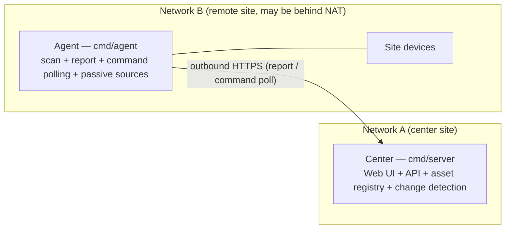
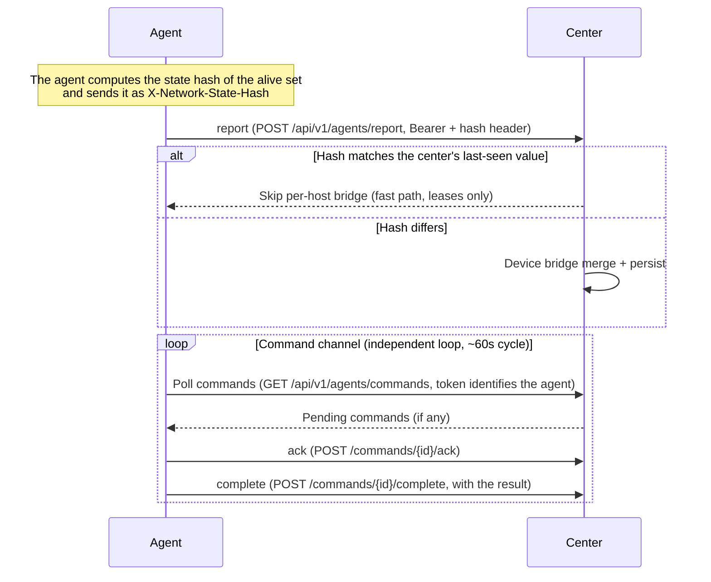

# Distributed Deployment

MiBee Steward uses a **center + agents** architecture to manage assets across multiple LANs / sites. This page covers the architecture, the data-sync model, the command channel, and operations.

## When to Go Distributed

| Scenario | Scale | Recommendation |
|---|---|---|
| Single LAN, a few dozen devices | Small | Standalone deployment (see [Standalone Deployment](deployment.md)) |
| Multiple LANs / sites | Medium-large | **Distributed**: one center + one agent per site |
| Router-based discovery needs | Any | See [OpenWrt Deployment](openwrt.md) (Form B is the distributed agent) |

Use the distributed architecture when you manage multiple disjoint subnets, or want Tier-1 signals (DHCP/conntrack/hostapd/dns_log) collected on each gateway.

## Architecture



The center is the **single writer** of the device registry (single-writer persistence). Agents scan their own network and report results to the center over HTTPS. Agents only make **outbound** connections (pull model), so they work through NAT/firewalls without any inbound port on the site side.


### Pull-Model Sequence



Internally the agent is driven by `command_poller` (poll / ack / complete) and `reporter` (reports with `X-Network-State-Hash`); scanning is run by the `scannerv2` engine (passive sources are collected on the router). The two channels are independent: report cadence does not affect command polling.

## Prerequisites

- **Center**: a server reachable by all agents (hostname or fixed IP, HTTPS recommended), running the center binary (`cmd/server`, ~24MB, embedded SPA).
- **Agent**: one per site (VM or low-power router), running the agent binary (`cmd/agent`, ~18MB, no embedded UI, ~100MB RAM).
- **Clock sync**: NTP on all nodes is recommended so report timestamps read cleanly. Tokens themselves are opaque hash lookups with no time check, and lease expiry only uses the center's own clock.

## Install & Register an Agent

### 1. Mint an agent token on the center

Agent tokens are credentials issued by the center, bound to `network_id + agent_id` and not reusable across networks. First create the target network (note its **numeric ID**) under network management, then mint the token from the center's **Agents page** or via the API:

```bash
curl -s -X POST http://<center-ip>:8080/api/v1/agents/tokens \
  -H 'Authorization: Bearer <admin-token>' \
  -H 'Content-Type: application/json' \
  -d '{"agent_id":"agent-site-b","network_id":3,"name":"site-b"}'
```

- `agent_id` (required, unique; 409 on collision): the agent's identity
- `network_id` (required): the **numeric ID** of the target `networks` row (not the network name)
- `name` (optional): display label

The plaintext token is returned exactly once at creation; the center stores only a SHA-256 hash.

### 2. Install the agent binary

```bash
# Download or cross-compile the agent binary (see the cross-compile section of [OpenWrt Deployment](openwrt.md))
wget https://github.com/Mi-Bee-Studio/MiBeeSteward/releases/download/<tag>/mibee-agent-linux-arm64
chmod +x mibee-agent-linux-arm64
sudo mv mibee-agent-linux-arm64 /usr/local/bin/mibee-agent
```

### 3. Configure and start

```bash
sudo mkdir -p /etc/mibee
sudo tee /etc/mibee/agent.yaml > /dev/null <<'EOF'
center:
  url: "https://<center-domain>"
  auth_token: "<token-from-step-1>"
  report_interval: "30s"
network:
  name: "site-b"
  cidr: "192.168.20.0/24"
EOF

sudo mibee-agent -config /etc/mibee/agent.yaml
```

Optional: run it as a service with systemd (the repo ships a unit template at `deploy/mibee-agent.service`).

> **Important**: the agent does **not** start scanning from this config alone — it only executes scan tasks registered in its local `scan_tasks` and commands dispatched by the center. Three ways to get it moving:
> 1. Dispatch a `scan` command to it from the center's Agents page (most common);
> 2. Insert a `scan_tasks` row into the agent's local database (good for recurring scans);
> 3. Enable `scanner.discovery.*` passive sources (router-side signals, see [OpenWrt Deployment](openwrt.md)).
>
> Command polling starts immediately (~60s cycle); the first report happens after the first scan/discovery produces results (refreshed every 30s by default, `center.report_interval`).

## Data Sync Model

### Report → Device Bridge

The agent POSTs scan results to `POST /api/v1/agents/report` with an `X-Network-State-Hash` header. The center is the single writer of the device registry (single-writer persistence).

**The agent computes the hash** (SHA-256 over the sorted identity+classification fields of the alive set); the center only compares it against the last value it saw:

- **Hash matches** → the center skips the full per-host bridge and only refreshes leases (fast path; saves CPU and DB writes). Note the last-seen hash lives in the center's memory — after a center restart the next report takes the full-merge path once.
- **Hash differs** → full merge: de-duplicate by MAC, keep stable device IDs across reports, update online state, and emit **change events**.

Change events are pushed in near-real-time to subscribers over SSE (`/api/v1/changes/watch`) — the cross-network asset view stays fresh.

### Lease & State

| Parameter | Default | Notes |
|---|---|---|
| Device lease TTL | 5 min (`scanner.agent_lease_ttl`) | Renewed by agent reports; the center's background `LeaseSweeper` (60s default) marks expiry as offline |
| Report refresh interval | 30s (`center.report_interval`) | New scan results are flushed at this cadence; ~10 consecutive misses exceed the lease TTL |
| Command poll cycle | ~60s | Independent of the report channel |
| Pending-report retry queue | 100 batches in memory | Buffers **reports** (not commands) while disconnected, drained on reconnect; oldest batches dropped when full |

## Command Channel

The center can actively dispatch commands to an agent (e.g. trigger a one-off scan):

1. An admin enqueues a command via `POST /api/v1/agents/{agentId}/commands` (commands live in the center's `agent_commands` table).
2. The agent's `command_poller` polls `GET /api/v1/agents/commands` on a ~60s cycle — there is **no** agentId in the path; the token is the identity.
3. After executing, the agent calls `POST /api/v1/agents/commands/{id}/ack` to acknowledge, then `POST /api/v1/agents/commands/{id}/complete` with the result (`{"status":"done|failed","result":...}`) — complete is its own immediate HTTP call, not piggybacked on the next report.

Commands are **best-effort**: commands enqueued while the agent is offline never expire — they run on the next poll cycle after the agent reconnects.


### Scheduled scans for agent-managed networks

`scan_tasks` natively supports agent-managed networks: when a task's targets resolve into the CIDR of a network bound to an agent (`networks.agent_id`), the scheduler **dispatches a scan command to that agent** on every cron tick (reusing the command channel and its target validation) instead of scanning locally — the agent IS the scanner for its network. A successful dispatch records a `completed` run; a rejected one (out-of-CIDR targets, reserved ranges) records a `failed` run with the reason, visible in the task's run history. Results flow back through `/agents/report` as usual (device bridge, leases, change detection unchanged).

> Historical note: this capability used to be driven by a deployment-side systemd timer plus a password-hardcoded shell script (login → command API). When the password rotated, the script failed silently and kept burning the admin account's failed-login counter, re-locking it indefinitely. With native scheduling, such external scripts should be retired — rotating the password no longer has hidden consumers.
## Fleet Management (#278)

Every agent report carries a meta block — build version, Go version, hostname, process uptime, cumulative scans shipped — which the center records into its `agent_status` table together with a **clock offset** approximation (report timestamp vs. receive time). The **Agents page** surfaces this fleet telemetry: version, clock offset (highlighted past ±60s), and last-report age per agent, next to the existing token status.

### Remote operations

The command channel also carries an ops family — `restart`, `config-reload`, `logs-tail` — that acts on the agent **process** rather than the network:

- **Double-gated by design**: the center refuses to enqueue ops commands unless `agent_fleet.remote_ops_enabled: true` is set on the center, AND the agent refuses to execute them unless `center.remote_ops_enabled: true` is set in its own config. Either side can keep ops from running.
- Every successful enqueue is **audit-logged** (`agent.ops_command`, with the issuing user).
- `restart` / `config-reload` re-exec the agent binary (config is consumed at construction; a re-exec is the only faithful reload). `logs-tail` returns the last ≤50 log lines from the agent's in-memory ring — the result lands in the command history on the Agents page.
- Under systemd/procd the re-exec is a clean restart; under a bare shell session the process comes back with the same args.

## Operations

### Monitoring

- Center health: `curl http://<center-ip>:8080/api/v1/health`.
- Agent status: the center's **Agents page** shows each token's last-used time (≈ last report/poll; Active when used within 5 minutes) and its command history.
- Logs: agent `journalctl -u mibee-agent -f`; the center is managed with systemd too.

### Disconnects & Recovery

- Agent offline: outbound failures back off and retry without an error storm; the in-memory pending queue (100 batches) buffers reports and drains them on reconnect.
- Center restart: SQLite single-writer makes cold starts safe; agents simply keep reporting (the center's hash cache is cleared, so one full merge happens before the fast path resumes).
- Token revocation: after revoking/deleting the center token, the agent's next report gets a 401 — a **terminal** 4xx: that batch is dropped and logged (not retried, not re-queued); the agent's local shadow data is untouched. Re-issue a token and update `center.auth_token` to resume.

### Limitations

- The center is **single-instance** by design (SQLite single writer); multiple centers cannot write one registry.
- The command channel is pull-based — no millisecond-level dispatch (poll cycle ~60s).
- The agent's local DB is only a shadow; authoritative data always lives on the center.

## Related Pages

- [Standalone Deployment](deployment.md) — single-network scenarios that don't need distribution
- [OpenWrt Deployment](openwrt.md) — Form B is the router variant of the distributed agent
- [Configuration Reference](configuration.md) — all agent and center config options
