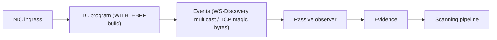
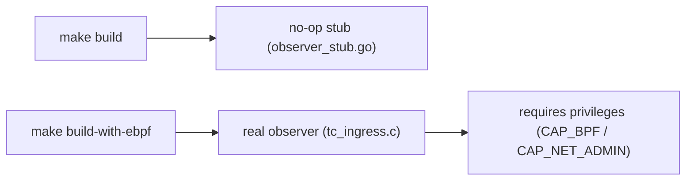

# eBPF Passive Observer

## Overview

MiBee Steward's scanning engine (scannerv2) uses a **dual-probe architecture**: active probing (TCP/SNMP/ONVIF etc.) provides precise identification, while passive observation collects supplementary evidence from real traffic without sending any probe packets. The eBPF passive observer implements the latter—it attaches to the Linux kernel's TC (Traffic Control) ingress hook to passively inspect inbound packets on network interfaces, matching known protocol signatures and feeding evidence to the classifier layer for fusion.

> **Positioning**: The eBPF observer is a **corroborating signal**, not a replacement for active probing. ONVIF/WS-Discovery multicast announcements are the cleanest passive target; TCP protocols (SSH/RTSP/HTTP) are more reliably detected by active probing, and the eBPF match results are injected as corroborating evidence with confidence 0.6.

## How It Works

`tc_ingress.c` attaches to the TC ingress hook on network interfaces and inspects incoming packets for known protocol signatures. The full packet path:



| Signature | Evidence kind | Classified as |
|-----------|--------------|---------------|
| TCP payload `SSH-...` | `banner` | ssh |
| TCP payload `RTSP/1...` | `rtsp_banner` | rtsp |
| TCP payload `HTTP/1...` | `banner` | http |
| UDP/3702 ↔ 239.255.255.250 | `wsdiscovery` | onvif |

Matches are emitted to a ring buffer (`events` map) and consumed by the Go loader, which translates them into `scannerv2.Evidence` with `Source: "passive:ebpf:tc"` and `Confidence: 0.6`. The classifier layer fuses this corroborating signal with active-probe evidence to produce the final identification.

**Key property**: The program **never modifies or drops packets**—it is pure observation (`TC_ACT_UNSPEC`).

## Build Story

eBPF support is controlled by a build tag. The default build ships with **zero kernel dependencies**:

```bash
# Default build — no eBPF (no-op stub):
make build

# Build with eBPF support (requires clang/llvm/bpftool + kernel BTF):
make build-with-ebpf
```



- **Default build**: uses the no-op stub at `internal/service/scannerv2/ebpf/observer_stub.go`—zero kernel/toolchain dependencies
- **eBPF build**: two steps. First run `go generate ./internal/service/scannerv2/ebpf/` inside the repo — it invokes `cilium/ebpf`'s bpf2go to compile `tc_ingress.c` into a BPF object and generate the Go bindings (the `tcIngress_*.go` outputs are gitignored and must be produced locally). Then `make build-with-ebpf` (which compiles the BPF object and builds with `-tags WITH_EBPF`). The BPF object is embedded into the final binary

```bash
# Step 1: generate bpf2go bindings (needs clang/llvm/bpftool + kernel BTF; outputs are not committed)
go generate ./internal/service/scannerv2/ebpf/

# Step 2: build
make build-with-ebpf
```

## Runtime Requirements

Only the `WITH_EBPF` build requires:

| Requirement | Details |
|-------------|---------|
| **Kernel** | Linux ≥ 5.8 with BTF (`CONFIG_DEBUG_INFO_BTF=y`) |
| **Privileges** | `CAP_BPF` + `CAP_NET_ADMIN` (or run as root) |
| **Config** | `scanner.ebpf.enabled: true` + `scanner.ebpf.interfaces: [eth0]` (**at least one interface must be listed**) |

When requirements aren't met (missing privileges or an empty `interfaces` list), the observer logs a debug message and **degrades gracefully** to active-only probing.

> Note: leaving `interfaces` empty does **not** auto-attach to all interfaces — the observer fails to start with nothing to attach to and degrades, so always list the interfaces explicitly when enabling.

## Configuration

Enable in the YAML config file:

```yaml
scanner:
  ebpf:
    enabled: true
    interfaces:
      - eth0
      - br-lan
```

- `scanner.ebpf.enabled`: enable the eBPF passive observer (default `false`)
- `scanner.ebpf.interfaces`: list of network interfaces to monitor; at least one is required when enabled (e.g. `eth0`, `br-lan`)

See [Configuration](configuration.md) for all config options, and [Discovery](discovery.md) for discovery-related settings.

## When to Use

### Use eBPF passive observation when

- Running on a gateway/router that sees all inbound traffic
- Need to discover hosts that don't respond to active probes (sleeping IoT, firewalled hosts)
- Detecting ONVIF cameras via multicast announcements (cleanest passive target)
- Want supplementary evidence without increasing network traffic

### Active probing suffices when

- All network devices respond to SNMP/ICMP probes
- Runtime environment doesn't meet eBPF requirements (non-Linux 5.8+, no BTF)
- Container/virtualized environment can't obtain `CAP_BPF` privileges

## Known Limitations

- **Linux only**: eBPF requires Linux kernel 5.8+ with BTF support
- **Privileges required**: must run as root or have `CAP_BPF` + `CAP_NET_ADMIN` capabilities
- **TCP signals are corroborating only**: SSH/RTSP/HTTP matches are evidence at confidence 0.6, not replacements for active probing
- **No CGO dependency**: the default build is completely free of eBPF code, suitable for all deployment environments
- **`vmlinux.h` is machine-specific**: generated from the running kernel's BTF, already gitignored

## Iterating on the C Program

```bash
cd bpf && make vmlinux.h && make tc_ingress.o
```

This requires `clang`, `llc`, and `bpftool`. The generated `vmlinux.h` is machine-specific (from the running kernel's BTF) and is gitignored.

## Related Pages

- [Discovery](discovery.md) — full list of discovery sources and configuration
- [Configuration](configuration.md) — all configuration options
- [Architecture](architecture.md) — scanning engine overview
