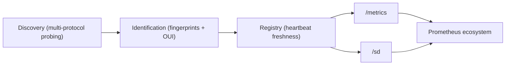
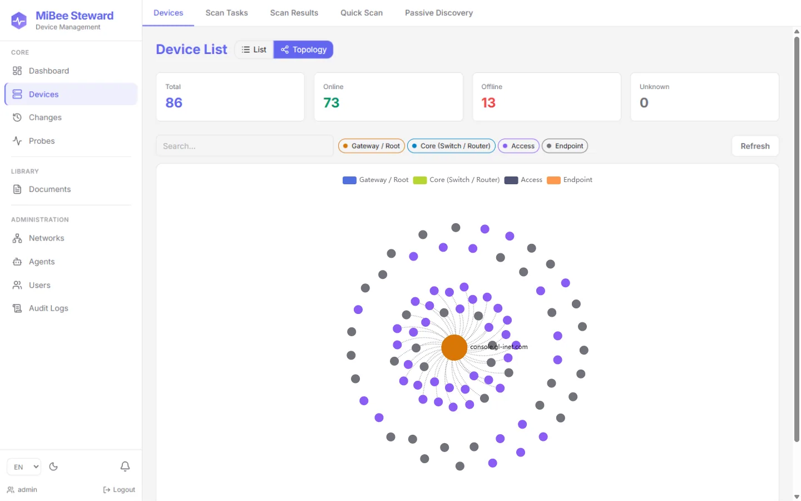

# MiBee Steward Product Introduction

MiBee Steward v0.5.0 (2026-08-19) is a **device/network-layer asset discovery, identification, and registry** tool — CMDB-lite for network and IoT assets, delivered as a single zero-dependency binary. The backend uses Go + Chi routing + modernc.org/sqlite (CGO-free pure-Go SQLite) + sqlc-generated data layer; configuration is managed by koanf (YAML files + `MIBEE_*` environment variables). The frontend is a SvelteKit 5 single-page application embedded into the binary via `go:embed`. Licensed AGPL-3.0 with a commercial dual-license option.

It answers three questions:

1. **What devices are on this network?** — multi-protocol active probing (ICMP, TCP port scan, SNMP, HTTP, RTSP, ONVIF, mDNS, SSDP, NetBIOS); optional eBPF passive observer (sniffs WS-Discovery multicast and TCP magic bytes); router-side data sources since v0.4.0 (DHCP leases, conntrack, hostapd, dnsmasq logs).
2. **What are they?** — protocol fingerprints (banner / HTTP / RTSP / ONVIF / SNMP / Prometheus) infer device type, brand, and model; the MAC OUI registry infers the vendor.
3. **Are they alive?** — heartbeat-driven freshness continuously tracks online/offline state, latency, and history, making the registry a living ledger rather than a one-shot snapshot.

## Core Capabilities

### Discovery & Identification

- Multi-protocol probing: ICMP, TCP port scan, SNMP (v1/v2c/v3 USM), HTTP, RTSP, ONVIF, mDNS / SSDP / NetBIOS (UDP); exponential backoff retry (1s → 2s → 4s, network errors only).
- Fingerprint identification: classifies device type, brand, and model from protocol fingerprints; the community-contributable fingerprint/rule library grows over time (see [Fingerprint Spec](fingerprint-spec.md)).
- OUI vendor inference: longest-prefix matching against IEEE MA-L / MA-M / MA-S registry blocks; ships with a compact CC-BY-SA vendor table, the full dataset available via `scripts/fetch-oui.sh`.
- L2 topology discovery: LLDP-MIB / CDP-MIB / Bridge-MIB / Q-BRIDGE-MIB / STP-MIB probes resolve switch adjacency into device neighbors, topology edges, subnets, and VLANs.
- TLS certificate inventory: grabs the full certificate chain from TLS-wrapped services (https / ldaps / smtps / imaps / pop3s, …) and tracks expiry and trust status over time.
- Optional passive observation: eBPF TC observer sniffs WS-Discovery multicast and TCP magic bytes (built with `make build-with-ebpf`, kernel ≥5.8 + BTF).
- Router data sources (v0.4.0): DHCP leases, conntrack, hostapd, dnsmasq logs supplement asset information.

### Asset Registry & Heartbeat

- Device registry: create, edit, delete, group, and bulk-operate devices; register multiple systems per device (with entry URLs).
- Heartbeat freshness: per-device probe intervals (default 30s); five consecutive failures (`offline_threshold`, configurable) automatically mark a device offline, and it recovers automatically when it responds again; known-offline devices are probed on a backoff schedule to avoid useless traffic.
- Online/offline history, latency, and availability statistics surface in the web UI and in metrics.
- Change detection: device additions, attribute changes, and losses are recorded to a change log and pushed as events (`GET /changes` + SSE watch), keeping asset dynamics visible in near real time.

### Synthetic Probing (external resources)

- Explicitly configured periodic probing (blackbox_exporter-style) of any reachable endpoint — typically external/internet resources (a public HTTPS site, a hosted mail TLS port, a vendor gateway) — tracking availability and latency on fixed intervals.
- Four modules: `http` (full URL, status < 400 = success; https targets also collect the certificate chain), `tls` (host:port handshake with full chain collection), `tcp`, and `icmp`.
- The TLS certificate capability is reused from the internal network to the outside world: chain (leaf/intermediates/root), SANs, serial, fingerprint, PEM, negotiated TLS version/cipher, and a trust verdict are all persisted; result history carries a cert-expiry summary so rotation cadence is observable.
- Availability and certificate-expiry metrics (`mibee_probe_up` / `mibee_probe_cert_expiry_timestamp_seconds`) flow through `/metrics`; alerting is left to Prometheus (example rules ship with the repo).

### Device Config Backup (Oxidized/RANCID-style)

- Scheduled sweeps fetch each router/switch/firewall device's running-config over SSH (vendor command matrix: Juniper JunOS, HP/Aruba/H3C/Comware, and the Cisco-style `show running-config` default; host-key trust-on-first-use), version it in `device_configs`, and record a new version only when the content changes.
- Two-version unified diffs (API `GET /devices/{id}/configs` + `/diff?a=&b=`) and a device-detail **config history** tab; SSH credentials are encrypted at rest (AES-256-GCM via `security.master_key`) and redacted on read.
- A config change emits a `device_config_changed` event into the change log — feeding the changes page, the SSE watch, and notification rules.
- Opt-in (`scanner.config_backup.enabled`, default off): requires the master key and an SSH credential bound to each target device.

### Event Notifications (built-in, rule-driven)

- For teams that don't run a Prometheus+Alertmanager stack: **notification rules** route change events (`device_lost` / `device_recovered` / `device_added` / `device_changed` / `device_config_changed`) to webhook/email channels, with per-(rule × device) cooldown to suppress flapping.
- Scope each rule to all networks, one network, or a single device (by UUID). This is a thin rule→channel hop on top of change detection — deliberately not an alerting engine.

### Observability (Prometheus Ecosystem)

- `/metrics`: Prometheus text-format metrics — device status gauges, heartbeat counters (total attempts/failures), response-time histograms.
- `/sd`: HTTP service discovery endpoint that registers assets (including systems with `metrics_enabled=true`) into Prometheus.
- Alerting and visualization are deliberately left to Prometheus Alertmanager and Grafana — they consume these endpoints natively.

### Management Interface

- Embedded SvelteKit 5 single-page application: dashboard (ECharts), devices (list / detail / discovery / scan tasks / scan results / scanner), agents, audit, changes, documents, networks, and more; dark/light themes, responsive layout.
- Middleware chain executes in order: RequestID → RealIP → logging → metrics → panic recovery → security headers → CORS → CSRF → rate limiting → authentication/authorization (RBAC + scope).
- JWT authentication (cookie-first, Bearer token fallback) with optional TOTP two-factor verification; capability-based RBAC (admin / operator / viewer tiers, `user` being a legacy alias for viewer), object-level network scope grants, and audit logging.
- Full internationalization: Chinese and English language packs with automatic detection.

For a complete visual walkthrough see the [Web UI Tour](web-ui.md).

### Distributed Deployment

- Center (`cmd/server`) + agent (`cmd/agent`) model: each agent owns one LAN segment; the center aggregates a unified registry.
- Pull model: agents actively report to and poll the center; the center needs no inbound connections and can sit behind NAT.
- MAC-first identity: roaming devices across subnets stay a single asset; the same private IP in different networks (`network_id`) is a distinct device.

## Use Cases

### Network Asset Inventory

Automatically discover and register routers, switches, wireless APs, servers, and IoT devices, identifying brand/model via protocol fingerprints. Replaces manual spreadsheet-based asset tracking with a continuously-fresh registry.

### IoT / Camera Fleet Discovery

Identify IP cameras, sensors, controllers, and other IoT devices by brand and model. Cameras (RTSP + ONVIF) are the current priority scenario because fingerprints are crisp and demand is concrete — Steward is not camera-specific; the same identification pipeline applies to any device type.

### Branch / SOHO Network Mapping

Lightweight enough for small/branch networks where LibreNMS or Zabbix is overkill: deploy a single binary, scan the subnet, get a structured asset portrait — no database, message broker, or container stack required.

### Lab / Edge Asset Tracking

Track research devices, test rigs, measurement equipment, and edge nodes with flexible per-device probe configurations. Heartbeat freshness ensures the registry reflects reality, not a stale snapshot.

## Product Scope & Boundaries

### What It Is

| Scope | Description |
|-------|-------------|
| Discovery | ICMP / TCP port scan / SNMP (v1/v2c/v3) / HTTP / RTSP / ONVIF / mDNS / SSDP / NetBIOS active probing, optional eBPF passive observation and router data sources |
| Topology | LLDP / CDP / Bridge-MIB / Q-BRIDGE / STP neighbor discovery → topology edges, subnets, VLANs |
| Identification | Protocol fingerprints infer device type, brand, model; OUI vendor inference |
| Registry | Device registry (CMDB-lite): CRUD, grouping, device systems management |
| Heartbeat | Continuous asset freshness: online/offline + latency + history |
| Config backup | Scheduled SSH running-config pulls, versioned storage + diffs (opt-in) |
| Synthetic probing | Blackbox-style periodic probing of external endpoints (http/tls/tcp/icmp) |
| Change notifications | Rule-driven device/config change events → webhook/email |
| Metrics export | `/metrics` (Prometheus format) + `/sd` (HTTP service discovery) |

### What It Is Not

These are **deliberate product boundaries, not gaps** — mature tools already do them better, and Steward does not compete:

| Capability | Use instead | Notes |
|------------|-------------|-------|
| Alerting | Prometheus Alertmanager / Uptime Kuma | Steward exposes data via `/metrics`; it does not decide what or when to alert |
| Dashboards / visualization | Grafana | Built-in ECharts covers asset overview only, not a Grafana replacement |
| Host deep monitoring (CPU/mem/disk) | Netdata / node_exporter | Steward discovers node_exporter; it is not one |
| Service-layer discovery (L7) | Consul / eureka | Steward discovers devices (L2-L4), not service instances (L7) |
| Configuration management | Ansible, etc. | Registers and tracks assets only; pushes no configs to devices |
| Center HA | Single-instance center | Center is a single process; cross-network scaling via center + agents (see [Distributed](distributed.md)), no cluster/HA |

Deploy these tools alongside Steward when you need them — they consume the `/metrics` and `/sd` endpoints natively.

> Common misconception: Steward is sometimes compared to lightweight monitoring tools like Beszel / Uptime Kuma / Netdata. That is a category error — those tools monitor hosts/services you already know about; Steward discovers what is actually on the network.

## System Requirements

- **Platform**: Linux x86_64 is the primary platform; ARM64 via cross-compilation. Single binary, CGO-free, zero runtime dependencies.
- **Disk**: ~50MB for the app and database; +100MB+ (optional) for file uploads and document storage.
- **Memory**: typically under 100MB; CPU and network usage scale with active probing.
- **Network**: access to target subnets required for device probing; production deployments recommended via systemd, Nginx reverse proxy, or Docker (see [Deployment](deployment.md)).
- **Database**: a single SQLite (WAL mode, `./data/mibee.db`); no external database service required.

## Next Steps

- [Feature overview](https://github.com/Mi-Bee-Studio/MiBeeSteward/blob/main/docs/en/features.md) — the full capability inventory, layer by layer
- [Scenario playbooks](https://github.com/Mi-Bee-Studio/MiBeeSteward/blob/main/docs/en/playbooks.md) — six beginner scenarios, learning by doing
- [Comparison with similar tools](https://github.com/Mi-Bee-Studio/MiBeeSteward/blob/main/docs/en/comparison.md) — positioning, radar charts, and selection advice
- [Quick Start](quick-start.md) — a first deployment and network scan within minutes
