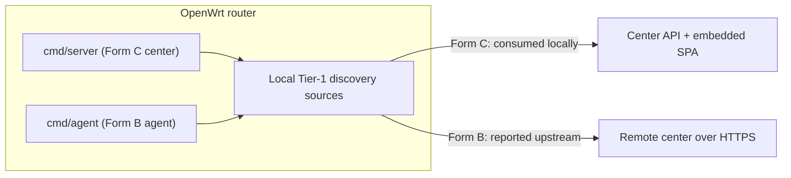

# OpenWrt Router Deployment

MiBee Steward can run directly on an OpenWrt router, in two forms: a **router-agent** (a light agent on the router reporting upstream to a remote center — repo naming **Form B**) and a **router-center** (the full center runs ON the router — repo naming **Form C**; Form A means a center on a generic host, see [Standalone Deployment](deployment.md)).

## Why Run on a Router

The router is the network's **choke point** — it sees DHCP leases, NAT flows, WiFi associations, and DNS queries that a regular LAN host cannot. These four Tier-1 router-only discovery sources are only available on the gateway:

| Source | What it gives | Router daemon it reads | No-op when absent |
|---|---|---|---|
| `dhcp_leases` | Authoritative hostname↔MAC↔IP map | dnsmasq `/tmp/dhcp.leases` | ✅ clean no-op (non-DHCP host) |
| `conntrack` | "Who is talking RIGHT NOW" (liveness + discovery) | `/proc/net/nf_conntrack` | ✅ clean no-op (module not loaded) |
| `hostapd` | WiFi STA associations (signal dBm / SSID / connect time) | hostapd ctrl socket → `iw station dump` fallback | ✅ clean no-op (no WiFi / no hostapd) |
| `dns_log` | Passive DNS fingerprint (devices that block probes still do DNS) | dnsmasq `--log-queries` log file | ✅ clean no-op (no query logging configured) |

The four sources are opt-in (all default false) and only work on the gateway; on a host that lacks the backing file/socket they degrade to a clean no-op (debug log + skip) — no errors, no crashes. Configuration lives under `scanner.discovery.*` (see [Discovery](discovery.md) and [Configuration Reference](configuration.md)).

## Form Selection

| Form | Binary | Role | When to use |
|---|---|---|---|
| **Form B — router-agent → remote center** | `cmd/agent` | Pure sensor: scans the router's LAN, reports upstream over HTTPS to a center elsewhere | Multi-site / multi-LAN: one remote center + one agent per router. The agent is light (18MB binary, ~100MB RAM). |
| **Form C — router-center** | `cmd/server` | The full center (API + SPA + asset registry + discovery) running ON the router | Single-network (home / small office): one router does everything — gets the choke-point signals AND serves the management UI. No separate agent process needed. |

Form B pairs with [Distributed Deployment](distributed.md); Form C is a self-contained single-network option (compare with [Standalone Deployment](deployment.md)).



## Installation

### Hardware Requirements

| Resource | Minimum | Comfortable | Notes |
|---|---|---|---|
| **Architecture** | **ARM or ARM64** | ARM64 (GL.iNet MT3000, ipq807x, mt798x) | **MIPS is NOT supported** — `modernc.org/libc` (the pure-Go SQLite backend's transitive dep) has no working `mips`/`mipsle` port and a broken `mips64le` one. This excludes older ath79/ramips routers (TP-Link Archer C7, Netgear R7000, etc.). |
| **RAM** | 128 MB | 256 MB+ | modernc SQLite is memory-heavier than C-SQLite; the center is heavier than the agent. |
| **Flash** | 32 MB | 128 MB+ | Binary 16-18MB + OUI (~5MB full / 1.2KB curated) + fingerprint corpus (~1.2MB) + DB. The DB should live on `/tmp` (tmpfs) — see Resource Usage below. |

### Cross-Compile

Both binaries build CGO-free (`modernc.org/sqlite`), so a plain `GOOS`/`GOARCH` cross-compile works — no OpenWrt SDK needed:

```bash
# Form B: agent
CGO_ENABLED=0 GOOS=linux GOARCH=arm64 go build \
  -trimpath -ldflags="-s -w" -o mibee-agent ./cmd/agent/
# → ~18MB

# Form C: center
CGO_ENABLED=0 GOOS=linux GOARCH=arm64 go build \
  -trimpath -ldflags="-s -w" -o mibee-steward ./cmd/server/
# → ~24MB (includes the embedded SvelteKit SPA)
```

`GOARCH=arm` (32-bit, GOARM=7) also works for older ARM boards; `GOARCH=mips*` does **not**. Note: the repo's Makefile cross-compile targets (`make build-linux-arm64` etc.) build the **center** binary (they run the device-type sync the embed step needs); cross-compile the agent with the raw `go build` above, or use `make build-agent` for a native-arch build:

```bash
# Center (Form C) — Makefile targets (amd64 / arm64 / arm likewise):
make build-linux-arm64

# Agent (Form B) — native arch:
make build-agent
```

### procd Init Scripts & Config Files

The repo ships two procd init scripts — `deploy/openwrt/mibee-steward.init` and `deploy/openwrt/mibee-agent.init` — installed to `/etc/init.d/` and managed with `enable` (start at boot) and `start`/`stop`/`restart`. Config files live under `/etc/mibee/`.

**Install Form B (agent → remote center):**

```bash
# On your build host:
scp mibee-agent root@router:/usr/bin/mibee-agent
scp deploy/openwrt/mibee-agent.init root@router:/etc/init.d/mibee-agent
ssh root@router 'mkdir -p /etc/mibee'
scp configs/agent.yaml root@router:/etc/mibee/agent.yaml   # then edit on the router

# On the router, edit /etc/mibee/agent.yaml:
#   center.url:         http://<your-center-ip>:<port>
#   center.auth_token:  <minted on the center via POST /api/v1/agents/tokens>
#   network.name/cidr:  this router's LAN (e.g. lan-62 / 192.168.62.0/24)
#   scanner.discovery.*: enable the router-only sources you want
#     (dhcp_leases, conntrack, hostapd, dns_log — all default false)

ssh root@router '/etc/init.d/mibee-agent enable && /etc/init.d/mibee-agent start'
ssh root@router 'logread -e mibee-agent | tail -20'   # expect "mibee-agent running"
```

**Install Form C (center on the router):**

```bash
scp mibee-steward root@router:/usr/bin/mibee-steward
scp deploy/openwrt/mibee-steward.init root@router:/etc/init.d/mibee-steward
ssh root@router 'mkdir -p /etc/mibee'
scp configs/config.yaml root@router:/etc/mibee/config.yaml   # then edit on the router

# On the router, edit /etc/mibee/config.yaml:
#   server.port:                   e.g. 8080
#   auth.jwt_secret:               a ≥32-char random string (required)
#   auth.initial_admin_password:   REQUIRED (no hardcoded default) — change from default!
#   network.name/cidr:             this router's LAN
#   database.sqlite.path:          /tmp/mibee/mibee.db  (tmpfs — see below)
#   scanner.discovery.*:           enable the router-only sources

ssh root@router '/etc/init.d/mibee-steward enable && /etc/init.d/mibee-steward start'
# Browse to http://<router-ip>:8080, log in with admin / <initial_admin_password>
```

### UCI Configuration (for the dns_log source)

`dns_log` requires dnsmasq query logging:

```bash
uci set dhcp.@dnsmasq[0].logqueries=1 && uci commit && /etc/init.d/dnsmasq restart
```

Then point `scanner.discovery.dns_log.path` at the resulting log (or leave it empty to probe the conventional paths).

## Permissions (CAP_NET_RAW)

Some of MiBee Steward's probes rely on raw sockets and need **CAP_NET_RAW**:

- ARP probing (`arp_scan` etc.) sends/receives raw ARP frames
- ICMP active probing depends on raw sockets
- If you bake in the raw-frame LLDP listeners or the [eBPF passive observer](ebpf.md), matching runtime caps are needed too (eBPF needs `CAP_BPF` + `CAP_NET_ADMIN`, kernel ≥5.8 + BTF)

**The procd init scripts run as root by default** (standard OpenWrt practice), so these capabilities are naturally available. If you run under a restricted account or a seccomp/apparmor policy that drops `CAP_NET_RAW`, ARP probing (`arp_scan` etc.) degrades or fails, and MAC discovery plus ICMP liveness checks become unavailable.

## Resource Usage

| Resource | Form B (agent) | Form C (center) |
|---|---|---|
| **Binary size** | ~18MB | ~24MB (includes SPA) |
| **RAM** | ~100MB | Heavier (modernc SQLite + asset registry) |

The agent is very lightweight and fits low-power routers (e.g. GL.iNet series); the center is best on 256MB+ routers.

### Flash-Wear Mitigation (DB on tmpfs)

Both binaries write a SQLite DB (WAL mode). On a router's NAND flash under overlayfs this causes write-wear. **Point the DB at `/tmp` (tmpfs, RAM-backed):**

- **Form B (agent):** the local DB is explicitly a *shadow* (the center is the writer of record), so cold-start loss is fine. Note the agent's DB path currently has **no dedicated config key** — it is fixed to `agent.db` next to the config file (e.g. `/etc/mibee/agent.db`). Its write volume is tiny (scan-result staging only), so flash is usually fine; if you truly need it on tmpfs, move the whole config dir to `/tmp/mibee-agent/` and point the init script there (the config file must be recreated after each reboot). The in-memory pending-queue (100 batches) handles disconnection during a reboot.
- **Form C (center):** the DB is the authoritative portrait. Pointing `database.sqlite.path` at `/tmp` means cold-start loss (rebuilt on the next scan; acceptable for a single-router deployment). For deployments that need persistence across reboots, leave that key on flash and accept the wear — consumer routers live 5-10 years and scan write volume is modest.

## Verification & Troubleshooting

### Health Check

```bash
# Form C (center): health endpoint
curl -s http://localhost:8080/api/v1/health

# View logs
logread -e mibee-steward   # Form C
logread -e mibee-agent     # Form B, expect "mibee-agent running"
```

### Common Issues

| Symptom | Cause / fix |
|---|---|
| `bind: address already in use` on start | Another process holds the port (often the router's own LuCI on 80/443). Set `server.port` to a free port (e.g. 8080). |
| `database is locked (SQLITE_BUSY)` | WAL-mode write contention under heavy concurrent probing. The pool ceiling (16) is currently fixed at compile time; the practical knob is reducing `scanner.max_concurrent_hosts`. |
| `mmap: access denied` at startup | Kernel disallows the mmap SQLite wants — run as root (the procd script does) or check seccomp/apparmor. |
| Discovery sources all no-op | Expected on a non-router host. On a router, check each source's prereq (dnsmasq running, `nf_conntrack` loaded, hostapd ctrl_interface enabled). |
| `build constraints exclude all Go files … modernc.org/libc…` at build | The typical error shape for unsupported MIPS (modernc/libc limitation). Use an ARM/ARM64 router. |

### Not Covered Here

- **Official .ipk packaging** (OpenWrt build feed): this repo ships init scripts + binaries that work via plain `scp` + `/etc/init.d/`. A proper `.ipk` via the OpenWrt buildroot's `golang-package` macros is a follow-up (not required for correctness).
- **MIPS support**: structural limitation of `modernc/libc`; would require swapping the SQLite backend to bbolt/goleveldb (deferred until a MIPS customer need exists).
