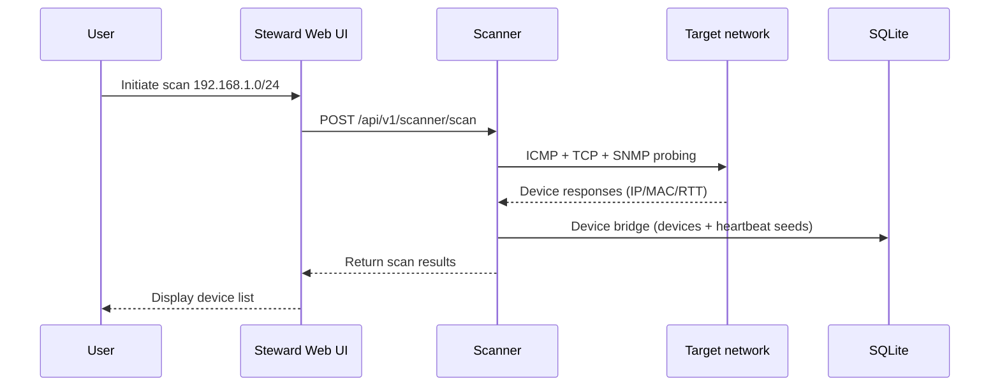

# Quick Start

This guide shows how to get MiBee Steward running in minutes and complete your first network asset discovery. It assumes you use a prebuilt binary or container image; to build from source, see the [Development Guide](development.md).

## Prerequisites

- A Linux x86_64 or ARM64 host (CGO-free single binary, no runtime dependencies)
- ~50MB of disk space (application + SQLite database)
- Network access to the target subnets (for ICMP / SNMP / TCP probing)
- For the container path: Docker Engine (optional)

## Get the Binary

### Option 1: GitHub Releases

Download the binary for your architecture from the [Mi-Bee-Studio/MiBeeSteward Releases](https://github.com/Mi-Bee-Studio/MiBeeSteward/releases) page (current version: v0.4.0):

```bash
chmod +x mibee-steward
./mibee-steward --config config.yaml
```

### Option 2: Docker

```bash
docker pull ghcr.io/mi-bee-studio/mibeesteward:0.4.0
```

Scanning operates at the network-namespace level, so run the container with host networking and declare `NET_RAW` / `NET_ADMIN`:

```bash
docker run -d --name mibee \
  --network host \
  --cap-add NET_RAW --cap-add NET_ADMIN \
  -v "$PWD/configs:/app/configs:ro" \
  ghcr.io/mi-bee-studio/mibeesteward:0.4.0
```

> Docker's default bridge mode sits behind NAT, which breaks ICMP, ARP/MAC, and multicast probing — it cannot be used for real asset inventory. See [Deployment](deployment.md).

## Minimal Configuration

Create `config.yaml`. The smallest useful config is the listen address, your local network CIDR, and two required auth keys (`auth.jwt_secret` must be at least 32 characters; an empty `auth.initial_admin_password` aborts startup):

```yaml
server:
  host: "0.0.0.0"
  port: 8080

network:
  name: "lan-1"
  cidr: "192.168.1.0/24"

auth:
  jwt_secret: "change-me-to-a-random-string-32-chars-min"   # ≥32 chars, required
  initial_admin_password: "your-strong-password"            # required; change after first login
```

Every config key can be overridden by an environment variable with the `MIBEE_` prefix (dots become underscores, e.g. `network.cidr` → `MIBEE_NETWORK_CIDR`):

```bash
export MIBEE_SERVER_PORT=8080
export MIBEE_AUTH_JWT_SECRET="$(openssl rand -base64 32)"
export MIBEE_AUTH_INITIAL_ADMIN_PASSWORD="your-strong-password"
```

For production, always set `auth.jwt_secret` and `auth.initial_admin_password`. See the [Configuration Reference](configuration.md) for all options.

## Start and Log In

```bash
./mibee-steward --config config.yaml
```

Open http://localhost:8080 and log in with `admin` and the configured initial password; change the password immediately after the first login. Health check:

```bash
curl http://localhost:8080/api/v1/health
```

## First Scan



**Web UI**: after logging in, open the scanner page and launch a scan against your target CIDR.

**Synchronous API** (for targets up to 1024 IPs):

```bash
# Obtain an admin token
TOKEN=$(curl -s -X POST http://localhost:8080/api/v1/auth/login \
  -H "Content-Type: application/json" \
  -d '{"username":"admin","password":"your-strong-password"}' | jq -r .token)

curl -X POST http://localhost:8080/api/v1/scanner/scan \
  -H "Authorization: Bearer $TOKEN" \
  -H "Content-Type: application/json" \
  -d '{"targets":"192.168.1.0/24"}'
```

The response is `{ hosts, total, alive, duration_ms }`; each host carries `ip`, `alive`, `rtt_ms`, `inferred_type`, `inferred_brand`, and more. Alive hosts are immediately registered through the **device bridge** (upserting `devices`, seeding heartbeat configs, and emitting change events); scan history rows (`scan_results` / `scan_task_runs`) are only persisted by async tasks.

**Async tasks** (the sync endpoint returns 413 for targets larger than 1024 IPs): create a task with `POST /api/v1/scanner/tasks` and trigger it with `POST /api/v1/scanner/tasks/{id}/trigger`; results are persisted to `scan_results`. See the [API Reference](api.md).

## What You Should See

- Device list: IP, MAC, OUI vendor, brand/model, type
- Identification results: `inferred_type` / `inferred_brand` (e.g. camera, server, pc, iot)
- Heartbeat status: online/offline and response latency
- Topology and neighbor relationships if the network has SNMP-capable switches

## Troubleshooting

| Symptom | Fix |
|---------|-----|
| Port 8080 already in use | Change `server.port` or set `MIBEE_SERVER_PORT` |
| No devices found | Verify `network.cidr` and `targets`; check that the firewall allows ICMP and SNMP (UDP 161) |
| Devices online but unidentified | Check the SNMP community (default `public`), or pass `community` explicitly in the scan request |
| Scanning misbehaves in Docker | Switch to host networking (see above) |
| Service fails to start | Read the startup log: a missing `auth.jwt_secret` (<32 chars) or an empty `auth.initial_admin_password` exits immediately; then check write permissions on the `data/` directory |
| Forgot the admin password | `./mibee-steward reset-admin-password -config config.yaml` (interactive prompt, or `-password 'new-pass'` / env `MIBEE_RESET_PASSWORD`) |

## Next Steps

- [Architecture](architecture.md) — scanner pipeline and background services
- [Deployment](deployment.md) — systemd, Docker, Nginx, backups
- [Distributed](distributed.md) — center + agents for multi-network discovery
- [Configuration Reference](configuration.md) — all config options
- [API Reference](api.md) — scan, device, and heartbeat endpoints
