# Web UI Tour

Every management capability of MiBee Steward ships inside its built-in web UI — embedded in the single Go binary, no separate frontend infrastructure required. This page walks through the interface area by area (screenshots show the light theme, captured from a live instance with sanitized demo data).

> The UI supports Chinese / English switching (language selector at the bottom of the sidebar) and light / dark themes. Screenshots below use the light theme.

## Login

The first visit to `http://<host>:8080` redirects to the login page. Sign in with the initial admin account (`admin` + the password from `auth.initial_admin_password`); TOTP two-factor authentication is supported, and user registration is admin-initiated.

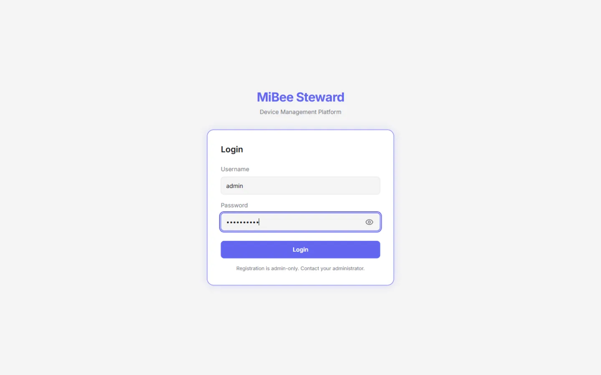

## Dashboard

The dashboard is the landing view: device status distribution, heartbeat success rate, device type distribution, and other widget cards; recent scan activity (alive / new / duration); and the offline devices that need attention. The widget layout is customizable (add/remove widgets), and a scan can be kicked off from the top-right corner.

## Device Inventory

The device list is the day-to-day workhorse: every registered device across all networks, filterable by status/type, searchable, and sortable. Each row shows IP, MAC, OUI vendor, inferred type and brand, and online status; the identification source (protocol evidence vs hostname heuristic) is distinguished by a badge.

Click any device for the detail page: base info, scan attributes (SNMP sysName/description, open ports, detected services and versions), TLS certificates, heartbeat history, neighbor relationships, config backup versions, and attached documents — all on one page.

## Discovery & Identification

The Discovery page shows the identification funnel: discovery events received → suppressed/deduplicated → known-device skips → identification triggered → liveness confirmed → finally recorded into the inventory. The per-stage counters tell you how healthy your discovery sources are and how well the pipeline converts.

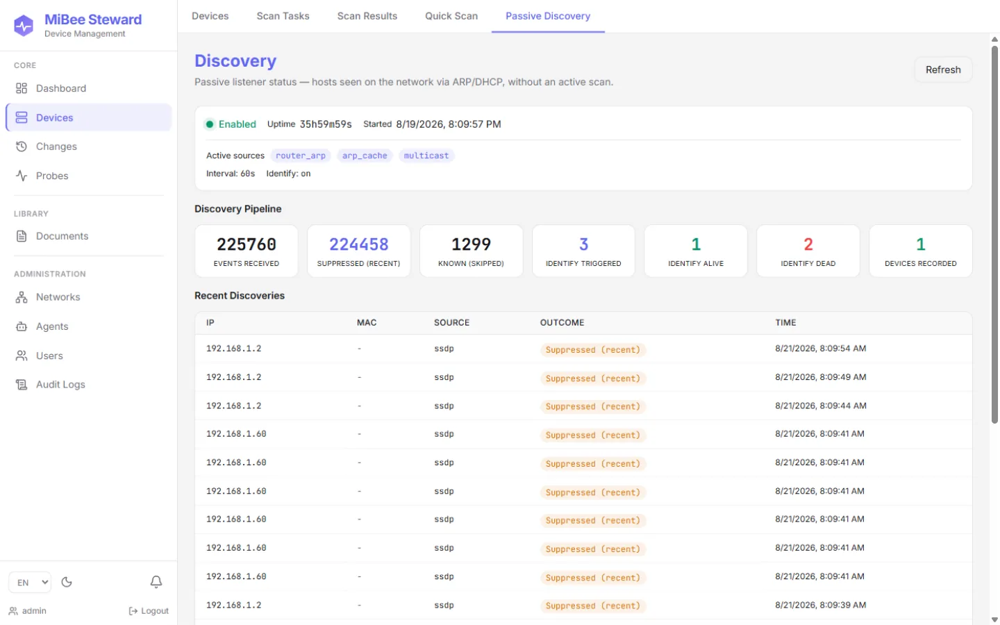

The Scanner page launches manual scans or manages recurring tasks: enter target CIDRs, SNMP community / v3 credentials, port and timeout parameters, then run a synchronous scan (≤1024 IPs) or create an async task (larger ranges). Results can be added back as devices.

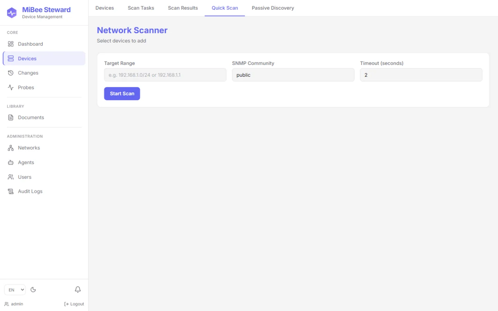

## Network Topology

For switched networks with LLDP / CDP / Bridge-MIB support, the topology page renders the device relationship graph automatically: core/distribution/access layers in distinct colors, edges carrying local/remote ports, VLAN tags, and STP roles; the legend doubles as a layer filter, and clicking a node highlights its neighbors with a detail card.

## Change Center

The Changes page lays out device additions / attribute changes / losses / config changes on a timeline — the "history axis" of the quasi-realtime network portrait. The SSE-based `/changes/watch` endpoint feeds downstream integrations.

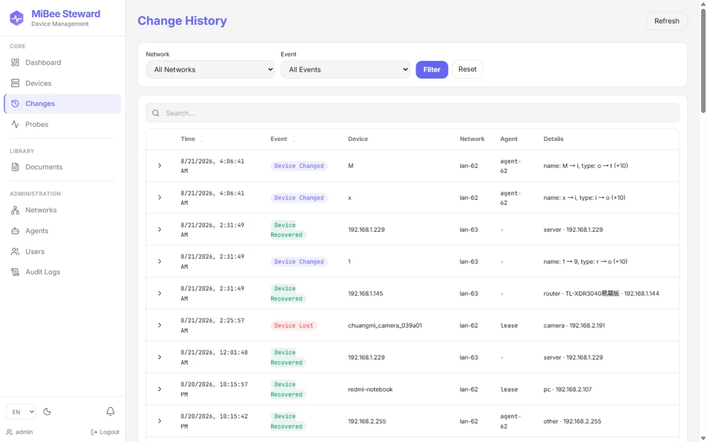

## Synthetic Probing

The Probes page manages periodic probing of targets **outside** your network: HTTP(S) availability, ICMP liveness, TCP ports, DNS, plus full certificate-chain collection and expiry tracking for HTTPS sites. Each target has its own interval; results feed the dashboard and alerting metrics.

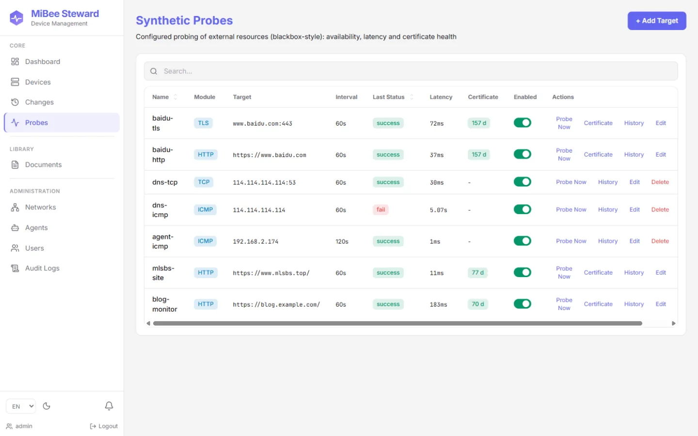

## Distributed Agents

Branch offices or isolated segments run `mibee-agent`, registering with the center via a one-time token. The Agents page shows each agent's online state, bound network, and last report; scan commands flow down the command channel, and agents poll, execute, and report back.

The Networks page manages logical networks (multi-LAN / multi-site): CIDR, site identifier, bound agent, and device count for each.

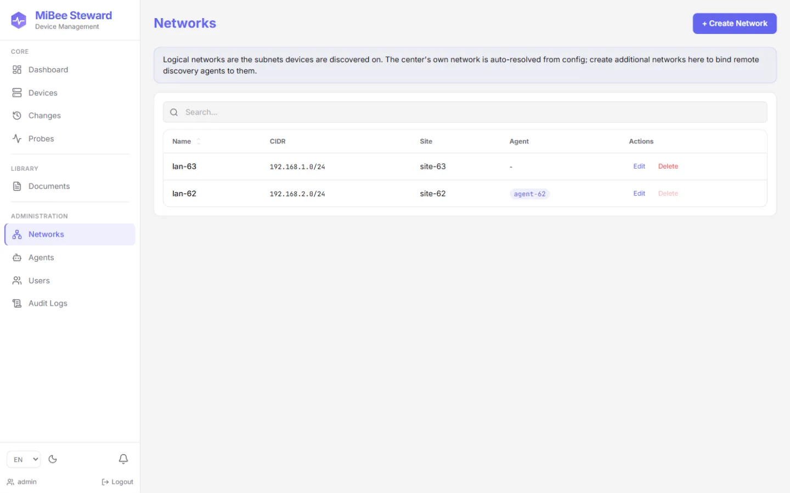

## Users & Permissions

Since v0.5.0 the UI uses a **role-capability model**: the `admin` / `operator` / `viewer` roles map to fine-grained capabilities (read devices, trigger scans, write configs, …), plus **object-level network grants** — non-admin users only see the networks they are granted (`closed` mode). The Users page handles account management and grant assignment.

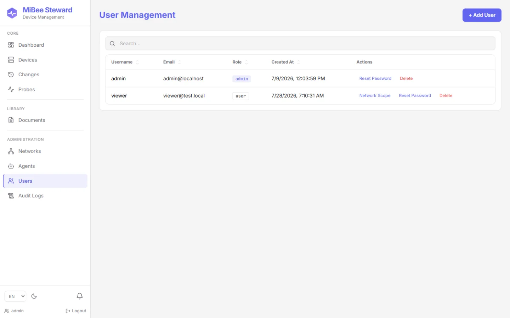

## Notifications & Integrations

The notification settings page manages two things: **channels** (webhook / email) and **rules** (which event — device lost/recovered/added/changed, config changed — goes to which channel, with a per-device cooldown). This is deliberately a thin rule→channel hop, not an alerting engine — alert orchestration stays with the Alertmanager ecosystem.

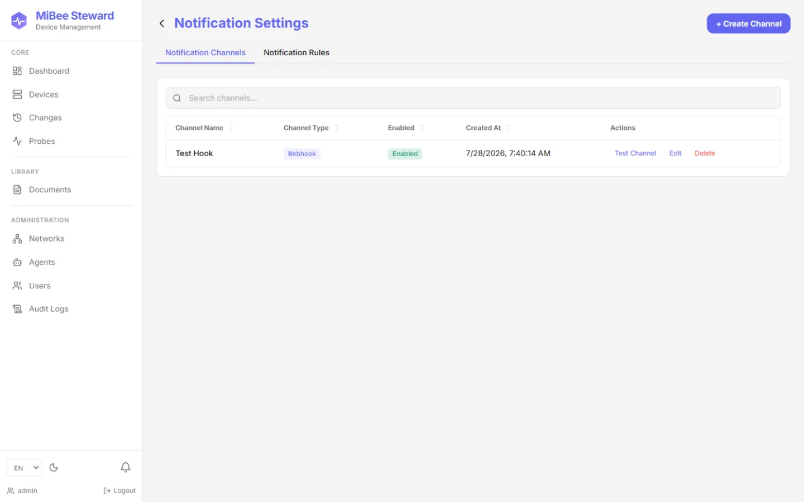

The settings page also covers profile, password change, TOTP two-factor, and theme/language preferences:

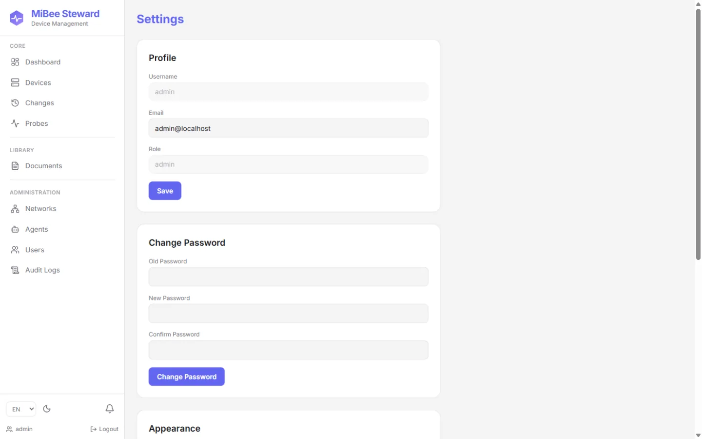

## Credential Vault

SNMPv3 (USM authNoPriv / authPriv) and SSH credentials live in the encrypted credential vault: AES-256-GCM at rest, keyed by `security.master_key`; the read API never echoes passphrases back (masked display only), and scans and config backups match credentials per target automatically.

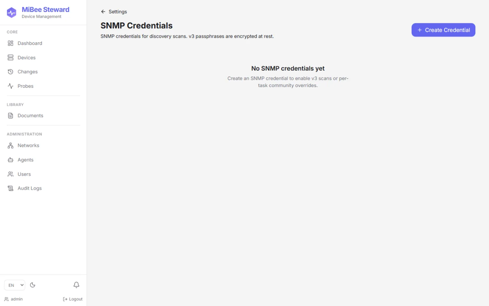

## Audit & Documents

The audit log records every sensitive operation (logins, credential changes, scan triggers, user management, …) — the "who changed what, when" trail.

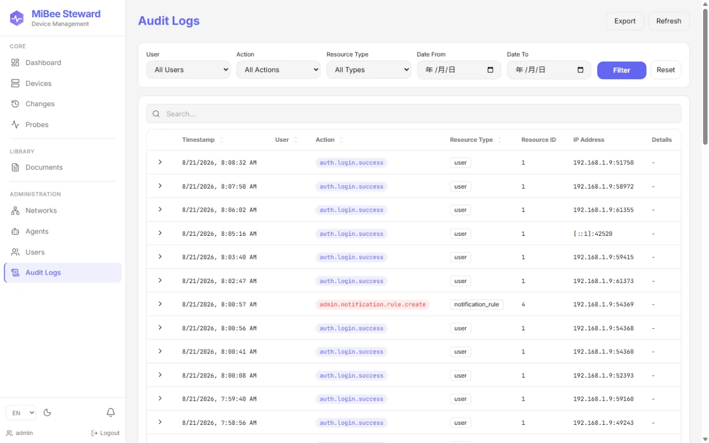

The document library attaches manuals, photos, and purchase records to devices (local upload, stored under `data/uploads`), extending the asset registry from "network visibility" into an "ops knowledge base".

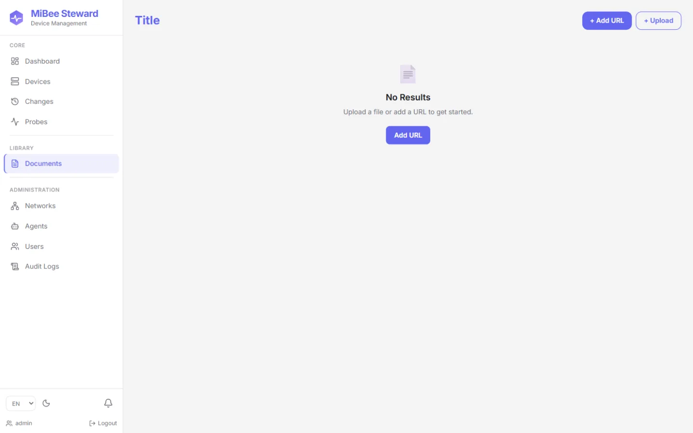

## Next Steps

- [Device Discovery & Identification](discovery.md) — how probe sources, fingerprint rules, and the identification pipeline work
- [Distributed Deployment](distributed.md) — the center + agent architecture in detail
- [Configuration Reference](configuration.md) — every configuration key
