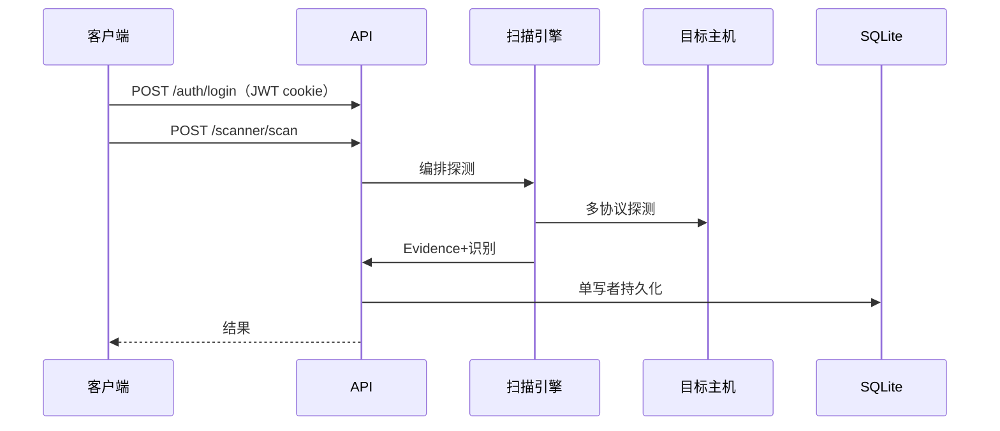

# API 参考

MiBee Steward 设备管理与监控系统（含设备系统、网络扫描、多网段代理、通知与审计）的完整 REST API 文档。

## 目录

- [概览](#概览)
- [认证与账户](#认证与账户)
- [健康检查](#健康检查)
- [用户与网络授权](#用户与网络授权)
- [设备](#设备)
- [设备系统](#设备系统)
- [设备邻居与证书](#设备邻居与证书)
- [设备配置历史](#设备配置历史)
- [网络](#网络)
- [扫描器](#扫描器)
- [凭据](#凭据)
- [代理与命令通道](#代理与命令通道)
- [变更与发现](#变更与发现)
- [拓扑](#拓扑)
- [文档](#文档)
- [文档-设备关联](#文档-设备关联)
- [心跳](#心跳)
- [拨测（Synthetic Probing）](#拨测synthetic-probing)
- [仪表板](#仪表板)
- [通知](#通知)
- [审计日志](#审计日志)
- [指标与服务发现](#指标与服务发现)
- [分页](#分页)
- [速率限制](#速率限制)
- [错误码](#错误码)

## 概览

- **基础 URL**：`/api/v1`（`/metrics`、`/sd` 除外）
- **Content-Type**：`application/json`（文件上传使用 `multipart/form-data`）
- **认证方式**：JWT cookie 优先 + Bearer 头回退（详见 [认证与账户](#认证与账户)）
- **错误信封**：所有错误响应使用 `{"error": "message"}` 格式
- **能力门控**：端点通过能力矩阵（capability matrix）控制访问，而非统一的角色检查（详见 [认证与账户](#认证与账户)）

### 中间件链

每个请求依次经过以下中间件（与源码注册顺序一致）：

```
RequestID → RealIP → Logging → Metrics → Recoverer → CORS → SecurityHeaders → CSRF → 全局限流 → 认证/RBAC（+ 网络范围 / 代理令牌）
```

- `RealIP` 仅在 TCP 对端位于 `server.trusted_proxies`（默认空 = 不信任任何代理）时采信 `X-Forwarded-For`；直接暴露时以 TCP 对端为准。反向代理部署需在配置中声明代理来源段。
- 全局限流默认每 IP 每分钟 600 次；登录端点 10 次/分钟；扫描触发 10 次/分钟（详见 [速率限制](#速率限制)）。

## 认证与账户

认证使用 JWT 令牌，采用 cookie 优先、Bearer 头回退的方式。除公开端点外，所有业务端点都要求认证。

### JWT 流程

1. **登录**：提交凭据获取 JWT 令牌（设置为 HTTP-only cookie）
2. **使用**：后续请求自动通过 cookie 发送令牌
3. **回退**：如果 cookie 不可用，使用 `Authorization: Bearer <token>` 头
4. **过期**：可配置（默认 24 小时）
5. **登出**：按 jti 将当前令牌拉黑至其过期时刻（服务端吊销）并清除 cookie

### 角色与能力

访问控制基于**能力矩阵（capability matrix）**：每个路由组按能力（Capability）门控，角色映射到能力集合，admin 继承全部能力。

| 能力类 | 能力 | 持有角色 |
|--------|------|---------|
| 读取 | `CapDeviceRead` / `CapNetworkRead` / `CapDiscoveryRead` / `CapChangesRead` / `CapTopologyRead` / `CapConfigRead` / `CapHeartbeatRead` / `CapDashboardRead` / `CapDocumentRead` / `CapNotificationRead` / `CapAuditRead` | 任意登录用户（viewer 及以上） |
| 操作 | `CapDeviceWrite` / `CapScanTrigger` / `CapScanManage` / `CapHeartbeatManage` / `CapDocumentWrite` | 操作员及以上（operator+） |
| 管理 | `CapUserManage` / `CapNetworkManage` / `CapCredManage` / `CapAgentManage` / `CapNotificationManage` / `CapDashboardManage` | 管理员（admin） |

> 角色：**admin**（管理员，持有全部能力）、**operator**（操作员，扫描与写入）、**viewer**（只读观察者）、**user**（旧版普通用户）。

### 认证级别


- **公开**：无需认证（健康检查、登录、登出、2FA 校验、`/metrics`、`/sd`）
- **需认证**：有效的 JWT 令牌（任意角色）
- **按能力门控**：持有对应能力的有效 JWT 令牌——读取能力所有登录用户可用，操作能力 operator 及以上，管理能力仅 admin

### TOTP 双因素认证（2FA）

账户支持基于 TOTP 的双因素认证，端点位于 `/api/v1/auth/2fa`（整个 `/auth` 组受登录限流约束）：

| 端点 | 认证 | 说明 |
|------|------|------|
| `POST /api/v1/auth/2fa/verify` | 公开 · 登录限流 | 校验 TOTP 验证码（登录的双因素校验步骤） |
| `POST /api/v1/auth/2fa/setup` | 需认证 | 获取 TOTP 设置（生成密钥 / otpauth URI 等绑定信息） |
| `POST /api/v1/auth/2fa/enable` | 需认证 | 启用 2FA（绑定并确认验证码后） |
| `POST /api/v1/auth/2fa/disable` | 需认证 | 禁用 2FA |
| `GET /api/v1/auth/2fa/status` | 需认证 | 查询当前账户的 2FA 状态 |

### 端点

#### POST /api/v1/auth/login

验证用户并返回 JWT 令牌。

**公开** · **每分钟 10 次请求速率限制**

**请求**：
```json
{
  "username": "string",  // 接受用户名或邮箱
  "password": "string"
}
```

**响应**：
```json
{
  "token": "string",
  "user": {
    "id": 1,
    "username": "admin",
    "email": "admin@example.com",
    "role": "admin",
    "must_change_password": false,
    "created_at": "2023-01-01T00:00:00Z",
    "updated_at": "2023-01-01T00:00:00Z"
  },
  "two_factor_required": false
}
```

每个用户对象都携带 `must_change_password` 标记。已启用 2FA 的账户存在**挑战变体**：密码校验通过后返回 `two_factor_required: true`，此时**不**发放 cookie/token，需继续调用 `POST /auth/2fa/verify` 通过验证后才完成登录。

#### POST /api/v1/auth/register

注册新用户（仅管理员）。

**需管理员** · **每分钟 10 次请求速率限制**

**请求**：
```json
{
  "username": "string",
  "email": "string",
  "password": "string",
  "role": "string"  // 可选，默认为 "user"
}
```

**响应**：
```json
{
  "id": 1,
  "username": "user",
  "email": "user@example.com",
  "role": "user",
  "must_change_password": false,
  "created_at": "2023-01-01T00:00:00Z",
  "updated_at": "2023-01-01T00:00:00Z"
}
```

#### POST /api/v1/auth/logout

用户登出：按 jti 将所出示的令牌拉黑至其过期时刻（服务端吊销，比仅清除 cookie 更强），并清除客户端 cookie。

**公开**（无认证门槛；与整个 `/auth` 组共用登录限流） · **每分钟 10 次请求速率限制**

**响应**：`200 OK` 带 `{"message": "logged out"}`

### 账户自助端点

当前登录用户的资料与密码自助管理（全部需认证）：

| 端点 | 方法 | 认证 | 说明 |
|------|------|------|------|
| `/api/v1/auth/profile` | GET | 需认证 | 获取当前用户资料 |
| `/api/v1/auth/profile` | PUT | 需认证 | 更新资料（`email`，必填） |
| `/api/v1/auth/password` | PUT | 需认证 | 修改密码（`old_password` + `new_password`） |
| `/api/v1/auth/force-password` | PUT | 需认证 | 强制改密（`must_change_password` 置位后的首次改密，仅 `new_password`） |

## 健康检查

### GET /api/v1/health

系统健康检查，包含数据库状态。

**公开**

**响应**：
```json
{
  "status": "ok",
  "db": "ok",
  "version": "v0.1.0"
}
```

`status` 为 `ok` 或 `degraded`（数据库 ping 失败时）。`db` 为 `ok` 或 `error`。`version` 为通过 ldflags 注入的构建版本（未打 tag 的构建为 `dev`）。

## 用户与网络授权

用户管理与网络范围授权（network scope grant）端点。所有端点均要求 **管理员**（`CapUserManage`）。

| 端点 | 方法 | 认证 | 说明 |
|------|------|------|------|
| `/api/v1/users` | GET | 需管理员 | 列出所有用户（分页） |
| `/api/v1/users/batch-delete` | POST | 需管理员 | 批量删除用户 |
| `/api/v1/users/{id}/reset-password` | POST | 需管理员 | 重置指定用户密码 |
| `/api/v1/users/{id}/network-grants` | GET | 需管理员 | 列出某用户被授权的网络集合（闭环模式下的可见范围） |
| `/api/v1/network-grants` | GET | 需管理员 | 列出全部网络授权 |
| `/api/v1/network-grants` | POST | 需管理员 | 创建网络授权（为用户授予指定网络，请求含 `user_id` 与 `network_id`） |
| `/api/v1/network-grants/{id}` | DELETE | 需管理员 | 删除网络授权 |

网络范围授权在**闭环范围模式**（`rbac.scope_default` 为 closed）下生效：用户只能看到被授权网络内的设备、扫描任务与结果；设备级越权访问返回 `403`，扫描任务/运行/结果的越权详情返回 `404`。管理模式见 [配置参考 → 网络范围授权](configuration.md)。

### GET /api/v1/users

列出所有用户。

**需管理员**

**查询参数**：
- `search`：按用户名/邮箱模糊搜索
- `limit`：结果数量（默认：20，最大：100）
- `offset`：分页偏移量

**响应**：
```json
{
  "users": [
    {
      "id": 1,
      "username": "admin",
      "email": "admin@example.com",
      "role": "admin",
      "must_change_password": false,
      "created_at": "2023-01-01T00:00:00Z",
      "updated_at": "2023-01-01T00:00:00Z"
    }
  ],
  "total": 1
}
```

### POST /api/v1/users/{id}/reset-password

重置用户密码（仅管理员）。目标用户下次登录时需要修改密码，同时清除登录锁定状态。

**需管理员**

**请求**：
```json
{
  "new_password": "new-secure-password"
}
```

**响应**：
```json
{
  "message": "password reset successfully"
}
```

## 设备

具有多协议自动发现与身份识别能力的设备登记与管理。

| 端点 | 方法 | 认证 | 说明 |
|------|------|------|------|
| `/api/v1/devices` | GET | 需认证 · `CapDeviceRead` | 列出设备（过滤 + 分页） |
| `/api/v1/devices` | POST | 需认证 · `CapDeviceWrite` | 创建设备 |
| `/api/v1/devices/stats` | GET | 需认证 · `CapDeviceRead` | 设备统计（按状态和类型计数） |
| `/api/v1/devices/export` | GET | 需认证 · `CapDeviceRead` | 导出设备清单 |
| `/api/v1/devices/{id}` | GET | 需认证 · `CapDeviceRead` | 获取设备详情 |
| `/api/v1/devices/{id}` | PUT | 需认证 · `CapDeviceWrite` | 更新设备 |
| `/api/v1/devices/{id}` | DELETE | 需认证 · `CapDeviceWrite` | 删除设备 |
| `/api/v1/devices/batch-delete` | POST | 需认证 · `CapDeviceWrite` | 批量删除设备 |
| `/api/v1/devices/batch-update-status` | POST | 需认证 · `CapDeviceWrite` | 批量更新设备状态 |

设备读/写路径均带**网络范围**（`NetworkScope`）过滤；设备级操作附加 `ValidateDeviceScope` 校验——闭环模式下越权访问返回 `403`（`{"error":"forbidden: device out of network scope"}`）。

### GET /api/v1/devices

列出设备，支持过滤和分页。

**需认证** · `CapDeviceRead`

**查询参数**：
- `status`：按状态过滤（`online`，`offline`，`unknown`）
- `type`：按类型过滤（12 种：`pc`，`server`，`switch`，`router`，`firewall`，`nas`，`camera`，`phone`，`printer`，`embedded`，`iot`，`other`）
- `search`：名称/IP/MAC 等模糊搜索
- `sort` / `order`：排序字段与方向（`asc` / `desc`）
- `created_from` / `created_to`：按创建时间过滤（`YYYY-MM-DD` 或完整时间戳）
- `network_id`：过滤到单个网络（缺省 = 所有网络）
- `limit`：结果数量（默认：20，最大：100）
- `offset`：分页偏移量

**响应**：
```json
{
  "devices": [
    {
      "id": 1,
      "name": "Server-01",
      "type": "pc",
      "brand": "Dell",
      "model": "PowerEdge R740",
      "location": "Data Center A",
      "purpose": "Web Server",
      "description": "Primary web hosting server",
      "status": "online",
      "ip_address": "192.168.1.100",
      "mac_address": "00:1a:2b:3c:4d:5e",
      "serial_number": "DELL123456",
      "purchase_date": "2022-01-15",
      "warranty_expiry": "2025-01-15",
      "tags": "web,primary",
      "scan_attributes": {
        "vendor": "Dell Inc.",
        "oui_prefix": "001A2B",
        "oui_vendor": "Dell Inc.",
        "mac": "00:1a:2b:3c:4d:5e",
        "mac_is_locally_administered": false,
        "mac_is_multicast": false,
        "hostname": "server-01",
        "os": "Linux",
        "inferred_type": "server",
        "inferred_type_source": "protocol",
        "scan_source": "scanner_v2"
      },
      "created_at": "2023-01-01T00:00:00Z",
      "updated_at": "2023-01-01T00:00:00Z"
    }
  ],
  "total": 1
}
```

**`scan_attributes`（引擎写入的扫描发现聚合）** — 每个设备上的 JSON 对象，承载扫描发现的信息。MAC/OUI 相关字段：

| 字段 | 描述 |
|-------|-------------|
| `vendor` | 设备**自报**品牌（经 SNMP sysObjectID / HTTP Server 头 / TLS 证书 CN）；以上都未命中时回落到 OUI 厂商。 |
| `oui_prefix` | MAC 经最长前缀匹配命中的 IEEE 分配块——6 hex（MA-L /24）、7 hex（MA-M /28）或 9 hex（MA-S /36）。未加载 OUI 表或 MAC 未知/本地管理时为空。 |
| `oui_vendor` | `oui_prefix` 对应的 IEEE 注册组织名——**NIC 芯片厂商**，与 `vendor` 分开（OEM/贴牌/虚拟化场景下两者不同）。 |
| `mac` | 规范化小写 MAC（`aa:bb:cc:..`）。 |
| `mac_is_locally_administered` | 中性事实标记：U/L 位（首字节 `& 0x02`）置位——MAC 由本地分配，非 IEEE 块。该位**无法**区分隐私随机化（不稳定）与本地固定设置（稳定），因此仅作观测，**不改变设备身份**。 |
| `mac_is_multicast` | I/G 位（首字节 `& 0x01`）置位——真实设备不应从多播 MAC 发出；数据卫生标记。 |

### GET /api/v1/devices/stats

获取设备统计信息（按状态和类型的计数）。支持可选查询参数 `network_id`（将统计范围限定到单个网络）。

**需认证** · `CapDeviceRead`

**响应**：
```json
{
  "by_status": {
    "online": 5,
    "offline": 2,
    "unknown": 1
  },
  "by_type": {
    "pc": 4,
    "embedded": 2,
    "iot": 1,
    "other": 1
  }
}
```

### GET /api/v1/devices/{id}

根据 ID 获取设备详情。

**需认证** · `CapDeviceRead`

**响应**：与 GET /api/v1/devices 相同，但为单个设备对象。

### POST /api/v1/devices

创建新设备。

**需认证** · `CapDeviceWrite`

**请求**：
```json
{
  "name": "string",
  "type": "string",     // pc, server, switch, router, firewall, nas, camera, phone, printer, embedded, iot, other
  "brand": "string",
  "model": "string",
  "location": "string",
  "purpose": "string",
  "description": "string",
  "ip_address": "string",
  "mac_address": "string",
  "serial_number": "string",
  "purchase_date": "string",
  "warranty_expiry": "string",
  "tags": "string"
}
```

**响应**：`201 Created` 带 DeviceResponse。

### PUT /api/v1/devices/{id}

更新设备（使用指针字段进行部分更新）。

**需认证** · `CapDeviceWrite`

**请求**：
```json
{
  "name": "string",
  "type": "string",
  "brand": "string",
  "model": "string",
  "location": "string",
  "purpose": "string",
  "description": "string",
  "ip_address": "string",
  "mac_address": "string",
  "serial_number": "string",
  "purchase_date": "string",
  "warranty_expiry": "string",
  "tags": "string"
}
```

**响应**：`200 OK` 带 updated DeviceResponse。

### DELETE /api/v1/devices/{id}

删除设备。

**需认证** · `CapDeviceWrite`

**响应**：`200 OK` 带 `{"message": "device deleted"}`

## 设备系统

设备系统管理，用于管理设备上安装的每个系统及其入口 URL 和监控能力。

| 端点 | 方法 | 认证 | 说明 |
|------|------|------|------|
| `/api/v1/devices/{id}/systems` | GET | 需认证 · `CapDeviceRead` | 列出设备的所有系统 |
| `/api/v1/devices/{id}/systems` | POST | 需认证 · `CapDeviceWrite` | 为设备创建新系统 |
| `/api/v1/devices/{id}/systems/{systemId}` | GET | 需认证 · `CapDeviceRead` | 获取系统详情 |
| `/api/v1/devices/{id}/systems/{systemId}` | PUT | 需认证 · `CapDeviceWrite` | 更新系统 |
| `/api/v1/devices/{id}/systems/{systemId}` | DELETE | 需认证 · `CapDeviceWrite` | 删除系统 |

### GET /api/v1/devices/{id}/systems

列出设备的所有系统。

**需认证** · `CapDeviceRead`

**响应**：
```json
{
  "systems": [
    {
      "id": 1,
      "device_id": 1,
      "name": "Web Server",
      "entry_url": "https://app.example.com",
      "description": "Main web application",
      "category": "web_app",
      "metrics_url": "https://app.example.com/metrics",
      "metrics_enabled": true,
      "tags": "primary,web",
      "created_at": "2023-01-01T00:00:00Z",
      "updated_at": "2023-01-01T00:00:00Z"
    }
  ],
  "total": 1
}
```

### POST /api/v1/devices/{id}/systems

为设备创建新系统。

**需认证** · `CapDeviceWrite`

**请求**：
```json
{
  "name": "string",
  "entry_url": "string",
  "description": "string",
  "category": "string",  // web_app, database, middleware, custom
  "metrics_url": "string",
  "metrics_enabled": true,
  "tags": "string"
}
```

**响应**：`201 Created` 带 SystemResponse。

### GET /api/v1/devices/{id}/systems/{systemId}

根据 ID 获取系统详情。

**需认证** · `CapDeviceRead`

**响应**：与 GET /api/v1/devices/{id}/systems 相同，但为单个系统对象。

### PUT /api/v1/devices/{id}/systems/{systemId}

更新系统（使用指针字段进行部分更新）。

**需认证** · `CapDeviceWrite`

**请求**：
```json
{
  "name": "string",
  "entry_url": "string",
  "description": "string",
  "category": "string",
  "metrics_url": "string",
  "metrics_enabled": true,
  "tags": "string"
}
```

**响应**：`200 OK` 带 updated SystemResponse。

### DELETE /api/v1/devices/{id}/systems/{systemId}

删除系统。

**需认证** · `CapDeviceWrite`

**响应**：`200 OK` 带 `{"message": "device system deleted"}`

## 设备邻居与证书

设备详情页的只读数据：L2 邻居与 TLS 证书。

| 端点 | 方法 | 认证 | 说明 |
|------|------|------|------|
| `/api/v1/devices/{id}/neighbors` | GET | 需认证 · `CapDeviceRead` | 列出设备的 L2 邻居（Bridge-MIB / LLDP / CDP / ARP） |
| `/api/v1/devices/{id}/certificates` | GET | 需认证 · `CapDeviceRead` | 列出设备各 TLS 端口的证书链 |

### GET /api/v1/devices/{id}/neighbors

列出设备已发现的 L2 邻居（来自 Bridge-MIB / LLDP / CDP / ARP），供设备详情页邻居面板使用。

**需认证** · `CapDeviceRead`

**响应**：邻居列表（`{ neighbors: [...] }`，含对端 IP/MAC 与发现来源）。

### GET /api/v1/devices/{id}/certificates

列出从设备上每个 TLS 端口采集的证书链，按端口分组。由 v2 扫描器从 TLS 包装的服务（HTTPS、LDAPS、SMTPS、IMAPS、POP3S、FTPS、IRCS、TelnetS）采集；每个端口链中每张证书一行（`cert_index` 0 = 叶/服务器证书，1..N = 上级颁发者）。每次扫描时该端口的链被整体替换。按 `retention.host_tls_certs_days`（默认 30 天）保留。

**需认证** · `CapDeviceRead`（只读）

**响应**：
```json
{
  "certificates": [
    {
      "port": 990,
      "tls_version": "TLS 1.2",
      "cipher_suite": "TLS_ECDHE_RSA_WITH_AES_256_GCM_SHA384",
      "trusted": false,
      "error": "",
      "updated_at": "2026-07-17T23:38:33Z",
      "leaf": {
        "cert_index": 0,
        "subject_cn": "device.example.com",
        "subject_org": "Example Org",
        "subject": "CN=device.example.com,O=Example Org",
        "issuer_cn": "Example CA",
        "issuer_org": "Example CA Ltd",
        "issuer": "CN=Example CA,O=Example CA Ltd,C=US",
        "san_dns": "device.example.com, alt.example.com",
        "san_ip": "192.168.1.112",
        "san_email": "",
        "serial": "665071982890971409216315924781532514095376553279",
        "not_before": "2023-10-29T02:38:14Z",
        "not_after": "2033-10-26T02:38:14Z",
        "sig_algorithm": "SHA256-RSA",
        "key_algorithm": "RSA",
        "key_bits": 2048,
        "is_ca": false,
        "self_signed": false,
        "fingerprint_sha256": "B8A72EE7DF38217D2C037C8927E687921FD8D31B9A0AF2E4E22779B60671F278",
        "pem": "-----BEGIN CERTIFICATE-----\nMIIC4zCCAcsCFHR+...\n-----END CERTIFICATE-----\n"
      },
      "chain": [
        { "cert_index": 0, "subject_cn": "device.example.com", "...": "..." },
        { "cert_index": 1, "subject_cn": "Example CA", "is_ca": true, "...": "..." }
      ]
    }
  ],
  "total": 1
}
```

**字段说明**：
- `tls_version` / `cipher_suite` / `trusted` 是握手元数据，在同一端口链中的每个条目上都相同（描述的是同一次握手）。
- `leaf` 即 `chain[0]`，单独暴露以便一览式渲染；当 `error` 非空时省略。
- `error` 在 TLS 握手失败时非空（如 `not TLS`、`handshake failure`）。这类行仍然返回，便于 UI 显示“已尝试过此端口”而非默默省略。此时 `leaf` 与 `chain` 为空。
- `trusted` 是最佳努力的判定（对系统根证书池做一次验证握手得出），仅用于 UI 徽章，**不影响采集**（自签名证书总会被采集）。
- 设备未记录任何 TLS 端口时返回空 `certificates` 数组，HTTP 仍为 200 —— 应渲染空状态，而非 404。

## 设备配置历史

设备运行配置历史（Oxidized/RANCID 风格），由后台 config-backup 服务写入（`scanner.config_backup.enabled`），端点只读。列表省略 `config_text`，详情与差异按需加载。

| 端点 | 方法 | 认证 | 说明 |
|------|------|------|------|
| `/api/v1/devices/{id}/configs` | GET | 需认证 · `CapConfigRead` | 列出设备的配置历史（不含 `config_text`） |
| `/api/v1/devices/{id}/configs/diff` | GET | 需认证 · `CapConfigRead` | 对比两个配置版本（必填查询参数 `a`、`b` = 配置 ID），返回差异 |
| `/api/v1/devices/{id}/configs/{configId}` | GET | 需认证 · `CapConfigRead` | 获取单个配置版本（含 `config_text`） |

## 网络

网络注册表：标识多网段/多实例部署下的网络（`network_id` 打标与过滤的来源）。读（`CapNetworkRead`）任意登录用户可用；写（`CapNetworkManage`）仅管理员。

| 端点 | 方法 | 认证 | 说明 |
|------|------|------|------|
| `/api/v1/networks` | GET | 需认证 · `CapNetworkRead` | 列出网络 |
| `/api/v1/networks` | POST | 需管理员 · `CapNetworkManage` | 创建网络（请求体含 `name`、`cidr`、`site`） |
| `/api/v1/networks/{id}` | PUT | 需管理员 · `CapNetworkManage` | 更新网络 |
| `/api/v1/networks/{id}` | DELETE | 需管理员 · `CapNetworkManage` | 删除网络 |

本实例自身的网络由配置 `network.name` / `network.cidr` / `network.site` 在启动时自动 upsert 到注册表。

## 扫描器

网络扫描器使用 v2 插件引擎（探测 → 分类 → 处理器 → 持久化），详见 [架构 → 网络扫描器](architecture.md) 与 [指纹识别规则规范](fingerprint-spec.md)。扫描相关端点按能力分档：读（`CapDiscoveryRead`）任意登录用户；触发与任务管理（`CapScanTrigger` / `CapScanManage`）操作员及以上；`add-devices` 需要 `CapDeviceWrite`。闭环模式下，非管理员只能看到被授权网络内的任务/运行/结果，越权详情返回 `404`。

### 认证与扫描时序



### POST /api/v1/scanner/scan

对目标（单 IP、CIDR、范围、逗号列表）执行同步扫描。

**需认证** · `CapScanTrigger` · 扫描限流（默认每 IP 10/分钟）

**请求体**：
```json
{ "targets": "192.168.1.0/24", "community": "public", "timeout": 2 }
```
- `targets`（必填）：IP / CIDR / `a.b.c.d-e` 范围 / 逗号列表
- `community`（默认 "public"）：SNMP community
- `timeout`（默认 2）：每主机 ICMP 超时（秒）
- `credential_id`（可选）：绑定 SNMP 凭据（缺省 0 = 不绑定）

**响应**：`ScanResponse { hosts: [ScanHost], total, alive, duration_ms }`，每个 `ScanHost` 含 `ip`、`alive`、`rtt_ms`、`snmp_*` 变量，以及 `inferred_type` / `inferred_brand`（如 `camera`、`server`、`pc`）。

**持久化**：存活主机经设备桥接（`ApplyReport`）写入 `devices` 表——upsert 设备、为新设备种子心跳配置、记录变更事件——与异步任务共用同一条单写者路径。同步扫描**不**写入原始 `scan_results` / `scan_task_runs` 行（那是异步任务路径的产物）。

**限制**：对 >1024 IP 的目标返回 **413**（请用下方异步任务 API）。若服务器 `write_timeout` 在扫描途中触发则返回 **504**（配置漂移兜底）。

### POST /api/v1/scanner/add-devices

从扫描结果手动添加设备。每个条目经设备桥接 upsert（新建 `devices` 行 + 为新设备种子心跳配置）。

**需认证** · `CapDeviceWrite`

**请求体**：
```json
{ "devices": [ { "ip": "192.168.1.1", "name": "Gateway", "type": "other", "brand": "...", "ports": [...], "services": [...] } ] }
```

**响应**：`{ added: int, errors: [string] }`。当**所有**条目都持久化失败时返回 **422**（`added=0`，`errors` 带各条原因）——请求合法但操作无法应用。

### 扫描任务 API（异步，用于大范围）

| 端点 | 方法 | 认证 | 说明 |
|------|------|------|------|
| `/api/v1/scanner/tasks` | POST | `CapScanManage` | 创建定时扫描任务（cron 驱动；含 `targets`、cron 表达式、超时、并发主机数与可选的 SNMP 凭据 ID） |
| `/api/v1/scanner/tasks` | GET | `CapDiscoveryRead` | 列出任务（分页） |
| `/api/v1/scanner/tasks/{id}` | GET | `CapDiscoveryRead` | 任务详情 |
| `/api/v1/scanner/tasks/{id}` | PUT | `CapScanManage` | 更新任务 |
| `/api/v1/scanner/tasks/{id}` | DELETE | `CapScanManage` | 删除任务 |
| `/api/v1/scanner/tasks/{id}/trigger` | POST | `CapScanTrigger` · 扫描限流 | 异步触发任务（返回 `202` 合成 "triggered" 状态；真实 run 行在扫描启动时创建） |
| `/api/v1/scanner/tasks/{id}/cancel` | POST | `CapScanTrigger` | 取消运行中的扫描（未运行则 `409`） |
| `/api/v1/scanner/tasks/{id}/runs` | GET | `CapDiscoveryRead` | 运行历史 |
| `/api/v1/scanner/tasks/{id}/results` | GET | `CapDiscoveryRead` | 任务每主机结果 |

任务创建（`POST /scanner/tasks`）校验：`name` 与 `targets` 必填；`targets` 上限 **4096 IP**；`cron_expr` 必填且必须为合法 cron 表达式；`timeout` 取值 **1–600** 秒；`concurrent_hosts` 取值 **1–200**；`pipeline_config` 必须通过校验（端口列表等）。校验失败返回 `400`。

### 扫描结果 API

| 端点 | 方法 | 认证 | 说明 |
|------|------|------|------|
| `/api/v1/scanner/results` | GET | `CapDiscoveryRead` | 浏览结果（`task_id`、`ip`、`alive`（`1`/`0`）、`sort`、`order`、`limit`、`offset`） |
| `/api/v1/scanner/results/{id}` | GET | `CapDiscoveryRead` | 单条结果 |
| `/api/v1/scanner/results/export` | GET | `CapDiscoveryRead` | CSV 导出（`task_id`） |
| `/api/v1/scanner/results` | DELETE | `CapScanManage` | 按日期批量删除（`before_date`，RFC3339） |
| `/api/v1/scanner/runs` | GET | `CapDiscoveryRead` | 浏览运行（`task_id`） |
| `/api/v1/scanner/runs/{id}` | GET | `CapDiscoveryRead` | 单次运行 |

## 凭据

扫描用 SNMP 与 SSH 凭据管理。两种凭据的密文都使用 AES-GCM 加密存储（`security.master_key`）；列表与详情响应为**掩码投影**，不包含密钥本身。所有端点仅 **管理员**（`CapCredManage`）可用。

### SNMP 凭据

| 端点 | 方法 | 认证 | 说明 |
|------|------|------|------|
| `/api/v1/snmp-credentials` | POST | 需管理员 · `CapCredManage` | 创建凭据（v1/v2c community 或 v3 USM auth/priv） |
| `/api/v1/snmp-credentials` | GET | 需管理员 · `CapCredManage` | 列出凭据（掩码投影） |
| `/api/v1/snmp-credentials/{id}` | GET | 需管理员 · `CapCredManage` | 获取单个凭据（掩码投影） |
| `/api/v1/snmp-credentials/{id}` | PUT | 需管理员 · `CapCredManage` | 更新凭据 |
| `/api/v1/snmp-credentials/{id}` | DELETE | 需管理员 · `CapCredManage` | 删除凭据 |

### SSH 凭据

| 端点 | 方法 | 认证 | 说明 |
|------|------|------|------|
| `/api/v1/ssh-credentials` | POST | 需管理员 · `CapCredManage` | 创建凭据 |
| `/api/v1/ssh-credentials` | GET | 需管理员 · `CapCredManage` | 列出凭据（掩码投影） |
| `/api/v1/ssh-credentials/{id}` | GET | 需管理员 · `CapCredManage` | 获取单个凭据（掩码投影） |
| `/api/v1/ssh-credentials/{id}` | PUT | 需管理员 · `CapCredManage` | 更新凭据 |
| `/api/v1/ssh-credentials/{id}` | DELETE | 需管理员 · `CapCredManage` | 删除凭据 |

SSH 凭据供设备配置备份探测使用（详见 [设备配置历史](#设备配置历史)）。

## 代理与命令通道

分布式部署中的发现代理（agent）管理与命令下发通道。令牌管理与命令管理端点要求 **管理员**（`CapAgentManage`）；代理数据上报与命令拉取使用**代理令牌**（`RequireAgentToken`）认证——令牌绑定 `agent_id` + `network_id`，上报的每台设备都会被打上该网络标签，多网段数据互不冲突。

| 端点 | 方法 | 认证 | 说明 |
|------|------|------|------|
| `/api/v1/agents/tokens` | POST | 需管理员 · `CapAgentManage` | 创建代理令牌（请求绑定 `agent_id` 与 `network_id`） |
| `/api/v1/agents/tokens` | GET | 需管理员 · `CapAgentManage` | 列出代理令牌 |
| `/api/v1/agents/tokens/{id}/revoke` | POST | 需管理员 · `CapAgentManage` | 吊销代理令牌 |
| `/api/v1/agents/tokens/{id}` | DELETE | 需管理员 · `CapAgentManage` | 删除代理令牌 |
| `/api/v1/agents/report` | POST | 代理令牌 | 代理上报扫描结果（机器到机器；每台设备标记上报来源网络） |
| `/api/v1/agents/commands` | GET | 代理令牌 | 代理拉取待执行命令（pull 模型） |
| `/api/v1/agents/commands/{id}/ack` | POST | 代理令牌 | 确认命令已收到 |
| `/api/v1/agents/commands/{id}/complete` | POST | 代理令牌 | 上报命令执行结果 |
| `/api/v1/agents/{agentId}/commands` | POST | 需管理员 · `CapAgentManage` | 为指定代理创建命令 |
| `/api/v1/agents/commands/all` | GET | 需管理员 · `CapAgentManage` | 查看全部代理命令 |

> 代理令牌认证与用户 JWT 是两套独立的认证体制：`/agents/report` 与 `/agents/commands`（拉取/确认/完成）挂在 `/api/v1/agents` 组下走 `RequireAgentToken`；命令管理与令牌管理走管理员 JWT。

## 变更与发现

变更事件流与被动发现状态。

| 端点 | 方法 | 认证 | 说明 |
|------|------|------|------|
| `/api/v1/changes` | GET | 需认证 · `CapChangesRead` | 变更事件列表（`device_added` / `device_changed` / `device_lost`；可按 `network_id` / `change_type` / `entity_type` 过滤） |
| `/api/v1/changes/watch` | GET | 需认证 · `CapChangesRead` | 实时变更推送（SSE） |
| `/api/v1/discovery/status` | GET | 需认证 · `CapDiscoveryRead` | 被动发现运行状态（事件计数、去重命中、识别触发、记录设备数、活跃源列表；服务未启用时 `enabled=false`） |

变更事件由变更检测引擎写入 `change_log` 表；`/changes/watch` 基于进程内 watcher 实时推送。通知规则引擎订阅同一事件源（见 [通知](#通知)）。

## 拓扑

| 端点 | 方法 | 认证 | 说明 |
|------|------|------|------|
| `/api/v1/topology` | GET | 需认证 · `CapTopologyRead` | 全网络拓扑图：所有设备（节点）+ 全部邻居边 |

## 文档

具有 URL 获取和文件上传功能的文档管理。

| 端点 | 方法 | 认证 | 说明 |
|------|------|------|------|
| `/api/v1/documents` | GET | 需认证 · `CapDocumentRead` | 列出文档 |
| `/api/v1/documents/{id}` | GET | 需认证 · `CapDocumentRead` | 获取文档详情 |
| `/api/v1/documents/{id}/download` | GET | 需认证 · `CapDocumentRead` | 下载文档文件 |
| `/api/v1/documents` | POST | 需认证 · `CapDocumentWrite`（operator+） | 创建 URL 文档 |
| `/api/v1/documents/upload` | POST | 需认证 · `CapDocumentWrite`（operator+） | 上传文件文档（multipart） |
| `/api/v1/documents/{id}` | PUT | 需认证 · `CapDocumentWrite`（operator+） | 更新文档 |
| `/api/v1/documents/{id}` | DELETE | 需认证 · `CapDocumentWrite`（operator+） | 删除文档 |

### GET /api/v1/documents

列出文档。

**需认证** · `CapDocumentRead`

**查询参数**：
- `search`：按标题/描述模糊搜索
- `limit`：结果数量（默认：20，最大：100）
- `offset`：分页偏移量

**响应**：
```json
{
  "documents": [
    {
      "id": 1,
      "title": "Server Manual",
      "type": "file",
      "url": "",
      "file_path": "./data/uploads/server-manual.pdf",
      "file_size": 2048000,
      "mime_type": "application/pdf",
      "description": "Server administration manual",
      "created_at": "2023-01-01T00:00:00Z",
      "updated_at": "2023-01-01T00:00:00Z"
    }
  ],
  "total": 1
}
```

### GET /api/v1/documents/{id}

获取文档详情。

**需认证** · `CapDocumentRead`

**响应**：与 GET /api/v1/documents 相同，但为单个文档对象。

### GET /api/v1/documents/{id}/download

下载文档文件。

**需认证** · `CapDocumentRead`

**响应**：带有适当 content-type 头的文件下载。

### POST /api/v1/documents

创建 URL 文档。

**需认证** · `CapDocumentWrite`（operator 及以上）

**请求**：
```json
{
  "title": "string",
  "type": "url",
  "url": "https://example.com/document",
  "description": "string"
}
```

**响应**：`201 Created` 带 DocumentResponse。

### POST /api/v1/documents/upload

上传文件文档（multipart 表单）。

**需认证** · `CapDocumentWrite`（operator 及以上）

**表单参数**：
- `file`：要上传的文件（默认上限 10 MiB，由 `storage.max_file_size` 配置；反向代理的 `client_max_body_size` 是另一层限制）
- `title`：文档标题
- `description`：文档描述

**响应**：`201 Created` 带 DocumentResponse。

### PUT /api/v1/documents/{id}

更新文档。

**需认证** · `CapDocumentWrite`（operator 及以上）

**请求**：
```json
{
  "title": "string",
  "url": "string",
  "description": "string"
}
```

**响应**：`200 OK` 带 updated DocumentResponse。

### DELETE /api/v1/documents/{id}

删除文档。

**需认证** · `CapDocumentWrite`（operator 及以上）

**响应**：`200 OK` 带 `{"message": "document deleted"}`

## 文档-设备关联

设备与文档之间的关联管理。

| 端点 | 方法 | 认证 | 说明 |
|------|------|------|------|
| `/api/v1/devices/{id}/documents` | GET | 需认证 · `CapDocumentRead` | 获取与设备关联的文档 |
| `/api/v1/devices/{id}/documents` | POST | 需认证 · `CapDocumentWrite`（operator+） | 将文档关联到设备 |
| `/api/v1/devices/{id}/documents/{docId}` | DELETE | 需认证 · `CapDocumentWrite`（operator+） | 解除设备与文档的关联 |
| `/api/v1/documents/{id}/devices` | GET | 需认证 · `CapDocumentRead` | 获取与文档关联的设备 |

### GET /api/v1/devices/{id}/documents

获取与设备关联的文档。

**需认证** · `CapDocumentRead`

**响应**：
```json
{
  "documents": [
    {
      "id": 1,
      "title": "Server Manual",
      "type": "file",
      "url": "",
      "file_path": "./data/uploads/server-manual.pdf",
      "file_size": 2048000,
      "mime_type": "application/pdf",
      "description": "Server administration manual",
      "created_at": "2023-01-01T00:00:00Z",
      "updated_at": "2023-01-01T00:00:00Z"
    }
  ],
  "total": 1
}
```

### POST /api/v1/devices/{id}/documents

将文档关联到设备。

**需认证** · `CapDocumentWrite`（operator 及以上）

**请求**：
```json
{
  "document_id": 1
}
```

**响应**：`201 Created`

### DELETE /api/v1/devices/{id}/documents/{docId}

解除设备与文档的关联。

**需认证** · `CapDocumentWrite`（operator 及以上）

**响应**：`200 OK` 带 `{"message": "document unlinked from device"}`

### GET /api/v1/documents/{id}/devices

获取与文档关联的设备。

**需认证** · `CapDocumentRead`

**响应**：
```json
{
  "devices": [
    {
      "id": 1,
      "name": "Server-01",
      "type": "pc",
      "brand": "Dell",
      "model": "PowerEdge R740",
      "location": "Data Center A",
      "purpose": "Web Server",
      "description": "Primary web hosting server",
      "status": "online",
      "ip_address": "192.168.1.100",
      "mac_address": "00:1A:2B:3C:4D:5E",
      "serial_number": "DELL123456",
      "purchase_date": "2022-01-15",
      "warranty_expiry": "2025-01-15",
      "tags": "web,primary",
      "created_at": "2023-01-01T00:00:00Z",
      "updated_at": "2023-01-01T00:00:00Z"
    }
  ],
  "total": 1
}
```

## 心跳

设备心跳配置与监控。读（`CapHeartbeatRead`）任意登录用户可用；写（`CapHeartbeatManage`）操作员及以上（operator+，非仅管理员）。

| 端点 | 方法 | 认证 | 说明 |
|------|------|------|------|
| `/api/v1/devices/{id}/heartbeat-configs` | GET | 需认证 · `CapHeartbeatRead` | 获取设备心跳配置 |
| `/api/v1/devices/{id}/heartbeat-configs` | POST | 操作员及以上 · `CapHeartbeatManage` | 创建设备心跳配置 |
| `/api/v1/heartbeat-configs/{id}` | PUT | 操作员及以上 · `CapHeartbeatManage` | 更新心跳配置 |
| `/api/v1/heartbeat-configs/{id}` | DELETE | 操作员及以上 · `CapHeartbeatManage` | 删除心跳配置 |
| `/api/v1/devices/{id}/heartbeat-results` | GET | 需认证 · `CapHeartbeatRead` | 设备心跳结果（分页默认 50/最大 500，支持 `start_date`/`end_date` 过滤） |
| `/api/v1/devices/{id}/heartbeat-results/export` | GET | 需认证 · `CapHeartbeatRead` | 导出心跳结果（CSV） |
| `/api/v1/devices/{id}/heartbeat-history` | GET | 需认证 · `CapHeartbeatRead` | 设备心跳历史（**必填** `from`/`to`，RFC3339，`to` > `from`，跨度 ≤ 90 天） |
| `/api/v1/devices/{id}/heartbeat-stats` | GET | 需认证 · `CapHeartbeatRead` | 设备心跳统计（**必填** `from`/`to`，RFC3339，`to` > `from`，跨度 ≤ 90 天） |

### GET /api/v1/devices/{id}/heartbeat-configs

获取设备心跳配置。

**需认证** · `CapHeartbeatRead`

**响应**：
```json
{
  "configs": [
    {
      "id": 1,
      "device_id": 1,
      "method": "icmp",
      "target": "192.168.1.100",
      "interval_seconds": 30,
      "timeout_seconds": 5,
      "snmp_community": "public",
      "snmp_oid": "1.3.6.1.2.1.1.3.0",
      "enabled": 1,
      "created_at": "2023-01-01T00:00:00Z",
      "updated_at": "2023-01-01T00:00:00Z"
    }
  ],
  "total": 1
}
```

### POST /api/v1/devices/{id}/heartbeat-configs

创建设备心跳配置。

**操作员及以上** · `CapHeartbeatManage`

**请求**：
```json
{
  "method": "icmp",
  "target": "192.168.1.100",
  "interval_seconds": 30,
  "timeout_seconds": 5,
  "snmp_community": "public",
  "snmp_oid": "1.3.6.1.2.1.1.3.0",
  "enabled": 1
}
```
- `method`（必填）：`icmp` | `http` | `tcp` | `snmp`
- `target`（必填）：探测目标
- `interval_seconds`（可选，默认 30）：探测间隔（秒）
- `timeout_seconds`（可选，默认 5）：超时（秒）
- `snmp_community`（可选，默认 "public"）：SNMP community
- `snmp_oid`（可选，默认 sysUpTime OID）：SNMP 探测 OID
- `enabled`（可选，默认 1）：是否启用

**响应**：`201 Created` 带 HeartbeatConfigResponse。

### PUT /api/v1/heartbeat-configs/{id}

更新心跳配置（使用指针字段进行部分更新，字段与创建请求同名）。

**操作员及以上** · `CapHeartbeatManage`

**请求**：
```json
{
  "method": "icmp",
  "target": "192.168.1.100",
  "interval_seconds": 30,
  "timeout_seconds": 5,
  "snmp_community": "public",
  "snmp_oid": "1.3.6.1.2.1.1.3.0",
  "enabled": 1
}
```

**响应**：`200 OK` 带 updated HeartbeatConfigResponse。

### DELETE /api/v1/heartbeat-configs/{id}

删除心跳配置。

**操作员及以上** · `CapHeartbeatManage`

**响应**：`200 OK` 带 `{"message": "heartbeat config deleted"}`

### GET /api/v1/devices/{id}/heartbeat-results

获取设备心跳结果。

**需认证** · `CapHeartbeatRead`

**查询参数**：
- `limit`：结果数量（默认：50，最大：500）
- `offset`：分页偏移量
- `start_date` / `end_date`：按检查时间过滤（RFC3339）

**响应**：
```json
{
  "results": [
    {
      "id": 1,
      "device_id": 1,
      "config_id": 1,
      "status": "success",
      "latency_ms": 12,
      "error_message": "",
      "checked_at": "2023-01-01T00:00:00Z"
    }
  ],
  "total": 1
}
```

`status` 取值为 `success` / `fail` / `timeout`；`checked_at` 为 RFC3339 字符串。

## 拨测（Synthetic Probing）

面向外网等显式配置端点的周期探测（blackbox_exporter 模式）：`http` / `tls` / `tcp` / `icmp` 四类模块。`tls` 模块与 https 的 `http` 模块会采集完整证书链（复用扫描器的证书清点能力，`tls` 结果含信任判定与 TLS 版本）。读（`CapProbeRead`）任意登录用户可用；写（`CapProbeManage`）操作员及以上。

| 端点 | 方法 | 认证 | 说明 |
|------|------|------|------|
| `/api/v1/probe-targets/` | GET | 需认证 · `CapProbeRead` | 拨测目标列表（`limit`/`offset`/`search` 分页搜索） |
| `/api/v1/probe-targets/` | POST | 操作员及以上 · `CapProbeManage` | 创建拨测目标 |
| `/api/v1/probe-targets/{id}` | GET | 需认证 · `CapProbeRead` | 获取单个目标 |
| `/api/v1/probe-targets/{id}` | PUT | 操作员及以上 · `CapProbeManage` | 更新目标（部分更新，nil 字段保持不变） |
| `/api/v1/probe-targets/{id}` | DELETE | 操作员及以上 · `CapProbeManage` | 删除目标（连同历史结果与已存证书链） |
| `/api/v1/probe-targets/{id}/trigger` | POST | 操作员及以上 · `CapProbeManage` | 立即拨测（同步执行，返回本次探测结果） |
| `/api/v1/probe-targets/{id}/results` | GET | 需认证 · `CapProbeRead` | 探测历史（`limit`/`offset`，新到旧） |
| `/api/v1/probe-targets/{id}/certificates` | GET | 需认证 · `CapProbeRead` | 当前证书链（响应形状与设备证书端点一致） |

### POST /api/v1/probe-targets/

创建拨测目标。

**操作员及以上** · `CapProbeManage`

**请求**：
```json
{
  "name": "github-tls",
  "module": "tls",
  "target": "github.com:443",
  "interval_seconds": 60,
  "timeout_seconds": 10,
  "notes": "",
  "enabled": true
}
```
- `name`（必填，全局唯一）：目标名称（同时是 Prometheus 指标 label）
- `module`（必填）：`http` | `tls` | `tcp` | `icmp`
- `target`（必填）：按模块校验——`http` 须为完整 http(s) URL；`tls`/`tcp` 须为 host:port（端口 1–65535）；`icmp` 须为纯主机名或 IP
- `interval_seconds`（可选，默认 60）：探测间隔，10–86400 秒
- `timeout_seconds`（可选，默认 10）：单次探测超时，1–60 秒，须小于间隔
- `notes`（可选，≤500 字符）、`enabled`（可选，默认 true）

**响应**：`201 Created` 带 ProbeTargetResponse（含 `last_run_at`/`last_status`/`last_latency_ms`/`last_error` 去规范化最新结果，空 = 尚未探测）。

### POST /api/v1/probe-targets/{id}/trigger

立即执行一次探测（与调度引擎互斥防重入；受目标 `timeout_seconds` 约束）。

**操作员及以上** · `CapProbeManage`

**响应**：本次探测结果（ProbeResultResponse）：
```json
{
  "target_id": 1,
  "status": "success",
  "latency_ms": 75.09,
  "status_code": 0,
  "error_message": "",
  "tls_version": "TLS 1.2",
  "cert_not_after": "2027-01-24T02:32:55Z",
  "cert_trusted": true,
  "checked_at": "2026-08-19T06:30:22Z"
}
```
`status` 取值 `success` / `fail` / `timeout`（拨测错误串含超时特征时归为 timeout）；`status_code` 仅 http 模块非零；证书字段仅在采集到证书时有值（`cert_trusted` 为 `null` 表示该轮未采集）。

### GET /api/v1/probe-targets/{id}/certificates

目标当前证书链（叶证书 + 中间/根，含 SAN/序列号/指纹/PEM/握手元数据）。采集失败时保留上一条已知良好链；无任何证书时返回空数组（200）。响应的 `certificates[]` 与 `GET /api/v1/devices/{id}/certificates` 同构（每目标单端口一条）。

相关指标：`mibee_probe_up{name,module}`、`mibee_probe_duration_seconds`、`mibee_probe_cert_expiry_timestamp_seconds`、`mibee_probe_checks_total{status,module}`（见[指标与服务发现](#指标与服务发现)）。

## 仪表板

Prometheus 数据源的仪表板配置与查询透传。读（`CapDashboardRead`，网络范围过滤）任意登录用户可用；配置管理（`CapDashboardManage`）仅管理员。

| 端点 | 方法 | 认证 | 说明 |
|------|------|------|------|
| `/api/v1/dashboard/configs` | GET | 需认证 · `CapDashboardRead` | 列出仪表板面板配置 |
| `/api/v1/dashboard/configs` | POST | 需管理员 · `CapDashboardManage` | 创建面板配置 |
| `/api/v1/dashboard/configs/{id}` | PUT | 需管理员 · `CapDashboardManage` | 更新面板配置 |
| `/api/v1/dashboard/configs/{id}` | DELETE | 需管理员 · `CapDashboardManage` | 删除面板配置 |
| `/api/v1/dashboard/overview` | GET | 需认证 · `CapDashboardRead` | 总览统计（设备/系统/网络计数） |
| `/api/v1/dashboard/query` | GET | 需认证 · `CapDashboardRead` | Prometheus 即时查询透传 |
| `/api/v1/dashboard/query_range` | GET | 需认证 · `CapDashboardRead` | Prometheus 范围查询透传 |

### GET /api/v1/dashboard/configs

列出仪表板面板配置。

**需认证** · `CapDashboardRead`

**响应**：
```json
{
  "configs": [
    {
      "id": 1,
      "name": "CPU Usage",
      "type": "line",
      "data_source": "prometheus",
      "query": "100 - (avg by (instance) (rate(node_cpu_seconds_total{mode=\"idle\"}[5m])) * 100)",
      "refresh_interval": 30,
      "position": "{\"col\":1,\"row\":1}",
      "created_at": "2023-01-01T00:00:00Z",
      "updated_at": "2023-01-01T00:00:00Z"
    }
  ],
  "total": 1
}
```

`position` 为 JSON **字符串**（面板布局坐标），不是对象。

### POST /api/v1/dashboard/configs

创建仪表板面板配置。

**需管理员** · `CapDashboardManage`

**请求**：
```json
{
  "name": "CPU Usage",
  "type": "line",
  "data_source": "prometheus",
  "query": "100 - (avg by (instance) (rate(node_cpu_seconds_total{mode=\"idle\"}[5m])) * 100)",
  "refresh_interval": 30,
  "position": "{\"col\":1,\"row\":1}"
}
```
- `name`（必填）：面板名称
- `type`（必填）：`gauge` | `line` | `bar` | `pie`
- `data_source`（可选，默认 "prometheus"）：数据源类型
- `query`（可选）：查询表达式
- `refresh_interval`（可选，默认 30）：刷新间隔（秒）
- `position`（可选，默认 "{}"）：布局坐标（JSON 字符串）

**响应**：`201 Created` 带 DashboardConfigResponse。

### GET /api/v1/dashboard/query

向配置的 Prometheus 数据源透传**即时查询**。等价于 Prometheus HTTP API 的 `GET /api/v1/query`，但仅透传 `query` 与 `time` 两个参数（其余参数不透传）。

**需认证** · `CapDashboardRead`

**查询参数**：
- `query`（必填）：PromQL 表达式
- `time`（可选）：评估时间戳（RFC3339 或 Unix 秒；缺省为服务器当前时间）

**响应**：Prometheus `query` 响应信封（`status` / `data`）。

### GET /api/v1/dashboard/query_range

向配置的 Prometheus 数据源透传**范围查询**。等价于 Prometheus HTTP API 的 `GET /api/v1/query_range`，但仅透传 `query`、`start`、`end`、`step` 四个参数（其余参数不透传）。

**需认证** · `CapDashboardRead`

**查询参数**：
- `query`（必填）：PromQL 表达式
- `start` / `end`（必填）：范围起止时间戳（RFC3339 或 Unix 秒）
- `step`（必填）：步长（持续时间格式，如 `15s`）

**响应**：Prometheus `query_range` 响应信封（`status` / `data`，含 `resultType: matrix`）。

## 通知

告警通知渠道与规则管理。规则基于能力矩阵（`CapNotificationManage`）——默认管理员；渠道为同能力，`PATCH` 用于启用/禁用。日志端点任意登录用户可读。

### 通知渠道

| 端点 | 方法 | 认证 | 说明 |
|------|------|------|------|
| `/api/v1/notification/channels` | POST | 需管理员 · `CapNotificationManage` | 创建渠道 |
| `/api/v1/notification/channels` | GET | 需管理员 · `CapNotificationManage` | 列出渠道 |
| `/api/v1/notification/channels/{id}` | GET | 需管理员 · `CapNotificationManage` | 渠道详情 |
| `/api/v1/notification/channels/{id}` | PUT | 需管理员 · `CapNotificationManage` | 更新渠道 |
| `/api/v1/notification/channels/{id}` | PATCH | 需管理员 · `CapNotificationManage` | 启用/禁用渠道 |
| `/api/v1/notification/channels/{id}` | DELETE | 需管理员 · `CapNotificationManage` | 删除渠道 |
| `/api/v1/notification/channels/{id}/test` | POST | 需管理员 · `CapNotificationManage` | 发送测试通知 |

### 通知规则

| 端点 | 方法 | 认证 | 说明 |
|------|------|------|------|
| `/api/v1/notification/rules` | POST | 需管理员 · `CapNotificationManage` | 创建规则 |
| `/api/v1/notification/rules` | GET | 需管理员 · `CapNotificationManage` | 列出规则 |
| `/api/v1/notification/rules/{id}` | GET | 需管理员 · `CapNotificationManage` | 规则详情 |
| `/api/v1/notification/rules/{id}` | PUT | 需管理员 · `CapNotificationManage` | 更新规则 |
| `/api/v1/notification/rules/{id}` | PATCH | 需管理员 · `CapNotificationManage` | 启用/禁用规则 |
| `/api/v1/notification/rules/{id}` | DELETE | 需管理员 · `CapNotificationManage` | 删除规则 |

### 通知日志

| 端点 | 方法 | 认证 | 说明 |
|------|------|------|------|
| `/api/v1/notification/logs` | GET | 需认证 | 通知发送日志（分页） |
| `/api/v1/notification/logs/read` | POST | 需认证 | 将通知日志标记为已读 |

## 审计日志

审计日志追踪用户行为（登录/登出、设备 CRUD、配置变更等）。只读端点任意登录用户可读（`CapAuditRead`）。

| 端点 | 方法 | 认证 | 说明 |
|------|------|------|------|
| `/api/v1/audit-logs` | GET | 需认证 · `CapAuditRead` | 查询审计日志（按时间/用户/动作过滤，分页） |
| `/api/v1/audit-logs/facets` | GET | 需认证 · `CapAuditRead` | 审计日志维度聚合（时间直方图、动作/用户/实体计数，用于筛选器） |
| `/api/v1/audit-logs/export` | GET | 需认证 · `CapAuditRead` | 导出审计日志（CSV） |

## 指标与服务发现

以下端点不位于 `/api/v1` 前缀下，且**不需要认证**：

| 端点 | 说明 |
|------|------|------|
| `GET /metrics` | Prometheus 指标抓取端点（HTTP 请求计数器/直方图，由 Metrics 中间件写入） |
| `GET /sd` | Prometheus HTTP SD 文件内容（已注册设备的 IP 与标签，供 Prometheus 服务发现） |

## 分页

列表端点使用 `limit` 与 `offset` 查询参数：

- `limit`：结果数量（默认：20，最大：100——适用于设备/用户/文档/扫描结果）
- `offset`：分页偏移量（默认：0）

例外：变更列表（`/changes`）默认 50 / 最大 200；心跳结果（`/heartbeat-results`）默认 50 / 最大 500。

响应为 `{ "<items>": [...], "total": <int> }` 信封，`total` 为过滤后的总数。

## 速率限制

| 限制 | 默认值 | 作用于 |
|------|--------|--------|
| 全局限流 | 600 次/分钟/IP | 所有端点（`rate_limit.global_per_minute`） |
| 登录限流 | 10 次/分钟/IP | `/api/v1/auth/*`（含 2FA 校验，`rate_limit.login_per_minute`） |
| 扫描限流 | 10 次/分钟/IP | `POST /scanner/scan` 与 `POST /scanner/tasks/{id}/trigger`（`rate_limit.scan_per_minute`） |

- 扫描限流在能力门控之后生效——权限不足的请求（403）**不消耗**配额。
- 超限返回 `429 Too Many Requests`。
- 数值可通过配置调整，详见 [配置参考](configuration.md)。

## 错误码

| 状态码 | 含义 |
|--------|------|
| `400` | 请求体或查询参数无效 |
| `401` | 未认证或令牌无效/过期 |
| `403` | 认证成功但能力不足；闭环范围模式下访问范围外设备同样返回 403（`forbidden: device out of network scope`） |
| `404` | 资源不存在（闭环范围模式下，越权的扫描任务/运行/结果同样返回 404，避免存在性泄露） |
| `409` | 状态冲突（如取消未在运行中的扫描任务） |
| `413` | 目标范围过大（如 >1024 IP 的同步扫描） |
| `422` | 请求合法但操作无法应用（如 `add-devices` 中所有条目均持久化失败） |
| `429` | 超出速率限制；连续 5 次登录失败触发 30 分钟账户锁定时同样返回 `429 "account is temporarily locked"` |
| `500` | 服务器内部错误 |
| `502` / `504` | 上游不可达（如 Prometheus 查询透传失败 / 扫描超时兜底） |

