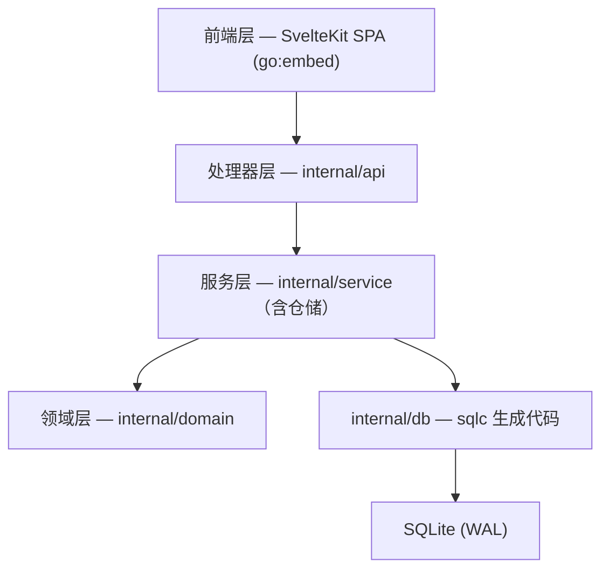
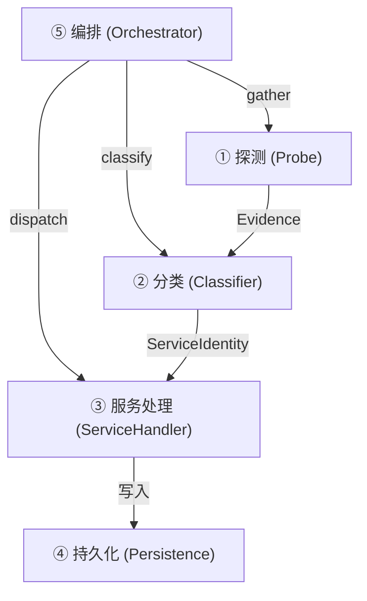
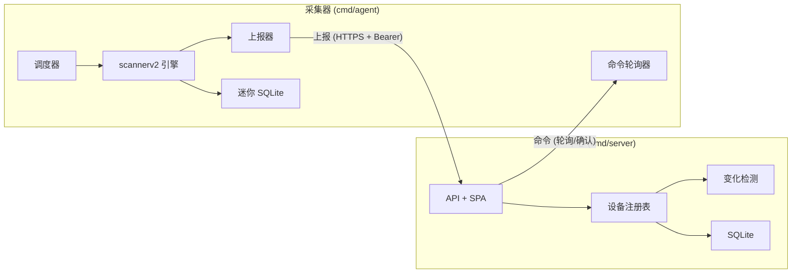

# 架构总览

## 系统概览

MiBee Steward 是一个设备管理和监控系统，以**单二进制**方式部署。Go 后端（Chi Web 框架 + SQLite）通过 `go:embed` 嵌入 SvelteKit 5 前端。这种零依赖形态意味着 Linux 上一个 `mibee-steward` 二进制文件就是整个技术栈——无需运行时、无需容器、无需边车。

典型部署中由反向代理（Nginx）前置，将请求转发给 Chi 路由器；请求依次穿过中间件链、处理器与服务层，最终写入 SQLite。

## 分层架构

后端采用分层架构；数据仓储（DeviceRepository / DeviceSystemRepository / AuditRepository）与消费者同包共存于服务层，没有独立的仓储包：

**领域层（internal/domain）**：业务模型、DTO、常量、能力（RBAC）定义、用于请求追踪的上下文键、类型化错误定义。

**服务层（internal/service）**：业务逻辑、错误处理、scannerv2 扫描引擎、心跳/通知/审计等子系统的仓储。基于构造函数的依赖注入；类型化错误。**章程**：变更型处理器必须走服务层，只读透传处理器可直接用 sqlc。

**处理器层（internal/api）**：HTTP 请求/响应处理、输入验证、审计日志、错误→状态码转换。`routes.go` 注册全部路由（约 40 个处理器文件 / 110+ 端点）与中间件链。

### 请求生命周期

1. HTTP 请求 → Chi 路由器 → 中间件链
2. 中间件：`RequestID → RealIP → Logging → Metrics → Recoverer → CORS → SecurityHeaders → CSRF → RateLimit → Auth/RBAC`（网络范围端点另有 scope 中间件；采集器端点使用 `agent_auth` bearer 认证）
3. 处理器：验证 → 审计日志 → 调用服务
4. 服务 → sqlc → SQLite
5. 响应沿链路返回

### 前端

SvelteKit 5 SPA，通过 `web/embed.go`（`//go:embed all:dist`）嵌入。Tailwind 4 样式，ECharts 图表，`@inlang/paraglide-js` 国际化（中英双语）。基于文件的路由位于 `web/src/routes/`；共享组件位于 `web/src/lib/components/`。

### 数据库

SQLite（`modernc.org/sqlite` 纯 Go 驱动，CGO-free），WAL 模式，主连接池 `MaxOpenConns=16`（`busy_timeout=5000`）。心跳结果写入**独立的** SQLite 文件 `data/heartbeat.db`（单连接、批量写），避免高频探测记录与主库竞争。sqlc 从 `db/queries/*.sql` 生成类型安全的 Go 代码。默认路径：`./data/mibee.db`。**迁移在启动时自动执行**：嵌入的 `schema.sql`（`CREATE TABLE IF NOT EXISTS`）+ 幂等的 `ALTER TABLE`/表重建，存量库迁移前自动做 `VACUUM INTO` 备份。切勿直接编辑 `internal/db/*.go`——修改 SQL 后重新生成。

## 扫描引擎 v2

扫描器采用**插件式五层架构**，将检测与持久化解耦。新增协议只需注册一个分类器 + 一个处理器——无需改动编排层或持久化层。

- **① 探测 (Probe)**：主动（TCP/SNMP/RTSP/ONVIF/HTTP-metrics）+ 被动（eBPF TC 观测器，位于 `WITH_EBPF` 构建标签之后）→ 产出 Evidence（port_open / banner / snmp / …）。
- **② 分类 (Classifier)**：每协议一个，对 Evidence 的纯函数 → 融合成 ServiceIdentity（ssh/http/rtsp/onvif/prometheus/node_exporter/snmp/camera），带置信度。
- **③ 服务处理 (ServiceHandler)**：按服务定制，实现 `GenerateHeartbeat()` / `Collect()` / `EnrichDevice()`。共注册 29 个服务处理器（其中 8 个为 TLS 包装服务的证书采集器）。
- **④ 持久化 (Persistence)**：Repository 接口 → SQLite，记录 evidence / services / 设备更新 / 心跳。
- **⑤ 编排 (Orchestrator)**：声明式 gather → classify → dispatch，级联触发带环保护（最大深度 5）。

典型级联：http → 探测 `/metrics` → prometheus → node_exporter → 解析 CPU/内存/内核 → 补充设备字段。

### 探测源分类

| 类别 | 来源 | 所需条件 | 产出 |
|---|---|---|---|
| 主动 | ICMP ping | 网络可达性 | echo/reply、RTT |
| 主动 | TCP 端口扫描 | 目标 IP + 端口 | port_open、banner 文本 |
| 主动 | SNMP Get（8 标量 OID） | UDP/161、community/凭据 | sysDescr、sysObjectID 等系统信息（v1/v2c + v3 USM） |
| 主动 | RTSP OPTIONS | RTSP 端口（554/8554） | rtsp_banner、Server 头 |
| 主动 | ONVIF SOAP 探测 | TCP 单播（已发现端口/80/8080） | onvif_response、设备元数据 |
| 主动 | HTTP 探测 | HTTP/HTTPS 端口 | Server 头、/metrics 可用性 |
| 主动 | TLS 证书链 | TLS 端口 | 完整证书链 |
| 主动 | mDNS / SSDP / rDNS / SMB | UDP 5353/1900、DNS、TCP 139/445 | 服务名、主机名、IP→MAC 补充 |
| 主动 | ARP 缓存 | 本地 `/proc/net/arp` | IP→MAC 映射（同子网） |
| 主动 | LLDP-MIB / CDP-MIB / Bridge-MIB / Q-BRIDGE-MIB / STP-MIB / IF-MIB | 支持 SNMP 的交换机 | 邻居关系、MAC→端口、VLAN、STP 角色、端口名 |
| 被动（主机本地） | arp_cache / multicast / router_arp | 本地主机（`scanner.discovery.enabled` 开启） | 内核 ARP 差分、mDNS/SSDP 监听、路由器 ARP 表 |
| 被动（eBPF） | eBPF TC 观测器 | 内核 ≥5.8、`WITH_EBPF` 构建标签 | ONVIF/WS-Discovery 多播 + TCP 魔术字节（置信度 0.6） |
| 路由器驻留 Tier-1 | dhcp_leases | 仅在网关上运行（默认关闭） | dnsmasq 租约表 |
| 路由器驻留 Tier-1 | conntrack | 仅在网关上运行（默认关闭） | `/proc/net/nf_conntrack` 活跃流 |
| 路由器驻留 Tier-1 | hostapd | 仅在网关上运行（默认关闭） | Wi-Fi 客户端关联 |
| 路由器驻留 Tier-1 | dns_log | 仅在网关上运行（默认关闭） | dnsmasq 查询日志 |

被动源（eBPF + 主机本地）默认关闭；路由器驻留 Tier-1 源仅在二进制直接部署于网关时才可运行，默认关闭需手动启用。详见[设备发现与识别](discovery.md)。

### 开箱即用的服务识别

SSH、HTTP/HTTPS、RTSP、ONVIF、SNMP、Prometheus、node\_exporter、邮件（SMTP/POP3/IMAP）、远程访问（VNC/RDP/Telnet）、目录与文件共享（LDAP/SMB）、DNS、**数据库**（MySQL/PostgreSQL/Redis/MongoDB/MSSQL/Memcached）、TLS 包装服务家族（LDAPS、SMTPS、IMAPS、POP3S、FTPS、IRCS、TelnetS），以及主机级 **camera** 元身份（由 RTSP + ONVIF 证据融合得出，支持从 Server 头 / SNMP sysDescr / 企业 OID / TLS 证书 CN 推断品牌）。

### TLS 证书清点

任何被分类为 TLS 服务的端口（默认端口 443/8443/9443/4443 + 知名 TLS 包装端口 465/636/989/990/992/993/994/995 + 分类器识别的任意端口）都通过 `probe.CollectCertChain` 采集完整证书链并写入 `host_tls_certs`——Subject/Issuer/SAN/有效期/签名/密钥/指纹 + PEM，链中每张证书一行。通过 `GET /api/v1/devices/{id}/certificates` 对外展示。

### 持久化表（v2 新增）

| 表 | 内容 |
|---|---|
| `service_evidence` | 原始探测观测（受采样控制） |
| `host_services` | 每主机的已分类服务身份 |
| `host_tls_certs` | 每 `(ip, port)` 的 TLS 证书链，每张证书一行；`not_after` 建索引 |
| `device_neighbors` | LLDP/CDP/Bridge/Q-BRIDGE 探测的原始邻居关系 |
| `topology_edges` | 物化的设备↔设备拓扑边 |
| `subnets` / `vlans` | 每网络 CIDR/网关、802.1Q VLAN |

设备 upsert 写入既有 `devices` 表；心跳配置写入 `heartbeat_configs`；SNMPv3/SSH 凭据（AES-256-GCM 加密）写入 `snmp_credentials` / `ssh_credentials`；设备配置备份版本写入 `device_configs`。

## 设备身份与持久化

### MAC 优先身份

设备首先按 **MAC 地址**去重（漫游设备跨网络保持单一资产），无 MAC 时退回 `(ip_address, network_id)` 复合键：

- 两个不同 LAN 上的相同私网 IP → **两个不同设备**（按 `network_id` 分区）。
- 相同 MAC、不同 IP（跨子网移动）→ **单一资产**。
- `(ip_address, network_id)` 复合唯一索引支撑此分区逻辑。

**MAC 位标记**（仅观测）：`mac_is_locally_administered`（U/L 位）和 `mac_is_multicast`（I/G 位）以中性事实标记记录在 `scan_attributes` 中。两者都不改变设备身份。

**OUI 厂商推断**：OUI 加载器（`internal/service/scannerv2/vendor/`）按**最长前缀匹配**解析 MAC 到 IEEE 注册厂商，跨三档注册表：MA-S（/36）→ MA-M（/28）→ MA-L（/24）。结果记为 `scan_attributes.oui_prefix` + `oui_vendor`（NIC 芯片厂商），与 `vendor`（设备自报品牌，经 SNMP/HTTP/TLS）**分开**。开箱即用：内嵌精简 CC-BY-SA 厂商表；完整 IEEE 数据集可通过 `scripts/fetch-oui.sh` 可选下载（`scanner.oui_path`）。

### 单写者漏斗（v0.2.0）

所有设备写入经由 `runner.applyDeviceBridge`——单一写入者并发模型，防止并发探测处理器之间的竞态条件（并行扫描结束后顺序执行桥接）。与 MAC 优先身份一起于 v0.2.0 落地。

### 设备替换检测

当扫描发现 MAC 与已有记录匹配但关键属性差异显著（如不同 IP 范围、不同服务）的设备时，系统检测到**替换**事件：IP 持有者胜出，旧 MAC 行标记为离线，差异写入 `change_log`。

### 网络对账漂移任务

`internal/service/scannerv2/reconcile` 提供网络对账任务（`scanner.reconcile_interval`，默认 1h）：定期对账网络范围内设备的 CIDR 归属，仅做**检测与呈现**（detect-and-surface，`mibee_network_mismatches` 指标），不自动修改设备记录。

### 变化检测引擎

中心对每次扫描与已知设备状态做差分，产生事件写入 `change_log`：

| 事件 | 触发条件 |
|---|---|
| `device_added` | 扫描中发现新设备 |
| `device_changed` | 被追踪字段不同（type、brand、MAC、端口、服务、scan\_attributes）。逐字段比较，`scan_attributes` 归一化（剥离易变键、规范 key 顺序），纯时间戳刷新不触发虚假事件。`after_data` = 变更后完整设备快照。 |
| `device_lost` | 连续 `lostThreshold`（2）次扫描未出现。grace period 防止单次扫描抖动误报。 |
| `device_recovered` | 此前判定丢失的设备重新出现。与 `device_lost` 共享 liveness 冷却桶（防抖）。 |
| `device_config_changed` | 配置备份 sweep 拉到的 running-config 与上一版本哈希不同（见下节）。 |

事件查询：`GET /api/v1/changes`，SSE 推送：`GET /api/v1/changes/watch`，Prometheus 计数器：`mibee_changes_total{type}`。

存活噪声控制：在线/离线判定采样进 `device_liveness` 时间序列（位于心跳存储），而不是每次翻转都发一条 `device_changed`——登记保持鲜活的同时不淹没真实变更。

### 设备配置备份

`internal/service/scannerv2/configbackup` 运行按需启用的 sweep（`scanner.config_backup`，默认 6h）：选取绑定了 SSH 凭据的路由器/交换机/防火墙设备，经 SSH 拉取 running-config（厂商命令矩阵；host-key TOFU），与上一版本计算 unified diff（`internal/configdiff`），仅内容变化时记录新的 `device_configs` 版本——并向上面的变化检测管线发出 `device_config_changed`。SSH 凭据存于 `ssh_credentials`，与 SNMPv3 口令共用 AES-256-GCM master-key 加密。

### 拨测（探测目标）

`internal/service/probetarget` 对显式配置的**外部**端点（公开 HTTPS 站点、托管 TLS 端口）按目标自身间隔探测（10s tick 重读目标——CRUD 免重启生效；到期时间从 `last_run_at` 恢复；8 并发上限）。http/tcp/icmp 模块复用心跳探测器；tls（与 https）调用 `CollectCertChain`，内网证书链清点因此延伸到互联网主机。表：`probe_targets` / `probe_results` / `probe_tls_certs`；指标 `mibee_probe_*`。

## 心跳与状态

`HeartbeatService` 在后台 goroutine 中以 30 秒计时器运行：

| 配置键 | 默认值 | 说明 |
|---|---|---|
| `heartbeat.default_interval` | 30 | 设备检查间隔（秒） |
| `heartbeat.tick_interval_seconds` | 30 | 探测循环节拍（秒） |
| `heartbeat.timeout` | 5 | 探测超时（秒） |
| `heartbeat.offline_threshold` | 5 | 连续失败 N 次判定离线 |
| `heartbeat.offline_backoff_ticks` | 10 | 离线设备每 N 个 tick 才探测一次（30s ticker 下约 5 分钟），避免对不会响应的设备持续写入超时记录。恢复扫描立即清除失败计数，不延迟恢复。0 禁用退避。 |

结果保留由 `retention.heartbeat_results_days` 控制（默认 7 天；`heartbeat.retention_days` 为旧键回退）。

**服务生命周期**：`NewRouter() → HeartbeatService.Start() → goroutine → 信号等待 → 优雅关闭`。

## 分布式模型

MiBee Steward 支持中心 + 采集器部署：**中心**（`cmd/server`）汇聚多个**采集器**（`cmd/agent`）的设备数据，每个采集器部署在不同的局域网段。详见[分布式部署](distributed.md)。

| 角色 | 二进制 | 职责 |
|---|---|---|
| **中心** | `cmd/server` | 汇聚枢纽：API、SPA、设备注册表、变化检测、心跳、接收上报、采集器管理 |
| **采集器** | `cmd/agent` | 轻量扫描器：本地运行 scannerv2 发现引擎（网关形态上报被动发现）、上报结果、轮询命令 |

**拉取模型**——采集器发起所有连接（适配 NAT 后部署）：

1. **上报**（`POST /api/v1/agents/report`）：批量 HostReport，MAC 优先合并。
2. **命令轮询**（`GET /api/v1/agents/commands`，令牌即身份）：每 60 秒；ack/complete 各自独立调用。
3. **断线补报**：失败批次存内存（上限 100 批），恢复后按序补报；终结性 4xx 直接丢弃。

**反熵**：采集器上报携带 `X-Network-State-Hash`（存活设备集合身份/分类字段的 SHA-256 哈希），中心据此检测漂移。**租约 TTL**：采集器令牌绑定 `network_id` + `agent_id`；租约 TTL 丢失检测（默认 5 分钟），吊销为软删除（`revoked_at`）。

## 可观测性

**指标**：`/metrics`——标准 Prometheus 端点。Counter、Gauge、Histogram 覆盖系统指标。

**服务发现**：`/sd`——HTTP SD 端点，用于 Prometheus 抓取配置和设备系统自动发现（`metrics_enabled=true`）。

**仪表板代理**：`/api/v1/dashboard/query`——对 Prometheus 的只读代理。

**保留清除器**（`internal/service/scannerv2/cleanup/`）：定期裁剪高频详情表。批量删除（默认 5000 行）避免长时间持有 SQLite 写锁。启动时 + 每 `sweep_interval_hours`（默认 6）执行一次。**静默设备清理**：持续无 MAC 设备 24 小时（`retention.silent_device_hours_no_mac`）/ 有 MAC 设备 7 天（`retention.silent_device_days_mac`）未再被发现即物理删除并记录 `device_removed`——扫描发现是登记的入口，长期扫不到的行会被回收。

| 表 | 默认保留 |
|---|---|
| `heartbeat_results` | 7 天 |
| `scan_results` | 30 天 |
| `scan_task_runs` | 30 天 |
| `service_evidence` | 14 天 |
| `host_services` | 30 天 |
| `host_tls_certs` | 30 天 |
| `change_log` | 30 天 |
| `device_neighbors` | 90 天 |
| `device_liveness` | 7 天 |
| `notification_log` | 30 天 |
| `audit_logs` | 90 天 |

## 后台任务一览

`NewRouter()` 启动的常驻 goroutine（优雅关闭时按依赖序停止）：

| 任务 | 周期 | 职责 |
|---|---|---|
| 心跳探测循环 | 30s tick | 轮询到期设备，写判决 |
| 令牌黑名单清理 | 定期 | 清理过期 JWT 黑名单 |
| v2 扫描调度器 | cron | 按 `scan_tasks` 触发扫描 + 失联 run 清扫 |
| 租约清扫器（LeaseSweeper） | 60s | 采集器网络的租约过期 → `device_lost` |
| 保留清除器 | 6h | 上表的批量裁剪 |
| 配置备份 sweep | 6h（可配） | SSH 拉取 running-config → `device_configs` 版本 |
| 拨测引擎 | 10s tick | 到期的外网拨测 → `probe_results` |
| 通知规则引擎 | 事件驱动 | 变更事件 → 匹配规则 → 分发队列 |
| 通知分发器 | 3 workers | 规则引擎 → 通道（邮件/webhook 等）派发 |
| 设备指标刷新（UpdateDeviceMetrics） | 定期 | `/metrics` 的设备 gauge |
| 变更 Watcher | 事件驱动 | `change_log` → SSE 推送 |

## 安全模型

- **JWT 认证**：cookie + Bearer 双模式。`auth.jwt_secret` 生产环境必须更改（≥32 字符，启动强校验）。`auth.token_expiry` 默认 24h。
- **TOTP 两步验证**（可选）：`/api/v1/auth/2fa/{verify,setup,enable,disable,status}`。
- **RBAC**：基于能力的能力集模型（admin / operator / viewer 三档，`user` 为 viewer 旧别名），中间件链中实现。
- **网络范围授权（network grants）**：基于 `internal/authz`（scopeql + scoperesolver）实现按用户的网络作用域隔离，限制用户仅能访问被授权的网络。
- **机密存储**：SNMPv3 USM 口令与 SSH 凭据在 SQLite 中以 AES-256-GCM 加密（`security.master_key`，32 字节，仅驻内存；首个凭据创建前可选）。
- **CSRF**：跨站请求伪造保护中间件。
- **采集器令牌**：SHA-256 哈希的不透明 bearer 令牌，存储在 `agent_tokens`。明文仅创建时返回一次；仅存哈希。绑定 `network_id` + `agent_id`。
- **审计日志**：通过中间件记录请求级审计轨迹。
- **安全头**：`SecurityHeaders` 中间件设置。
