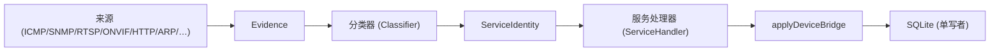
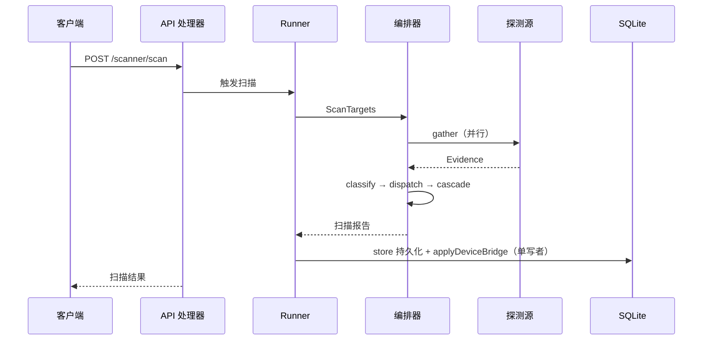

# 设备发现与识别

## 发现机制总览

MiBee Steward 通过分层流水线发现设备：**探测源**产出原始证据，**分类器**将证据融合为服务身份，**单写者持久化漏斗**将结果合并到设备注册表。流程如下：



探测源分为四类：

| 类别 | 运行位置 | 默认状态 |
|---|---|---|
| **主动探测** | 任意部署 | 启用 |
| **被动（eBPF）** | 任意部署（内核 ≥5.8，`WITH_EBPF` 构建标签） | 禁用 |
| **被动（主机本地）** | 任意部署 | 禁用（总开关 `scanner.discovery.enabled`，默认 `false`） |
| **路由器驻留 Tier-1** | 仅在网关上 | 禁用，需手动启用 |

## 主动探测源

主动探测向目标主机发起连接。只要有 L3 可达性，从任意网络位置都可运行。

| 来源 | 协议 / 端口 | 产出的 Evidence | 备注 |
|---|---|---|---|
| ICMP ping | ICMP | `echo`（RTT、可达性） | 基础存活检查 |
| TCP connect | 38 个默认端口（`scanner.pipeline_defaults.default_ports` 可配） | `port_open`、`banner` | 覆盖远程访问/数据库/邮件/目录/媒体/监控 exporter 等常见服务 |
| SNMP Get | UDP/161 | `snmp`（sysDescr、sysObjectID、sysServices、ifNumber、sysUpTime、sysContact、sysName、sysLocation 共 8 个标量 OID） | v1+v2c 版本阶梯；SNMPv3 USM 走凭据库。仅 L2 拓扑探针做表 walk |
| RTSP OPTIONS | TCP/554,8554 | `rtsp_banner`（Server 头、Public 方法） | 摄像头/NVR 检测 |
| ONVIF SOAP | TCP 单播 POST `/onvif/device_service`（已发现端口，回退 80/8080） | `onvif_response`（GetSystemDateAndTime + XML 命名空间验证） | IP 摄像头识别；WS-Discovery **多播**嗅探属于 eBPF 被动观测（见 [eBPF](ebpf.md)） |
| HTTP 探测 | TCP/80,443,8080,… | `http`（Server 头、`/metrics` 可用性） | 触发 prometheus/node_exporter 级联 |
| TLS 证书链 | TCP/443,8443,9443,4443,465,636,989-995 等 | `tls`（完整证书链） | https/ldaps/smtps/imaps/pop3s 等 TLS 包装服务的证书清点 |
| mDNS / SSDP | UDP/5353、UDP/1900 | `mdns`、`ssdp`（服务实例名、厂商字段） | 主动 UDP 发现；mDNS 可配 unicast（`scanner.mdns.unicast_queries`） |
| rDNS | DNS 反向解析 | `rdns`（主机名） | `scanner.rdns.dns_servers` 可配解析器 |
| SMB/NetBIOS | TCP/139,445 | `smb`（主机名、域、SMB 签名） | Windows/NAS 识别 |
| ARP 缓存 | 本机 `/proc/net/arp` | IP→MAC 映射 | 本机已通信过的主机（仅同一子网有效） |

**L2 拓扑探针**（对支持 SNMP 的交换机做表 walk，产出邻居关系 → `device_neighbors` → 拓扑边）：

| 探针 | 走的表 | 产出 |
|---|---|---|
| LLDP-MIB | `lldpRemTable` | 邻居 MAC/端口/系统描述 |
| CDP-MIB | `cdpCacheTable`（Cisco） | 邻居 MAC/IP/端口 |
| Bridge-MIB | `dot1dTpFdbTable` | MAC→端口 转发表 |
| Q-BRIDGE-MIB | `dot1qTpFdbPort` | MAC→端口 + 802.1Q VLAN 标签 |
| STP-MIB | `dot1dStp` | 根桥/指定桥/端口 STP 角色 |
| IF-MIB | `ifName` | ifIndex→人类可读端口名 |

## 被动与路由器驻留源

这些来源从本地系统读取数据，而非探测远程主机。**全部被动发现源受总开关 `scanner.discovery.enabled` 控制（默认 `false`）**，总开关打开后各子源再按各自的 `enabled` 键生效。

**被动（eBPF）**：eBPF TC 观测器（`WITH_EBPF` 构建标签，内核 ≥5.8）观测 ONVIF/WS-Discovery 多播与 TCP 魔术字节，产出置信度 0.6 的证据。详见 [eBPF 被动观测](ebpf.md)。

**被动（主机本地）**：`arp_cache`（对账内核 `/proc/net/arp` 缓存，零流量）、`multicast`（被动监听 mDNS 224.0.0.251:5353 与 SSDP 239.255.255.250:1900 的自宣告设备）、`router_arp`（走 `scanner.router_arp.routers` 所列路由器的 SNMP ARP 表——覆盖跨 VLAN 的 MAC，未配置路由器时为 no-op）。默认构建下还有两个需专用构建标签的可选源：`arp_scan`（主动 ARP 广播 sweep，`WITH_ARPSCAN` 标签）与 LLDP 原始帧监听器（`WITH_LLDP` 标签 + `scanner.discovery.lldp_interfaces`）。

**路由器驻留 Tier-1**：仅在 MiBee Steward 直接部署于网关时才有数据（如 OpenWrt 设备），**默认关闭，需手动启用**。

| 来源 | 配置键 | 读取内容 | 为何仅限网关 |
|---|---|---|---|
| `dhcp_leases` | `scanner.discovery.dhcp_leases.enabled` | dnsmasq 租约文件（OpenWrt `/tmp/dhcp.leases`、Debian `/var/lib/misc/dnsmasq.leases`） | 需访问本机 DHCP 服务的租约表 |
| `conntrack` | `scanner.discovery.conntrack.enabled` | `/proc/net/nf_conntrack`（活跃 NAT 流的 LAN 侧端点） | 需网关网络命名空间 |
| `hostapd` | `scanner.discovery.hostapd.enabled` | hostapd 控制套接字（`iw station dump` 回退）— STA 关联/信号 dBm/SSID | 需同设备上的 Wi-Fi AP |
| `dns_log` | `scanner.discovery.dns_log.enabled` | dnsmasq 查询日志（`--log-queries`） | 需本机 DNS 解析器日志 |

**启用被动发现**（YAML 示例——先开总开关，再按需开子源）：

```yaml
scanner:
  discovery:
    enabled: true            # 总开关（默认 false）
    interval: 60             # 被动源轮询周期（秒）
    trigger_identify: true   # 新主机出现即触发单 IP 全量识别扫描（推荐）
    arp_cache:
      enabled: true          # 示例配置自带的三子源；总开关关闭时均不生效
    multicast:
      enabled: true
    router_arp:
      enabled: true          # 需同时配置 scanner.router_arp.routers
    dhcp_leases:             # Tier-1 路由器源，默认 false
      enabled: true
    conntrack:
      enabled: false
    hostapd:
      enabled: false
      interfaces: []         # 如 ["wlan0"]；留空自动探测
    dns_log:
      enabled: false
      path: ""               # 留空自动探测常规路径
```

或通过环境变量（注意键名带 `_ENABLED` 后缀）：

```bash
export MIBEE_SCANNER_DISCOVERY_ENABLED=true
export MIBEE_SCANNER_DISCOVERY_DHCP_LEASES_ENABLED=true
export MIBEE_SCANNER_DISCOVERY_CONNTRACK_ENABLED=true
```

**Tier-1 源需手动启用的原因**：这些来源读取敏感系统状态，仅在二进制运行于实际网关时才有用数据。远程运行不仅无用，还可能引发权限错误；底层文件/套接字缺失时它们干净降级为 no-op（debug 日志 + 跳过），不会报错或崩溃。

## 指纹识别

探测产出证据后，**RuleClassifier** 将证据与数据驱动的 YAML 规则库匹配，识别设备类型、品牌和型号。

### 规则文件

| 文件 | 覆盖范围 |
|---|---|
| `banner.yaml` | TCP banner 问候（SSH/HTTP/RTSP/FTP/SMTP/POP3/IMAP） |
| `http-tls.yaml` | 类型存在服务（RTSP/ONVIF/Web/TLS/Prometheus） |
| `ports.yaml` | 仅端口形态的兜底规则（LDAP/SMB/DNS-TCP/…） |
| `snmp-data.yaml` | SNMP OID 前缀表 + sysDescr 关键词表 |
| `lldp-cdp.yaml` | LLDP/CDP 系统描述特征 |
| `recog-imported.yaml` | 由 `cmd/fpimport` 从 recog（Apache-2.0）批量导入的规则 |

规则库默认嵌入二进制（规则资产随 `mibee-fingerprints-go` 模块内置）。自定义规则：设置 `scanner.fingerprint_path` 指向 YAML 文件目录。

### 匹配与发出流程

每条规则有一个 `match` 节点（测试证据字段）和一个 `emit` 节点（产出 `ServiceIdentity`）。匹配操作包括 `kind_presence`、`port`/`port_eq`、`prefix`/`prefix_ci`、`contains`/`contains_any`、`equals`、`regex`，以及复合 `compound`/`or` 运算符。置信度融合公式：`fused = 1 - (1 - evidence.conf) * (1 - rule.conf)`。

完整规则格式、匹配操作和置信度模型详见[指纹规范](fingerprint-spec.md)。

> **逻辑无法写成单条声明式规则时**（SNMP 位掩码+数值的设备类型启发式、摄像头分类器的跨证据融合）保留为 Go 代码，与规则库并存——见指纹规范 §"Logic plugins"。

### 设备类型推断（hostname/品牌/端口 关键词表）

在服务级指纹之外，设备**类型**（camera/switch/nas/…）还由一张数据驱动的关键词表推断：`configs/fingerprints/device-types/device_types.yaml`（主机名前缀、品牌、端口组合 → 类型），由 `runner` 的通用匹配器消费。

每条规则带 `source` 字段——`protocol`（来自 SNMP/RTSP/ONVIF 等协议证据，可信）或 `heuristic`（来自主机名猜测，可被伪造）——写入 `scan_attributes.inferred_type_source`。UI 对 heuristic 来源的类型显示 `?` 角标，提示该结论可被设备名 spoof。加一个设备签名 = 在 YAML 里加一行，不是加一个 Go 分支。

### OUI 厂商解析

OUI 加载器按**最长前缀匹配**将 MAC 地址解析为 IEEE 注册厂商，跨三档注册表：

| 注册表 | 前缀长度 | 示例 |
|---|---|---|
| MA-S（原 IAB） | /36（9 hex） | 村田等特定子块 |
| MA-M | /28（7 hex） | 中等规模分配 |
| MA-L（OUI） | /24（6 hex） | IEEE 大块 |

**最长前缀是强制的**，因为 MA-S/MA-M 子块是从 IEEE 或其他厂商拥有的 /24 OUI 中切出来的。例如，以 `8C1F64B14..` 开头的 MAC 属于村田的 MA-S 块，而非其 /24 父块所有者 "IEEE Registration Authority"。

**两个厂商字段**：

| 字段 | 来源 | 含义 |
|---|---|---|
| `oui_vendor` | OUI 加载器（IEEE 注册表） | NIC 芯片厂商 |
| `vendor` | 设备自报（SNMP/HTTP/TLS） | 设备品牌 |

两者均存储在 `scan_attributes` 中。区分很重要：一台海康威视摄像头可能使用瑞昱 NIC（oui\_vendor = Realtek，vendor = Hikvision）。

**OUI 数据来源**：

- **内嵌**（默认）：精简的 CC-BY-SA 常见厂商表。大多数部署场景足够。
- **完整 IEEE 数据集**（可选）：通过 `scripts/fetch-oui.sh` 下载，设置 `scanner.oui_path` 指向 CSV 文件。IEEE 注册表为"保留所有权利"的事实数据——引用，不入 CC-BY-SA 指纹语料库。

## 身份归并与设备替换

### MAC 优先身份

设备身份模型以 **MAC 地址为主键**：

- 相同 MAC、不同 IP（设备跨子网移动）→ **单一资产**
- 相同 IP、不同 MAC（DHCP 复用）→ **两个不同资产**
- 无 MAC 已知 → 退回 `(ip_address, network_id)` 复合键

这意味着在 Wi-Fi 网络间漫游的设备（相同 MAC，每次不同 IP）始终作为单一资产被追踪。

### 设备替换检测

当扫描发现 MAC 与已有记录匹配但属性差异显著（不同 IP 范围、不同服务、不同品牌）时，系统发出**替换**事件：IP 持有者胜出，旧 MAC 行标记为离线，差异写入 `change_log`。这有助于检测设备被物理替换的情况（如旧摄像头被新摄像头替换，使用同一根网线）。

### 单写者并发

所有设备写入经由 `runner.applyDeviceBridge`——单一写入者漏斗，防止多个探测处理器并发运行时的竞态条件（并行扫描结束后顺序执行桥接）。MAC 优先身份与该桥接自 v0.2.0 起落地。

### 网络对账漂移任务

`internal/service/scannerv2/reconcile` 提供网络对账任务（`scanner.reconcile_interval`，默认 1h）：定期对账网络范围内设备的 CIDR 归属，仅做**检测与呈现**（`mibee_network_mismatches` 指标 + 记录），不自动修改设备记录。

## 调优要点

### 同步 vs 异步扫描

`POST /scanner/scan`（同步）拒绝 **>1024 个 IP** 的目标（HTTP 413）。更大范围请使用异步任务 API：

| 端点 | 说明 |
|---|---|
| `POST /scanner/tasks` | 创建扫描任务 |
| `POST /scanner/tasks/{id}/trigger` | 开始执行 |

### 同步扫描流程



### 速率限制与并发

| 配置键 | 默认值 | 说明 |
|---|---|---|
| `scanner.max_concurrent_hosts` | 50 | 每主机并行度上限 |
| `scanner.default_timeout` | 300 | 每主机流水线超时（秒） |
| `scanner.per_probe_timeout` | 3 | 单个探测动作的超时（秒） |
| `retention.scan_results_days` | 30 | `scan_results`/`scan_task_runs` 裁剪窗口（`scanner.retention_days` 为旧键，未设新键时作回退） |

### 心跳阈值

| 配置键 | 默认值 | 说明 |
|---|---|---|
| `heartbeat.default_interval` | 30 | 每设备默认检查间隔（秒） |
| `heartbeat.tick_interval_seconds` | 30 | 探测循环节拍（秒） |
| `heartbeat.timeout` | 5 | 探测超时（秒） |
| `heartbeat.offline_threshold` | 5 | 连续失败 N 次判定离线 |
| `heartbeat.offline_backoff_ticks` | 10 | 离线设备每 N 个 tick 探测一次（30s tick 下约 5 分钟一次） |

### 扫描器流水线默认配置

```yaml
scanner:
  pipeline_defaults:
    icmp_enabled: true
    snmp_enabled: true
    port_scan_enabled: true
    default_ports: "22,21,23,25,53,80,110,143,389,443,445,554,631,636,8554,1433,3306,3389,5432,5900,6379,8000,8080,8081,8443,8888,9000,9090,9100,9104,9113,9121,9187,9200,9443,11211,27017,161"
    service_detection_enabled: true
    prometheus_check_enabled: true
    node_exporter_enabled: true
```

默认端口共 38 个，覆盖远程访问（22/23/3389）、数据库（1433/3306/5432/6379/9200/11211/27017）、邮件/目录（25/110/143/389/636）、媒体（554/8554）、存储（445）与监控 exporter（9100/9104/9113/9121/9187）；161 为 SNMP/UDP（端口表仅作协调用，UDP 探测路径独立）。

## 交叉引用

- [架构总览](architecture.md)——五层扫描器流水线、持久化表、设备身份模型
- [配置参考](configuration.md)——所有 `scanner.*` 和 `heartbeat.*` 配置键
- [指纹规范](fingerprint-spec.md)——规则格式、匹配操作、置信度模型、许可证
