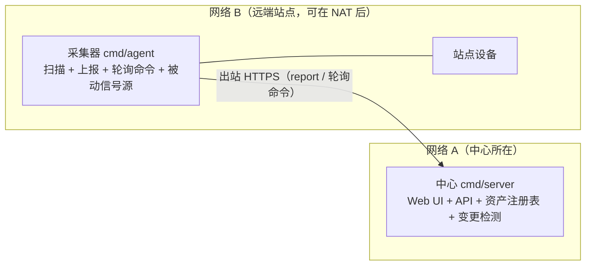
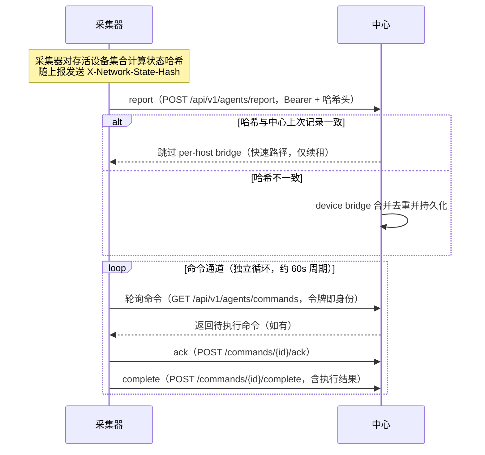

# 分布式部署

MiBee Steward 采用**中心 + 采集器**的分布式架构，跨多个局域网/站点统一管理资产。本文介绍架构、数据同步模型、命令通道与运维要点。

## 何时使用分布式

| 场景 | 规模 | 推荐 |
|---|---|---|
| 单局域网，几十台设备 | 小型 | 单机部署（见 [单机部署](deployment.md)） |
| 多个局域网 / 多站点 | 中大型 | **分布式**：一台中心 + 每站点一台采集器 |
| 路由器上已有发现需求 | 单/多 | 见 [OpenWrt 部署](openwrt.md)（形态 B 即分布式采集器） |

需要管理多个不相连的网段、或希望在各路由器上采集 Tier-1 信号（DHCP/conntrack/hostapd/dns_log）时，请使用分布式架构。

## 架构



中心是设备注册表的**唯一写入方（单写者持久化）**；采集器在各自网络中扫描，经 HTTPS 将结果上报给中心。采集器**只发起出站连接**（pull 模型），因此天然穿越 NAT/防火墙，无需在站点侧开放入站端口。

### 拉取模型时序



采集器内部由 `command_poller`（轮询 / ack / complete）与 `reporter`（上报，附带 `X-Network-State-Hash`）驱动，扫描由 `scannerv2` 引擎执行（被动信号源从路由器采集）。两条通道相互独立：上报快慢不影响命令轮询。

## 前置条件

- **中心**：一台可被采集器访问的服务器（域名或固定 IP，建议 HTTPS），运行中心二进制（`cmd/server`，~24MB，含嵌入式 SPA）。
- **采集器**：每站点一台（虚拟机 / 低功耗路由器均可），运行采集器二进制（`cmd/agent`，~18MB，无内置 UI，内存 ~100MB）。
- **时钟同步**：建议所有节点 NTP 对齐。采集器上报会按时间戳记录，NTP 能让"最近上报时间"更可读；令牌本身是不透明哈希查找、不校验时间，租约过期也只依赖中心自身时钟。

## Agent 安装与注册

### 1. 在中心上创建 Agent 令牌

Agent 令牌是中心签发的凭证，绑定 `network_id + agent_id`，不可跨网络复用。创建前需先在网络管理中建好目标网络（拿到**数字 ID**），然后在中心的 **Agents 页面**新建令牌，或直接调 API：

```bash
curl -s -X POST http://<center-ip>:8080/api/v1/agents/tokens \
  -H 'Authorization: Bearer <admin-token>' \
  -H 'Content-Type: application/json' \
  -d '{"agent_id":"agent-site-b","network_id":3,"name":"site-b"}'
```

- `agent_id`（必填，唯一，冲突返回 409）：采集器的身份标识
- `network_id`（必填）：目标 `networks` 行的**数字 ID**（不是网络名）
- `name`（可选）：备注名

令牌明文只在创建响应中返回一次，中心只保存 SHA-256 哈希。

### 2. 安装采集器

```bash
# 下载或交叉编译采集器二进制（见 [OpenWrt 部署](openwrt.md) 交叉编译一节）
wget https://github.com/Mi-Bee-Studio/MiBeeSteward/releases/download/<tag>/mibee-agent-linux-arm64
chmod +x mibee-agent-linux-arm64
sudo mv mibee-agent-linux-arm64 /usr/local/bin/mibee-agent
```

### 3. 配置并启动

```bash
sudo mkdir -p /etc/mibee
sudo tee /etc/mibee/agent.yaml > /dev/null <<'EOF'
center:
  url: "https://<center-domain>"
  auth_token: "<上一步创建的令牌>"
  report_interval: "30s"
network:
  name: "site-b"
  cidr: "192.168.20.0/24"
EOF

sudo mibee-agent -config /etc/mibee/agent.yaml
```

可选：用 systemd 常驻（仓库 `deploy/mibee-agent.service` 提供 unit 模板）。

> **重要**：采集器**不会仅凭上述配置自行开始扫描**——它只执行本地 `scan_tasks` 中登记的扫描任务和中心下发的命令。让它动起来的三种方式：
> 1. 在中心的 Agents 页面对该采集器下发一次 `scan` 命令（最常用）；
> 2. 在采集器本地数据库中插入 `scan_tasks` 行（适合固化周期扫描）；
> 3. 启用 `scanner.discovery.*` 被动发现源（路由器侧信号，见 [OpenWrt 部署](openwrt.md)）。
>
> 命令轮询在启动后立即开始（约 60s 周期），首次上报则发生在第一次扫描/发现产出结果之后（默认每 30s 刷新一次，`center.report_interval`）。

## 数据同步模型

### Report → Device Bridge（设备桥）

采集器将扫描结果通过 `POST /api/v1/agents/report` 上报到中心，附带 `X-Network-State-Hash` 请求头。中心是设备注册表的唯一写入方（单写者持久化）。

**哈希由采集器计算**（对存活设备集合的"身份+分类"字段排序后取 SHA-256），中心只与上次收到的值比较：

- **哈希匹配** → 中心跳过完整的 per-host bridge，仅刷新租约（快速路径，节省 CPU 与 DB 写入）。注意该"上次哈希"存于中心内存，中心重启后会回到完整合并一次。
- **哈希不匹配** → 走完整合并：按 MAC 去重、保留跨上报稳定的设备 ID、更新在线状态，并触发**变更事件**。

变更事件通过 SSE（`/api/v1/changes/watch`）实时推送给订阅者（Web UI、通知等），实现跨网络资产视图的准实时刷新。

### 租约与状态

| 参数 | 默认值 | 说明 |
|---|---|---|
| 设备租约 TTL | 5 分钟（`scanner.agent_lease_ttl`） | 采集器上报续租；中心后台 `LeaseSweeper`（默认 60s 扫一次）检测超时并标记离线 |
| 上报刷新周期 | 30 秒（`center.report_interval`） | 有新扫描结果时按此节奏刷新上报；连续错过约 10 次即超出租约 TTL |
| 命令轮询周期 | ~60 秒 | 独立于上报通道 |
| 待重试上报队列 | 内存 100 批 | 断连期间缓存**上报**（非命令），恢复后补齐；超出即丢弃最旧批次 |

## 命令通道

中心可以主动向采集器下发命令（例如触发一次临时扫描）：

1. 管理员调用 `POST /api/v1/agents/{agentId}/commands` 入队命令（命令保存在中心的 `agent_commands` 表）。
2. 采集器的 `command_poller` 以约 60 秒周期轮询 `GET /api/v1/agents/commands` 取回——路径中**没有** agentId，令牌即身份。
3. 采集器执行后先调 `POST /api/v1/agents/commands/{id}/ack` 确认接收，再调 `POST /api/v1/agents/commands/{id}/complete` 上报结果（`{"status":"done|failed","result":...}`）——complete 是即时 HTTP 调用，不随下一次上报捎带。

命令是**尽力而为**的：采集器离线期间入队的命令不会过期，恢复连接后在下个轮询周期执行。

## 运维

### 监控

- 中心健康：`curl http://<center-ip>:8080/api/v1/health`。
- 采集器状态：中心 Web UI 的 **Agents 页面**可看到每个令牌的最近使用时间（≈最近上报/轮询，5 分钟内有活动即显示 Active）与命令历史。
- 日志：采集器 `journalctl -u mibee-agent -f`；中心同样用 systemd 管理。

### 断连与恢复

- 采集器断网：出站连接失败即退避重试，不产生错误风暴；内存中的待重试队列（100 批）缓存上报，恢复后补齐。
- 中心重启：SQLite 单写者，冷启动安全；采集器自动继续上报（中心的哈希缓存清空，会完整合并一次后恢复快速路径）。
- 令牌吊销：吊销/删除中心令牌后，采集器下次上报收到 401——这是**终结性**的 4xx，该批上报会被丢弃并记日志（不重试、不入队），采集器本地影子数据不受影响。重新签发令牌并更新 `center.auth_token` 后即恢复。

### 限制

- 中心为**单实例**设计（SQLite 单写者），不支持多中心写同一注册表。
- 命令通道是拉取式，无法做到毫秒级即时下发（轮询周期 ~60 秒）。
- 采集器本地 DB 只是影子，权威数据始终在中心。

## 相关页面

- [单机部署](deployment.md) — 无需分布式的单网络场景
- [OpenWrt 部署](openwrt.md) — 形态 B 即分布式采集器的路由器形态
- [配置参考](configuration.md) — 采集器与中心的全部配置项
