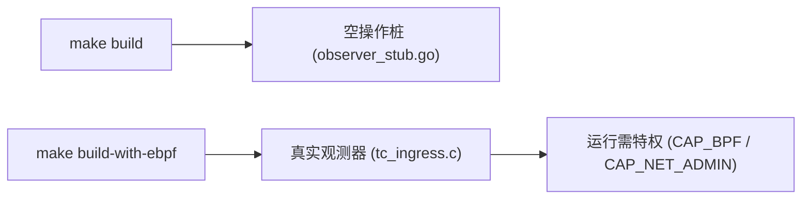

# eBPF 被动观测

## 概述

MiBee Steward 的扫描引擎（scannerv2）采用**双探测架构**：主动探测（TCP/SNMP/ONVIF 等）负责精确识别，被动观测负责在不向网络发送任何探测包的前提下，从真实流量中收集补充证据。eBPF 被动观测正是后者的实现——它挂载在 Linux 内核的 TC（Traffic Control）入口钩子上，以零干扰方式窥探经过网络接口的入站数据包，匹配已知协议签名后将证据交给分类层融合。

> **定位**：eBPF 观测是**辅助信号**，不是主动探测的替代。ONVIF/WS-Discovery 的组播通告是最佳被动目标，而 TCP 协议（SSH/RTSP/HTTP）仍以主动探测为主，eBPF 的匹配结果作为**佐证**以置信度 0.6 注入。

## 工作原理

`tc_ingress.c` 挂载到网络接口的 TC ingress 钩子，检查入站数据包的协议签名。完整的数据包路径如下：


| 签名 | 证据类型 | 分类结果 |
|------|---------|---------|
| TCP 载荷 `SSH-...` | `banner` | ssh |
| TCP 载荷 `RTSP/1...` | `rtsp_banner` | rtsp |
| TCP 载荷 `HTTP/1...` | `banner` | http |
| UDP/3702 ↔ 239.255.255.250 | `wsdiscovery` | onvif |

匹配结果通过环形缓冲区（`events` map）发送到 Go 用户态，由加载器转换为 `scannerv2.Evidence`，标记 `Source: "passive:ebpf:tc"` 和 `Confidence: 0.6`。分类层将此被动证据与主动探测证据融合，得出最终识别结论。

**关键特性**：程序**从不修改或丢弃数据包**——它是纯粹的观测（`TC_ACT_UNSPEC`）。

## 构建方式

eBPF 支持通过构建标签（build tag）控制，默认构建**不含任何内核依赖**：

```bash
# 默认构建 — 不含 eBPF（使用空操作桩）：
make build

# 含 eBPF 支持的构建（需要 clang/llvm/bpftool + 内核 BTF）：
make build-with-ebpf
```



- **默认构建**：使用 `internal/service/scannerv2/ebpf/observer_stub.go` 空操作桩，零内核/工具链依赖
- **eBPF 构建**：分两步。先在仓库内运行 `go generate ./internal/service/scannerv2/ebpf/`——它调用 `cilium/ebpf` 的 bpf2go 把 `tc_ingress.c` 编译为 BPF 对象并生成 Go 绑定（产物 `tcIngress_*.go` 已加入 `.gitignore`，必须在本机生成）；然后 `make build-with-ebpf`（等价于编译 BPF 对象 + 以 `-tags WITH_EBPF` 构建）。BPF 对象嵌入到最终二进制文件中

```bash
# 步骤 1：生成 bpf2go 绑定（需要 clang/llvm/bpftool + 内核 BTF；产物不入库）
go generate ./internal/service/scannerv2/ebpf/

# 步骤 2：构建
make build-with-ebpf
```

## 运行时要求

仅 `WITH_EBPF` 构建需要以下条件：

| 要求 | 说明 |
|------|------|
| **内核** | Linux ≥ 5.8，启用 BTF（`CONFIG_DEBUG_INFO_BTF=y`） |
| **权限** | `CAP_BPF` + `CAP_NET_ADMIN`（或以 root 运行） |
| **配置** | `scanner.ebpf.enabled: true` + `scanner.ebpf.interfaces: [eth0]`（**必须至少列出一个接口**） |

当运行环境不满足上述条件（如权限不足或 `interfaces` 为空）时，观测器记录一条 debug 日志并**优雅降级**为主动探测模式。

> 注意：`interfaces` 留空**不会**自动附加到所有接口——观测器会因无接口可附加而启动失败并降级，因此启用时务必显式列出要监听的接口。

## 配置

在 YAML 配置文件中启用：

```yaml
scanner:
  ebpf:
    enabled: true
    interfaces:
      - eth0
      - br-lan
```

- `scanner.ebpf.enabled`：是否启用 eBPF 被动观测（默认 `false`）
- `scanner.ebpf.interfaces`：要监听的网络接口列表；启用时必须至少列出一个（如 `eth0`、`br-lan`）

更多扫描配置请参阅 [配置](configuration.md)，网络发现相关配置请参阅 [网络发现](discovery.md)。

## 适用场景

### 何时使用 eBPF 被动观测

- 运行在网关/路由器上，能接触到所有入站流量
- 需要发现不响应主动探测的设备（如休眠 IoT、防火墙严格的主机）
- ONVIF 摄像头的组播通告检测（最佳被动目标）
- 希望在不增加网络流量的情况下获取补充证据

### 何时主动探测已足够

- 网络设备均响应 SNMP/ICMP 探测
- 运行环境不满足 eBPF 要求（非 Linux 5.8+、无 BTF）
- 容器/虚拟化环境无法获取 `CAP_BPF` 权限

## 已知限制

- **仅 Linux**：eBPF 需要 Linux 内核 5.8+ 和 BTF 支持
- **需要特权**：必须以 root 运行或具备 `CAP_BPF` + `CAP_NET_ADMIN` 能力
- **TCP 信号为佐证**：SSH/RTSP/HTTP 的匹配仅作为置信度 0.6 的辅助证据，不替代主动探测
- **无 CGO 依赖**：默认构建完全不含 eBPF 代码，适合所有部署环境
- **`vmlinux.h` 是机器相关的**：由运行内核的 BTF 生成，已加入 `.gitignore`

## 迭代 C 程序

```bash
cd bpf && make vmlinux.h && make tc_ingress.o
```

需要 `clang`、`llc` 和 `bpftool`。生成的 `vmlinux.h` 是机器相关的（来自运行内核的 BTF），已加入 `.gitignore`。

## 相关页面

- [网络发现](discovery.md) — 完整的发现源列表和配置
- [配置](configuration.md) — 所有配置项参考
- [架构](architecture.md) — 扫描引擎整体架构
