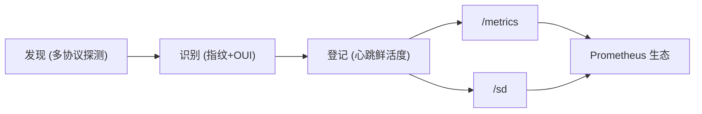

# MiBee Steward 产品介绍

MiBee Steward v0.5.0（2026-08-19）是一个**设备/网络层的资产发现、识别与登记**工具——面向网络与 IoT 资产的轻量 CMDB（CMDB-lite），以单个零依赖二进制交付。后端采用 Go + Chi 路由 + modernc.org/sqlite（CGO-free 的纯 Go SQLite 实现）+ sqlc 生成的数据访问层，配置管理基于 koanf（YAML 文件 + `MIBEE_*` 环境变量）；前端为 SvelteKit 5 单页应用，通过 `go:embed` 嵌入二进制。许可证为 AGPL-3.0，并提供商业双授权。

它回答三个问题：

1. **网络上有哪些设备？** 通过 ICMP、TCP 端口扫描、SNMP、HTTP、RTSP、ONVIF、mDNS、SSDP、NetBIOS 等多协议主动探测发现；可选 eBPF 被动观测器（嗅探 WS-Discovery 多播与 TCP 魔术字节）；v0.4.0 起还可接入路由器侧数据源（DHCP 租约、conntrack、hostapd、dnsmasq 日志）。
2. **它们是什么？** 通过协议指纹（banner / HTTP / RTSP / ONVIF / SNMP / Prometheus）推断设备类型、品牌、型号，并基于 MAC 地址的 IEEE OUI 注册表推断厂商。
3. **它们还活着吗？** 以心跳驱动的资产鲜活度持续跟踪在线/离线、延迟与历史，使资产登记成为活账本而非一次性快照。

## 核心能力

### 发现与识别

- 多协议探测：ICMP、TCP 端口扫描、SNMP（v1/v2c/v3 USM）、HTTP、RTSP、ONVIF、mDNS / SSDP / NetBIOS（UDP）；指数退避重试（1s → 2s → 4s，仅网络错误）。
- 指纹识别：基于协议指纹分类设备类型、品牌、型号，社区可贡献的指纹/规则库随时间积累（见[指纹库规范](fingerprint-spec.md)）。
- OUI 厂商推断：按最长前缀匹配 IEEE MA-L / MA-M / MA-S 注册块；开箱即用内嵌精简 CC-BY-SA 厂商表，完整数据集可运行 `scripts/fetch-oui.sh` 获取。
- L2 拓扑发现：LLDP-MIB / CDP-MIB / Bridge-MIB / Q-BRIDGE-MIB / STP-MIB 探测交换机邻居关系，物化为设备邻居表、拓扑边、子网与 VLAN 视图。
- TLS 证书清点：对 https / ldaps / smtps / imaps / pop3s 等 TLS 包装服务抓取完整证书链，持续跟踪证书到期与信任状态。
- 可选被动观测：eBPF TC 观测器嗅探 WS-Discovery 多播与 TCP 魔术字节（需 `make build-with-ebpf` 构建，内核 ≥5.8 + BTF）。
- 路由器数据源（v0.4.0）：从 DHCP 租约、conntrack、hostapd、dnsmasq 日志补充资产信息。

### 资产登记与心跳

- 设备注册表：设备的创建、编辑、删除、分组、批量操作，支持为每台设备登记多个系统（含入口 URL）。
- 心跳鲜活度：按设备配置探测间隔（默认 30s）；连续五次失败（`offline_threshold`，可配置）自动标记离线，设备再次响应时自动恢复；已知离线的设备自动退避探测频率，减少无效探测。
- 在线/离线历史、延迟与可用性统计，实时反映在 Web 界面与指标中。
- 变更检测：设备新增、属性变更、离线自动写入变更日志并推送事件（`GET /changes` + SSE watch），资产动态准实时可见。

### 拨测（外网资源探测）

- 显式配置的周期探测（blackbox_exporter 模式）：对任意可达端点——通常是外网/互联网资源（公开 HTTPS 站点、托管邮件 TLS 端口、供应商网关）——按固定间隔探测可用性与延迟。
- 四类模块：`http`（完整 URL，状态码 < 400 为成功，https 目标同时采集证书链）、`tls`（host:port 握手并采集完整证书链）、`tcp`、`icmp`。
- TLS 证书能力从内网复用到外网：证书链（叶/中间/根）、SAN、序列号、指纹、PEM、协商的 TLS 版本与密码套件、信任判定全部入库；历史结果携带证书到期摘要，可观察证书续期节奏。
- 证书到期与可用性指标（`mibee_probe_up` / `mibee_probe_cert_expiry_timestamp_seconds`）走 `/metrics`，告警交给 Prometheus（示例规则随仓库提供）。

### 设备配置备份（Oxidized/RANCID 式）

- 定时后台 sweep 通过 SSH 拉取每台路由器/交换机/防火墙设备的 running-config（厂商命令矩阵：Juniper JunOS、HP/Aruba/H3C/Comware 专用命令，其余走 Cisco 风格 `show running-config` 默认；host-key TOFU），版本化存入 `device_configs`，仅内容变化时记录新版本。
- 两版本 unified diff（API `GET /devices/{id}/configs` + `/diff?a=&b=`）与设备详情「配置历史」tab；SSH 凭据落库加密（AES-256-GCM，`security.master_key` 派生），读取时脱敏。
- 配置变更产生 `device_config_changed` 事件写入变更日志——进入变更页、SSE watch 与通知规则。
- 按需启用（`scanner.config_backup.enabled`，默认关闭）：需要 master key 与绑定到目标设备的 SSH 凭据。

### 事件通知（内置、规则驱动）

- 为不运行 Prometheus+Alertmanager 栈的团队准备：**通知规则**将变更事件（`device_lost` / `device_recovered` / `device_added` / `device_changed` / `device_config_changed`）投递到 webhook/邮件渠道，带每（规则 × 设备）冷却窗口抑制抖动。
- 每条规则可限定作用域：全部网络 / 单个网络 / 单台设备（按 UUID）。这是变更检测之上的轻量「规则→渠道」链路——刻意不做告警引擎。

### 可观测性（Prometheus 生态）

- `/metrics`：Prometheus 文本格式指标——设备状态 gauge、心跳计数器（总尝试/失败）、响应时间直方图。
- `/sd`：HTTP 服务发现端点，自动将资产（含 `metrics_enabled=true` 的系统）注册进 Prometheus。
- 告警与可视化有意留给 Prometheus Alertmanager 和 Grafana——它们原生消费上述端点。

### 管理界面

- 嵌入式 SvelteKit 5 单页应用：仪表板（ECharts）、设备（列表 / 详情 / 发现 / 扫描任务 / 扫描结果 / 扫描器）、代理、审计、变更、文档、网络等页面；深色/浅色主题，响应式布局。
- 中间件链按序执行：RequestID → RealIP → 日志 → 指标 → 异常恢复 → 安全头 → CORS → CSRF → 限流 → 认证/鉴权（RBAC + scope）。
- JWT 认证（cookie 优先，Bearer 令牌回退）+ 可选 TOTP 两步验证；基于能力的 RBAC（admin / operator / viewer 三档，`user` 为 viewer 的旧别名），对象级网络作用域授权，审计日志。
- 完整国际化：中文与英文语言包，自动语言检测。

### 分布式部署

- 中心（`cmd/server`）+ 采集器（`cmd/agent`）模式：每个采集器负责一个局域网段，中心汇聚统一注册表。
- 拉取模型：采集器主动向中心上报与轮询命令，中心无需入站连接，可部署在 NAT 之后。
- MAC 优先身份模型：跨子网漫游设备保持单一资产；相同私网 IP 在不同网络（`network_id`）下视为不同设备。

## 使用场景

### 网络资产清单

自动发现并登记路由器、交换机、无线 AP、服务器与 IoT 设备，通过协议指纹识别品牌/型号，用持续鲜活的登记替代基于电子表格的手工资产跟踪。

### IoT / 摄像头舰队发现

按品牌和型号识别 IP 摄像头、传感器、控制器等 IoT 设备。摄像头（RTSP + ONVIF）是当前的优先场景，因为指纹清晰、需求明确——不代表 Steward 是摄像头专属工具，同一识别管线适用于任何设备类型。

### 分支机构 / SOHO 网络画像

在 LibreNMS 或 Zabbix 显得过重的小型/分支网络中足够轻量：部署单个二进制、扫描子网、得到结构化资产画像，无需数据库、消息代理或容器栈。

### 实验室 / 边缘资产跟踪

以灵活的逐设备探测配置跟踪研究设备、测试装置、测量设备与边缘节点，心跳鲜活度确保登记反映现实而非过期快照。

## 产品范围与边界

### 是什么

| 范围 | 说明 |
|------|------|
| 发现 | ICMP / TCP 端口扫描 / SNMP（v1/v2c/v3）/ HTTP / RTSP / ONVIF / mDNS / SSDP / NetBIOS 主动探测，可选 eBPF 被动观测与路由器数据源 |
| 拓扑 | LLDP / CDP / Bridge-MIB / Q-BRIDGE / STP 邻居发现 → 拓扑边、子网、VLAN |
| 识别 | 协议指纹推断设备类型、品牌、型号；OUI 厂商推断 |
| 登记 | 设备注册表（CMDB-lite）：CRUD、分组、设备系统管理 |
| 心跳 | 在线/离线 + 延迟 + 历史的持续资产鲜活度 |
| 配置备份 | 定时 SSH 拉取 running-config，版本化存储 + diff（按需启用） |
| 拨测 | blackbox 风格的外部端点周期探测（http/tls/tcp/icmp） |
| 变更通知 | 规则驱动的设备/配置变更事件 → webhook/邮件 |
| 指标导出 | `/metrics`（Prometheus 格式）+ `/sd`（HTTP 服务发现） |

### 不是什么

这些是刻意保留的**产品边界，不是缺口**——对应能力由成熟工具完成，Steward 不与它们竞争：

| 能力 | 请使用 | 说明 |
|------|--------|------|
| 告警 | Prometheus Alertmanager / Uptime Kuma | Steward 通过 `/metrics` 暴露数据，不决定告警什么、何时告警 |
| 仪表盘 / 可视化 | Grafana | 内置 ECharts 仅用于资产概览，不替代 Grafana |
| 主机深度监控（CPU/内存/磁盘） | Netdata / node_exporter | Steward 负责发现 node_exporter，而不是充当它 |
| 服务层发现（L7） | Consul / eureka | Steward 发现设备（L2-L4），不是服务实例（L7） |
| 配置管理 | Ansible 等配置管理工具 | 只登记与跟踪资产，不向设备下发配置 |
| 中心高可用 | 单实例中心 | 中心是单一进程；跨网络扩展通过中心 + 采集器（见[分布式](distributed.md)），不提供集群/HA |

如果确实需要上述能力，把对应工具与 Steward 一起部署即可——它们原生消费 `/metrics` 与 `/sd` 端点。

> 常见误解：Steward 有时被拿来与 Beszel / Uptime Kuma / Netdata 等轻量监控工具比较。这是类别错误——那些工具监控你已经知道的主机/服务，Steward 是去发现"网络上到底有什么"。

## 系统要求

- **平台**：Linux x86_64 为主要平台；ARM64 可通过交叉编译支持。单二进制，CGO-free，零运行时依赖。
- **磁盘**：应用与数据库约需 50MB；文件上传与文档存储另需 100MB+（可选）。
- **内存**：大多数部署低于 100MB；CPU 与网络消耗随活跃探测数增长。
- **网络**：需要到目标网段的访问用于设备探测；生产环境建议使用 systemd、Nginx 反向代理或 Docker（见[部署](deployment.md)）。
- **数据库**：单个 SQLite（WAL 模式，`./data/mibee.db`），无需外部数据库服务。

## 下一步

继续阅读[快速开始](quick-start.md)，在几分钟内完成首次部署与网络扫描。
