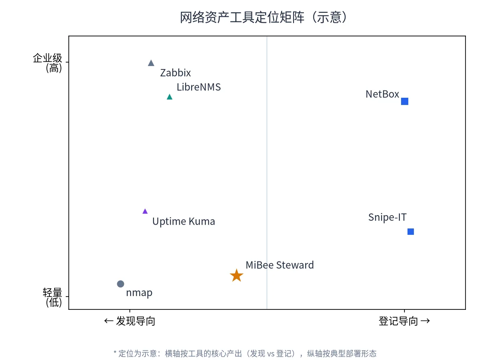
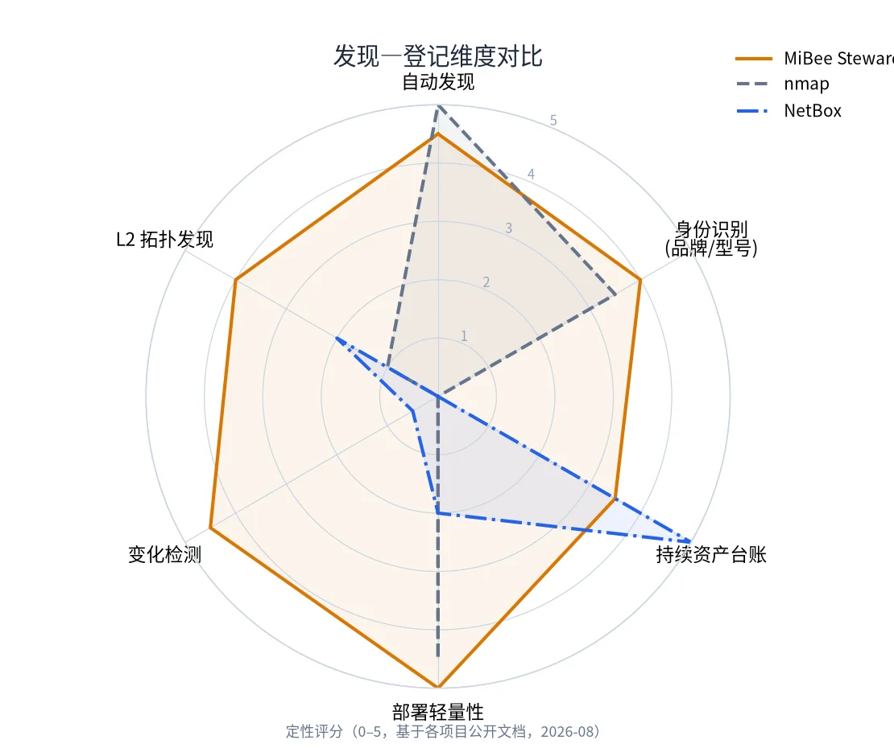
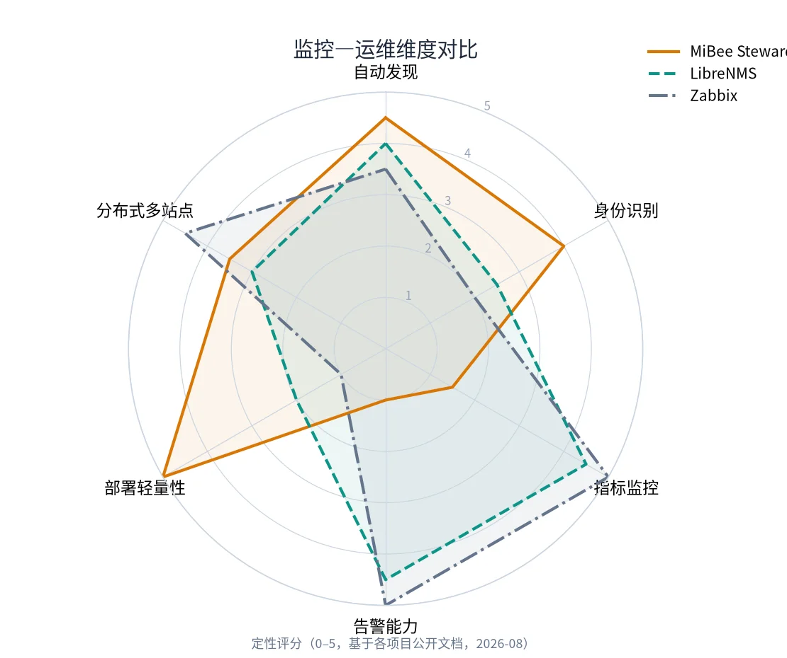

# 与同类工具的对比

> **如何读这一页**：以下对比基于各项目的公开文档与发布说明（截至 2026-08），评分是**定性判断**（0–5），不是基准测试结果。所有项目都在活跃演进，此页会随版本更新。选择工具的最好方式是明确自己的核心问题，再看谁解决得最好。

MiBee Steward 的定位一句话：**设备/网络层的自动发现 + 身份识别 + 登记**（CMDB-lite），以单个零依赖二进制交付。它不试图替代下面的任何一类工具--恰恰相反，它通过 `/metrics` 与 `/sd` 出口与它们共生。

## 先说边界：它不是什么

| 它不是 | 应该用什么 |
|---|---|
| 告警系统（阈值/静默/路由树） | Prometheus + Alertmanager |
| 自由探索式仪表盘 | Grafana |
| 状态页 | Uptime Kuma / gatus |
| 主机深度监控（CPU/内存/磁盘） | Netdata / node_exporter |
| L7 服务注册中心 | Consul / etcd |

这些边界是设计决定，不是待补的坑：把「资产画像」一件事做透，其余交给成熟生态。

## 工具版图

网络资产相关工具可以按两个轴摆放：**核心产出是发现还是登记**，**部署形态是轻量还是企业级**。MiBee Steward 占据的是「自动发现 + 自动识别 + 轻量交付」这一格：

## 逐类对比

### 对比扫描器：nmap

nmap 是网络扫描的事实标准--探测深度与灵活性无可挑剔。差异在于**扫描之后**：nmap 给你一次性的命令行结果，MiBee Steward 给你一份持续保鲜的资产库。

- nmap 的服务/版本检测（`-sV`）与 OS 指纹很强大，MiBee 的识别规则库同样覆盖这些证据源，但目标是「无人值守地持续识别并登记」，而非单次深度审计。
- MiBee 提供变更检测、心跳鲜活度、Web UI、API 与 Prometheus 出口；nmap 提供脚本生态（NSE）与极致的扫描控制。
- 深度安全审计仍然应该用 nmap；日常资产台账用 MiBee。两者互不替代。

### 对比 CMDB/IPAM：NetBox、Snipe-IT

NetBox 是 DCIM/IPAM 领域的标杆，Snipe-IT 擅长资产生命周期与采购/保修管理。它们的共同前提是**人工录入**--你得自己填 IP、MAC、型号、归属。MiBee Steward 反过来：**自动扫出来、认出来、登记进去**。

- 需要严谨的 IPAM、机房线缆文档、采购与保修流程、合规导出--NetBox/Snipe-IT 是更成熟的选择。
- 需要的是「不用人维护的活台账」--MiBee 的自动发现 + 识别 + 变更检测是这个问题的直接答案。
- 两者也可以协作：MiBee 负责发现与保鲜，结果导出（CSV/JSON/API）后进入 NetBox 做治理。

### 对比网络监控：LibreNMS、Zabbix

LibreNMS 与 Zabbix 是 SNMP 网络监控的主流选择：指标采集、阈值告警、仪表盘、分布式轮询一应俱全。它们也带自动发现--但那是为**监控目标入库**服务的，身份识别是副产品。

- 部署形态差异显著：LibreNMS 需要 MySQL + PHP + Redis，Zabbix 需要 Server + Agent + DB + Web 多组件；MiBee 是约 20MB 单二进制、SQLite 内嵌、秒级启动。轻量是 MiBee 的选择，代价是它**不做**指标采集与告警引擎。
- 需要端口流量图、阈值告警、SLA 报表--选 LibreNMS/Zabbix（或 Prometheus 生态）。
- 需要「网络上有什么、是什么、什么时候来什么时候走」--选 MiBee，并通过 `/metrics` 把资产状态喂给你的监控栈。

### 对比轻量拨测：Uptime Kuma

Uptime Kuma 监控你**已经知道**的服务并给出漂亮的状态页--赛道与 MiBee 互补而非重叠。MiBee 的拨测模块（v0.5.0）覆盖了外网站点可用性与证书到期的基础场景；如果需要状态页、多地点拨测、丰富通知渠道，Uptime Kuma 更合适。一个常见的组合：MiBee 发现并登记内网资产，Uptime Kuma 看护关键服务。

## 能力矩阵

> ✅ 完整支持 · ⚠️ 部分支持/需组合 · ❌ 不支持（或明确不做）

| 能力 | MiBee Steward | nmap | NetBox | LibreNMS | Zabbix | Uptime Kuma |
|---|:---:|:---:|:---:|:---:|:---:|:---:|
| 多协议自动发现 | ✅ | ✅ | ❌ | ✅ | ✅ | ❌ |
| 设备身份识别（品牌/型号） | ✅ 自动 | ⚠️ 版本检测 | ❌ 手动 | ⚠️ sysObjectID 映射 | ⚠️ 模板 | ❌ |
| 持续资产台账 | ✅ 自动 | ❌ | ✅ 手动 | ✅ | ✅ | ❌ |
| 变更检测（增/变/失） | ✅ | ❌ | ❌ | ⚠️ | ⚠️ | ❌ |
| L2 拓扑（LLDP/CDP/Bridge-MIB） | ✅ | ❌ | ⚠️ 手动线缆 | ✅ | ⚠️ | ❌ |
| TLS 证书盘点 | ✅ | ⚠️ 脚本 | ❌ | ⚠️ | ⚠️ | ✅ 有限 |
| 心跳/存活跟踪 | ✅ | ❌ | ❌ | ✅ | ✅ | ✅ |
| 指标采集与告警 | ❌（边界） | ❌ | ❌ | ✅ | ✅ | ⚠️ |
| 主机深度监控 | ❌（边界） | ❌ | ❌ | ✅ | ✅ | ❌ |
| 配置备份（版本化 diff） | ✅ | ❌ | ❌ | ⚠️ Oxidized 组合 | ⚠️ | ❌ |
| 分布式多网段 | ✅ agent | ❌ | ❌ | ✅ 轮询器 | ✅ proxy | ❌ |
| Prometheus 出口 | ✅ | ❌ | ⚠️ 导出器 | ✅ | ✅ | ⚠️ 导出器 |
| 单二进制零依赖 | ✅ | ✅ | ❌ | ❌ | ❌ | ⚠️ Node |
| Web UI | ✅ | ❌ | ✅ | ✅ | ✅ | ✅ |

## 目前不如这些工具的地方（诚实清单）

为了让你不做错选择，把 MiBee 当前的短板摆明：

1. **没有告警引擎**--设备事件可以转发到 webhook/邮箱，但没有阈值、静默、升级路由这些告警语义。需要就上 Alertmanager。
2. **不做主机深度监控**--不采集 CPU/内存/磁盘指标（能发现并登记 node_exporter，但不替代它）。
3. **指纹库仍在建设期**--摄像头与网络设备覆盖较好，长尾厂商型号靠社区贡献 YAML 规则持续补齐。
4. **没有 LDAP/SAML SSO**--目前是本地账号 + JWT + TOTP 两步验证。
5. **center 单实例**--SQLite 单库，无原生 HA；跨网段扩展靠 agent 而非多 center。
6. **多租户/服务台流程缺失**--团队 RBAC 与网络级授权已有，但 MSP 多租户、工单流转这类能力没有。

如果以上任何一条是你现在的硬需求，对应的成熟工具是更务实的选择。

## 一句话选型

- 要**一次性深度扫描/安全审计** → nmap
- 要**严谨的 IPAM/DCIM 治理** → NetBox
- 要**指标监控 + 告警体系** → Zabbix / LibreNMS / Prometheus 栈
- 要**服务可用性 + 状态页** → Uptime Kuma
- 要**自动发现 + 自动识别 + 持续保鲜的轻量资产台账** → MiBee Steward

多数真实环境是组合：MiBee Steward 负责「网络上有什么、是什么」，其余交给各自领域最好的工具。
