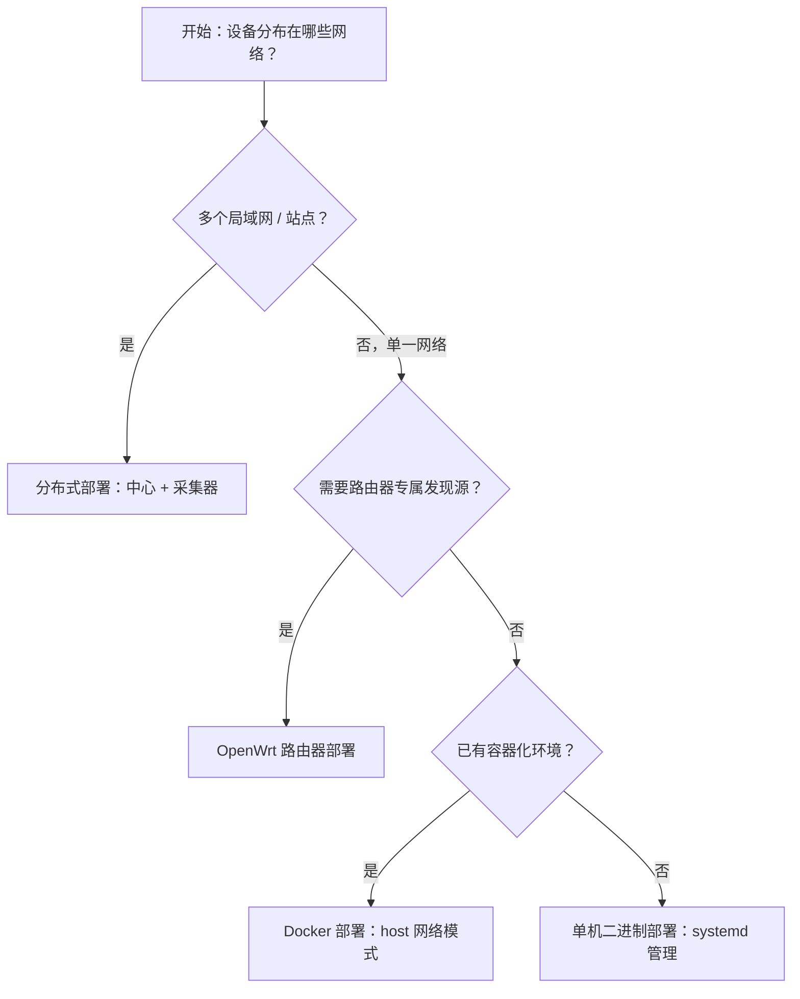
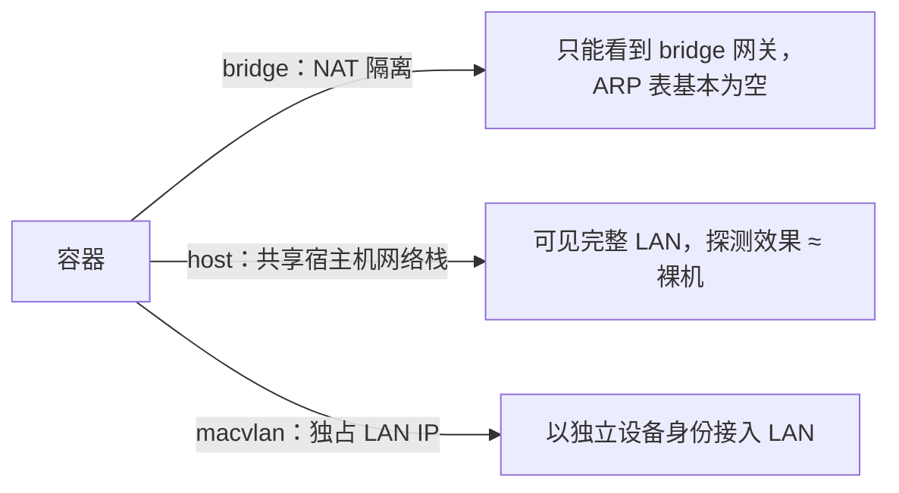

# 单机部署

本指南涵盖 MiBee Steward 的单机生产环境部署方法，包括二进制、Docker、Nginx 反向代理、备份策略和安全加固。

## 部署形态选择

MiBee Steward 提供多种部署形态，请根据场景选择：

| 部署形态 | 适用场景 | 说明 |
|---|---|---|
| **单机二进制** | Linux 服务器、虚拟机 | 直接运行，systemd 管理，最简部署 |
| **Docker** | 容器化环境、需要快速部署 | GHCR 预构建镜像或本地构建，多架构支持 |
| **OpenWrt 路由器** | 路由器上直接运行 | 解锁 Tier-1 路由器专属发现信号（DHCP/conntrack/hostapd/dns_log），详见 [OpenWrt 部署](openwrt.md) |
| **分布式** | 多局域网/多站点 | 一个中心 + 多个采集器，跨网段统一管理，详见 [分布式部署](distributed.md) |

如果只有一个局域网且设备数量可控，单机部署即可满足需求。



## 二进制部署

### 下载

从 [GitHub Releases](https://github.com/Mi-Bee-Studio/MiBeeSteward/releases) 下载对应平台的预编译 binary（amd64/arm64），或从源码构建。单机部署使用**中心**二进制（源码入口 `cmd/server`，约 24MB，内嵌 SvelteKit Web 界面）；纯采集器（`cmd/agent`，约 18MB，无内嵌界面）用于 [OpenWrt](openwrt.md) 与 [分布式](distributed.md) 场景：

```bash
git clone https://github.com/Mi-Bee-Studio/MiBeeSteward.git
cd mibee-steward
make build
# 或交叉编译
make build-linux-amd64
```

### 最小配置

```bash
# 创建用户和目录
sudo useradd -r -s /usr/sbin/nologin -d /opt/mibee-steward mibee
sudo mkdir -p /opt/mibee-steward/{data,data/uploads,data/backups,configs}

# 复制文件
sudo cp mibee-steward /opt/mibee-steward/
sudo cp -r configs/* /opt/mibee-steward/configs/
sudo chown -R mibee:mibee /opt/mibee-steward
sudo chmod +x /opt/mibee-steward/mibee-steward
```

### 配置生产环境

```bash
sudo cp /opt/mibee-steward/configs/config.production.yaml /opt/mibee-steward/configs/config.yaml
sudo nano /opt/mibee-steward/configs/config.yaml
```

关键配置项：

```yaml
auth:
  jwt_secret: "<32位随机字符>"  # openssl rand -base64 32
  initial_admin_password: "<强密码>"
  cookie_secure: true
  cookie_same_site: "strict"
```

### Systemd 服务

```bash
sudo cp deploy/mibee-steward.service /etc/systemd/system/
sudo systemctl daemon-reload
sudo systemctl enable mibee-steward
sudo systemctl start mibee-steward
```

服务内置安全加固：`NoNewPrivileges=true`、`ProtectSystem=strict`、`ReadWritePaths=/opt/mibee-steward/data`。

## Docker 部署

### 使用预构建镜像（GHCR）

从 v0.4.0 起，每个 release 自动发布多架构容器镜像到 GitHub Container Registry（amd64 / arm64）。镜像标签支持 `latest`、`:版本号`（如 `0.4.0`）、`:主.次版本`（如 `0.4`）与 `:commit-sha`：

```bash
# 拉取最新版
docker pull ghcr.io/mi-bee-studio/mibeesteward:latest

# 或锁定具体版本
docker pull ghcr.io/mi-bee-studio/mibeesteward:0.4.0
```

预构建镜像是**非特权变体**（LLDP/eBPF 编译为 stub）。如需被动探测能力，用源码 + `make docker-build-priv` 自行构建。

### docker-compose

以下为**简化示例**（单服务 + host 网络的等价写法）。仓库自带的 `docker-compose.yml` 实际提供 `bridge` / `host` / `macvlan` 三个 profile 与共享构建锚点，建议直接使用：

```yaml
services:
  mibee-steward:
    build: .
    network_mode: host          # 生产用 host 模式（见下节）
    volumes:
      - mibee-data:/data
      - ./configs/config.yaml:/app/configs/config.yaml:ro
    restart: unless-stopped

volumes:
  mibee-data:
```

### 网络模式选型（重要）

MiBee Steward 的扫描器在网络命名空间层面工作，**容器的网络模式直接决定探测效果**。`docker-compose.yml` 提供三个 profile：

| Profile | 启动命令 | 探测效果 | 适用场景 | 限制 |
|---|---|---|---|---|
| `bridge`（默认） | `docker compose --profile bridge up` | 仅 TCP/SNMP/HTTP/TLS/RTSP/ONVIF 可靠；**ICMP、ARP/MAC 发现严重缺失** | UI 演示、开发 | 看不到真实 LAN，设备 MAC 基本拿不到 |
| `host`（**推荐**） | `docker compose --profile host up` | ≈ 裸机部署，探测完整（ICMP、`/proc/net/arp`、多播） | **生产环境** | 占用宿主机 8080 端口；需 `cap_add: NET_RAW,NET_ADMIN` |
| `macvlan` | `docker compose --profile macvlan up` | 容器独占一个 LAN IP，ARP/MAC 可用 | 需要容器以独立设备身份出现在 LAN | 宿主机↔容器默认不可达（需手动加 macvlan shim 接口） |



实测经验进一步印证：bridge 模式下基本拿不到设备 MAC，host 网络模式下接近全量 —— 生产扫描务必使用 host 网络模式。

> ⚠️ **为什么 bridge 模式不能用于真实盘点**
> Docker 默认 bridge 把容器放在 NAT 后面。后果：
> 1. **ARP/MAC 失效**：容器读 `/proc/net/arp` 只能看到 bridge 网关一条记录，LAN 设备的 MAC 几乎全拿不到（`ARPProbe`、`ARPCacheSource`、`LookupMACPostScan` 都依赖此文件）。
> 2. **ICMP 失效**：跨 NAT 的 ping 回包常被丢弃，心跳的 30s 主动探测会把 LAN 设备误判为离线。
> 3. **被动多播失效**：bridge 不转发 224/239 多播，mDNS/SSDP 监听源会自禁用。
>
> 补救：bridge 模式下在 `scanner.router_arp.routers` 里列出网关路由器 IP，让扫描器通过 SNMP walk 路由器的 ARP 表补 MAC；但这只能补 MAC，救不了 ICMP/多播。

### host 模式完整示例

```bash
# 1. 准备配置
cp configs/config.docker.yaml configs/config.yaml
#    编辑 jwt_secret / initial_admin_password / network.cidr

# 2. 构建并启动（host profile）
docker compose --profile host up -d --build

# 3. 验证
curl -s http://localhost:8080/api/v1/health
```

如需 LLDP 原始帧监听或 eBPF 被动观察者（默认镜像是 no-op stub），构建时加 build tag：

```bash
BUILD_TAGS=WITH_LLDP,WITH_EBPF docker compose --profile host build
# 运行时 eBPF 额外需要 cap_add: BPF，内核 ≥5.8 + BTF
```

**国内网络构建加速**：

```bash
NPM_REGISTRY=https://registry.npmmirror.com \
GOPROXY=https://goproxy.cn,direct \
docker compose --profile host build
```

Makefile 封装了常用流程：`make docker-up`（host profile，推荐）、`make docker-up-bridge`（演示）、`make docker-up-macvlan`、`make docker-build-priv`（特权变体）。

### 直接运行预构建镜像

```bash
docker run -d --name mibee \
  --network host \
  --cap-add NET_RAW --cap-add NET_ADMIN \
  -v mibee-data:/data \
  -v "$PWD/configs/config.yaml:/app/configs/config.yaml:ro" \
  ghcr.io/mi-bee-studio/mibeesteward:latest
```

## Nginx 反向代理 + TLS

将 MiBee Steward 放在 Nginx 反向代理后面，配置 TLS 加密和安全头：

```nginx
server {
    listen 80;
    server_name your-domain.com;
    return 301 https://$host$request_uri;
}

server {
    listen 443 ssl http2;
    server_name your-domain.com;

    ssl_certificate /etc/nginx/ssl/cert.pem;
    ssl_certificate_key /etc/nginx/ssl/key.pem;
    ssl_protocols TLSv1.2 TLSv1.3;
    ssl_ciphers ECDHE-ECDSA-AES128-GCM-SHA256:ECDHE-RSA-AES128-GCM-SHA256:ECDHE-ECDSA-AES256-GCM-SHA384:ECDHE-RSA-AES256-GCM-SHA384;
    ssl_prefer_server_ciphers off;

    add_header X-Frame-Options DENY always;
    add_header X-Content-Type-Options nosniff always;
    add_header Strict-Transport-Security "max-age=63072000; includeSubDomains; preload" always;

    location / {
        proxy_pass http://127.0.0.1:8080;
        proxy_set_header Host $host;
        proxy_set_header X-Real-IP $remote_addr;
        proxy_set_header X-Forwarded-For $proxy_add_x_forwarded_for;
        proxy_set_header X-Forwarded-Proto $scheme;
        proxy_http_version 1.1;
        proxy_set_header Upgrade $http_upgrade;
        proxy_set_header Connection "upgrade";
        proxy_buffering off;
        client_max_body_size 100m;
    }

    location /metrics {
        proxy_pass http://127.0.0.1:8080;
        allow 127.0.0.1;
        deny all;
    }
}
```

启用并测试：

```bash
sudo ln -s /etc/nginx/sites-available/mibee-steward /etc/nginx/sites-enabled/
sudo nginx -t
sudo systemctl restart nginx
```

**SSL 证书（Let's Encrypt）**：

```bash
sudo apt install certbot python3-certbot-nginx
sudo certbot --nginx -d your-domain.com
# 自动续订：0 12 * * * /usr/bin/certbot renew --quiet
```

## 数据与备份

### 数据位置

SQLite 数据库默认位于 `./data/mibee.db`（二进制部署）或容器内 `/data/mibee.db`（Docker 部署）。

### 备份策略

使用 `scripts/backup.sh` 执行安全的 SQLite 备份（无数据库锁定）：

```bash
# 用法: ./scripts/backup.sh [数据库路径] [备份目录] [保留天数]
# 默认: ./data/mibee.db → ./data/backups，保留 7 天
./scripts/backup.sh

# 定期备份（crontab）
# 0 2 * * * /opt/mibee-steward/scripts/backup.sh /opt/mibee-steward/data/mibee.db /opt/mibee-steward/data/backups 30
```

备份脚本会自动验证完整性并清理过期备份。

### 自动养护

每轮保留清理（默认每 6 小时，`retention.sweep_interval_hours`）同时执行存储健康巡检：WAL 检查点并截断（`PRAGMA wal_checkpoint(TRUNCATE)` —— 将预写日志页折回主文件，`-wal` 归零）、刷新 SQLite 统计信息（`PRAGMA optimize`），并将磁盘体积与高容量表行数导出到 Prometheus：

| 指标 | 标签 | 含义 |
|---|---|---|
| `mibee_db_size_bytes` | `db`（main/heartbeat）、`kind`（db/wal） | 磁盘文件体积 |
| `mibee_db_table_rows` | `db`、`table` | 高容量表行数 |

这是容量规划的增长基线，也是自监控样例（见 `deploy/prometheus`）中库体积告警的数据源。

所有导出指标均有开箱即用的 Grafana 面板（`deploy/grafana/`），见[生态集成指南](https://github.com/Mi-Bee-Studio/MiBeeSteward/blob/main/docs/zh/integrations.md)。

### 容量规划（实测基线）

在 85 台设备的局域网、默认保留窗口（扫描结果 30 天、心跳结果 7 天、服务证据 14 天）下实测：

- 稳态：主库约 150 MB + 心跳库约 4 MB
- 增长主要由 `scan_results`（每任务 × 每 IP × 每轮扫描一行 —— /24 每 30 分钟一轮 ≈ 1.2 万行/天）与 `heartbeat_results`（每探测每 tick 一行 —— 30 台 × 3 探测 × 2880 tick/天 ≈ 26 万行/天，7 天清理）主导
- 经验值：默认保留窗口下按**每台被扫描设备每月约 2 MB** 预算；之后关注 `mibee_db_size_bytes` —— 若偏离线性增长，用 `mibee_db_table_rows` 定位哪张表在累积（清理器卡死表现为单表单调增长）


### 恢复

备份文件是 `sqlite3 ".backup"` 产出的**二进制数据库文件**，不是 SQL 脚本——直接复制回原位即可：

```bash
sudo systemctl stop mibee-steward
sudo cp /path/to/backup/mibee-YYYYMMDD_HHMMSS.db /opt/mibee-steward/data/mibee.db
# 删除可能残留的 WAL/SHM 文件，避免旧状态干扰
sudo rm -f /opt/mibee-steward/data/mibee.db-wal /opt/mibee-steward/data/mibee.db-shm
sudo systemctl start mibee-steward
```

## 升级

### 二进制升级

```bash
sudo systemctl stop mibee-steward
# 替换 binary（数据文件不受影响）
sudo cp mibee-steward /opt/mibee-steward/
sudo systemctl start mibee-steward
```

### Docker 升级

```bash
docker compose pull  # 拉取新镜像
docker compose up -d
```

数据兼容性：数据库 schema 在应用启动时自动迁移（迁移前自动 `VACUUM INTO` 备份），升级无需手动操作。ARMv7 设备无 release 预编译产物，需本地 `make build-linux-arm` 交叉编译。

### 管理员密码重置

忘记 `admin` 密码时无需改库：

```bash
sudo /opt/mibee-steward/mibee-steward reset-admin-password -config /opt/mibee-steward/configs/config.yaml
# 交互输入新密码，或：-password '新密码' / 环境变量 MIBEE_RESET_PASSWORD
```

## 安全清单

- [ ] **非 root 运行**：创建专用用户（如 `mibee`），不以 root 身份运行服务
- [ ] **JWT 密钥**：使用 `openssl rand -base64 32` 生成强密钥，勿使用默认值
- [ ] **管理员密码**：设置强密码（12+ 字符），启用 `cookie_secure` 和 `cookie_same_site`
- [ ] **防火墙**：仅开放必要端口（80/443），内网扫描端口 8080 不对外暴露
- [ ] **反向代理 TLS**：生产环境必须通过 Nginx 等反向代理配置 HTTPS
- [ ] **Metrics 端点**：仅允许 localhost 访问 `/metrics`，勿对外暴露 Prometheus 指标
- [ ] **定期备份**：配置 cron 每日自动备份 SQLite 数据库
- [ ] **日志监控**：使用 `journalctl -u mibee-steward -f` 或 JSON 格式日志进行监控

## 健康检查与监控

```bash
# 服务健康状态
curl -s http://localhost:8080/api/v1/health
# 响应: {"status":"ok","db":"ok","version":"0.x.x"}

# Prometheus 指标（仅 localhost）
curl -s http://localhost:8080/metrics
```

关键指标：`mibee_devices_total`（设备总数）、`mibee_heartbeat_checks_total`（心跳检查总数）、`mibee_heartbeat_latency_seconds`（心跳延迟）。

仓库内置 Prometheus 告警规则（`deploy/prometheus/alert_rules.yml`，共 5 条）：

| 规则 | 触发条件 |
|---|---|
| `MiBeeStewardDown` | 实例不可达 |
| `HighErrorRate` | `mibee_api_requests_total` 计算 5xx 占比 >5%（5 分钟） |
| `HeartbeatFailures` | 心跳失败/超时占比 >30%（5 分钟，按 status 标签过滤） |
| `DatabaseLocked` | DB 锁引发的 5xx 持续突增 |
| `HighMemoryUsage` | 常驻内存 >500MB |

配套的 `deploy/prometheus/alertmanager.yml` 与抓取配置（含 `/sd` 服务发现）也在同目录。另可参考 `deploy/prometheus/` 接入指南。

嵌入式 SPA 提供实时设备状态仪表板、心跳监控图表和设备运行时间统计。
