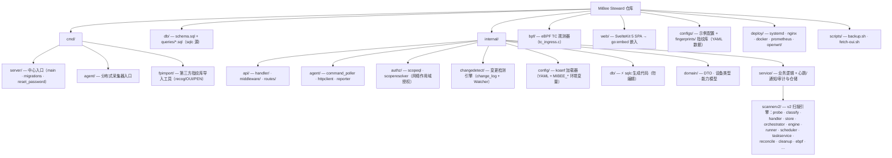
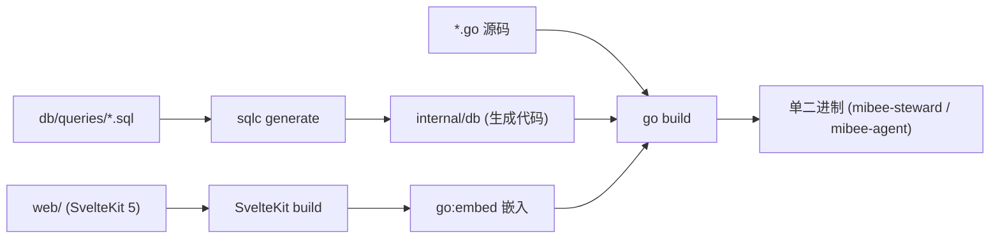

# 开发与贡献

本指南涵盖 MiBee Steward 的开发环境、项目结构、常用任务、编码规范和贡献流程。

## 开发环境

### 前置要求

- **Go** 1.26+（禁用 CGO，使用 `modernc.org/sqlite`）
- **Node.js** 20+ 和 npm
- **sqlc** — 查询代码生成
- **golangci-lint** v2 — 代码检查（配置在 `.golangci.yml`）

### 启动开发服务器

```bash
# 安装依赖
cd web && npm install && cd ..

# 启动前端 + 后端（热重载）
make dev
```

运行内容：
- 前端：端口 5173 上的 `npm run dev`（Vite HMR 热重载）
- 后端：端口 8080 上的 `go run`（**无热重载**——改后端代码需重启 `make dev`）

### 生产环境构建

```bash
make build                  # 先构建前端，再构建后端
make build-all              # 交叉编译（linux amd64 + arm64）
make build-linux-arm64      # 仅 arm64
```

## 项目结构



### 构建管线

各部分在构建时组合成单个二进制：



### 关键架构层

- **领域层** (`internal/domain/`)：DTO、常量、请求/响应模型、能力（RBAC）定义
- **服务层** (`internal/service/`)：业务逻辑、探测子系统、scannerv2 引擎；数据仓储（device/device_system/audit repo）与消费者同包共存
- **处理器层** (`internal/api/handler/`)：HTTP 请求处理、响应格式化。**章程**：变更型处理器必须走服务层；只读透传处理器可直接用 `*db.Queries`

## 常用任务

### 数据库查询（sqlc 工作流）

1. 在 `db/queries/*.sql` 中编写 SQL
2. 重新生成：`~/go/bin/sqlc generate`
3. 生成的代码出现在 `internal/db/` — **请勿直接编辑这些文件**

```sql
-- db/queries/your_table.sql
-- name: GetYourData :one
SELECT * FROM your_table WHERE id = $1;
```

### 模式变更

1. 编辑 `db/schema.sql`
2. 运行 `~/go/bin/sqlc generate`
3. 模式在应用启动时自动从嵌入的 `schema.sql` 执行

### 前端开发

```bash
cd web && npm run dev       # 启动前端开发服务器
cd web && npm run build     # 构建生产环境前端
cd web && npm test          # 运行 vitest
```

### 测试

```bash
go test ./...               # 运行所有 Go 测试（make test 等价）
go test -race ./...         # 竞态检测（CI 会跑这个）
cd web && npm test          # 运行前端测试（vitest run，单次执行）
```

### 代码检查与格式门禁

```bash
golangci-lint run           # Go linter（CI 钉死 v2.12.2，比 go vet 更严格）
```

> ⚠️ **推送前务必跑格式检查**（本地 `go vet`/`go build` 会通过、但 CI 的 golangci-lint 会挂的头号陷阱）：
>
> ```bash
> gofmt -l internal/ cmd/    # 必须无输出
> goimports -l internal/ cmd/  # 必须无输出（未预装：go install golang.org/x/tools/cmd/goimports@latest）
> ```

### eBPF 构建（可选）

```bash
make build-with-ebpf       # 需要 clang/llvm/bpftool + 内核 BTF（先 go generate，见 eBPF 文档）
```

详见 [eBPF 被动观测](ebpf.md)。

## 扩展扫描器

### 添加一个协议 = 一个分类器 + 一个处理器

scannerv2 是五层插件引擎，扩展点集中在两处：

1. **分类器**：在 `internal/service/scannerv2/classify/` 写一个 Classifier 并注册进 `classify.DefaultClassifiers()`；
2. **处理器**：在 `internal/service/scannerv2/handler/` 写一个 ServiceHandler 并加入 `handler.DefaultHandlers()`。

编排器与持久化层**零改动**。启动日志 `scannerv2 engine ready registry{probes=N classifiers=N handlers=N}` 可验证各层是否加载齐全。

**很多协议连新类型都不用写**——它们是数据驱动的：

- **服务器类服务**（数据库/邮件/远程访问/目录/文件共享：mysql、postgresql、redis、mongodb、mssql、memcached 等）：把服务名加进 `handler/services.go` 的 `serverServiceNames` 即可；
- **TLS 包装服务**（https/ldaps/smtps/imaps/pop3s/ftps/ircs/telnets 等）：加进 `handler/tls_collect.go` 的 `tlsCollectNames`，自动获得完整证书链采集。

只有带真正 per-protocol 采集逻辑的协议（HTTP/SNMP/Camera/RTSP/ONVIF/Prometheus/NodeExporter/SSH）才需要定义命名类型。

### 指纹与设备类型规则 = 数据，不是代码

- 设备签名规则在 `configs/fingerprints/*.yaml`（格式见[指纹库适配器规范](fingerprint-spec.md)），改完必须同步到内嵌目录：**`make sync-fingerprints`**（`make build` 前跑）。
- 设备类型关键词表在 `configs/fingerprints/device-types/device_types.yaml`，同步命令 **`make sync-device-types`**；一个防漂移测试（`TestDeviceTypesYAML_InSyncWithSourceOfTruth`）会在两份拷贝不一致时挂掉 CI——永远改 `configs/` 下的源文件再同步，不要直接改 `runner/` 下的内嵌副本。
- 所有 `build-*` 目标已依赖上述同步步骤；OUI 精简表同步用 `make sync-oui-curated`。

## 编码规范

### 关键反模式

- **永远不要编辑 `internal/db/*.go`** — 它们是 sqlc 生成的
- **永远不要使用 `CGO_ENABLED=1`** — 使用 `modernc.org/sqlite`
- **变更型处理器永远不要绕过服务层** — 只读处理器可直接用 `*db.Queries`
- **永远不要在 `routes/routes.go` 之外注册路由** — 保持路由集中化
- **永远不要绕过身份验证中间件**
- **永远不要在 `.ts` 文件中使用 `$state` 运算符** — 只在 `.svelte` 文件中使用
- **永远不要硬编码 API URL** — 前端统一走 `import.meta.env.VITE_API_BASE ?? '/api/v1'`（`web/src/lib/api/client.ts`）
- **永远不要提交密钥** — 使用 `.env`（已加入 .gitignore）

### 请求 DTO 模式

**CreateXRequest**（必需字段）：
```go
type CreateUserRequest struct {
    Username string `json:"username" validate:"required,min:3,max:255"`
    Email    string `json:"email" validate:"required,email"`
    Password string `json:"password" validate:"required,min:8"`
}
```

**UpdateXRequest**（用于部分更新的指针字段）：
```go
type UpdateUserRequest struct {
    Username *string `json:"username"`
    Email    *string `json:"email"`
    Password *string `json:"password"`
}
```

### 错误处理

服务返回类型化错误；处理器转换为 HTTP 状态码：

```go
// 服务层
func (s *YourService) YourMethod(ctx context.Context, id int64) error {
    if notFound {
        return domain.ErrYourResourceNotFound
    }
    return nil
}

// 处理器层
func (h *YourHandler) YourMethod(w http.ResponseWriter, r *http.Request) {
    if errors.Is(err, domain.ErrYourResourceNotFound) {
        response.Error(w, http.StatusNotFound, "Resource not found")
        return
    }
}
```

### 响应格式

始终使用 JSON，snake_case 字段和 ISO 8601 时间戳：

```json
{
    "id": 123,
    "name": "Resource Name",
    "created_at": "2026-01-15T10:30:00Z",
    "updated_at": "2026-01-15T10:30:00Z"
}
```

### 测试规范

- 使用 `testify/require` 断言和内存 SQLite
- 将 `_test.go` 文件放在被测源码同目录
- 前端测试放在 `web/src/__tests__/`
- 测试助手使用 `t.Helper()`
- 集成测试使用 `httptest.Server`
- 同时测试成功和错误情况

## 贡献流程

### 工作流 — 测试驱动开发

遵循 **TDD**：Red → Green → Refactor。

1. **Red**：先写一个失败的测试
   - 后端：`_test.go` 放在源码旁边，使用 `testify/require`
   - 前端：`*.test.ts` 放在 `web/src/__tests__/`
2. **Green**：编写最少的代码让测试通过
3. **Refactor**：在保持测试通过的前提下重构

### 分支与 Pull Request 流程

1. Fork 仓库，从 `main` 创建功能分支
2. 使用 [Conventional Commits](https://www.conventionalcommits.org/)：`feat:`、`fix:`、`docs:`、`chore:`、`ci:`、`refactor:`
3. 向 `main` 提交 PR，填写 PR 模板检查清单
4. 确保所有 CI 检查通过
5. 请求维护者审查

### CI 检查

PR 合并前必须通过以下检查（`.github/workflows/ci.yml`）：

- 前端构建（`npm ci && npm run build`——产出 `web/dist`，`go:embed` 编译期需要）
- `go vet ./...`
- `golangci-lint run`（钉死 v2.12.2）
- `go test -race -coverprofile=cover.out -covermode=atomic ./...`
- 前端测试（`npm ci && npm test`）
- `sqlc compile`（验证查询与模式的一致性）
- Docker 镜像构建 + `/health` 冒烟（`docker-build` job）
- DCO 签名检查

覆盖率**仅报告**（上传 artifact），不作为硬性门槛。

## 双许可与法律要求

MiBee Steward 采用**双许可**分发：[GNU AGPLv3](https://github.com/Mi-Bee-Studio/MiBeeSteward/blob/main/LICENSE) + [商业许可](https://github.com/Mi-Bee-Studio/MiBeeSteward/blob/main/LICENSE-COMMERCIAL.md)。为保持此模式，每个贡献必须满足：

### 贡献者许可协议（CLA）

每个贡献者**只需签署一次** CLA（个人签 ICLA，公司签 CCLA）。CLA 授予 Mi-Bee Studio 将您的贡献以 AGPLv3 和商业许可双重发布的权利，您保留版权。

CLA 到位前，PR **无法合并**。详见 [CLA.md](https://github.com/Mi-Bee-Studio/MiBeeSteward/blob/main/CLA.md)。

### DCO 签名

每个 commit 必须携带 `Signed-off-by` 行以证明其来源。使用 `-s` 参数：

```bash
git commit -s -m "feat: add new discovery source"
```

CI 检查（`.github/workflows/dco.yml`）会阻止未签名的 commit。详见 [DCO.md](https://github.com/Mi-Bee-Studio/MiBeeSteward/blob/main/.github/DCO.md)。

### 指纹库许可证

指纹 YAML 文件采用 [CC-BY-SA 4.0](https://creativecommons.org/licenses/by-sa/4.0/) 许可。衍生指纹语料库必须以相同许可发布。IEEE OUI 和 IANA PEN 数据为事实注册表——仅引用，不纳入语料库。详见 [指纹库适配器规范](fingerprint-spec.md) §8。

## 文档更新

面向用户的文档位于仓库 `docs/{zh,en}/` 目录下（中英双语，结构对齐）。当修改影响用户可见行为时，请在代码变更的同时更新相关文档。

## 获取帮助

- 通读根目录 `README.md` 与本 `docs/` 目录了解全貌
- 查看现有代码了解模式和约定
- 在 [GitHub Issues](https://github.com/Mi-Bee-Studio/MiBeeSteward/issues) 中提问
