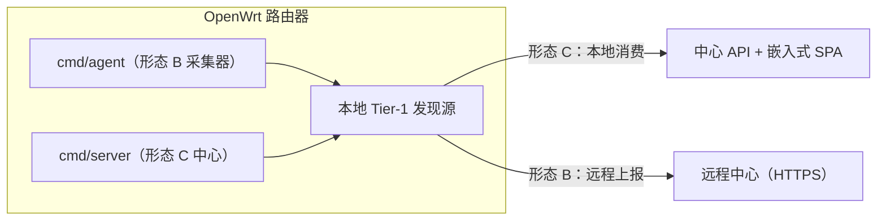

# MiBee Steward OpenWrt 路由器部署

MiBee Steward 可以直接运行在 OpenWrt 路由器上，分为两种形态：**路由器采集器**（轻量采集器跑在路由器上、上报到远程中心，仓库命名**形态 B**）与**路由器中心**（完整中心跑在路由器上，仓库命名**形态 C**；形态 A 指通用主机上的中心，见[单机部署](deployment.md)）。

> 已在 GL.iNet MT2500（Brume 2，mt7981）上完成真机验证：形态 C 在原厂固件上端到端运行——4 个 Tier-1 信号源全部产出真实数据，全网段扫描中路由器被正确自识别为 GL.iNet 设备（#288）。部署前请先阅读下方排障表中该固件 v4 监听限制的已知问题。

## 为什么跑在路由器上

路由器是网络的**汇聚点（choke point）**——它看到 DHCP 租约、NAT 流量、WiFi 关联和 DNS 查询，这些是普通 LAN 主机看不到的。以下 4 个 Tier-1 路由器专属被动发现源只有在网关上才可用：

| 信号源 | 提供什么 | 读取的路由器组件 | 缺失时行为 |
|---|---|---|---|
| `dhcp_leases` | 权威的 hostname↔MAC↔IP 映射 | dnsmasq `/tmp/dhcp.leases` | ✅ 干净降级（非 DHCP 主机） |
| `conntrack` | "此刻谁在通信"（存活 + 发现） | `/proc/net/nf_conntrack` | ✅ 干净降级（模块未加载） |
| `hostapd` | WiFi STA 关联（信号 dBm / SSID / 连接时长） | hostapd ctrl socket → `iw station dump` 回退 | ✅ 干净降级（无 WiFi / 无 hostapd） |
| `dns_log` | 被动 DNS 指纹（阻止探测的设备仍会做 DNS） | dnsmasq `--log-queries` 日志文件 | ✅ 干净降级（未配置查询日志） |

四个信号源为 opt-in（默认关闭），仅在网关上可用；在非路由器主机或底层文件/套接字缺失时干净降级为 no-op（调试日志 + 跳过），不会报错或崩溃。配置见 `scanner.discovery.*`（详见 [发现机制](discovery.md) 与 [配置参考](configuration.md)）。

## 形态选择

| 形态 | 二进制 | 角色 | 何时使用 |
|---|---|---|---|
| **形态 B — 路由器采集器（router-agent → 远程中心）** | `cmd/agent` | 纯传感器：扫描本路由器 LAN，经 HTTPS 上报到远程中心 | 多站点 / 多 LAN：一个远程中心 + 每台路由器一个采集器。采集器很轻量（18MB 二进制、约 100MB 内存） |
| **形态 C — 路由器中心（router-center）** | `cmd/server` | 完整中心（API + SPA + 资产注册 + 发现）跑在路由器上 | 单网络（家庭/小型办公室）：一台路由器包揽全部——既拿到汇聚点发现信号，又提供管理 UI，无需单独采集器进程 |

形态 B 与 [分布式部署](distributed.md) 配合使用；形态 C 适合单网络的自包含部署（与其他形态的对比见 [单机部署](deployment.md)）。



## 安装

### 架构要求

| 资源 | 最低 | 推荐 | 说明 |
|---|---|---|---|
| **架构** | **ARM 或 ARM64** | ARM64（GL.iNet MT3000、ipq807x、mt798x） | **不支持 MIPS**：`modernc.org/libc`（纯 Go SQLite 后端的传递依赖）没有可用的 `mips`/`mipsle` 移植，`mips64le` 也有缺陷。老款 ath79/ramips 路由器（TP-Link Archer C7、Netgear R7000 等）不在支持之列 |
| **内存** | 128 MB | 256 MB+ | modernc SQLite 比 C-SQLite 更吃内存；中心比采集器更重 |
| **闪存** | 32 MB | 128 MB+ | 二进制 16-18MB + OUI（约 5MB 完整 / 1.2KB 精简）+ 指纹库（约 1.2MB）+ DB。DB 建议放 `/tmp`（tmpfs）——见下文「资源占用」 |

### 交叉编译

两个二进制均 CGO-free（`modernc.org/sqlite`），直接 `GOOS`/`GOARCH` 交叉编译即可，无需 OpenWrt SDK：

```bash
# 形态 B: 采集器
CGO_ENABLED=0 GOOS=linux GOARCH=arm64 go build \
  -trimpath -ldflags="-s -w" -o mibee-agent ./cmd/agent/
# → ~18MB

# 形态 C: 中心
CGO_ENABLED=0 GOOS=linux GOARCH=arm64 go build \
  -trimpath -ldflags="-s -w" -o mibee-steward ./cmd/server/
# → ~24MB（含嵌入式 SvelteKit SPA）
```

`GOARCH=arm`（32 位，GOARM=7）也可用于老款 ARM 板；`GOARCH=mips*` **不支持**。注意：仓库 Makefile 的交叉编译目标（`make build-linux-arm64` 等）构建的是**中心**二进制；采集器有对应的 `make build-agent-linux-arm64` / `-amd64` / `-arm` 目标（两组都内含设备类型同步的 embed 前置步骤）。不带架构后缀的 `make build-agent` 构建的是**本机架构**：

```bash
# 中心（形态 C）——Makefile 目标（amd64 / arm64 / arm 同理）：
make build-linux-arm64

# 采集器（形态 B）——本机架构：
make build-agent
```

### procd init 脚本与配置文件

仓库提供两个 procd init 脚本——`deploy/openwrt/mibee-steward.init` 与 `deploy/openwrt/mibee-agent.init`，安装到 `/etc/init.d/` 后用 `enable`（开机自启）与 `start`/`stop`/`restart` 管理。配置文件统一放在 `/etc/mibee/`。

**形态 B 安装（采集器 → 远程中心）：**

```bash
# 在构建机器上：
scp mibee-agent root@router:/usr/bin/mibee-agent
scp deploy/openwrt/mibee-agent.init root@router:/etc/init.d/mibee-agent
ssh root@router 'mkdir -p /etc/mibee'
scp configs/agent.yaml root@router:/etc/mibee/agent.yaml   # 然后在路由器上编辑

# 在路由器上编辑 /etc/mibee/agent.yaml：
#   center.url:         http://<中心IP>:<端口>
#   center.auth_token:  <在中心通过 POST /api/v1/agents/tokens 创建>
#   network.name/cidr:  此路由器的 LAN（如 lan-62 / 192.168.62.0/24）
#   scanner.discovery.*: 启用需要的路由器专属信号源
#     （dhcp_leases, conntrack, hostapd, dns_log — 默认均为 false）

ssh root@router '/etc/init.d/mibee-agent enable && /etc/init.d/mibee-agent start'
ssh root@router 'logread -e mibee-agent | tail -20'   # 期望看到 "mibee-agent running"
```

**形态 C 安装（中心跑在路由器上）：**

```bash
scp mibee-steward root@router:/usr/bin/mibee-steward
scp deploy/openwrt/mibee-steward.init root@router:/etc/init.d/mibee-steward
ssh root@router 'mkdir -p /etc/mibee'
scp configs/config.yaml root@router:/etc/mibee/config.yaml   # 然后在路由器上编辑

# 在路由器上编辑 /etc/mibee/config.yaml：
#   server.port:                   如 8080
#   auth.jwt_secret:               ≥32 字符随机串（必填）
#   auth.initial_admin_password:   必填（无硬编码默认值）— 请修改！
#   network.name/cidr:             此路由器的 LAN
#   database.sqlite.path:          /tmp/mibee/mibee.db（tmpfs — 见下文）
#   scanner.discovery.*:           启用路由器专属信号源

ssh root@router '/etc/init.d/mibee-steward enable && /etc/init.d/mibee-steward start'
# 浏览器访问 http://<路由器IP>:8080，用 admin / <initial_admin_password> 登录
```

### UCI 配置（启用 dns_log 源）

`dns_log` 需要开启 dnsmasq 查询日志：

```bash
uci set dhcp.@dnsmasq[0].logqueries=1 && uci commit && /etc/init.d/dnsmasq restart
```

然后在 `scanner.discovery.dns_log.path` 指向日志文件路径（留空则自动探测常规路径）。

## 权限说明（CAP_NET_RAW）

MiBee Steward 的部分探测基于原始套接字，需要 **CAP_NET_RAW**：

- `arp_scan` 等 ARP 探测需要发送/接收原始 ARP 帧
- ICMP 主动探测依赖原始套接字
- 若编译进 LLDP 原始帧监听或 [eBPF 被动观察者](ebpf.md)，还需要相应权限（eBPF 需要 `CAP_BPF` + `CAP_NET_ADMIN`，内核 ≥5.8 + BTF）

**procd init 脚本默认以 root 身份运行**（OpenWrt 标准做法），因此以上权限天然满足。若以非 root 或受限 seccomp/apparmor 环境运行而缺失 `CAP_NET_RAW`，ARP 探测（`arp_scan` 等）会降级/失效，MAC 发现与 ICMP 存活判断将不可用。

## 资源占用

| 资源 | 形态 B（采集器） | 形态 C（中心） |
|---|---|---|
| **二进制大小** | ~18MB | ~24MB（含 SPA） |
| **运行内存** | ~100MB | 更重（modernc SQLite + 资产注册表） |

采集器非常轻量，适合低功耗路由器（如 GL.iNet 系列）；中心建议 256MB+ 内存的路由器。

### 闪存磨损缓解（DB 放 tmpfs）

两个二进制都会写 SQLite DB（WAL 模式）。在路由器的 NAND 闪存 + overlayfs 下会造成写磨损。**建议把 DB 指向 `/tmp`（tmpfs，内存支撑）：**

- **形态 B（采集器）：** 本地 DB 只是*影子*（中心才是记录写入方），冷启动丢失无妨。注意采集器的 DB 路径当前**没有独立配置项**——固定为配置文件同目录下的 `agent.db`（如 `/etc/mibee/agent.db`）。它写量很小（仅扫描结果暂存），通常可留在闪存；若确实要放到 tmpfs，可把整个配置目录移到 `/tmp/mibee-agent/` 并让 init 脚本指向它（重启后需重建配置文件）。内存待发队列（100 批）可覆盖重启期间的断连。
- **形态 C（中心）：** DB 是权威数据。`database.sqlite.path` 指向 `/tmp` 意味着冷启动丢失（下次扫描重建；单路由器部署可接受）。需要跨重启持久化时，可把该键留在闪存上并接受磨损——消费级路由器寿命 5-10 年，扫描写入量不大。

## 验证与排障

### 健康检查

```bash
# 形态 C（中心）：健康端点
curl -s http://localhost:8080/api/v1/health

# 查看日志
logread -e mibee-steward   # 形态 C
logread -e mibee-agent     # 形态 B，期望 "mibee-agent running"
```

### 常见问题

| 症状 | 原因 / 修复 |
|---|---|
| 启动时 `bind: address already in use` | 端口被占用（常为路由器自带 LuCI 的 80/443）。把 `server.port` 设为空闲端口（如 8080） |
| `database is locked (SQLITE_BUSY)` | WAL 模式下高并发探测的写冲突。连接池上限（16）当前为编译期固定值，实际可调的手段是降低 `scanner.max_concurrent_hosts` |
| 启动时 `mmap: access denied` | 内核不允许 SQLite 所需的 mmap——以 root 运行（procd 脚本默认如此）或检查 seccomp/apparmor |
| 发现源全部 no-op | 非路由器主机上的预期行为。在路由器上逐一检查前置条件（dnsmasq 运行中、`nf_conntrack` 已加载、hostapd ctrl_interface 已启用） |
| ICMP 探测全部 `permission denied` | OpenWrt 默认 `net.ipv4.ping_group_range = 1 0`，MiBee ICMP 探测所用的非特权 ping socket 被整体禁用。一次性修复：`echo 'net.ipv4.ping_group_range = 0 2147483647' > /etc/sysctl.d/99-mibee.conf && /etc/init.d/sysctl restart`——`mibee-steward doctor` 会检查此项 |
| 间歇性静默丢连路由器自身端口 | fw3 SYN-flood 防护（GL.iNet 默认开启）是全局 25/s、burst-50 令牌桶；MiBee 心跳端口检查 + 探测扇出可能耗尽它，之后**到任意本地端口的新 TCP 连接被静默丢弃**。在 LuCI 或 fw3 配置中关闭 SYN-flood 防护 |
| GL.iNet MT2500（mt7981，kernel 5.4.211 SDK）上新 v4 TCP 监听无法完成握手 | 厂商内核 bug：SYN 到达但 SYN-ACK 以未填充的 `0.0.0.0` 地址域发出、被对端 RST——任何语言的新监听都受影响，v6 正常。该固件上的已知限制：绑 v6（`server.host: "::"`）或 center 另放、路由器跑 agent（form B） |
| `scp` 传文件报 `sh: /usr/libexec/sftp-server: not found` | 厂商固件（含 GL.iNet）不带 sftp-server，新版 scp 回退 SFTP 即失败。强制旧协议：`scp -O …` |
| GL.iNet 上 `dns_log` 发现源始终为空 | GL 的 dnsmasq 用定制的 `logfacility` uci 键记查询日志（不是标准的 `logfile`）：`uci set dhcp.@dnsmasq[0].logqueries=1 && uci set dhcp.@dnsmasq[0].logfacility=/tmp/dnsmasq.log && uci commit dhcp`，再把 `discovery.dns_log.path` 指向该文件并重启 dnsmasq |
| 构建报 `build constraints exclude all Go files … modernc.org/libc…` | MIPS 不受支持（modernc/libc 限制）的典型报错形态。请使用 ARM/ARM64 路由器 |

### 当前不支持

- **官方 .ipk 打包**（OpenWrt build feed）：本仓库通过 `scp` + `/etc/init.d/` 交付 init 脚本与二进制即可运行；正式的 `.ipk`（经 OpenWrt buildroot 的 `golang-package` 宏）是后续工作，非正确性必需。
- **MIPS 架构**：`modernc/libc` 的结构性限制；需要把 SQLite 后端换成 bbolt/goleveldb（真正的重构，推迟到有 MIPS 需求时）。
