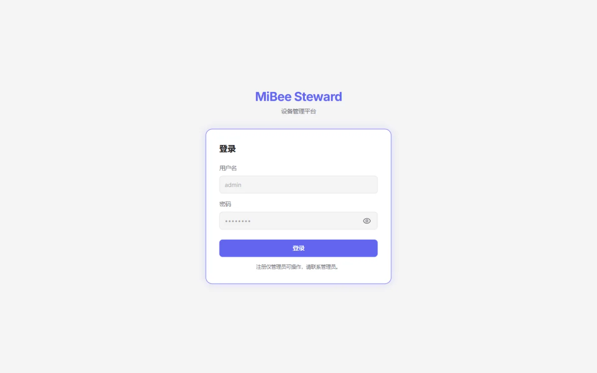
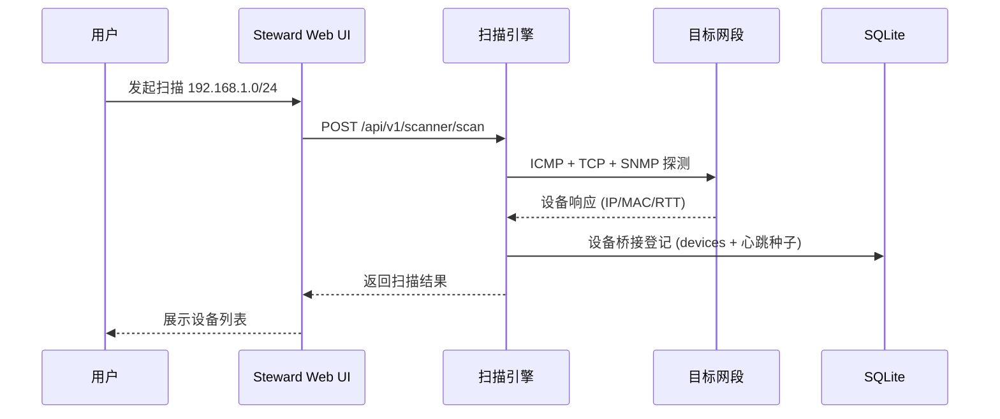
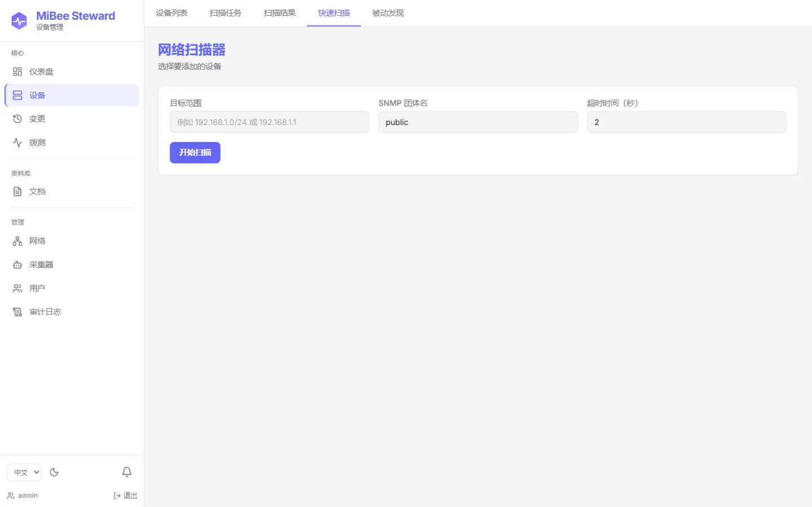
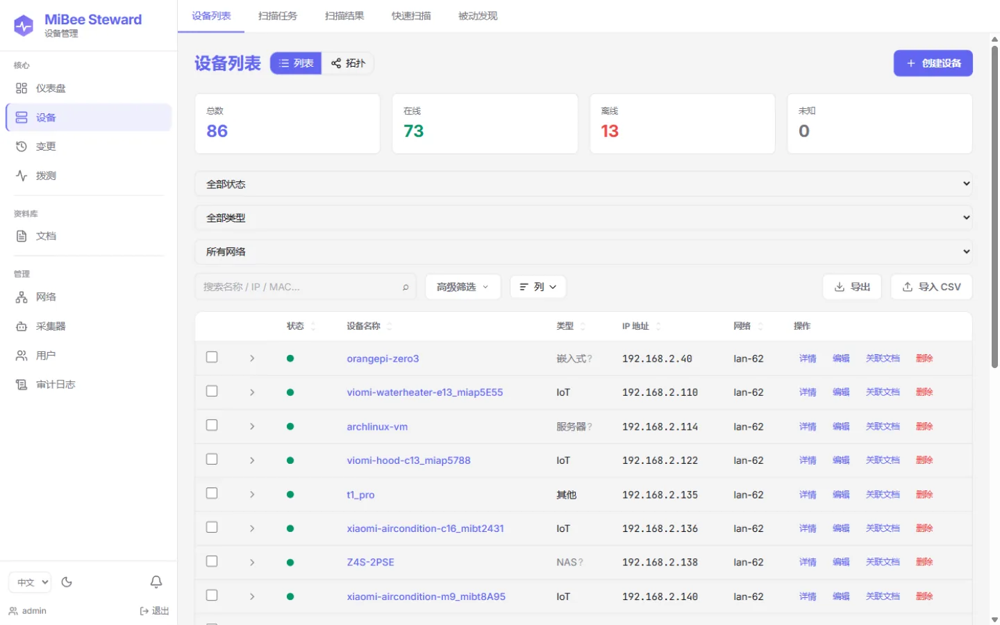

# 快速开始

本文演示如何在几分钟内运行 MiBee Steward 并完成第一次网络资产发现。假设你使用预构建二进制或容器镜像；从源码构建见[开发指南](development.md)。

## 前置条件

- Linux x86_64 或 ARM64 主机（CGO-free 单二进制，无运行时依赖）
- 约 50MB 磁盘空间（应用 + SQLite 数据库）
- 到目标网段的网络访问（用于 ICMP / SNMP / TCP 等探测）
- 容器路径：Docker Engine（可选）

## 获取二进制

### 方式一：GitHub Releases

从 [Mi-Bee-Studio/MiBeeSteward Releases](https://github.com/Mi-Bee-Studio/MiBeeSteward/releases) 下载对应架构的二进制（当前 v0.5.0）：

```bash
chmod +x mibee-steward
./mibee-steward --config config.yaml
```

### 方式二：Docker

```bash
docker pull ghcr.io/mi-bee-studio/mibeesteward:0.4.0
```

扫描依赖网络命名空间能力，容器建议使用 host 网络模式并声明 `NET_RAW` / `NET_ADMIN`：

```bash
docker run -d --name mibee \
  --network host \
  --cap-add NET_RAW --cap-add NET_ADMIN \
  -v "$PWD/configs:/app/configs:ro" \
  ghcr.io/mi-bee-studio/mibeesteward:0.4.0
```

> Docker 默认 bridge 模式位于 NAT 之后，ICMP、ARP/MAC 与多播探测会失效，不能用于真实资产盘点。详见[部署](deployment.md)。

## 最小配置

创建 `config.yaml`。最小配置只需监听地址、本机网络 CIDR 与两个必需的认证项（`auth.jwt_secret` 至少 32 字符，`auth.initial_admin_password` 为空则服务直接退出）：

```yaml
server:
  host: "0.0.0.0"
  port: 8080

network:
  name: "lan-1"
  cidr: "192.168.1.0/24"

auth:
  jwt_secret: "change-me-to-a-random-string-32-chars-min"   # ≥32 字符，必填
  initial_admin_password: "your-strong-password"            # 必填，首次登录后修改
```

所有配置项均可被 `MIBEE_` 前缀环境变量覆盖（点号转下划线，如 `network.cidr` → `MIBEE_NETWORK_CIDR`）：

```bash
export MIBEE_SERVER_PORT=8080
export MIBEE_AUTH_JWT_SECRET="$(openssl rand -base64 32)"
export MIBEE_AUTH_INITIAL_ADMIN_PASSWORD="your-strong-password"
```

生产环境务必设置 `auth.jwt_secret` 与 `auth.initial_admin_password`。完整配置项见[配置参考](configuration.md)。

## 启动并登录

```bash
./mibee-steward --config config.yaml
```

打开 http://localhost:8080，使用 `admin` 与配置的初始密码登录，登录后立即修改密码。健康检查：



```bash
curl http://localhost:8080/api/v1/health
```

## 60 秒演示（无需网络）

想在接入真实网段前先看看资产画像长什么样？用演示模式启动 —— 首次启动自动种入一套虚构资产（两个网络、约 20 台设备画像、变更历史、拨测结果），并有模拟事件保持活力：

```bash
./mibee-steward -demo -config configs/config.example.yaml
```

打开界面即可浏览；顶部琥珀色横幅标注演示模式，并提供一键「清空演示数据」切换到真实资产采集。

## 首次扫描



**Web 界面**：登录后进入扫描器页面，选择目标 CIDR 发起扫描。



**同步 API**（适合 ≤1024 IP 的目标）：

```bash
# 获取管理员令牌
TOKEN=$(curl -s -X POST http://localhost:8080/api/v1/auth/login \
  -H "Content-Type: application/json" \
  -d '{"username":"admin","password":"your-strong-password"}' | jq -r .token)

curl -X POST http://localhost:8080/api/v1/scanner/scan \
  -H "Authorization: Bearer $TOKEN" \
  -H "Content-Type: application/json" \
  -d '{"targets":"192.168.1.0/24"}'
```

返回 `{ hosts, total, alive, duration_ms }`，每个主机含 `ip`、`alive`、`rtt_ms`、`inferred_type`、`inferred_brand` 等字段。存活主机会立即通过**设备桥接**自动登记（写入 `devices`、生成心跳配置、记录变更事件）；扫描历史明细（`scan_results` / `scan_task_runs`）仅由异步任务持久化。

**异步任务**（目标 >1024 IP 时同步接口返回 413）：`POST /api/v1/scanner/tasks` 创建任务，`POST /api/v1/scanner/tasks/{id}/trigger` 触发，结果持久化到 `scan_results`。详见[API 参考](api.md)。

## 应该看到什么



- 设备列表：IP、MAC、OUI 厂商、品牌/型号、类型
- 识别结果：`inferred_type` / `inferred_brand`（如 camera、server、pc、iot）
- 心跳状态：在线/离线、响应延迟
- 若网络中有支持 SNMP 的交换机，还能看到拓扑与邻居关系

## 故障排查

| 现象 | 处理 |
|------|------|
| 端口 8080 被占用 | 修改 `server.port` 或设置 `MIBEE_SERVER_PORT` |
| 没有发现任何设备 | 确认 `network.cidr` 与 `targets` 正确；检查防火墙是否放行 ICMP 与 SNMP（UDP 161） |
| 设备在线但识别为空 | 确认 SNMP community（默认 `public`），或在扫描请求中显式传 `community` |
| Docker 中扫描异常 | 改用 host 网络模式（见上文） |
| 服务无法启动 | 看启动日志：缺 `auth.jwt_secret`（<32 字符）或 `auth.initial_admin_password` 为空会直接退出；再检查 `data/` 目录写权限 |
| 忘记 admin 密码 | `./mibee-steward reset-admin-password -config config.yaml`（交互输入，或加 `-password '新密码'` / 环境变量 `MIBEE_RESET_PASSWORD`） |

## 下一步

- [场景玩法指引](https://github.com/Mi-Bee-Studio/MiBeeSteward/blob/main/docs/zh/playbooks.md) — 从首次扫描到多网段的六个上手场景
- [功能总览](https://github.com/Mi-Bee-Studio/MiBeeSteward/blob/main/docs/zh/features.md) — 全部能力的分层清单
- [架构](architecture.md) — 扫描器流水线与后台服务
- [部署](deployment.md) — systemd、Docker、Nginx、备份
- [分布式](distributed.md) — 中心 + 采集器跨网络发现
- [配置参考](configuration.md) — 全部配置项
- [API 参考](api.md) — 扫描、设备、心跳接口
