# Web 界面巡礼

MiBee Steward 的全部管理功能都通过内置 Web 界面完成——它被嵌入在单个 Go 二进制里，部署即得，无需额外的前端设施。本页按功能区域逐一走一遍界面（截图均为浅色主题，取自真实运行实例，演示数据已脱敏）。

> 界面支持中文 / English 一键切换（侧栏底部语言选择器）与浅色 / 深色主题，以下截图均为浅色主题。

## 登录

首次访问 `http://<host>:8080` 会重定向到登录页。使用初始管理员账号（`admin` + 配置文件中 `auth.initial_admin_password` 指定的密码）登录；支持 TOTP 两步验证，普通用户的注册仅管理员可发起。

## 仪表盘

登录后首先看到仪表盘：设备状态分布、心跳成功率、设备类型分布等组件化卡片，最近的扫描活动（存活/新增/耗时），以及需要关注的离线设备清单。组件布局可自定义（添加/移除组件），右上角可一键发起扫描。

## 设备资产

设备列表是日常工作的主界面：跨网络聚合展示所有已登记设备，支持按状态/类型筛选、关键字搜索与排序。每行展示 IP、MAC、OUI 厂商、识别出的类型与品牌、在线状态；识别来源（协议证据 vs 主名启发式）会以角标区分。

点击任意设备进入详情页：基础信息、扫描属性（SNMP sysName/描述、开放端口、检测到的服务与版本）、TLS 证书、心跳历史、邻居关系、配置备份版本与关联文档，全部集中在一页。

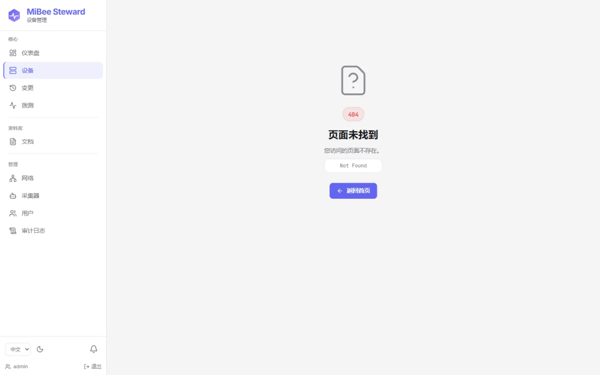

## 发现与识别

「发现」页展示识别漏斗：接收到的发现事件 → 抑制/去重 → 已知设备跳过 → 触发识别 → 存活确认 → 最终登记入资产库。漏斗各级计数用于评估发现源的健康度与识别管线的转化率。

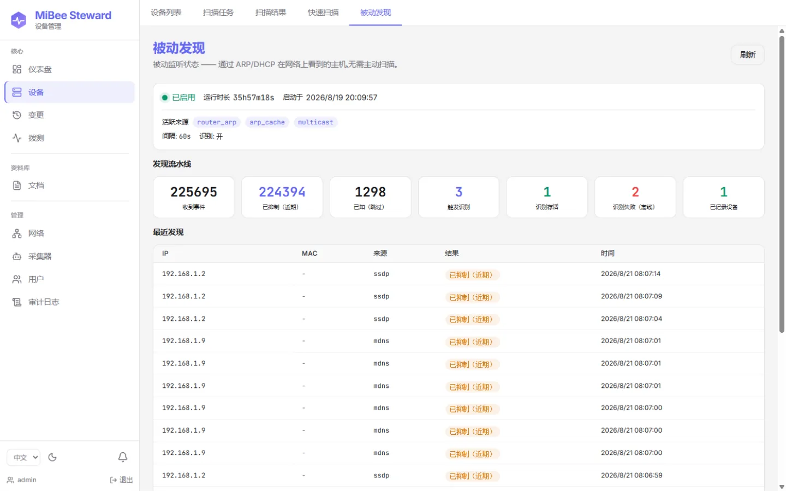

「扫描器」页发起手动扫描或管理周期任务：填写目标 CIDR、SNMP community / v3 凭据、端口与超时参数，即可同步扫描（≤1024 IP）或创建异步任务（更大网段）。扫描结果可回填为设备。

## 网络拓扑

对支持 LLDP / CDP / Bridge-MIB 的交换网络，拓扑页自动生成设备关系图：核心/汇聚/接入分层着色，边携带本地/远端端口、VLAN 标签与 STP 角色；图例可按层过滤，点击节点高亮邻居并展示详情。

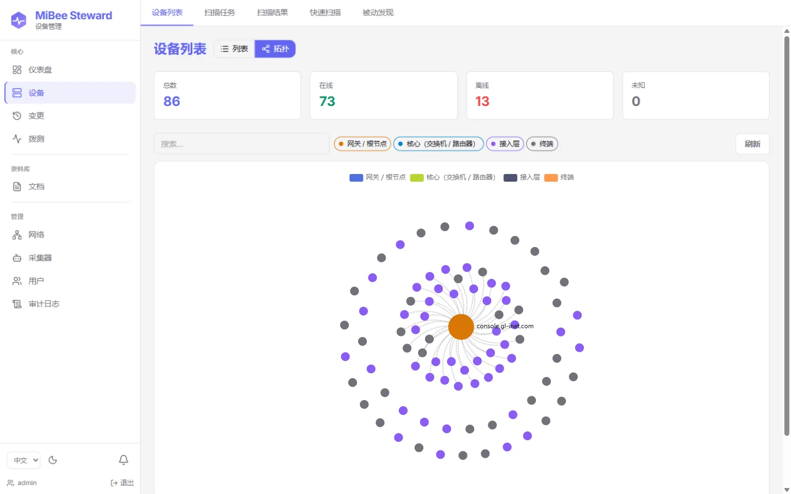

## 变更中心

变更页按时间线展示设备的增加 / 属性变化 / 失联 / 配置变更事件，是准实时网络画像的"时间轴视图"；基于 SSE 的 `/changes/watch` 为下游集成提供事件流。

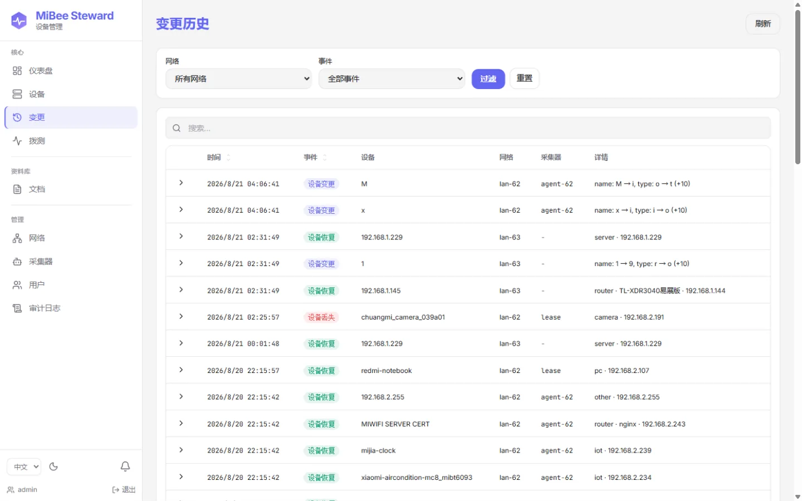

## 拨测（外网资源探测）

拨测页管理对**网络外**目标的周期性探测：HTTP(S) 可用性、ICMP 存活、TCP 端口、DNS，以及对 HTTPS 站点的完整证书链采集与到期跟踪。每条目标可独立设置探测间隔，结果直接进入仪表盘与告警指标。

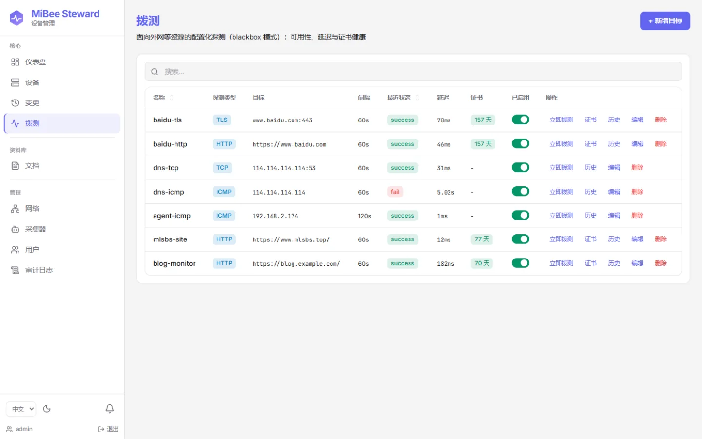

## 分布式采集器

分支机构或隔离网段可部署 `mibee-agent`，通过一次性令牌向中心注册。采集器页展示各 agent 的在线状态、归属网络与最近上报；扫描指令经命令通道下发，agent 拉取执行后回传结果。

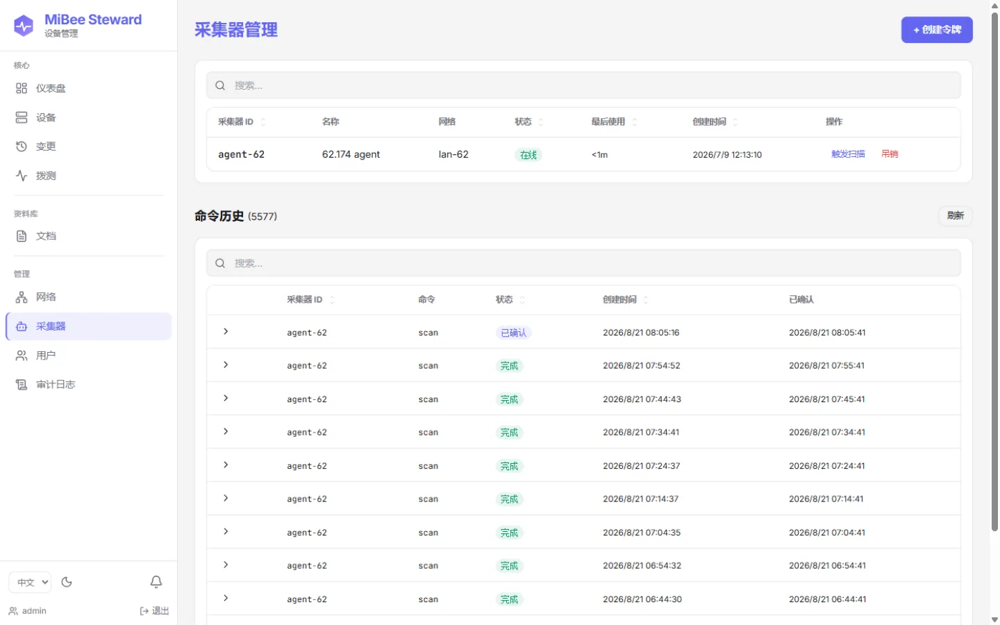

网络页管理逻辑网络（多 LAN / 多站点）：每个网络的 CIDR、站点标识、绑定的采集器与设备数量。

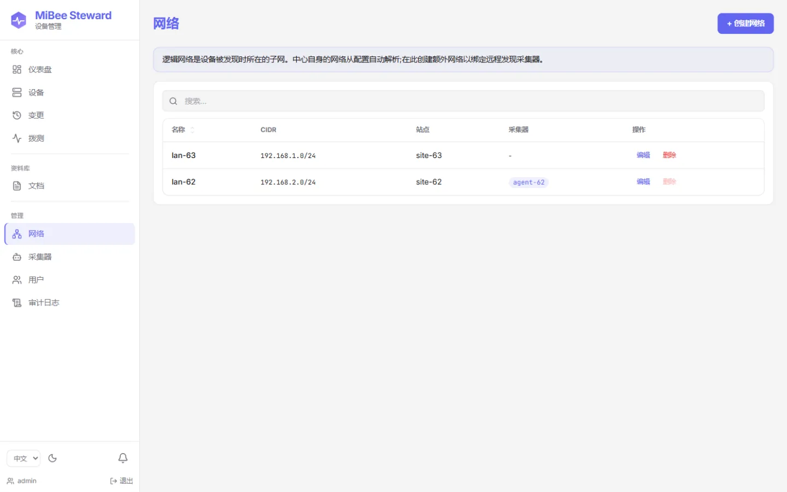

## 用户与权限

v0.5.0 起采用**角色-能力模型**：`admin` / `operator` / `viewer` 三种角色映射到细粒度能力（读设备、触发扫描、写配置……），并支持**按网络的对象级授权**——非管理员用户只能看到被授权的网络（`closed` 模式）。用户页完成账号管理与授权分配。

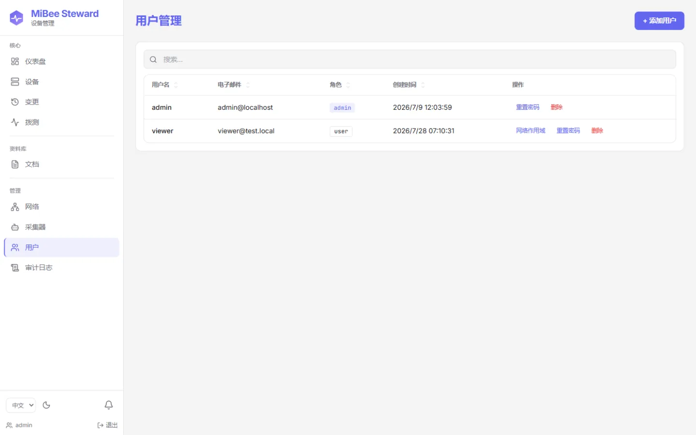

## 通知与集成

设置中的通知页管理两件事：**渠道**（webhook / 邮件）与**规则**（哪种事件——设备失联/恢复/新增/变更/配置变更——发到哪个渠道，附带每设备防抖冷却）。这是刻意保持轻量的"规则→渠道"转发，不是告警引擎——告警编排仍交给 Alertmanager 生态。

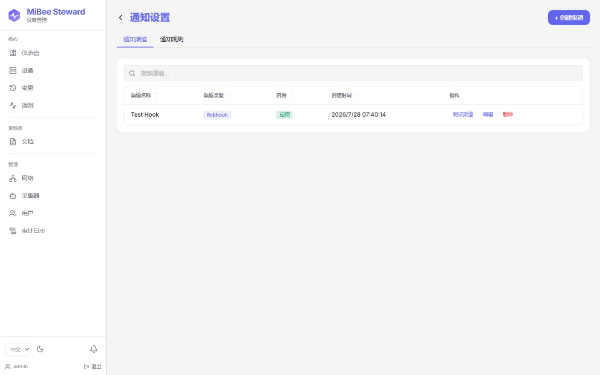

设置页还包含个人资料、密码修改、TOTP 两步验证、主题与语言偏好：

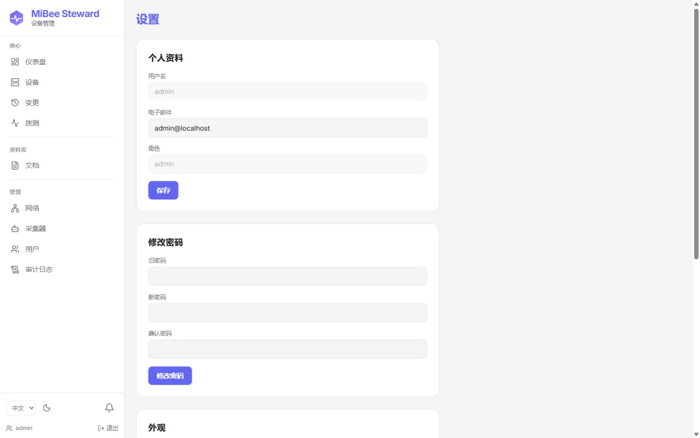

## 凭据库

SNMPv3（USM authNoPriv / authPriv）与 SSH 凭据集中存放在加密凭据库中：AES-256-GCM 静态加密，密钥来自 `security.master_key`；读取接口永不回显口令（仅显示掩码），扫描与配置备份按目标自动匹配凭据。

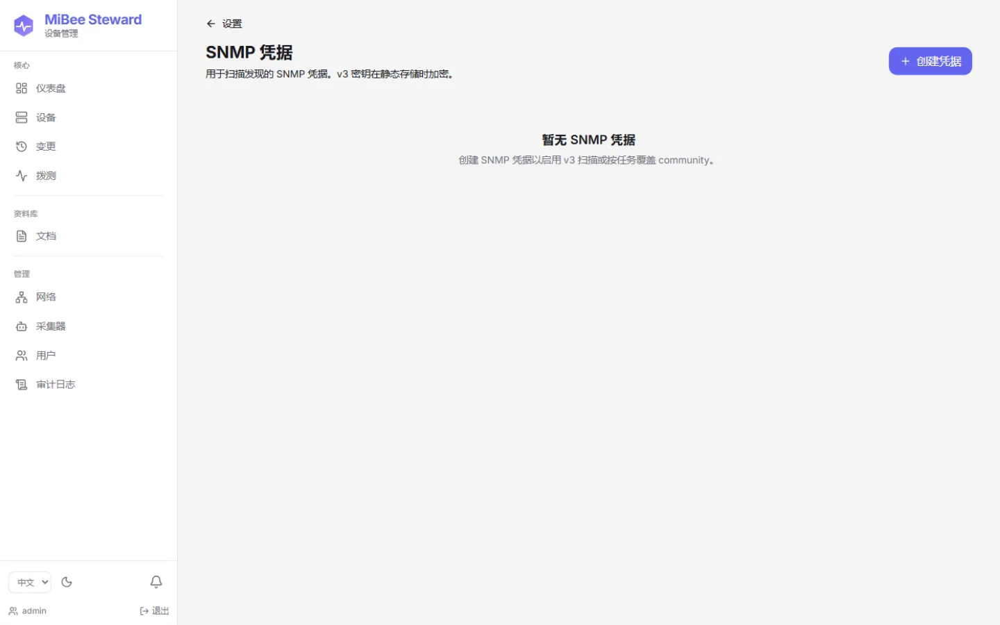

## 审计与文档

审计日志记录所有敏感操作（登录、凭据变更、扫描触发、用户管理……），满足"谁在什么时候改了什么"的追溯需求。

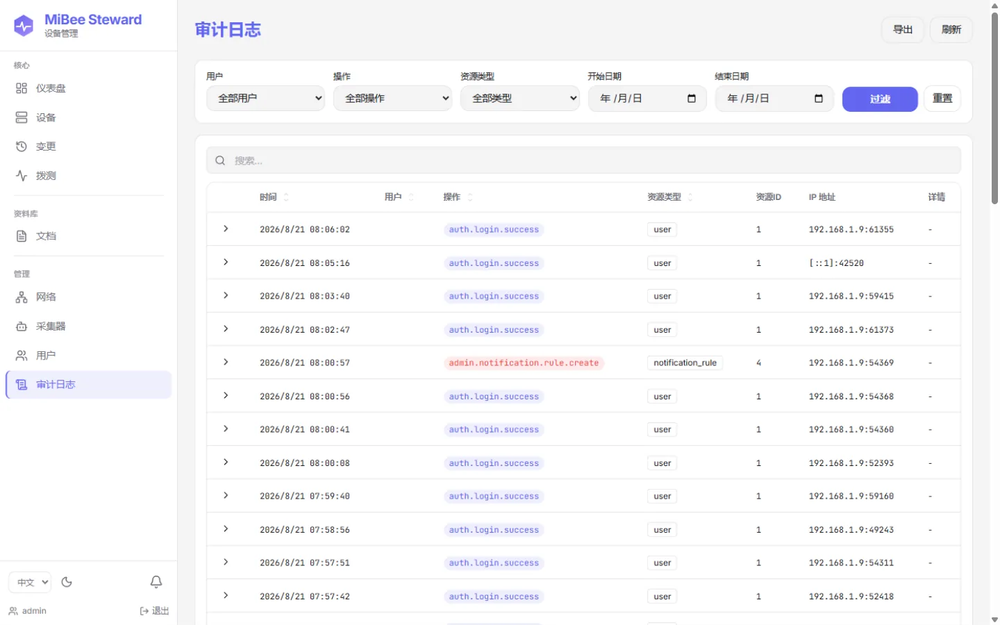

文档库为设备挂载手册、照片、采购凭证等附件（本地上传，`data/uploads` 存储），让资产台账从"网络可见性"延伸到"运维知识库"。

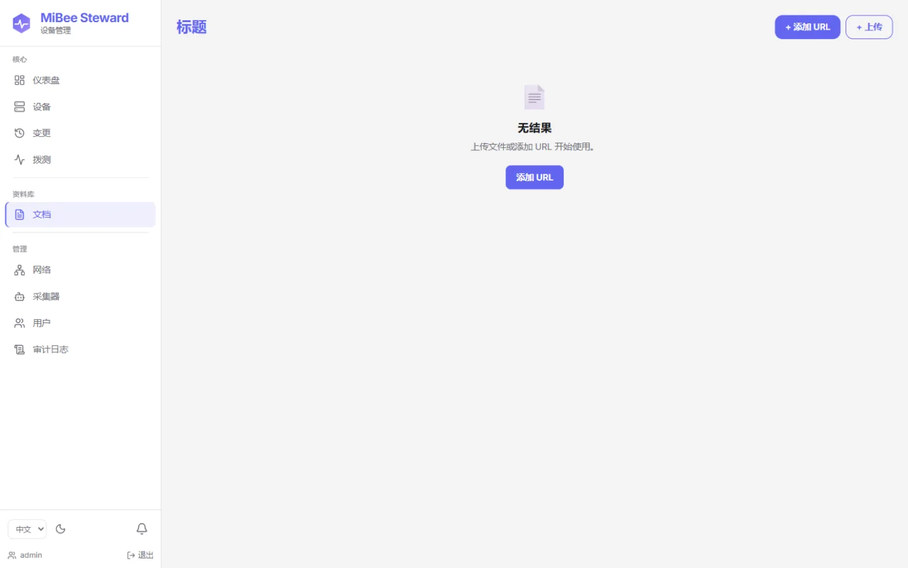

## 下一步

- [设备发现与识别](discovery.md)——探测源、指纹规则与识别管线的工作原理
- [分布式部署](distributed.md)——中心 + 采集器的架构细节
- [配置参考](configuration.md)——全部配置项
